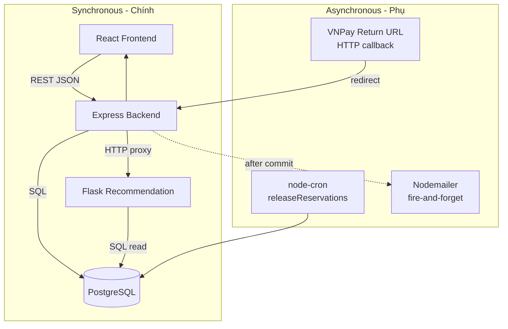
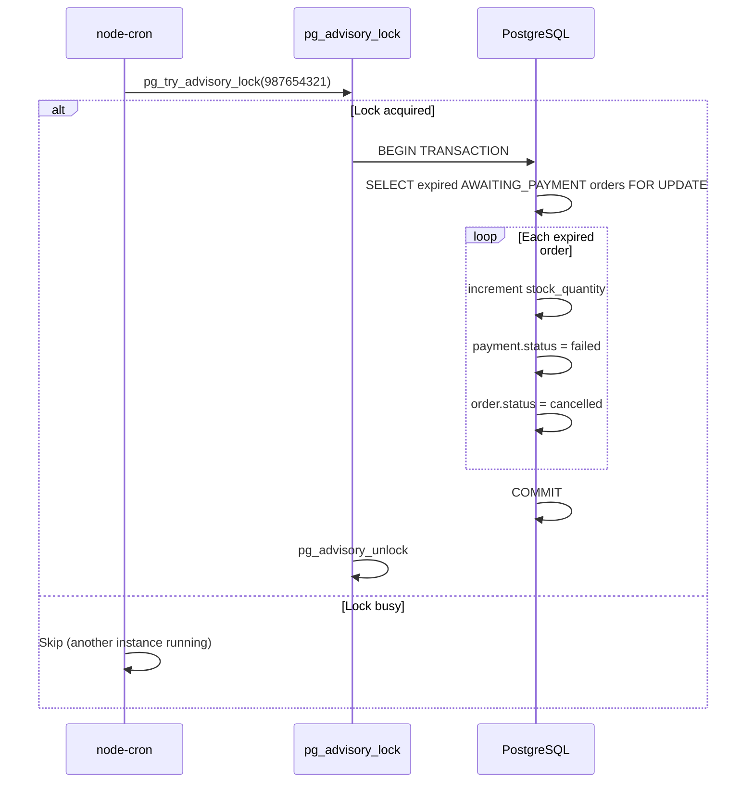
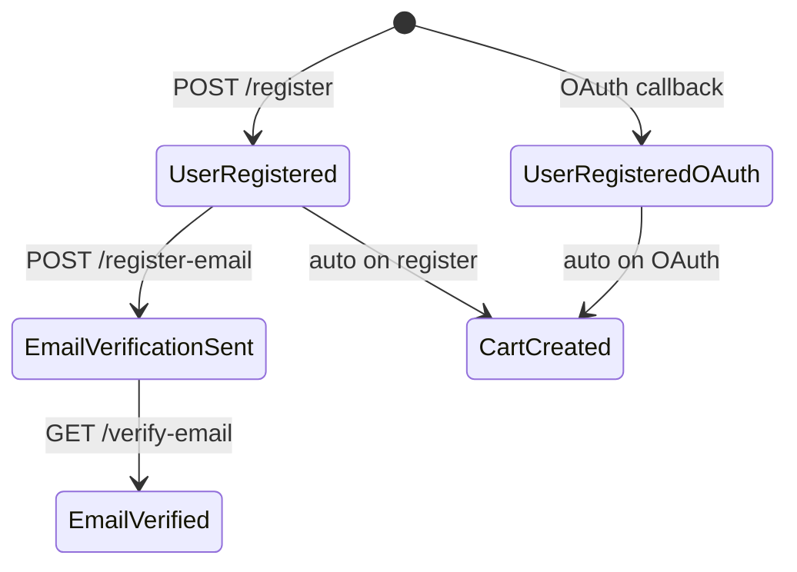
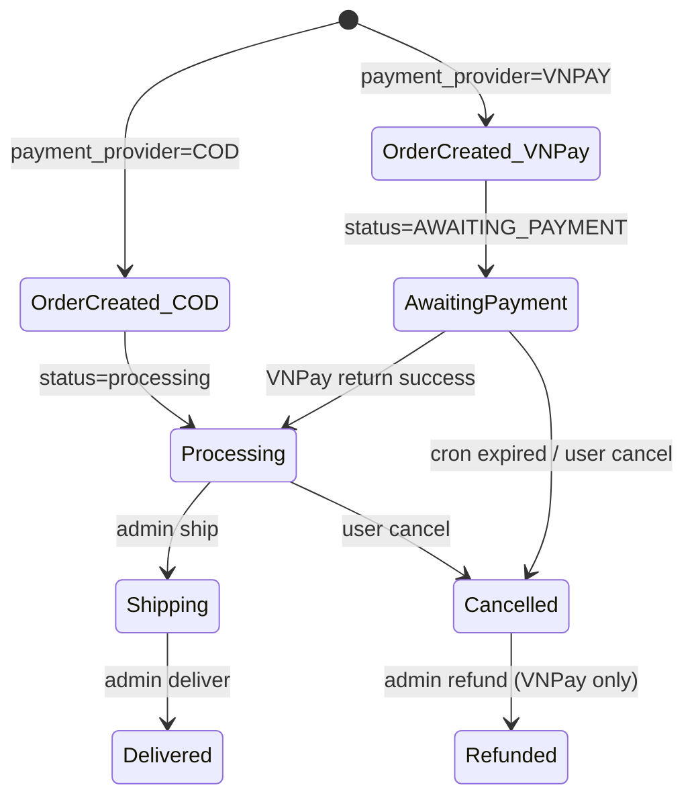
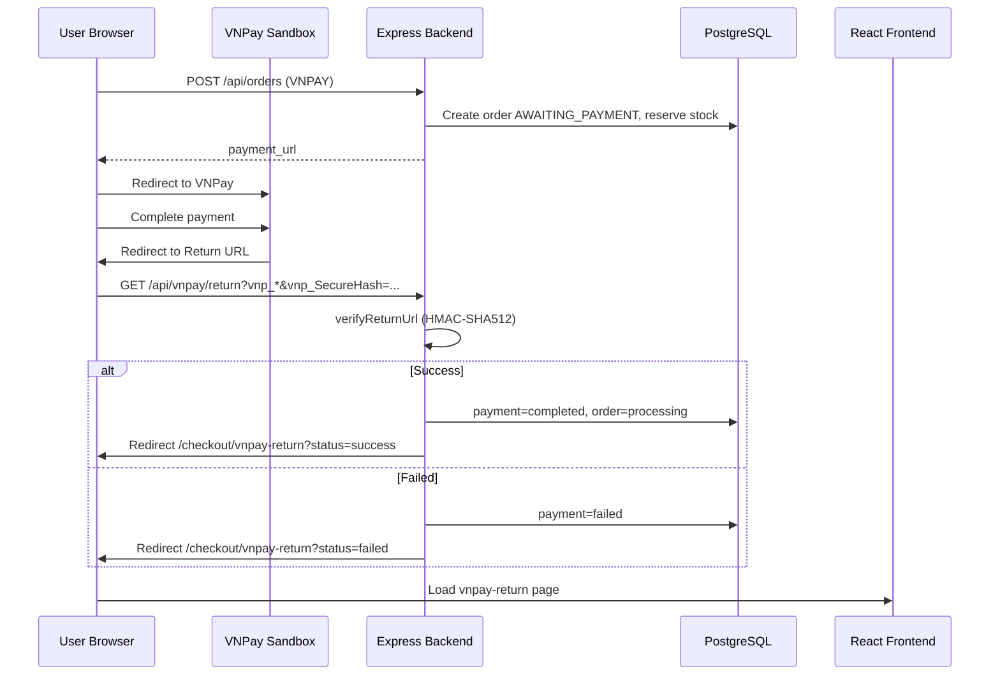
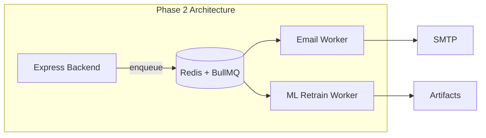
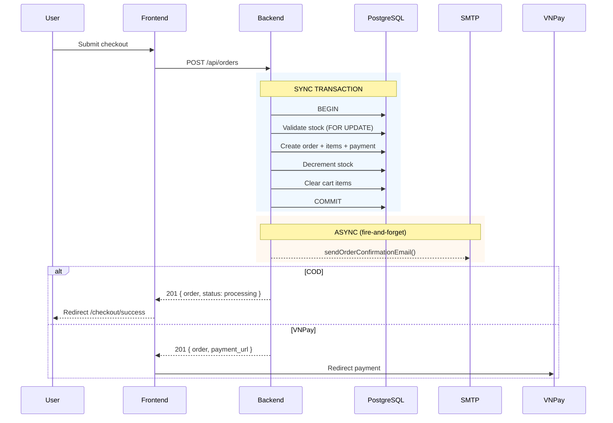

# Event-Driven Architecture — LaptopStore (laptop_NEW)

> **Phiên bản:** 1.0  
> **Ngày cập nhật:** 2026-05-26  
> **Liên quan:** [`system-architecture.md`](./system-architecture.md) · [`database-strategy.md`](./database-strategy.md) · [`../master_specification.md`](../master_specification.md)

---

## Mục lục

1. [Tổng quan & phạm vi tài liệu](#1-tổng-quan--phạm-vi-tài-liệu)
2. [Kiến trúc giao tiếp hiện tại](#2-kiến-trúc-giao-tiếp-hiện-tại)
3. [Các pattern bất đồng bộ đang dùng](#3-các-pattern-bất-đồng-bộ-đang-dùng)
4. [Luồng sự kiện nghiệp vụ (Business Event Flows)](#4-luồng-sự-kiện-nghiệp-vụ-business-event-flows)
5. [Background Jobs & Scheduled Tasks](#5-background-jobs--scheduled-tasks)
6. [Side-effect ngoài Transaction](#6-side-effect-ngoài-transaction)
7. [External Callbacks & Webhooks](#7-external-callbacks--webhooks)
8. [Ma trận sự kiện hiện tại](#8-ma-trận-sự-kiện-hiện-tại)
9. [Hạn chế kiến trúc hiện tại](#9-hạn-chế-kiến-trúc-hiện-tại)
10. [Lộ trình Event-Driven (đề xuất tương lai)](#10-lộ-trình-event-driven-đề-xuất-tương-lai)
11. [So sánh: Hiện tại vs EDA đầy đủ](#11-so-sánh-hiện-tại-vs-eda-đầy-đủ)

---

## 1. Tổng quan & phạm vi tài liệu

### 1.1. Tuyên bố kiến trúc

**LaptopStore hiện tại KHÔNG phải hệ thống Event-Driven Architecture (EDA) đầy đủ.**

Dự án sử dụng mô hình **Modular Monolith + ML Microservice** với giao tiếp chủ yếu **đồng bộ (Synchronous REST)**. Các hành vi "bất đồng bộ" hiện có được triển khai qua:

- **Cron jobs** (node-cron)
- **Fire-and-forget promises** (email, view count)
- **External callbacks** (VNPay Return URL)
- **HTTP proxy** (backend → recommendation service)

Tài liệu này mô tả **trạng thái thực tế** của các luồng bất đồng bộ, đồng thời đề xuất lộ trình nếu team muốn tiến hóa sang EDA.

### 1.2. Tại sao chưa cần EDA đầy đủ (MVP)

| Lý do | Giải thích |
|-------|------------|
| Single database | Local transaction đủ cho consistency — không cần Saga/Outbox |
| Single backend | Không có inter-service communication cần decouple |
| Quy mô MVP | Throughput chưa đòi hỏi message broker |
| Team size nhỏ | Operational complexity của Kafka/RabbitMQ chưa justify |

### 1.3. Sơ đồ tổng quan giao tiếp



---

## 2. Kiến trúc giao tiếp hiện tại

### 2.1. Phân loại giao tiếp

| Loại | Cơ chế | Ví dụ | Coupling |
|------|--------|-------|----------|
| **Sync Request-Response** | REST HTTP | FE → BE → response | Chặt |
| **Sync Service Call** | HTTP proxy | BE → REC `/recommend` | Trung bình |
| **Deferred Side-effect** | Promise `.catch()` | Email sau createOrder | Lỏng (không đảm bảo) |
| **Scheduled Polling** | node-cron | releaseReservations mỗi 2 phút | Lỏng |
| **External Callback** | HTTP redirect | VNPay → `/api/vnpay/return` | Lỏng |
| **Fire-and-forget** | Unawaited async | `view_count++` | Rất lỏng |

### 2.2. Không có trong hệ thống

| Thành phần EDA | Trạng thái |
|----------------|------------|
| Message Broker (Kafka, RabbitMQ, Redis Pub/Sub) | ❌ Không có |
| Transactional Outbox Pattern | ❌ Không có |
| Event Store / Event Sourcing | ❌ Không có |
| CQRS (Command Query Responsibility Segregation) | ❌ Không có |
| Dead Letter Queue (DLQ) | ❌ Không có |
| WebSocket / SSE real-time push | ❌ Không có (`socket.io` unused) |
| VNPay IPN webhook handler | ❌ Chưa implement |

---

## 3. Các pattern bất đồng bộ đang dùng

### 3.1. Pattern 1 — Cron-based Polling

**File:** `server/jobs/releaseReservations.js`

```
Schedule: */2 * * * * (mỗi 2 phút)
Lock:     PostgreSQL advisory lock (key: 987654321)
Action:   Scan orders WHERE status='AWAITING_PAYMENT' AND reserve_expires_at < now()
          → Hoàn kho → Cancel order → Fail payment
```

**Đặc điểm:**

| Thuộc tính | Giá trị |
|------------|---------|
| Delivery guarantee | At-least-once (advisory lock giảm duplicate) |
| Latency | Tối đa ~2 phút sau expiry |
| Idempotency | `reserve_expires_at = null` sau cancel |
| Failure handling | try/catch + rollback transaction |



### 3.2. Pattern 2 — Fire-and-Forget Email

**File:** `server/services/emailService.js`

Sau khi transaction commit thành công, controller gọi email **không await**, chỉ log lỗi:

```javascript
sendOrderConfirmationEmail({ order, items_breakdown, ... })
  .catch(err => console.error("Email send failed:", err));
```

**Các trigger email:**

| Event | Function | Trigger file |
|-------|----------|--------------|
| Order created | `sendOrderConfirmationEmail` | `orderController.createOrder` |
| Payment method changed | `sendOrderUpdateEmail` | `orderController.changePaymentMethod` |
| Shipping address changed | `sendOrderUpdateEmail` | `orderController.updateShippingAddress` |
| Order status changed | `sendOrderUpdateEmail` | `adminController.updateOrderStatus` |
| Order shipped | `sendOrderUpdateEmail` | `adminController.shipOrder` |
| Order delivered | `sendOrderUpdateEmail` | `adminController.deliverOrder` |
| Order refunded | `sendOrderUpdateEmail` | `adminController.refundOrder` |

**Rủi ro:**

- Email fail → **không retry**, **không dead letter**
- User không nhận email nhưng đơn hàng vẫn tạo thành công
- Không có audit log email delivery

### 3.3. Pattern 3 — Fire-and-Forget Counter

**File:** `server/controllers/productController.js`

```javascript
product.increment("view_count").catch(() => {});
```

- Không block response
- Không đảm bảo chính xác 100% (acceptable cho analytics)

### 3.4. Pattern 4 — External HTTP Callback (VNPay Return)

**File:** `server/controllers/vnpayController.js`

```
User thanh toán VNPay → redirect → GET /api/vnpay/return?vnp_*
  → verifyReturnUrl (HMAC-SHA512)
  → Update payment + order trong DB
  → Redirect FE /checkout/vnpay-return?status=success|failed
```

**Đặc điểm:**

| Thuộc tính | Giá trị |
|------------|---------|
| Trigger | User browser redirect (không phải server-to-server) |
| Idempotency | Check `payment.payment_status !== 'completed'` trước update |
| IPN | ❌ Chưa có — chỉ dựa Return URL |
| Reliability | User đóng browser trước redirect → payment có thể pending |

### 3.5. Pattern 5 — Sync HTTP Proxy (Recommendation)

**File:** `server/controllers/productController.js`

```
FE → GET /api/products/variations/:id/recommendations
  → BE axios.get(RECO_API_BASE/recommend?variation_id=)
  → Enrich metadata from DB
  → Return to FE
```

- **Không phải async/event** — blocking request-response
- Timeout: `RECO_TIMEOUT_MS` (default 7000ms)
- Fallback: 502 + empty products array nếu ML service down

---

## 4. Luồng sự kiện nghiệp vụ (Business Event Flows)

Mặc dù không có event bus, các **business events** vẫn xảy ra trong code. Bảng dưới mô tả chúng theo góc nhìn "sự kiện nghiệp vụ":

### 4.1. User Lifecycle Events



| Business Event | Trigger | Immediate Effects | Async Effects |
|----------------|---------|-------------------|---------------|
| `USER_REGISTERED` | POST `/api/auth/register` | Create user, role, cart, JWT | None |
| `USER_REGISTERED_EMAIL` | POST `/api/auth/register-email` | Create user (unverified) | Send verification email |
| `EMAIL_VERIFIED` | GET `/api/auth/verify-email` | Activate user | Redirect FE |
| `USER_OAUTH_CREATED` | OAuth callback | Create/find user, role, cart | Redirect FE with JWT |
| `PASSWORD_RESET_REQUESTED` | POST `/api/auth/forgot-password` | Generate reset token | Send reset email |
| `PASSWORD_RESET_COMPLETED` | POST `/api/auth/reset-password` | Update password_hash | None |

### 4.2. Order Lifecycle Events



| Business Event | Trigger | DB Changes (sync, in TX) | Async Effects |
|----------------|---------|---------------------------|---------------|
| `ORDER_CREATED_COD` | POST `/api/orders` | Order, OrderItems, Payment, stock--, clear cart | Email confirmation |
| `ORDER_CREATED_VNPAY` | POST `/api/orders` | Same + reserve_expires_at +24h | Email + VNPay redirect URL |
| `PAYMENT_COMPLETED` | GET `/api/vnpay/return` | payment=completed, order=processing | Redirect FE |
| `PAYMENT_FAILED` | GET `/api/vnpay/return` | payment=failed | Redirect FE |
| `ORDER_EXPIRED` | Cron releaseReservations | stock++, payment=failed, order=cancelled | None |
| `ORDER_CANCELLED` | POST `/api/orders/:id/cancel` | stock++, order=cancelled | None |
| `ORDER_SHIPPED` | POST `/api/admin/orders/:id/ship` | order=shipping | Email update |
| `ORDER_DELIVERED` | POST `/api/admin/orders/:id/deliver` | order=delivered | Email update |
| `ORDER_REFUNDED` | POST `/api/admin/orders/:id/refund` | payment=refunded | Email update |
| `PAYMENT_METHOD_CHANGED` | POST `.../payment-method` | Update payment | Email update |
| `SHIPPING_ADDRESS_CHANGED` | PUT `.../shipping-address` | Update order + recalc ship | Email update |

### 4.3. Catalog Events

| Business Event | Trigger | Effects |
|----------------|---------|---------|
| `PRODUCT_VIEWED` | GET `/api/products/:id` | `view_count++` (fire-and-forget) |
| `PRODUCT_CREATED` | POST `/api/admin/products` | Insert product + variations + images |
| `PRODUCT_UPDATED` | PUT `/api/admin/products/:id` | Update product |
| `VARIATION_STOCK_CHANGED` | Admin update / order flow | `stock_quantity` modified |

> **Lưu ý:** Khi catalog thay đổi, ML index **không tự cập nhật** — cần chạy lại `train_recommend.py` thủ công.

### 4.4. Q&A Events

| Business Event | Trigger | Effects |
|----------------|---------|---------|
| `QUESTION_CREATED` | POST `/api/products/questions` | Insert question |
| `ANSWER_CREATED` | POST `/api/admin/questions/:id/answers` | Insert answer, is_answered=true |

---

## 5. Background Jobs & Scheduled Tasks

### 5.1. Danh sách jobs

| Job | File | Schedule | Lock | Mô tả |
|-----|------|----------|------|-------|
| `releaseReservations` | `server/jobs/releaseReservations.js` | `*/2 * * * *` | Advisory lock 987654321 | Hủy đơn VNPay hết hạn, hoàn kho |

### 5.2. Job loading

```javascript
// server/server.js — loaded at startup
require("./jobs/releaseReservations");
```

Job chạy **trong cùng process** với Express server — không tách worker riêng.

### 5.3. Implications

| Aspect | Hiện tại | Rủi ro |
|--------|----------|--------|
| Process model | In-process cron | Server restart = job restart (OK) |
| Multi-instance | Advisory lock prevents duplicate | ✅ |
| Monitoring | Console.error on failure | Không có alert/metrics |
| Manual trigger | Không có admin endpoint | Phải chờ cron hoặc restart |

### 5.4. Offline batch (không phải cron)

| Task | File | Trigger | Mô tả |
|------|------|---------|-------|
| ML Training | `train_recommend.py` | Manual CLI | Build KNN artifacts từ DB |
| Admin Seed | `seedAdmin.js` | `npm run seed:admin` | Tạo admin user |

---

## 6. Side-effect ngoài Transaction

### 6.1. Vấn đề Dual-Write

Khi một nghiệp vụ cần:
1. Ghi DB (trong transaction)
2. Gửi email / gọi service ngoài

Hệ thống hiện tại xử lý theo pattern:

```
BEGIN TX
  → DB writes (order, payment, stock)
COMMIT TX
  → sendEmail().catch(...)   // NGOÀI transaction
  → redirect VNPay URL       // Return to client
```

### 6.2. Failure scenarios

| Scenario | DB State | Email State | User Experience |
|----------|----------|-------------|-----------------|
| TX success, email fail | ✅ Order created | ❌ No email | Order OK, no notification |
| TX fail | ❌ Rolled back | — | Error response |
| VNPay redirect fail | ✅ Order awaiting | — | User stuck, must retry payment |
| Cron miss (server down) | Stock locked | — | Order expired late |

### 6.3. Không có cơ chế retry

| Side-effect | Retry | Dead Letter | Audit |
|-------------|-------|-------------|-------|
| Email | ❌ | ❌ | ❌ |
| view_count | ❌ | ❌ | ❌ |
| VNPay callback | User manual retry | ❌ | `raw_return` JSONB |

---

## 7. External Callbacks & Webhooks

### 7.1. VNPay Return URL Flow



### 7.2. VNPay IPN — Chưa triển khai

| Endpoint | Trạng thái | Ghi chú |
|----------|------------|---------|
| Return URL (`GET /api/vnpay/return`) | ✅ Implemented | Browser redirect — unreliable |
| IPN (`POST /api/vnpay/ipn`) | ❌ Missing | Server-to-server — reliable |
| Env `PUBLIC_IPN_URL` | ⚠️ Referenced | Không có route handler |

**Rủi ro khi thiếu IPN:**
- User đóng tab sau thanh toán → payment pending mãi
- Phải dựa vào user retry hoặc admin manual update

### 7.3. OAuth Callbacks

| Provider | Callback | Flow |
|----------|----------|------|
| Google | `GET /api/auth/google/callback` | Passport → JWT → redirect FE |
| Facebook | `GET /api/auth/facebook/callback` | Passport → JWT → redirect FE |

OAuth callbacks là **sync HTTP** — không phải event-driven.

---

## 8. Ma trận sự kiện hiện tại

### 8.1. Producer → Consumer (thực tế)

| Producer (Source) | Event / Trigger | Consumer | Cơ chế | Guaranteed |
|-------------------|-----------------|----------|--------|------------|
| orderController | Order created | emailService | fire-and-forget | ❌ |
| orderController | Order created | VNPay (external) | sync redirect URL | ✅ (URL returned) |
| vnpayController | Payment return | Order/Payment DB | sync HTTP callback | ⚠️ Browser-dependent |
| adminController | Status change | emailService | fire-and-forget | ❌ |
| releaseReservations | Order expired | Order/Payment/Stock DB | cron polling | ✅ (within 2 min) |
| productController | Product viewed | products.view_count | fire-and-forget | ❌ |
| productController | Recommend request | Flask ML service | sync HTTP proxy | ⚠️ (timeout 7s) |
| authController | Register email | emailService (SMTP) | sync await | ⚠️ |
| Passport OAuth | OAuth success | User/Cart DB | sync callback | ✅ |

### 8.2. Events chưa có consumer

| Event tiềm năng | Model/Schema sẵn có | Consumer thiếu |
|-----------------|----------------------|----------------|
| Order status change | `notifications` table | Notification API/UI |
| Payment success | `notifications` table | Push notification |
| Product back in stock | — | Alert system |
| New Q&A answer | — | Email to question author |

---

## 9. Hạn chế kiến trúc hiện tại

### 9.1. Reliability gaps

| Gap | Impact | Severity |
|-----|--------|----------|
| Email fire-and-forget | User miss notifications | Medium |
| No VNPay IPN | Payment state desync | **High** |
| ML index stale | Bad recommendations | Medium |
| In-process cron | Job stops if server crashes mid-run | Low (advisory lock helps) |
| No event audit trail | Hard to debug order flow | Medium |

### 9.2. Scalability limits

| Limit | Khi nào thấy | Giải pháp |
|-------|--------------|-----------|
| Sync email blocks (auth flows) | High registration rate | Queue emails |
| Sync ML proxy | Slow recommendations | Cache results / async precompute |
| Single cron instance | Multiple server replicas | ✅ Advisory lock OK |
| No message buffer | Traffic spike | Add queue |

### 9.3. Observability gaps

| Missing | Current state |
|---------|---------------|
| Event log | Không có |
| Email delivery tracking | Console.error only |
| Job metrics | Không có |
| Distributed tracing | Không có |
| Payment webhook log | Chỉ `raw_return` JSONB |

---

## 10. Lộ trình Event-Driven (đề xuất tương lai)

### 10.1. Phase 1 — Reliability (ngắn hạn)

**Không cần message broker — cải thiện trong monolith:**

| Task | Mô tả | Effort |
|------|-------|--------|
| VNPay IPN handler | `POST /api/vnpay/ipn` server-to-server | Medium |
| Email outbox table | Lưu pending emails trong DB, worker gửi + retry | Medium |
| Activate notifications | Populate `notifications` table on order events | Medium |
| Job monitoring | Log metrics cho cron (processed count, duration) | Low |

**Email Outbox (Phase 1 proposal):**

```sql
CREATE TABLE email_outbox (
  id SERIAL PRIMARY KEY,
  event_type VARCHAR(50) NOT NULL,
  payload JSONB NOT NULL,
  status VARCHAR(20) DEFAULT 'PENDING',  -- PENDING | SENT | FAILED
  retry_count INT DEFAULT 0,
  last_error TEXT,
  created_at TIMESTAMP DEFAULT NOW(),
  sent_at TIMESTAMP
);
```

```
Flow:
  createOrder TX → insert order + insert email_outbox (same TX)
  cron/worker → poll PENDING → send → mark SENT/FAILED
```

### 10.2. Phase 2 — Decoupling (trung hạn)

| Task | Mô tả |
|------|-------|
| Redis + BullMQ | Job queue cho email, ML retrain trigger |
| Webhook for catalog changes | Trigger `train_recommend.py` on product update |
| SSE/WebSocket | Real-time order status for user |
| Notification service | Tách logic notification thành module riêng |



### 10.3. Phase 3 — Full EDA (dài hạn, nếu tách microservices)

Chỉ cần thiết khi tách thành multiple services:

| Component | Technology |
|-----------|------------|
| Message Broker | RabbitMQ hoặc Redis Streams |
| Outbox Pattern | `outbox_events` table per service |
| Event Schema | JSON Schema / Avro |
| Consumers | Notification, Analytics, Search Index |

**Event matrix đề xuất (Phase 3):**

| Event Type | Producer | Consumers |
|------------|----------|-----------|
| `order.created` | Commerce | Notification, Analytics, ML |
| `payment.completed` | Commerce | Notification, Inventory |
| `payment.expired` | Commerce (cron) | Notification, Inventory |
| `product.updated` | Catalog | ML Retrain, Search Index |
| `user.registered` | Auth | Notification, Analytics |
| `question.answered` | Community | Notification |

---

## 11. So sánh: Hiện tại vs EDA đầy đủ

| Tiêu chí | LaptopStore MVP (hiện tại) | Full EDA (tương lai) |
|----------|------------------------------|----------------------|
| Communication | Sync REST + cron | Async events + sync API |
| Consistency | Strong (single DB TX) | Eventual consistency |
| Coupling | Monolith tight coupling | Loose coupling |
| Complexity | Low | High |
| Failure recovery | Manual / cron retry | DLQ + retry policy |
| Scalability | Vertical + DB pool | Horizontal per service |
| Observability | Logs only | Event log + tracing |
| Phù hợp | MVP, small team | High traffic, multi-team |

### 11.1. Khi nào nên chuyển sang EDA?

| Signal | Action |
|--------|--------|
| Email delivery critical | Phase 1: Outbox table |
| Payment desync incidents | Phase 1: VNPay IPN |
| > 1000 orders/day | Phase 2: Job queue |
| Tách recommendation/analytics service | Phase 3: Message broker |
| Multi-team development | Phase 3: Event contracts |

---

## Phụ lục A — Sequence: Order Created (End-to-End)



---

## Phụ lục B — Checklist cải thiện async reliability

- [ ] Implement VNPay IPN endpoint
- [ ] Email outbox table + retry worker
- [ ] Activate `notifications` table on order events
- [ ] Add cron job metrics/logging
- [ ] Auto-trigger ML retrain on catalog change (webhook/cron)
- [ ] Remove unused `socket.io` or implement real-time notifications
- [ ] Document event contracts before any service split

---

*Tài liệu mô tả trung thực trạng thái async/event patterns của `laptop_NEW`. Cập nhật khi triển khai Phase 1+ trong mục 10.*
