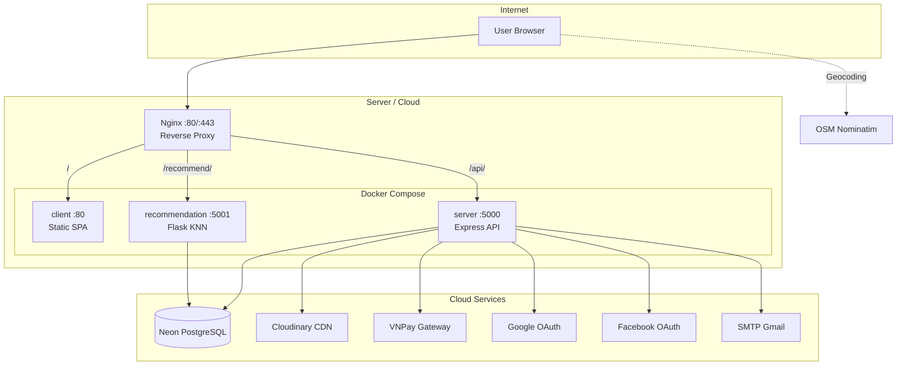
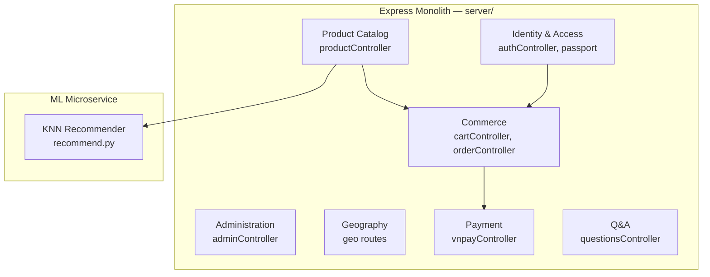
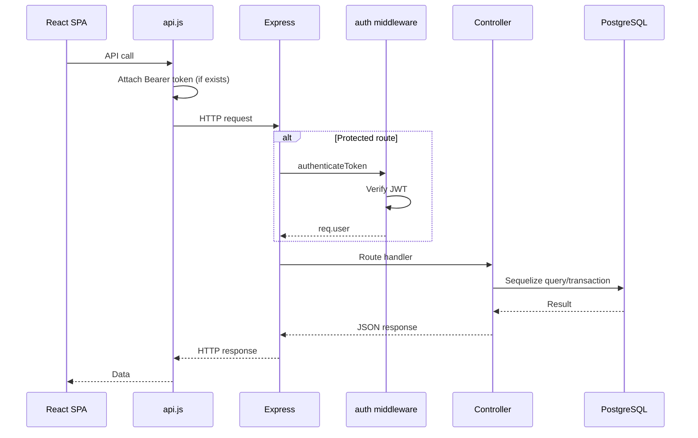
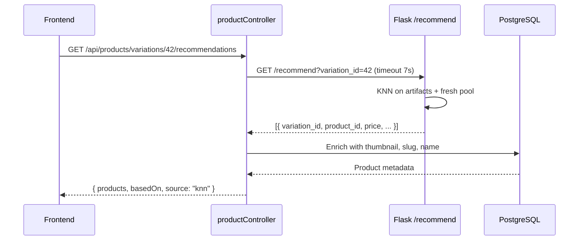
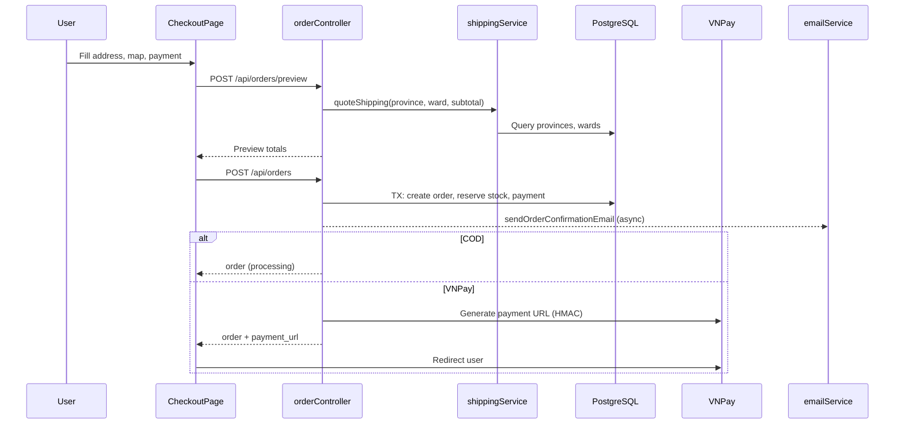
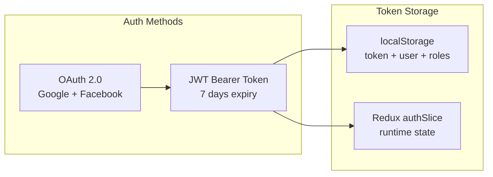
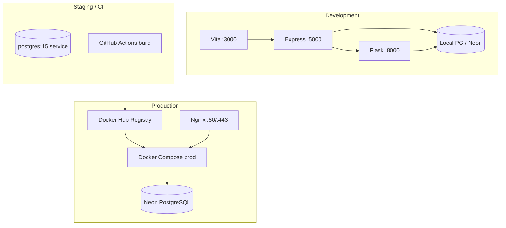
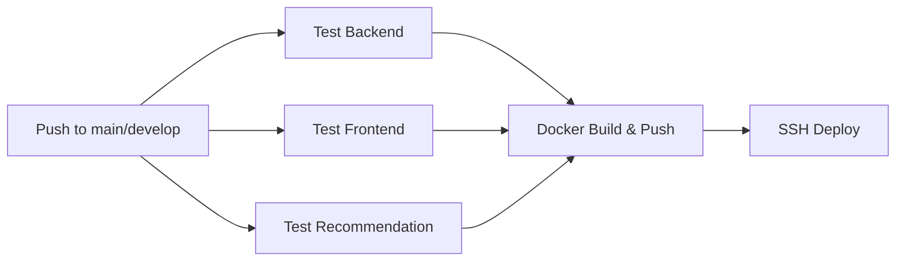
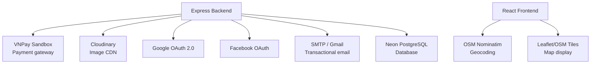

# System Architecture — LaptopStore (laptop_NEW)

> **Phiên bản:** 1.0  
> **Ngày cập nhật:** 2026-05-26  
> **Liên quan:** [`database-strategy.md`](./database-strategy.md) · [`event-driven-architecture.md`](./event-driven-architecture.md) · [`../master_specification.md`](../master_specification.md)

---

## Mục lục

1. [Tổng quan kiến trúc](#1-tổng-quan-kiến-trúc)
2. [Các thành phần hệ thống](#2-các-thành-phần-hệ-thống)
3. [Kiến trúc phân lớp (Layered Architecture)](#3-kiến-trúc-phân-lớp-layered-architecture)
4. [Luồng giao tiếp (Communication Flows)](#4-luồng-giao-tiếp-communication-flows)
5. [Frontend Architecture](#5-frontend-architecture)
6. [Backend Architecture](#6-backend-architecture)
7. [Recommendation Service Architecture](#7-recommendation-service-architecture)
8. [Security Architecture](#8-security-architecture)
9. [Deployment Architecture](#9-deployment-architecture)
10. [CI/CD Pipeline](#10-cicd-pipeline)
11. [Third-Party Integrations](#11-third-party-integrations)
12. [Non-Functional Requirements](#12-non-functional-requirements)
13. [Architecture Decision Records (ADR)](#13-architecture-decision-records-adr)

---

## 1. Tổng quan kiến trúc

### 1.1. Mô hình kiến trúc

LaptopStore được thiết kế theo mô hình **Modular Monolith + ML Microservice**:

```
┌─────────────────────────────────────────────────────────────────┐
│                        Presentation Layer                        │
│              React SPA (Vite) — client/app/                      │
└────────────────────────────┬────────────────────────────────────┘
                             │ HTTPS / REST JSON
┌────────────────────────────▼────────────────────────────────────┐
│                     API / Gateway Layer                          │
│         Express.js REST API — server/ (Port 5000)                │
│    Auth · Products · Cart · Orders · Admin · Geo · VNPay         │
└──────────┬─────────────────────────────┬────────────────────────┘
           │ SQL (Sequelize)              │ HTTP Proxy
┌──────────▼──────────┐    ┌─────────────▼──────────────────────┐
│    Data Layer        │    │   ML Service Layer                  │
│  PostgreSQL (Neon)   │◄───│  Flask KNN — recommendation_service │
│  18+ tables          │    │  (Port 5001/8000)                   │
└──────────────────────┘    └─────────────────────────────────────┘
           │
┌──────────▼──────────────────────────────────────────────────────┐
│                   External Services Layer                          │
│  Cloudinary · VNPay · Google/Facebook OAuth · SMTP · Nominatim  │
└───────────────────────────────────────────────────────────────────┘
```

### 1.2. Đặc điểm kiến trúc chính

| Đặc điểm | Mô tả |
|----------|-------|
| **Monorepo** | `client/`, `server/`, `recommendation_service/` trong một repo |
| **API-first** | Frontend chỉ giao tiếp qua REST API |
| **Single DB** | PostgreSQL shared giữa backend và ML service |
| **Stateless API** | JWT-based auth, không server-side session |
| **Container-ready** | Docker Compose + Nginx reverse proxy |
| **VN market** | VNPay, tỉnh/thành–phường/xã, tiếng Việt |

### 1.3. Sơ đồ triển khai production



---

## 2. Các thành phần hệ thống

### 2.1. Bảng thành phần

| # | Thành phần | Tech | Port | Vai trò |
|---|------------|------|------|---------|
| 1 | **Frontend (client)** | React 18 + Vite 5 | 3000 (dev) / 80 (prod) | SPA storefront + admin |
| 2 | **Backend (server)** | Express 4 + Sequelize 6 | 5000 | REST API, business logic |
| 3 | **Recommendation** | Flask 3 + numpy/sklearn | 5001 / 8000 | KNN product suggestions |
| 4 | **PostgreSQL** | Neon / Docker postgres:15 | 5432 | Primary data store |
| 5 | **Nginx** | nginx:alpine | 80, 443 | Reverse proxy, rate limit, SSL |
| 6 | **Cloudinary** | SaaS | — | Image CDN |
| 7 | **VNPay** | Sandbox/Production | — | Payment gateway |

### 2.2. Bounded Contexts (trong monolith)



| Context | Routes prefix | Controller(s) | Models |
|---------|---------------|---------------|--------|
| Identity & Access | `/api/auth` | authController | User, Role, Permission |
| Product Catalog | `/api/products` | productController | Product, Variation, Category, Brand, Tag |
| Commerce | `/api/cart`, `/api/orders` | cartController, orderController | Cart, Order, Payment |
| Administration | `/api/admin` | adminController, questionsController | All |
| Geography | `/api/provinces`, `/api/quote` | geo, shippingController | Province, Ward |
| Payment | `/api/vnpay` | vnpayController | Payment |
| ML Recommend | `/api/products/variations/:id/recommendations` | productController (proxy) | — |

---

## 3. Kiến trúc phân lớp (Layered Architecture)

### 3.1. Backend layers

```
┌─────────────────────────────────────────┐
│  Routes Layer                           │  routes/*.js
│  HTTP routing, middleware mounting      │
├─────────────────────────────────────────┤
│  Middleware Layer                       │  middleware/*.js
│  auth, upload, errorHandler             │
├─────────────────────────────────────────┤
│  Controller Layer                     │  controllers/*.js
│  Request validation, orchestration      │
├─────────────────────────────────────────┤
│  Service Layer                          │  services/*.js
│  vnpayService, shippingService, email   │
├─────────────────────────────────────────┤
│  Model Layer (ORM)                      │  models/*.js
│  Sequelize definitions + associations   │
├─────────────────────────────────────────┤
│  Database Layer                         │  config/database.js
│  PostgreSQL via Sequelize               │
└─────────────────────────────────────────┘

Cross-cutting:
  jobs/releaseReservations.js  — Background cron
  config/passport.js           — OAuth strategies
  utils/slugifyVN.js           — Helpers
```

### 3.2. Frontend layers

```
┌─────────────────────────────────────────┐
│  Pages Layer                            │  pages/*.jsx
│  Route-level components                 │
├─────────────────────────────────────────┤
│  Components Layer                       │  components/*.jsx
│  Reusable UI building blocks            │
├─────────────────────────────────────────┤
│  Hooks Layer                            │  hooks/*.js
│  React Query data fetching              │
├─────────────────────────────────────────┤
│  State Layer                            │  store/slices/*.js
│  Redux Toolkit (auth, cart, compare)    │
├─────────────────────────────────────────┤
│  API Layer                              │  services/api.js
│  Axios client + interceptors            │
└─────────────────────────────────────────┘
```

### 3.3. ML Service layers

```
┌─────────────────────────────────────────┐
│  API Layer                              │  app.py
│  Flask routes: /health, /recommend      │
├─────────────────────────────────────────┤
│  Business Logic                         │  core/recommend.py
│  KNN pipeline, fresh pool, reranking    │
├─────────────────────────────────────────┤
│  Feature Engineering                    │  core/features.py, bench.py, rules.py
│  Performance score calculation          │
├─────────────────────────────────────────┤
│  Data Access                            │  core/db.py
│  SQLAlchemy raw SQL                     │
├─────────────────────────────────────────┤
│  Artifacts                              │  artifacts/*.pkl, *.npy, *.joblib
│  Pre-computed index (offline training)  │
└─────────────────────────────────────────┘
```

---

## 4. Luồng giao tiếp (Communication Flows)

### 4.1. Client → Backend (Primary flow)



**Dev proxy:** Vite dev server (`:3000`) proxy `/api` → `localhost:5000`.

### 4.2. Backend → Recommendation (Service call)



**Config:** `RECO_API_BASE` (default `http://127.0.0.1:8000`).

### 4.3. Checkout flow (Cross-component)



### 4.4. Admin flow

```
Admin Browser → AdminRoute (FE role check: admin)
  → JWT Bearer token
  → /api/admin/* (BE role check: admin | manager)
  → adminController
  → PostgreSQL + Cloudinary (uploads)
  → Recharts data for analytics
```

---

## 5. Frontend Architecture

### 5.1. Tech stack

| Layer | Technology | Version |
|-------|------------|---------|
| UI | React | 18.2 |
| Build | Vite | 5.4 |
| Routing | React Router | 7.9 |
| Server state | TanStack React Query | 5.14 |
| Client state | Redux Toolkit | 2.0 |
| Styling | Tailwind CSS | 3.4 |
| Charts | Recharts | 3.6 |
| Maps | Leaflet + react-leaflet | 1.9 / 4.2 |
| Rich text | react-quill | 2.0 |
| HTTP | Axios | 1.6 |

### 5.2. Route architecture

| Zone | Paths | Guard |
|------|-------|-------|
| **Public** | `/`, `/products/:id`, `/cart`, `/login`, `/register` | None |
| **Protected** | `/checkout`, `/profile`, `/orders` | `ProtectedRoute` (JWT) |
| **Admin** | `/admin/*` | `AdminRoute` (role `admin`) |
| **Payment return** | `/checkout/vnpay-return`, `/checkout/success` | None |
| **OAuth** | `/oauth/success` | None |

### 5.3. State management strategy

| State type | Tool | Persist | Examples |
|------------|------|---------|----------|
| Auth (token, user) | Redux `authSlice` | localStorage | JWT, roles |
| Cart (client) | Redux `cartSlice` | Memory + API sync | Items, quantities |
| Compare | Redux `compareSlice` | Memory | Max 3 variation_ids |
| UI flags | Redux `uiSlice` | Memory | Modals, sidebar |
| Server data | React Query | Cache + staleTime | Products, orders, facets |

### 5.4. Key page responsibilities

| Page | API dependencies | Features |
|------|------------------|----------|
| `HomePage` | products/v2, facets, categories, questions | Filter, sort, pagination, global Q&A |
| `ProductDetailPage` | products/:id, recommendations | Variation selector, compare, Q&A |
| `CheckoutPage` | orders/preview, orders, provinces, quote | Map picker, COD/VNPay, buy_now/cart |
| `OrdersPage` | orders, counters | Tabbed list, cancel |
| `AdminDashboard` | analytics/dashboard, analytics/sales | Recharts |
| `AdminProducts` | admin/products CRUD | Cloudinary upload, variations |

### 5.5. External client-side calls

| Service | Called from | Purpose |
|---------|-------------|---------|
| OpenStreetMap Nominatim | `CheckoutPage.jsx` | Reverse geocoding |
| Leaflet tiles | `MapPicker.jsx` | Map display |

---

## 6. Backend Architecture

### 6.1. Entry point & startup

**File:** `server/server.js`

```
Startup sequence:
  1. Load dotenv
  2. Import routes, passport, cron job
  3. Mount middleware (cors, json, passport)
  4. Mount route prefixes
  5. Health check /api/health
  6. Error handler
  7. sequelize.authenticate()
  8. Optional sequelize.sync({ alter: true })
  9. app.listen(PORT)
```

### 6.2. Route map

| Prefix | File | Auth |
|--------|------|------|
| `/api/auth` | authRoutes.js + authSocialRoutes.js | Mixed |
| `/api/products` | productRoutes.js | Public + JWT for Q&A |
| `/api/cart` | cartRoutes.js | JWT required |
| `/api/orders` | orderRoutes.js | JWT required |
| `/api/admin` | adminRoutes.js | JWT + admin/manager |
| `/api` | geo.js, vnpayRoutes.js, shippingRoutes.js | Public |
| `/api/health` | inline | Public |

### 6.3. Middleware pipeline

```
Request
  → cors()
  → express.json()
  → express.urlencoded()
  → passport.initialize()
  → [Route-specific: authenticateToken, authorizeRoles]
  → [Route-specific: upload (Cloudinary multer)]
  → Controller handler
  → errorHandler (centralized)
  → Response
```

### 6.4. Controller responsibilities

| Controller | Endpoints | Key logic |
|------------|-----------|-----------|
| `authController` | 10+ auth routes | Register, login, JWT, email verify, reset password |
| `productController` | Catalog, facets, search, compare, Q&A, recommend proxy | Complex filtering v2 |
| `cartController` | Cart CRUD | Price snapshot at add |
| `orderController` | Order lifecycle | TX + stock lock, VNPay, preview, cancel |
| `adminController` | Admin CRUD + analytics | Cloudinary upload, Recharts data |
| `vnpayController` | Payment URL + return | HMAC verify, redirect FE |
| `shippingController` | Quote | Wrapper for shippingService |
| `questionsController` | Admin Q&A | List, detail, answer |

### 6.5. Service layer

| Service | Responsibility |
|---------|----------------|
| `vnpayService.js` | URL signing (HMAC-SHA512), return verification |
| `shippingService.js` | Province/ward fee calculation |
| `emailService.js` | HTML email templates (order confirm, updates) |

### 6.6. Background processing

| Component | Type | Schedule |
|-----------|------|----------|
| `jobs/releaseReservations.js` | In-process cron | Every 2 minutes |

---

## 7. Recommendation Service Architecture

### 7.1. Overview

```
                    ┌─────────────────┐
  HTTP GET          │     app.py      │
  /recommend ──────►│  Flask routes   │
                    └────────┬────────┘
                             │
                    ┌────────▼────────┐
                    │ recommend_core  │
                    │ (recommend.py)  │
                    └────────┬────────┘
              ┌──────────────┼──────────────┐
              ▼              ▼              ▼
        ┌──────────┐  ┌──────────┐  ┌──────────┐
        │ Artifacts│  │ KNN numpy│  │ Fresh DB │
        │ .pkl/npy │  │ distance │  │ query    │
        └──────────┘  └──────────┘  └──────────┘
```

### 7.2. Feature pipeline

```
product_variations (DB)
  → processor, ram, storage, graphics_card, price
  → calculate_perf_from_mapping_or_rule()
      → CPU score (benchmark JSON or rule)
      → GPU score (benchmark JSON or rule)
      → RAM score (rule)
      → Storage score (rule)
      → performance_score = 0.40×CPU + 0.35×GPU + 0.15×RAM + 0.10×Storage
  → MinMaxScaler on (price, performance_score)
  → KNN weighted Euclidean distance
  → Price jump penalty for more expensive neighbors
  → Fresh pool merge (60-day window, recency boost)
  → Dedup by product_id
  → Top K results
```

### 7.3. Training vs Runtime

| Phase | Script | Input | Output |
|-------|--------|-------|--------|
| **Training (offline)** | `train_recommend.py` | Full DB catalog | `artifacts/*.pkl, *.npy, *.joblib` |
| **Runtime (online)** | `app.py` + `recommend.py` | variation_id | JSON recommendation list |

### 7.4. Integration points

| Consumer | Path | Protocol |
|----------|------|----------|
| Backend proxy | `GET /recommend?variation_id=` | HTTP sync |
| Nginx (prod) | `/recommend/` → recommendation:5001 | HTTP |
| Direct (optional) | FE `VITE_RECOMMENDATION_BASE_URL` | HTTP (unused, FE uses BE proxy) |

---

## 8. Security Architecture

### 8.1. Authentication



| Aspect | Implementation |
|--------|----------------|
| Password hashing | bcrypt, 10 rounds |
| JWT secret | `JWT_SECRET` env var |
| Token payload | `{ userId }` |
| Token transport | `Authorization: Bearer <token>` |
| OAuth | Passport.js strategies |

### 8.2. Authorization

| Layer | Mechanism | Roles |
|-------|-----------|-------|
| Backend routes | `authorizeRoles("admin", "manager")` | admin, manager |
| Frontend admin | `AdminRoute` checks `roles.includes("admin")` | admin only |
| Resource ownership | Controller checks `user_id` match | customer |

### 8.3. API security

| Measure | Implementation | Location |
|---------|----------------|----------|
| CORS | `cors()` middleware | server.js |
| Rate limiting | Nginx `limit_req` 10r/s API | nginx.conf |
| Security headers | X-Frame-Options, CSP, XSS, etc. | nginx.conf |
| Input validation | express-validator (partial) | Controllers |
| SQL injection | Sequelize parameterized queries | ORM |
| Payment integrity | VNPay HMAC-SHA512 | vnpayService.js |
| File upload | Cloudinary (no local storage) | middleware/upload.js |

### 8.4. Data security

| Data | Protection |
|------|------------|
| Passwords | bcrypt hash, never returned in API |
| JWT secret | Environment variable only |
| DB connection | SSL (Neon), env var |
| VNPay keys | Environment variable only |
| Payment raw data | JSONB in DB (audit) |
| OAuth tokens | Not stored (only provider id) |

### 8.5. Known security gaps

| Gap | Severity | Recommendation |
|-----|----------|----------------|
| No VNPay IPN verification | High | Implement server-to-server webhook |
| No rate limit on auth endpoints | Medium | Stricter limit on `/api/auth/login` |
| Manager role FE bypass | Low | Extend AdminRoute |
| `rejectUnauthorized: false` SSL | Low | Use proper CA in production |
| No refresh token rotation | Low | Add refresh token flow |

---

## 9. Deployment Architecture

### 9.1. Docker Compose (development)

**File:** `docker-compose.yml`

| Service | Image | Port mapping | Depends on |
|---------|-------|--------------|------------|
| postgres | postgres:15-alpine | 5432:5432 | — |
| server | ./server/Dockerfile | 5000:5000 | postgres |
| recommendation | ./recommendation_service/Dockerfile | 5001:5001 | postgres |
| client | ./client/Dockerfile | 3000:80 | server, recommendation |
| nginx | nginx:alpine | 80:80, 443:443 | all (profile: production) |

### 9.2. Docker Compose (production)

**File:** `docker-compose.prod.yml`

- Pulls pre-built images from Docker Hub: `laptop-store-{server,client,recommendation}:latest`
- Nginx always enabled
- Secrets from `.env`

### 9.3. Nginx routing

| Location | Upstream | Features |
|----------|----------|----------|
| `/` | client:80 | Static SPA, asset caching 1 year |
| `/api/` | server:5000 | Rate limit 10r/s, CORS headers |
| `/recommend/` | recommendation:5001 | Proxy pass |
| `/health` | inline 200 | Health check |

### 9.4. Container details

**server/Dockerfile:**
- Base: `node:18-alpine`
- Non-root user: `nodejs:1001`
- Port: 5000
- Health check: `curl /health` ⚠️ (should be `/api/health`)

**client/Dockerfile:**
- Multi-stage: Node build → nginx serve static
- Port: 80

**recommendation_service/Dockerfile:**
- Base: Python 3.11
- Port: 5001 (app.py defaults 8000 ⚠️)

### 9.5. Environment topology



---

## 10. CI/CD Pipeline

### 10.1. Pipeline overview

**File:** `.github/workflows/ci-cd.yml`



### 10.2. Jobs detail

| Job | Trigger | Steps |
|-----|---------|-------|
| `test-backend` | push, PR | checkout → node 18 → npm ci → lint → test → build |
| `test-frontend` | push, PR | checkout → node 18 → npm ci → lint → test → vite build → upload artifact |
| `test-recommendation` | push, PR | checkout → python 3.11 → pip install → pytest → flake8 |
| `docker-build` | push main only | buildx → Docker Hub push (3 images) |
| `deploy` | push main only | SSH → docker-compose pull → up -d |

### 10.3. Docker Hub images

| Image | Context |
|-------|---------|
| `{DOCKER_USERNAME}/laptop-store-server` | `./server` |
| `{DOCKER_USERNAME}/laptop-store-client` | `./client` |
| `{DOCKER_USERNAME}/laptop-store-recommendation` | `./recommendation_service` |

### 10.4. Required secrets

| Secret | Purpose |
|--------|---------|
| `DOCKER_USERNAME` | Docker Hub login |
| `DOCKER_TOKEN` | Docker Hub token |
| `SERVER_HOST` | Deploy target IP |
| `SERVER_USER` | SSH user |
| `SERVER_SSH_KEY` | SSH private key |

---

## 11. Third-Party Integrations

### 11.1. Integration map



### 11.2. Integration details

| Service | Protocol | Direction | Data exchanged |
|---------|----------|-----------|----------------|
| **VNPay** | HTTPS redirect + HMAC | BE → VNPay → User → BE | Amount, txnRef, secure hash |
| **Cloudinary** | HTTPS upload API | BE → Cloudinary | Image binary → URL |
| **Google OAuth** | OAuth 2.0 | User → Google → BE → FE | Profile, email |
| **Facebook OAuth** | OAuth 2.0 | User → Facebook → BE → FE | Profile, email |
| **Gmail SMTP** | SMTP/TLS | BE → Gmail | HTML emails |
| **Neon** | PostgreSQL + SSL | BE/ML → Neon | All business data |
| **Nominatim** | HTTPS REST | FE → OSM | lat/lng → address |

### 11.3. Not integrated

| Service | Reason |
|---------|--------|
| GHN / GHTK / Viettel Post | Rule-based shipping sufficient for MVP |
| SMS gateway | Email only |
| Elasticsearch | SQL search sufficient |
| Redis | No cache/queue needed yet |
| Sentry / Datadog | No APM configured |

---

## 12. Non-Functional Requirements

### 12.1. Performance targets (MVP)

| Metric | Target | Current approach |
|--------|--------|------------------|
| API response (catalog) | < 500ms | Pagination, Sequelize queries |
| API response (checkout) | < 2s | DB transaction + VNPay URL gen |
| Recommendation | < 7s | Timeout config, KNN numpy |
| Concurrent users | ~100 | Single instance, pool max 5 |
| Static assets | Cached 1 year | Nginx cache headers |

### 12.2. Availability

| Component | Strategy |
|-----------|----------|
| Backend | Docker `restart: unless-stopped` |
| Database | Neon managed HA |
| ML service | Docker restart; graceful fallback (502 empty array) |
| Nginx | Docker restart |
| Cron job | Advisory lock for multi-instance |

### 12.3. Scalability path

| Stage | Action |
|-------|--------|
| Current | Single server instance |
| Stage 2 | Multiple server instances behind Nginx load balancer |
| Stage 3 | Neon read replica for catalog queries |
| Stage 4 | Redis cache for facets/categories |
| Stage 5 | Separate ML service scaling independent |

### 12.4. Maintainability

| Aspect | Approach |
|--------|----------|
| Code organization | MVC pattern in monolith |
| API documentation | `READMEAPI.md` (~1640 lines) |
| Architecture docs | `docs/architecture/*.md` |
| Config | Environment variables (.env) |
| Logging | console.log/error (no structured logging) |

---

## 13. Architecture Decision Records (ADR)

### ADR-001: Modular Monolith thay vì Microservices

| | |
|---|---|
| **Status** | Accepted |
| **Context** | MVP e-commerce, small team, tight deadline |
| **Decision** | Single Express monolith + 1 ML microservice |
| **Rationale** | Giảm operational complexity; local DB transactions; faster development |
| **Consequences** | (+) Simple deploy, strong consistency. (−) Harder to scale individual domains |

### ADR-002: Single Shared PostgreSQL

| | |
|---|---|
| **Status** | Accepted |
| **Context** | All domains need relational data with ACID |
| **Decision** | One PostgreSQL for server + recommendation read |
| **Rationale** | No distributed transaction needed; Sequelize ORM mature |
| **Consequences** | (+) Simple queries across domains. (−) ML service coupled to main DB |

### ADR-003: JWT Stateless Auth (no server session)

| | |
|---|---|
| **Status** | Accepted |
| **Context** | SPA frontend, potential horizontal scaling |
| **Decision** | JWT 7-day expiry, stored in localStorage |
| **Rationale** | Stateless API, no session store needed |
| **Consequences** | (+) Scalable. (−) No easy token revocation; XSS risk on localStorage |

### ADR-004: Immediate Stock Deduction (no Redis hold)

| | |
|---|---|
| **Status** | Accepted |
| **Context** | VNPay 24h payment window, prevent overselling |
| **Decision** | Decrement stock on order creation; cron release on expiry |
| **Rationale** | Simpler than Redis reservation; PostgreSQL row lock sufficient |
| **Consequences** | (+) No Redis dependency. (−) Stock locked during VNPay wait |

### ADR-005: KNN Microservice tách riêng

| | |
|---|---|
| **Status** | Accepted |
| **Context** | ML pipeline (Python) khác runtime (Node.js) |
| **Decision** | Flask service riêng, BE proxy qua HTTP |
| **Rationale** | Python ML ecosystem; independent training/deploy cycle |
| **Consequences** | (+) ML independence. (−) Extra service to deploy; sync coupling |

### ADR-006: Cloudinary cho image storage

| | |
|---|---|
| **Status** | Accepted |
| **Context** | Admin upload product/category/brand images |
| **Decision** | Cloudinary CDN, store URL in DB |
| **Rationale** | No local file management; CDN built-in; image transforms |
| **Consequences** | (+) Simple uploads. (−) External dependency; cost at scale |

### ADR-007: VNPay Return URL (no IPN initially)

| | |
|---|---|
| **Status** | Accepted (with known gap) |
| **Context** | MVP payment integration |
| **Decision** | Browser redirect callback only |
| **Rationale** | Faster MVP integration |
| **Consequences** | (+) Quick to ship. (−) Unreliable payment confirmation — **needs IPN** |

### ADR-008: Nginx Reverse Proxy cho production

| | |
|---|---|
| **Status** | Accepted |
| **Context** | Multiple services, SSL, rate limiting |
| **Decision** | Nginx fronting client + server + recommendation |
| **Rationale** | Industry standard; single entry point; security headers |
| **Consequences** | (+) Clean URL routing. (−) Extra config to maintain |

---

## Phụ lục A — Port & URL Reference

| Service | Dev URL | Docker URL | Prod (Nginx) |
|---------|---------|------------|--------------|
| Frontend | http://localhost:3000 | http://localhost:3000 | http://domain/ |
| Backend API | http://localhost:5000/api | http://localhost:5000/api | http://domain/api/ |
| Recommendation | http://localhost:8000 | http://localhost:5001 | http://domain/recommend/ |
| PostgreSQL | Neon remote / localhost:5432 | postgres:5432 | Neon remote |
| Health (BE) | /api/health | /api/health | /api/health |
| Health (ML) | /health | /health | /recommend/health |

---

## Phụ lục B — File index quan trọng

| File | Vai trò kiến trúc |
|------|-------------------|
| `server/server.js` | Backend entry, route mounting |
| `server/config/database.js` | DB connection config |
| `server/config/passport.js` | OAuth strategies |
| `server/middleware/auth.js` | JWT + RBAC |
| `client/app/App.jsx` | Frontend routing |
| `client/app/services/api.js` | API client |
| `recommendation_service/app.py` | ML service entry |
| `recommendation_service/core/recommend.py` | KNN core logic |
| `nginx/nginx.conf` | Production reverse proxy |
| `docker-compose.yml` | Dev stack definition |
| `docker-compose.prod.yml` | Prod stack definition |
| `.github/workflows/ci-cd.yml` | CI/CD pipeline |

---

## Phụ lục C — Architecture checklist

- [x] Frontend SPA với routing và auth guards
- [x] REST API monolith với layered architecture
- [x] ML microservice tách biệt
- [x] PostgreSQL single database
- [x] Docker containerization
- [x] Nginx reverse proxy
- [x] CI/CD GitHub Actions
- [x] VNPay payment integration
- [x] OAuth social login
- [x] Cloudinary image CDN
- [ ] VNPay IPN webhook
- [ ] Structured logging / APM
- [ ] Redis cache layer
- [ ] SSL/HTTPS production config
- [ ] Database migration files
- [ ] Automated ML retrain pipeline

---

*Tài liệu mô tả kiến trúc hệ thống thực tế của dự án `laptop_NEW` tại thời điểm 2026-05-26. Cập nhật khi có thay đổi kiến trúc.*
