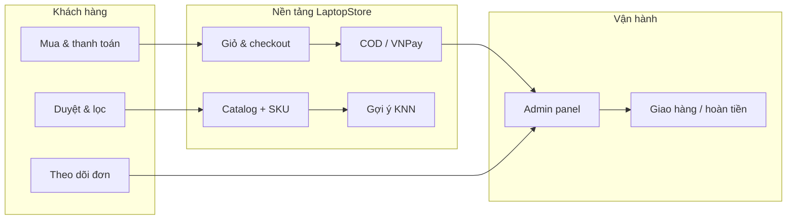
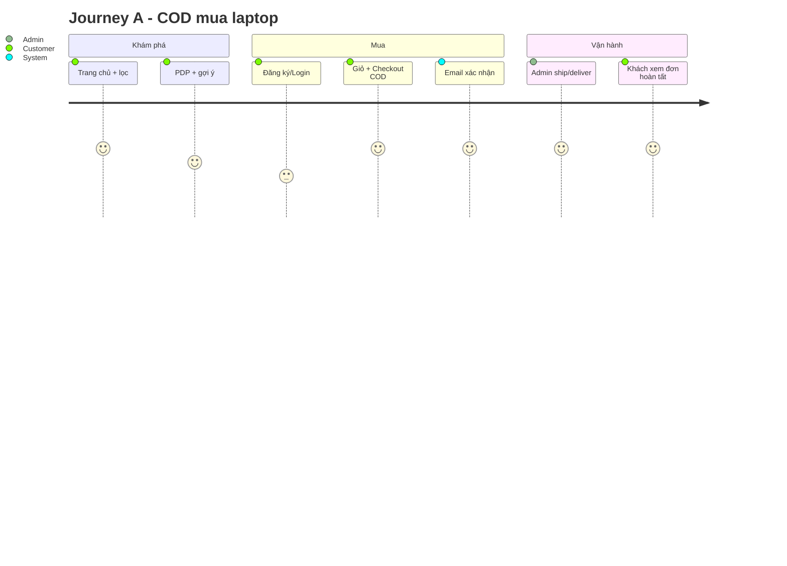
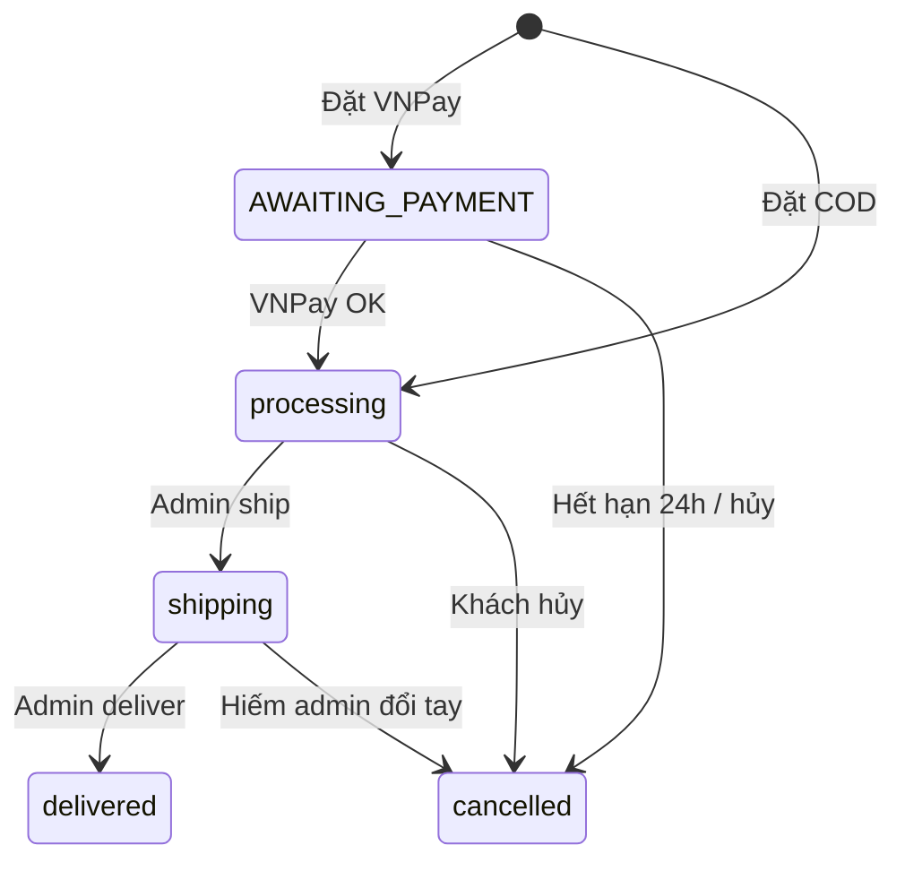
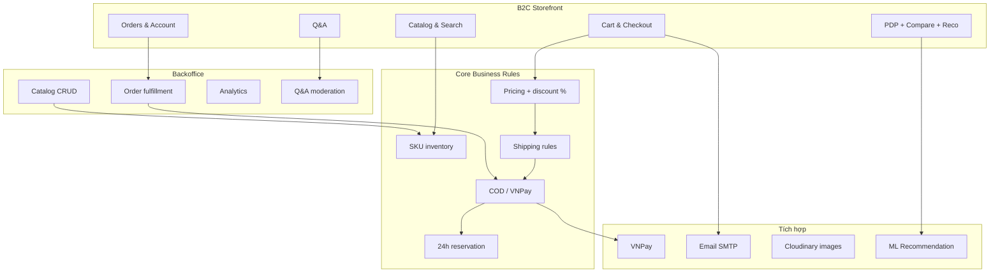

# Business Specification — LaptopStore (`laptop_NEW`)

| Thuộc tính | Giá trị |
|------------|---------|
| **Tài liệu** | Business Specification (đặc tả nghiệp vụ) |
| **Phiên bản** | 1.0 |
| **Ngày** | 2026-05-27 |
| **Trạng thái sản phẩm** | MVP đã triển khai — vận hành được end-to-end trên web |
| **Thị trường** | Việt Nam (VNPay, địa giới hành chính VN, giao diện tiếng Việt) |
| **Đối tượng đọc** | Product owner, BA, reviewer đồ án, dev tham chiếu nghiệp vụ |
| **Tài liệu kỹ thuật đi kèm** | [master_specification.md](../master_specification.md), [READMEAPI.md](../../READMEAPI.md) |
| **Use cases chi tiết** | [docs/use_cases/](../use_cases/) (85+ file) |

---

## Mục lục

1. [Tóm tắt điều hành](#1-tóm-tắt-điều-hành)
2. [Bối cảnh & định vị kinh doanh](#2-bối-cảnh--định-vị-kinh-doanh)
3. [Mục tiêu & phạm vi sản phẩm](#3-mục-tiêu--phạm-vi-sản-phẩm)
4. [Các bên liên quan (Stakeholders)](#4-các-bên-liên-quan-stakeholders)
5. [Bản đồ năng lực nghiệp vụ](#5-bản-đồ-năng-lực-nghiệp-vụ)
6. [Hành trình khách hàng (Customer Journeys)](#6-hành-trình-khách-hàng-customer-journeys)
7. [Quy tắc nghiệp vụ: Đơn hàng & thanh toán](#7-quy-tắc-nghiệp-vụ-đơn-hàng--thanh-toán)
8. [Quy tắc nghiệp vụ: Vận chuyển & giao hàng](#8-quy-tắc-nghiệp-vụ-vận-chuyển--giao-hàng)
9. [Quy tắc nghiệp vụ: Catalog & tồn kho](#9-quy-tắc-nghiệp-vụ-catalog--tồn-kho)
10. [Tương tác khách hàng: Q&A, so sánh, gợi ý](#10-tương-tác-khách-hàng-qa-so-sánh-gợi-ý)
11. [Mô hình vận hành Admin](#11-mô-hình-vận-hành-admin)
12. [Truyền thông & thông báo](#12-truyền-thông--thông-báo)
13. [Truy cập & phân quyền (góc nhìn nghiệp vụ)](#13-truy-cập--phân-quyền-góc-nhìn-nghiệp-vụ)
14. [Gợi ý sản phẩm (góc nhìn kinh doanh)](#14-gợi-ý-sản-phẩm-góc-nhìn-kinh-doanh)
15. [Ngoài phạm vi & ràng buộc kinh doanh](#15-ngoài-phạm-vi--ràng-buộc-kinh-doanh)
16. [Rủi ro, khoảng trống & nợ kỹ thuật ảnh hưởng kinh doanh](#16-rủi-ro-khoảng-trống--nợ-kỹ-thuật-ảnh-hưởng-kinh-doanh)
17. [Chỉ số thành công đề xuất (KPI)](#17-chỉ-số-thành-công-đề-xuất-kpi)
18. [Chỉ mục use case theo domain](#18-chỉ-mục-use-case-theo-domain)
19. [Tiêu chí nghiệm thu nghiệp vụ (UAT)](#19-tiêu-chí-nghiệm-thu-nghiệp-vụ-uat)
20. [Thuật ngữ](#20-thuật-ngữ)

---

## 1. Tóm tắt điều hành

**LaptopStore** là nền tảng **thương mại điện tử B2C** chuyên **laptop**, được xây dựng như đồ án full-stack với ba lớp:

| Lớp | Vai trò kinh doanh |
|-----|-------------------|
| **Cửa hàng trực tuyến** | Khách tìm kiếm, lọc theo cấu hình kỹ thuật, so sánh, hỏi đáp, mua hàng |
| **Vận hành nội bộ** | Admin quản lý catalog, đơn hàng, người dùng, Q&A, báo cáo |
| **Gợi ý thông minh** | Gợi ý laptop tương tự theo giá + hiệu năng (KNN), hiển thị trên trang chi tiết sản phẩm |

**Giá trị cốt lõi cho khách:** Mua laptop online với bộ lọc phù hợp nhu cầu kỹ thuật, thanh toán quen thuộc tại Việt Nam (COD / VNPay), phí ship theo địa bàn, và gợi ý cấu hình tương đương.

**Giá trị cốt lõi cho doanh nghiệp:** Một admin panel thống nhất, quản lý SKU-level (từng cấu hình RAM/SSD/CPU), fulfillment có trạng thái, và dashboard doanh thu cơ bản.



---

## 2. Bối cảnh & định vị kinh doanh

### 2.1. Vấn đề cần giải quyết

| Pain point thị trường | Cách LaptopStore đáp ứng (MVP) |
|----------------------|------------------------------|
| Laptop có nhiều biến thể cấu hình, khó so sánh | Trang chi tiết theo **variation** (SKU); so sánh tối đa 3 cấu hình |
| Lọc theo CPU/RAM/GPU thủ công trên nhiều site | API catalog **v2** + facets động |
| Thanh toán online cần VNPay/COD | Tích hợp **COD** và **VNPay sandbox** |
| Phí ship không minh bạch | Báo giá ship theo **tỉnh/thành + phường/xã** trước khi đặt |
| Không biết chọn cấu hình tương đương | Block **gợi ý tương tự** trên PDP (cần train ML) |
| Vận hành đơn rời rạc | **Admin** tập trung đơn, sản phẩm, Q&A |

### 2.2. Mô hình kinh doanh

| Khía cạnh | Mô tả |
|-----------|--------|
| **Mô hình** | B2C — một nhà bán (admin) quản lý toàn bộ catalog |
| **Không có** | Marketplace đa seller, đại lý, franchise |
| **Doanh thu** | Bán thiết bị + phí ship (rule-based, không thu hộ) |
| **Kênh** | Web responsive (không app native) |

### 2.3. Giả định nghiệp vụ (đồ án)

- Catalog laptop do **admin nhập**, không đồng bộ ERP bên ngoài.
- Khách **đăng ký tài khoản** để đặt hàng (giỏ gắn user).
- VNPay dùng **môi trường sandbox** cho demo; production cần merchant thật.
- Giao hàng **nội bộ / đối tác ngoài hệ thống** — phần mềm chỉ quản lý trạng thái, không tích hợp GHN/GHTK.

---

## 3. Mục tiêu & phạm vi sản phẩm

### 3.1. Mục tiêu kinh doanh (đã hỗ trợ bởi phần mềm)

| # | Mục tiêu | Bằng chứng trong hệ thống |
|---|---------|---------------------------|
| O1 | Bán laptop trực tuyến với nhiều cấu hình | `products` + `product_variations`, PDP chọn biến thể |
| O2 | Trải nghiệm mua sắm có lọc & tìm kiếm | `/products/v2`, facets, search suggestions |
| O3 | Thanh toán phổ biến tại VN | COD, VNPay (QR, Bank, thẻ, trả góp) |
| O4 | Quản lý đơn & fulfillment | Admin orders: ship, deliver, refund (VNPay) |
| O5 | Hỗ trợ quyết định mua (gợi ý + so sánh + Q&A) | KNN block, compare API, questions |
| O6 | Báo cáo vận hành cơ bản | Dashboard analytics, sales API |

### 3.2. Phạm vi MVP (In scope)

Toàn bộ mục **§6** trong [master_specification.md](../master_specification.md) — tóm tắt:

- Storefront: catalog, filter, search, PDP, compare, reco, cart, checkout.
- Auth: register (direct + email), login, forgot password, OAuth Google/Facebook, profile.
- Order: COD/VNPay, preview, đổi PT thanh toán/địa chỉ, hủy, tab đơn, retry VNPay.
- Admin: CRUD SP/biến thể/ảnh, category, brand, orders, users, roles, Q&A, analytics.
- System: JWT, role admin API, cron hủy đơn VNPay hết hạn, email đơn hàng.

### 3.3. Ngoài phạm vi (Out of scope) — ảnh hưởng kỳ vọng kinh doanh

| Hạng mục | Ý nghĩa kinh doanh |
|----------|-------------------|
| Đánh giá sao / review thật | Có field rating trên SP nhưng **không có luồng review** |
| Thông báo in-app | Model có, **không có UI** |
| Tags / voucher / khuyến mãi phức tạp | Chỉ `discount_percentage` cấp product |
| GHN / GHTK / Viettel Post API | Phí ship **rule nội bộ**, không tracking vận đơn |
| VNPay IPN server-to-server | Chỉ **Return URL** qua browser |
| SMS OTP / xác nhận giao | Email copy có nhắc SMS nhưng **chưa tích hợp** |
| Đa ngôn ngữ | Chỉ tiếng Việt |
| Marketplace seller | Một admin catalog |

---

## 4. Các bên liên quan (Stakeholders)

| Stakeholder | Mục tiêu | Tương tác với hệ thống |
|-------------|---------|------------------------|
| **Guest (khách)** | Xem giá, so sánh, đọc Q&A | Không giỏ/đặt hàng |
| **Customer** | Mua, theo dõi đơn, hỏi đáp | Storefront + JWT |
| **Administrator** | Vận hành catalog, đơn, Q&A, báo cáo | `/admin/*` (FE: role `admin`) |
| **Manager** (nếu có) | Cùng API admin | BE cho phép; **FE admin chặn** |
| **Staff** (nếu có role) | Trả lời Q&A trên storefront | `admin` hoặc `staff` trên API trả lời — **không** vào admin panel |
| **Hệ thống (Cron)** | Tự hủy đơn VNPay quá hạn | `releaseReservations` mỗi 2 phút |
| **VNPay** | Cổng thanh toán | Redirect return |
| **Khách hàng cuối (nhận hàng)** | Nhận hàng đúng địa chỉ | Dữ liệu từ checkout |

---

## 5. Bản đồ năng lực nghiệp vụ

Bản đồ dưới đây map **năng lực** → **module phần mềm** → **thư mục use case** (chi tiết kỹ thuật nằm ở đó).

| Năng lực nghiệp vụ | Mô tả ngắn | Module | Use cases (thư mục) |
|-------------------|-----------|--------|---------------------|
| **Khám phá catalog** | Lọc, sort, search, category/brand | Catalog | `docs/use_cases/catalog/` (11 UC) |
| **Xem & chọn cấu hình** | PDP, primary variation, specs | Catalog | UC_ViewProductDetail, UC_SelectProductConfiguration |
| **So sánh & gợi ý** | Compare ≤3; KNN similar | Catalog + Recommendation | UC_CompareProducts, UC_ViewKNNRecommendations |
| **Tài khoản** | Đăng ký, login, OAuth, profile | Auth | `docs/use_cases/auth/` (14 UC) |
| **Giỏ hàng** | Thêm/sửa/xóa, chọn checkout | Cart | `docs/use_cases/cart/` (6 UC) |
| **Đặt hàng & thanh toán** | Preview, COD/VNPay, hủy, đổi PT/địa chỉ | Order + Payment | `docs/use_cases/order/` (15 UC) |
| **Vận chuyển (báo giá)** | Tỉnh/xã, map, quote | Shipping | `docs/use_cases/shipping/` (4 UC) |
| **Thanh toán VNPay** | Redirect, return, retry | Payment | `docs/use_cases/payment/` (3 UC) |
| **Hỏi đáp** | Global + theo SP; admin duyệt/trả lời | Q&A | `docs/use_cases/qa/` (7 UC) |
| **Quản trị catalog** | SP, biến thể, category, brand | Admin | `docs/use_cases/admin/` (sản phẩm, category, brand) |
| **Quản trị đơn** | List, ship, deliver, refund | Admin | UC_AdminManageOrders, UC_AdminFulfillOrderLifecycle |
| **Quản trị user & role** | Khóa user, gán role (API) | Admin + System | UC_AdminManageUsers, UC_AdminManageRolesAndPermissions |
| **Báo cáo** | Dashboard, sales (API) | Admin | UC_AdminViewAnalyticsDashboard |
| **Thông báo email** | Xác nhận đơn, cập nhật trạng thái | Notification | `docs/use_cases/notification/` (2 UC) |
| **Hạ tầng phiên** | JWT, route guard, health, cron | System + UI | `docs/use_cases/system/`, `docs/use_cases/ui/` |

---

## 6. Hành trình khách hàng (Customer Journeys)

### 6.1. Journey A — Khách mới mua laptop (happy path COD)

| Bước | Hành động người dùng | Hệ thống (tóm tắt) |
|------|----------------------|-------------------|
| 1 | Vào trang chủ, lọc laptop gaming | `GET /products/v2` + facets |
| 2 | Mở PDP, chọn RAM/SSD/color | Variation price/stock cập nhật |
| 3 | Xem gợi ý tương tự | Proxy → Flask `/recommend` |
| 4 | Thêm giỏ → đăng ký/đăng nhập | Cart API + auth |
| 5 | Checkout: tỉnh/xã, map, COD | Preview → `POST /orders` |
| 6 | Nhận email xác nhận | `sendOrderConfirmationEmail` |
| 7 | Admin xử lý → giao | ship → deliver |
| 8 | Khách xem tab「Hoàn thành」 | `GET /orders` tab `completed` |



### 6.2. Journey B — Thanh toán VNPay (giữ kho 24h)

| Bước | Nghiệp vụ |
|------|-----------|
| 1 | Checkout chọn **VNPay** → đơn `AWAITING_PAYMENT`, **trừ kho ngay** |
| 2 | Redirect sang cổng VNPay sandbox |
| 3 | **Thành công:** return URL → `processing`, payment `completed` |
| 4 | **Thất bại / bỏ qua 24h:** cron → hoàn kho, `cancelled`, payment `failed` |
| 5 | Email xác nhận gửi **ngay khi tạo đơn** (kể cả chưa trả tiền) |

**Quy tắc kinh doanh quan trọng:** Khách có thể nhận email「đặt hàng thành công」trước khi thanh toán VNPay — cần training CS nếu triển khai thật.

### 6.3. Journey C — Mua ngay chưa login (buy now)

| Bước | Nghiệp vụ |
|------|-----------|
| 1 | PDP → Mua ngay → lưu `pendingCheckout` (localStorage) |
| 2 | Redirect login/register/OAuth |
| 3 | Sau auth → restore checkout (`/checkout` + state) |
| 4 | Hoàn tất đặt như Journey A/B |

Use cases: `UC_BuyNowWithoutFullLoginFlow`, `UC_RestorePendingCheckoutAfterLogin`, `UC_HandleOAuthSuccessCallback`.

### 6.4. Journey D — Hủy đơn (khách hàng)

Khách **chỉ hủy** khi:

| Điều kiện | COD | VNPay |
|-----------|-----|-------|
| Chờ thanh toán | — | `AWAITING_PAYMENT` + payment pending |
| Chờ giao | `processing` + payment pending | `processing` + payment **completed** |

Hệ quả: **hoàn kho**; VNPay đã trả tiền → payment có thể `pending` chờ admin **refund** (đánh dấu DB, không gọi API VNPay refund).

**Không gửi email** khi khách hủy (gap CS).

### 6.5. Journey E — Admin vận hành đơn

| Tab admin | Hành động nghiệp vụ |
|-----------|-------------------|
| Chờ giao hàng (`processing`) | Nút **Giao hàng** → `shipping` |
| Đang giao (`shipping`) | Nút **Đã nhận** → `delivered` |
| Đã hủy + VNPay (`cancelled`) | Nút **Hoàn tiền** (nếu provider VNPay) → `payment_status = refunded` |

Admin có thể **nhảy trạng thái** tùy ý qua dropdown (`PUT /status`) — bypass quy trình ship/deliver (rủi ro vận hành).

---

## 7. Quy tắc nghiệp vụ: Đơn hàng & thanh toán

### 7.1. Mã đơn & sở hữu

- Mỗi đơn thuộc **một user** (`user_id`), có `order_code` hiển thị cho khách.
- Chỉ user sở hữu đơn mới xem/hủy qua API customer (admin xem tất cả).

### 7.2. Tính tiền (business rules)

Công thức áp dụng khi tạo đơn (`createOrder`):

```
Với mỗi dòng hàng:
  itemDiscount = round((price × discount_percentage / 100) × quantity)
  dòng sau giảm = price × quantity - itemDiscount

subtotalAfterDiscount = tổng các dòng sau giảm
shipping_fee = quoteShipping(province_id, ward_id, subtotalAfterDiscount)
final_amount = subtotalAfterDiscount + shipping_fee
```

| Thành phần | Nguồn giảm giá |
|-----------|----------------|
| Giảm theo sản phẩm | `products.discount_percentage` áp dụng mọi biến thể |
| Mã giảm giá / voucher | **Không có** |

### 7.3. Trạng thái đơn hàng (logic kinh doanh)

| Trạng thái | Ý nghĩa với khách | Cách vào trạng thái |
|------------|-------------------|-------------------|
| `AWAITING_PAYMENT` | Chờ thanh toán VNPay | Tạo đơn VNPay |
| `processing` | Đang chuẩn bị / chờ giao | COD ngay khi đặt; VNPay sau return OK |
| `shipping` | Đang giao | Admin ship |
| `delivered` | Đã giao | Admin deliver |
| `cancelled` | Đã hủy | User hủy; cron VNPay hết hạn |
| `FAILED` | Thanh toán thất bại | VNPay return fail (tab khách có thể gộp với cancelled) |



### 7.4. Giữ kho (reservation) — VNPay

| Quy tắc | Giá trị |
|---------|---------|
| Thời hạn giữ chỗ | **24 giờ** kể từ tạo đơn |
| Thời điểm trừ kho | **Ngay** khi tạo đơn (trước khi khách trả tiền) |
| Hết hạn | Cron **mỗi 2 phút** hoàn kho + hủy đơn + fail payment |
| COD | **Không** set `reserve_expires_at` — không qua cron này |

### 7.5. Thanh toán — phương thức

| Provider | Khi đặt | Sau đặt |
|----------|---------|---------|
| **COD** | Order `processing`, payment `pending` | Thu tiền khi giao |
| **VNPay** | Order `AWAITING_PAYMENT`, payment `pending` | Return success → `completed` + order `processing` |

Khách có thể **đổi** COD ↔ VNPay (trước giao) qua `changePaymentMethod` — có email thông báo.

**Retry VNPay:** Đơn chờ thanh toán có thể tạo link thanh toán mới.

### 7.6. Điều kiện sửa đơn sau khi đặt

| Thao tác | Cho phép khi |
|----------|--------------|
| Đổi địa chỉ | **Không** `shipping`, `delivered`, `cancelled` |
| Đổi địa chỉ (VNPay đã trả tiền) | **Chặn** nếu đổi địa làm **phí ship đổi** |
| Đổi PT thanh toán | Theo rule controller (thường trước giao) |
| Hủy đơn | Theo bảng §6.4 |

### 7.7. Danh sách đơn khách — tab (UX)

| Tab hiển thị | Logic lọc (tóm tắt) |
|-------------|---------------------|
| Chờ thanh toán | VNPay + pending |
| Chờ giao hàng | processing + payment rule COD pending / VNPay completed |
| Đang giao | shipping |
| Hoàn thành | delivered + completed |
| Đã hủy / Thất bại | cancelled / FAILED |

Chi tiết: `UC_ViewMyOrdersWithTabs`.

---

## 8. Quy tắc nghiệp vụ: Vận chuyển & giao hàng

### 8.1. Dữ liệu địa lý

- Danh mục **tỉnh/thành** (`provinces`) và **phường/xã** (`wards`) trong DB.
- Checkout **bắt buộc** chọn `province_id`, `ward_id`.
- Checkout **bắt buộc** xác nhận tọa độ trên bản đồ (`geo_lat`, `geo_lng`) — OpenStreetMap phía FE.

### 8.2. Công thức phí vận chuyển (rule-based)

Thứ tự ưu tiên (`shippingService` / `quoteShipping`):

| # | Điều kiện | Phí ship |
|---|-----------|---------|
| 1 | `province.is_free_shipping = true` | **0** |
| 2 | `province.is_hcm = true` **và** subtotal ≥ **1.000.000 VND** | **0** |
| 3 | Mặc định | `base_shipping_fee` (tỉnh) + `extra_fee` (phường/xã) |
| 4 | Có `max_shipping_fee` | `min(tính được, max)` |
| 5 | Làm tròn | Số nguyên, ≥ 0 |

**Không có:** freeship theo mã, theo user VIP, theo trọng lượng sản phẩm.

### 8.3. Fulfillment (góc kinh doanh)

- Admin **không** nhập mã vận đơn đối tác.
- Trạng thái giao hàng là **cam kết nội bộ** với khách, không sync tracking GHN.
- Khách theo dõi qua **tab đơn** + email khi admin đổi status (nếu SMTP bật).

---

## 9. Quy tắc nghiệp vụ: Catalog & tồn kho

### 9.1. Cấu trúc sản phẩm

| Cấp | Khái niệm kinh doanh | Ví dụ |
|-----|----------------------|-------|
| **Product** | Model laptop (marketing) | "Dell XPS 15" |
| **Variation (SKU)** | Cấu hình bán được | i7 / 16GB / 512GB / Xám |
| **Primary variation** | Cấu hình mặc định hiển thị | Một biến thể `is_primary = true` |

Mỗi SKU có: **giá**, **tồn kho**, CPU/GPU/RAM/SSD (phục vụ lọc & ML).

### 9.2. Hiển thị & bán

| Quy tắc | Chi tiết |
|---------|----------|
| Chỉ bán variation `is_available = true` | Lọc catalog/reco |
| Hết hàng | Không thêm giỏ / báo lỗi khi đặt |
| Soft delete sản phẩm | Admin delete → `is_active = false` (không xóa hẳn khỏi DB) |
| Ảnh | Thumbnail + gallery; upload Cloudinary qua admin |

### 9.3. Lọc & tìm kiếm (giá trị cho khách)

- Lọc: category, brand, khoảng giá, **processor, ram, storage, graphics_card, screen_size, weight**.
- Sort: giá, mới, bán chạy.
- Gợi ý tìm kiếm khi gõ ≥ 2 ký tự (API suggestions).

### 9.4. Tồn kho & rủi ro oversell

| Sự kiện | Tồn kho |
|---------|---------|
| Thêm giỏ | **Không** trừ kho |
| Tạo đơn | **Trừ** kho (lock row) |
| Hủy đơn / cron hết hạn VNPay | **Hoàn** kho |
| Admin sửa tồn kho | Trực tiếp trên biến thể |

**Rủi ro kinh doanh:** Hai khách cùng mua variation cuối cùng — ai tạo đơn trước (transaction) thắng.

---

## 10. Tương tác khách hàng: Q&A, so sánh, gợi ý

### 10.1. Hỏi đáp (Q&A)

| Loại | Vị trí | Ai đặt câu hỏi | Ai trả lời |
|------|--------|----------------|-----------|
| **Global** | Trang chủ / trang Q&A chung | User JWT | Admin (panel) hoặc staff/admin trên API |
| **Theo sản phẩm** | PDP | User JWT | Admin / staff |

- Hỗ trợ câu hỏi **lồng nhau** (`parent_question_id`).
- Admin duyệt list + trả lời chi tiết; user có thể sửa/xóa câu hỏi của mình (rule owner/staff).

### 10.2. So sánh sản phẩm

- Tối đa **3** biến thể (variation) so sánh cạnh nhau.
- Dùng Redux `compareSlice` + API compare.

### 10.3. Gợi ý sản phẩm (KNN) — giá trị kinh doanh

| Khía cạnh | Mô tả |
|-----------|--------|
| **Mục tiêu** | "Laptop tương tự cấu hình đang xem" — tăng cross-sell |
| **Vị trí** | Block trên PDP (tối đa **5** card hiển thị) |
| **Logic** | Tương tự về **giá + hiệu năng** (CPU/GPU benchmark), không phải "cùng brand" |
| **Vận hành** | Cần **train offline** sau khi đổi catalog lớn |
| **Lỗi hệ thống** | Service down → section trống, PDP vẫn dùng được |

Chi tiết kỹ thuật: `docs/use_cases/recommendation/`.

---

## 11. Mô hình vận hành Admin

### 11.1. Chức năng admin (theo menu thực tế)

| Module | Nghiệp vụ chính |
|--------|----------------|
| **Dashboard / Analytics** | Doanh thu, AOV, đơn theo trạng thái, top SP, low stock (kỳ hạn dashboard) |
| **Sản phẩm** | CRUD product + variations + ảnh (form upload) |
| **Đơn hàng** | List theo tab trạng thái; chi tiết; ship/deliver/refund |
| **Người dùng** | List; khóa/mở khóa (`is_active`) |
| **Danh mục / Thương hiệu** | CRUD + icon/logo |
| **Q&A** | Duyệt câu hỏi, trả lời |

**Lưu ý UI:** Route `/admin/brands` **có** nhưng **không** có link sidebar — vào bằng URL trực tiếp.

### 11.2. Quy trình fulfillment chuẩn (khuyến nghị vận hành)

```
1. Tab「Chờ giao hàng」→ xác nhận thanh toán (COD/VNPay)
2. Nút「Giao hàng」→ chuyển「Đang giao hàng」
3. Nút「Đã nhận」→「Hoàn thành」
4. Nếu đơn VNPay đã hủy nhưng đã thu tiền → tab「Đã hủy」→「Hoàn tiền」(đánh dấu nội bộ)
```

### 11.3. Quản lý catalog — quy tắc nghiệp vụ

| Quy tắc | Chi tiết |
|---------|----------|
| Mỗi sản phẩm | **Đúng 1** biến thể `is_primary` |
| Xóa danh mục | **Không** xóa nếu còn sản phẩm gắn |
| Xóa thương hiệu | **Không** xóa nếu còn sản phẩm |
| Slug category/brand | Tự sinh từ tên khi tạo/sửa |

### 11.4. Phân quyền admin (thực tế)

| Role | Admin panel (FE) | API `/api/admin` |
|------|------------------|------------------|
| `admin` | ✅ | ✅ |
| `manager` | ❌ redirect `/` | ✅ |
| `customer` | ❌ | ❌ |
| `staff` | ❌ | ❌ (nhưng có thể trả lời Q&A storefront) |

Seed admin mặc định: `npm run seed:admin` → `super_admin` / `admin@laptopstore.com` (đổi mật khẩu sau triển khai).

---

## 12. Truyền thông & thông báo

### 12.1. Kênh email (SMTP / Gmail)

| Sự kiện | Email | Ghi chú kinh doanh |
|---------|-------|-------------------|
| Tạo đơn | **Xác nhận đơn** | Gửi async; lỗi SMTP không chặn đặt hàng |
| Admin ship/deliver/đổi status | **Cập nhật trạng thái** | |
| Đổi địa chỉ / PT thanh toán | **Cập nhật đơn** | |
| Admin refund VNPay | **Hoàn tiền** | Chỉ đánh dấu DB, không tự hoàn tiền ngân hàng |
| Khách hủy đơn | **Không gửi** | Gap CS |
| VNPay thành công | **Không gửi riêng** | Khách dựa vào tab đơn |
| Đăng ký email verify | Link xác minh | Auth flow |

### 12.2. Nội dung marketing trong email

Email xác nhận có bullet hứa **SMS** và hotline — **chưa có** tích hợp thật (chỉ copy).

---

## 13. Truy cập & phân quyền (góc nhìn nghiệp vụ)

### 13.1. Khách hàng

| Hành động | Cần đăng nhập? |
|-----------|----------------|
| Xem catalog, PDP, Q&A đọc | Không |
| Giỏ / đặt hàng / profile / đơn | **Có** |
| OAuth Google/Facebook | Tùy chọn thay register |

Phiên lưu **JWT 7 ngày** trong `localStorage` — F5 vẫn đăng nhập (`UC_RestoreAuthFromLocalStorage`).

### 13.2. Bảo vệ trang (UI)

| Route | Guard |
|-------|-------|
| `/checkout`, `/profile`, `/orders` | `ProtectedRoute` → login |
| `/admin/*` | `AdminRoute` → login + role `admin` |

**Gap:** `/orders/:id` (chi tiết đơn) **không** bọc protected — có thể lộ URL (API vẫn cần JWT đúng user).

---

## 14. Gợi ý sản phẩm (góc nhìn kinh doanh)

### 14.1. Định vị

| Câu hỏi kinh doanh | Trả lời từ hệ thống hiện tại |
|-------------------|------------------------------|
| Gợi ý cùng hãng? | **Không** — theo gần giá + hiệu năng |
| Gợi ý rẻ hơn? | Có penalty nếu giá cao hơn gốc nhiều |
| Sản phẩm mới có được ưu tiên? | **Có** — pool "fresh" 60 ngày + recency boost |
| Bao lâu cập nhật sau khi đổi giá? | Sau khi chạy lại `train_recommend.py` + restart service |

### 14.2. Trách nhiệm vận hành ML (role RACI đơn giản)

| Việc | Owner đề xuất |
|------|---------------|
| Train model định kỳ | DevOps / Admin catalog |
| Monitor service up | Ops |
| Giải thích khách khi reco trống | CS (do ML down / chưa train) |

---

## 15. Ngoài phạm vi & ràng buộc kinh doanh

### 15.1. Ràng buộc pháp lý / vận hành (cần bổ sung khi go-live)

- Chính sách đổi trả / bảo hành — **không** model trong phần mềm.
- Chính sách bảo mật GDPR-style — chỉ lưu trữ cơ bản user + địa chỉ giao hàng.
- Hóa đơn VAT / e-invoice — **không** có.

### 15.2. Ràng buộc kỹ thuật → hạn chế kinh doanh

| Ràng buộc | Tác động |
|----------|----------|
| Một cửa hàng, một admin catalog | Không scale đa thương hiệu độc lập |
| Không GHN/GHTK | Không tracking, không in vận đơn |
| VNPay refund thủ công | CS phải hoàn tiền ngoài hệ thống |
| ML không tự train | Reco lỗi thời sau đổi giá |
| FE/BE env lệch tên biến | Dễ cấu hình sai khi deploy |

---

## 16. Rủi ro, khoảng trống & nợ kỹ thuật ảnh hưởng kinh doanh

Bảng dưới ưu tiên **tác động kinh doanh** (chi tiết kỹ thuật trong master spec §17 và từng UC).

| ID | Rủi ro / gap | Mức độ | Tác động kinh doanh |
|----|--------------|--------|-------------------|
| R1 | VNPay hết hạn 24h — khách không được email | Trung bình | Nhầm lẫn đơn hủy |
| R2 | Refund chỉ đánh dấu DB | Cao | Tranh chấp hoàn tiền |
| R3 | Admin đổi status tùy ý | Trung bình | Sai quy trình giao hàng |
| R4 | Manager không vào FE admin | Thấp | Vận hành khó nếu tách role |
| R5 | Reco down / chưa train | Cao | Mất cross-sell |
| R6 | Email fail im lặng | Trung bình | Khách không nhận xác nhận |
| R7 | Cart page public nhưng API cần login | Thấp | UX khó hiểu |
| R8 | Double header admin + storefront | Thấp | Giao diện admin rối |
| R9 | Không review sản phẩm | Trung bình | Ít social proof |
| R10 | Không voucher | Trung bình | Khuyến mãi hạn chế |

---

## 17. Chỉ số thành công đề xuất (KPI)

Hệ thống **đã có dữ liệu** cho một số KPI qua dashboard (`/admin/analytics/dashboard`):

| KPI | Nguồn dữ liệu | Ghi chú |
|-----|---------------|--------|
| Doanh thu theo kỳ | `SUM(final_amount)` đơn `delivered` | Chọn period 7/30/90 ngày |
| AOV | revenue / số đơn delivered | |
| Tỷ lệ đơn delivered / tổng đơn tạo | success_rate trong API | Định nghĩa kỹ thuật — cần thống nhất báo cáo |
| Đơn 7 ngày gần nhất | `recent.orders_last_7_days` | |
| Top sản phẩm bán | SQL order_items | |
| Cảnh báo tồn kho thấp | Low stock query | Hỗ trợ nhập hàng |

**KPI chưa có trong hệ thống** (cần analytics bổ sung):

- Tỷ lệ chuyển đổi giỏ → đơn (conversion rate).
- Tỷ lệ hủy VNPay / COD.
- Thời gian trung bình fulfillment (processing → delivered).
- CSAT / NPS.
- Click-through gợi ý KNN.

---

## 18. Chỉ mục use case theo domain

Tài liệu này **không** thay thế use case — dùng bảng dưới để tra cứu. Tổng **85+** file trong `docs/use_cases/`.

| Domain | Số lượng (ước) | Thư mục | Ví dụ UC |
|--------|----------------|---------|----------|
| Auth | 14 | `auth/` | Login, OAuth, Register, Reset password |
| Catalog | 11 | `catalog/` | Browse, PDP, Search, Compare |
| Cart | 6 | `cart/` | View cart, Add, Checkout selection |
| Order | 15 | `order/` | COD/VNPay checkout, Cancel, Tabs |
| Payment | 3 | `payment/` | VNPay return, Retry |
| Shipping | 4 | `shipping/` | Provinces, wards, quote, map |
| Q&A | 7 | `qa/` | Ask, Admin answer |
| Admin | 11 | `admin/` | Products, orders, users, analytics |
| Recommendation | 3 | `recommendation/` | Train, ML API, PDP block |
| Notification | 2 | `notification/` | Confirm email, Update email |
| System | 5 | `system/` | JWT, roles, seed, health, cron |
| UI | 4 | `ui/` | Layout, route guards, restore session |

**Quy ước ID use case trong tài liệu chi tiết:**

- Auth: `UC-AUTH-xx` · Catalog: `UC-CAT-xx` · Order: `UC-ORD-xx` · Cart: `UC-CART-xx`
- Admin: `UC-ADM-xx` · System: `UC-SYS-xx` · UI: `UC-UI-xx` · Notification: `UC-NOT-xx`

---

## 19. Tiêu chí nghiệm thu nghiệp vụ (UAT)

Checklist cho nghiệm thu **từ góc kinh doanh** (bám [master_specification.md](../master_specification.md) Phụ lục B và code hiện tại):

### 19.1. Khách hàng (Storefront)

- [ ] Lọc laptop theo CPU, RAM, giá — kết quả hợp lý.
- [ ] PDP: chọn biến thể, giá và tồn kho khớp admin.
- [ ] Gợi ý SP hiển thị sau khi đã train ML.
- [ ] Thêm giỏ, sửa số lượng, xóa — giá snapshot đúng lúc thêm.
- [ ] Checkout COD: đơn vào tab「Chờ giao hàng」, email (nếu SMTP).
- [ ] Checkout VNPay: redirect sandbox, return thành công, đơn chuyển chờ giao.
- [ ] Để đơn VNPay quá 24h (test chỉnh `reserve_expires_at`) → kho hoàn, đơn hủy.
- [ ] Hủy đơn đúng điều kiện — kho hoàn.
- [ ] Đăng ký + verify email + login OAuth (smoke).
- [ ] Đặt câu hỏi SP + thấy admin trả lời.

### 19.2. Vận hành (Admin)

- [ ] Tạo SP mới + 2 biến thể + ảnh — hiện storefront.
- [ ] Tab đơn: ship → deliver; refund đơn VNPay cancelled.
- [ ] Khóa user → user không login được.
- [ ] Dashboard hiển thị doanh thu khi có đơn delivered.
- [ ] Trả lời Q&A từ admin panel.

### 19.3. Phi chức năng (go-live blocker nếu production)

- [ ] Đổi mật khẩu admin seed mặc định.
- [ ] Cấu hình SMTP, VNPay production, `JWT_SECRET`, DB URL thống nhất.
- [ ] Train recommendation + verify `/health` + PDP gợi ý.
- [ ] Xác nhận chính sách refund/CS với khách (ngoài phần mềm).

---

## 20. Thuật ngữ

| Thuật ngữ | Định nghĩa trong LaptopStore |
|-----------|------------------------------|
| **Product** | Sản phẩm marketing (một model laptop) |
| **Variation / SKU** | Biến thể bán được (cấu hình cụ thể) |
| **Primary variation** | Biến thể mặc định hiển thị trên PDP |
| **PDP** | Product Detail Page — trang chi tiết sản phẩm |
| **COD** | Thanh toán khi nhận hàng |
| **VNPay** | Cổng thanh toán điện tử (sandbox trong đồ án) |
| **Reservation / Giữ kho** | Trừ tồn kho khi đặt VNPay, giữ 24h |
| **Fulfillment** | Quy trình xử lý → giao → hoàn tất đơn |
| **Soft delete** | Ẩn sản phẩm (`is_active = false`) thay vì xóa DB |
| **KNN gợi ý** | Gợi ý laptop tương tự theo giá + hiệu năng |
| **Facet** | Bộ đếm số lượng theo tiêu chí lọc (ví dụ số SP theo RAM) |
| **Pending checkout** | Dữ liệu checkout lưu tạm khi user chưa login (buy now) |

---

## Phụ lục — Sơ đồ tổng thể nghiệp vụ (context)



---

## Liên kết tài liệu liên quan

| Tài liệu | Mục đích |
|----------|---------|
| [master_specification.md](../master_specification.md) | Đặc tả kỹ thuật đầy đủ, API, kiến trúc |
| [READMEAPI.md](../../READMEAPI.md) | Contract API chi tiết |
| [docs/use_cases/](../use_cases/) | Use case từng luồng (kịch bản + code) |
| [docs/feature_requirements/](../feature_requirements/) | Functional requirements theo module |
| [docs/architecture/](../architecture/) | Kiến trúc hệ thống (nếu có) |

---

## Lịch sử thay đổi tài liệu

| Phiên bản | Ngày | Mô tả |
|----------|------|--------|
| 1.0 | 2026-05-27 | Khởi tạo Business Spec tổng hợp từ source code + 85 use cases + master spec |

---

*Tài liệu mô tả **nghiệp vụ và quy tắc kinh doanh** phản ánh **hiện trạng code** dự án `laptop_NEW`. Khi thay đổi logic nghiệp vụ, cập nhật tài liệu này đồng thời với use case liên quan và `master_specification.md`.*
