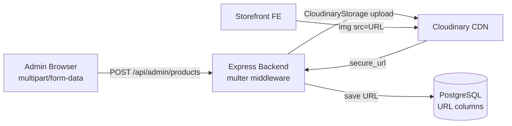
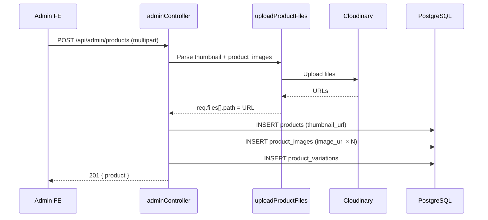

# Commerce Object Storage — LaptopStore (laptop_NEW)

> **Phiên bản:** 1.0  
> **Ngày cập nhật:** 2026-05-26  
> **Phạm vi:** Lưu trữ ảnh/media cho catalog commerce (products, categories, brands)  
> **Provider:** **Cloudinary** (không dùng local disk hay MinIO/S3 trực tiếp)  
> **Liên quan:** [`backend-convention.md`](./backend-convention.md) · [`database-strategy.md`](../architecture/database-strategy.md)

---

## Mục lục

1. [Tổng quan](#1-tổng-quan)
2. [Kiến trúc lưu trữ](#2-kiến-trúc-lưu-trữ)
3. [Cloudinary Configuration](#3-cloudinary-configuration)
4. [Upload Middleware](#4-upload-middleware)
5. [Folder Structure trên Cloudinary](#5-folder-structure-trên-cloudinary)
6. [Upload Flow theo Entity](#6-upload-flow-theo-entity)
7. [Database URL Storage](#7-database-url-storage)
8. [Admin API Upload Endpoints](#8-admin-api-upload-endpoints)
9. [Frontend Upload Pattern](#9-frontend-upload-pattern)
10. [Formats & Constraints](#10-formats--constraints)
11. [Security & Access Control](#11-security--access-control)
12. [Error Handling](#12-error-handling)
13. [Hạn chế & Lộ trình](#13-hạn-chế--lộ-trình)

---

## 1. Tổng quan

LaptopStore **không lưu binary file trên server** hay PostgreSQL. Mọi media (ảnh sản phẩm, icon danh mục, logo thương hiệu, avatar user) được upload lên **Cloudinary CDN**, database chỉ lưu **URL string**.

| Nguyên tắc | Mô tả |
|------------|-------|
| **URL-only in DB** | Chỉ lưu HTTPS URL, không BLOB |
| **CDN delivery** | Cloudinary serve ảnh globally |
| **Admin-only upload** | Chỉ `/api/admin/*` có upload |
| **Multer bridge** | Express multer → CloudinaryStorage |
| **Folder isolation** | Mỗi entity type có folder riêng |

### So sánh với pattern khác

| | LaptopStore | Local disk | S3/MinIO |
|--|-------------|------------|----------|
| Provider | Cloudinary SaaS | `./server/uploads` | Self-hosted |
| DB stores | URL | Path/URL | URL/key |
| Transform | Cloudinary built-in | Manual | Manual/CDN |
| Cost | Free tier + usage | Disk space | Storage + egress |

---

## 2. Kiến trúc lưu trữ



**Luồng đọc:** Frontend render trực tiếp `` — không qua backend proxy.

---

## 3. Cloudinary Configuration

**File:** `server/middleware/upload.js`

```javascript
cloudinary.config({
  cloud_name: process.env.CLOUDINARY_NAME,
  api_key: process.env.CLOUDINARY_KEY,
  api_secret: process.env.CLOUDINARY_SECRET,
})
```

### Environment variables

| Variable | Docker compose name | Mô tả |
|----------|---------------------|-------|
| `CLOUDINARY_NAME` | `CLOUDINARY_CLOUD_NAME` | Cloud name |
| `CLOUDINARY_KEY` | `CLOUDINARY_API_KEY` | API key |
| `CLOUDINARY_SECRET` | `CLOUDINARY_API_SECRET` | API secret |

> **Naming inconsistency:** Code dùng `CLOUDINARY_NAME`; docker-compose/env-example dùng `CLOUDINARY_CLOUD_NAME`. Cần map đúng khi deploy.

---

## 4. Upload Middleware

**File:** `server/middleware/upload.js`

### 4.1. Storage instances

| Export | CloudinaryStorage folder | Field name(s) | Max count |
|--------|--------------------------|---------------|-----------|
| `uploadProductFiles` | `laptop-store/products` | `thumbnail`, `product_images` | 1 + 10 |
| `uploadThumbnail` | `laptop-store/thumbnails` | single | 1 |
| `uploadProductImages` | `laptop-store/products` | multiple | — |
| `uploadCategoryIcon` | `laptop-store/categories` | `icon` | 1 |
| `uploadBrandLogo` | `laptop-store/brands` | `logo` | 1 |
| `uploadCategoryFiles` | `laptop-store/categories` | `thumbnail` | 1 |
| `uploadBrandFiles` | `laptop-store/brands` | `thumbnail` | 1 |

### 4.2. Middleware được dùng thực tế

Admin controller chủ yếu dùng **`uploadProductFiles`** cho mọi entity (product, category, brand):

```javascript
exports.createProduct = [
  uploadProductFiles,
  async (req, res, next) => { ... }
]
```

Category/brand đọc field `thumbnail` (backward compat) thay vì `icon`/`logo` dedicated middleware.

### 4.3. URL extraction pattern

```javascript
// Sau upload, Cloudinary URL nằm ở file.path (multer-storage-cloudinary convention)
if (req.files?.thumbnail?.[0]) {
  thumbnail_url = req.files.thumbnail[0].path
}

if (req.files?.product_images) {
  const imageUrls = req.files.product_images.map(f => ({
    image_url: f.path,
    alt_text: f.originalname,
  }))
}
```

**URL format ví dụ:**
```
https://res.cloudinary.com/{cloud_name}/image/upload/v1234567890/laptop-store/products/abc123.jpg
```

---

## 5. Folder Structure trên Cloudinary

```
Cloudinary Account
└── laptop-store/
    ├── thumbnails/          # (defined, ít dùng trực tiếp)
    ├── products/            # Product thumbnail + gallery images
    ├── categories/          # Category icons
    └── brands/              # Brand logos
```

| Folder | Entity | DB column |
|--------|--------|-----------|
| `laptop-store/products` | Product thumbnail + images | `products.thumbnail_url`, `product_images.image_url` |
| `laptop-store/categories` | Category icon | `categories.icon_url` |
| `laptop-store/brands` | Brand logo | `brands.logo_url` |

---

## 6. Upload Flow theo Entity

### 6.1. Product (thumbnail + gallery)



**Form fields (multipart):**

| Field | Type | Required | Max |
|-------|------|----------|-----|
| `thumbnail` | File | Recommended | 1 |
| `product_images` | File[] | Optional | 10 |
| `product_name` | Text | ✅ | — |
| `description` | Text | — | — |
| `category_id` | Number | — | — |
| `brand_id` | Number | — | — |
| `variations` | JSON string | ✅ | — |

### 6.2. Category (icon)

```
POST /api/admin/categories
Field: thumbnail (file) → categories.icon_url
```

### 6.3. Brand (logo)

```
POST /api/admin/brands
Field: thumbnail (file) → brands.logo_url
```

### 6.4. User avatar

**Hiện tại:** `users.avatar_url` là VARCHAR — có thể set qua `PUT /api/auth/profile` với URL string, **không có upload endpoint riêng**.

---

## 7. Database URL Storage

### 7.1. Columns lưu URL

| Table | Column | Type | Max length |
|-------|--------|------|------------|
| `products` | `thumbnail_url` | VARCHAR(255) | 255 |
| `product_images` | `image_url` | VARCHAR(255) | 255 |
| `product_images` | `alt_text` | VARCHAR(255) | 255 |
| `product_images` | `display_order` | INTEGER | — |
| `product_images` | `is_primary` | BOOLEAN | — |
| `categories` | `icon_url` | VARCHAR(255) | 255 |
| `brands` | `logo_url` | VARCHAR(255) | 255 |
| `users` | `avatar_url` | VARCHAR(255) | 255 |

### 7.2. Product images relationship

```
products (1) ──→ (N) product_images
  thumbnail_url     image_url (gallery)
  (primary display)  display_order, is_primary
```

**Frontend ưu tiên:** `thumbnail_url` cho card/grid; gallery từ `images[]` trên detail page.

### 7.3. Không lưu

| Data | Lý do |
|------|-------|
| Binary/BLOB | Cloudinary handles |
| Cloudinary public_id | Không track — chỉ URL |
| Upload metadata | Không lưu size, mime |
| Local file path | Không dùng local storage |

---

## 8. Admin API Upload Endpoints

| Method | Path | Upload middleware | Response |
|--------|------|-------------------|----------|
| POST | `/api/admin/products` | `uploadProductFiles` | 201 `{ product }` |
| PUT | `/api/admin/products/:product_id` | `uploadProductFiles` | 200 `{ product }` |
| POST | `/api/admin/categories` | `uploadProductFiles` | 201 `{ category }` |
| PUT | `/api/admin/categories/:category_id` | `uploadProductFiles` | 200 `{ category }` |
| POST | `/api/admin/brands` | `uploadProductFiles` | 201 `{ brand }` |
| PUT | `/api/admin/brands/:brand_id` | `uploadProductFiles` | 200 `{ brand }` |

**Auth:** JWT + role `admin` hoặc `manager`.

---

## 9. Frontend Upload Pattern

Admin pages dùng `<input type="file">` + `FormData`:

```javascript
const formData = new FormData()
formData.append("product_name", name)
formData.append("description", description)
formData.append("category_id", categoryId)
formData.append("variations", JSON.stringify(variations))

if (thumbnailFile) {
  formData.append("thumbnail", thumbnailFile)
}
productImages.forEach(file => {
  formData.append("product_images", file)
})

await api.post("/admin/products", formData, {
  headers: { "Content-Type": "multipart/form-data" },
})
```

**Preview:** Admin pages thường dùng `URL.createObjectURL(file)` cho preview trước upload.

---

## 10. Formats & Constraints

### 10.1. Allowed formats

| Storage | Formats |
|---------|---------|
| Product images | jpg, png, jpeg, webp |
| Category icons | jpg, png, jpeg, webp, **svg** |
| Brand logos | jpg, png, jpeg, webp, **svg** |
| Thumbnails | jpg, png, jpeg, webp |

### 10.2. Limits

| Constraint | Value |
|------------|-------|
| Product gallery max | 10 images per request |
| Thumbnail max | 1 per request |
| URL max length (DB) | 255 chars |
| File size limit | Cloudinary/multer default (không custom trong code) |

### 10.3. Cloudinary transforms (chưa dùng)

Code hiện tại **không** apply transforms (resize, crop, quality) trong upload params. Có thể thêm:

```javascript
params: {
  folder: 'laptop-store/products',
  transformation: [{ width: 800, height: 600, crop: 'limit' }],
}
```

---

## 11. Security & Access Control

| Aspect | Implementation |
|--------|----------------|
| Upload auth | JWT + admin/manager role |
| Public read | Cloudinary URLs are public |
| Direct upload from FE | ❌ Không — upload qua backend only |
| Signed URLs | ❌ Không dùng |
| Virus scan | ❌ Không |

**Khuyến nghị production:**
- Validate file MIME type server-side (ngoài Cloudinary)
- Set max file size trong multer config
- Cloudinary upload preset với restrictions

---

## 12. Error Handling

| Error | Behavior |
|-------|----------|
| Missing Cloudinary config | Upload fails at runtime |
| Invalid file format | Cloudinary rejects |
| Upload timeout | Multer error → errorHandler → 500 |
| Missing thumbnail on create | Product created without thumbnail (nullable) |

**Không có** cleanup logic khi DB insert fail sau upload thành công (orphan files trên Cloudinary).

---

## 13. Hạn chế & Lộ trình

### 13.1. Hạn chế hiện tại

| # | Hạn chế |
|---|---------|
| 1 | Không xóa ảnh cũ trên Cloudinary khi update/delete product |
| 2 | Không track Cloudinary public_id → khó delete programmatically |
| 3 | Category/brand dùng field `thumbnail` thay vì `icon`/`logo` |
| 4 | User avatar không có upload endpoint |
| 5 | Không có image optimization pipeline |
| 6 | `VARCHAR(255)` có thể truncate URL dài |
| 7 | Docker volume `./server/uploads` mount nhưng không dùng |

### 13.2. Lộ trình cải tiến

| Phase | Action |
|-------|--------|
| 1 | Lưu `cloudinary_public_id` trong DB để enable delete |
| 2 | Thêm multer file size limit (5MB) |
| 3 | Cloudinary transforms cho thumbnail (800×600) |
| 4 | Avatar upload endpoint cho user profile |
| 5 | Orphan cleanup job (Cloudinary admin API) |
| 6 | Xóa Docker volume mount `./server/uploads` không dùng |

---

## Phụ lục — Entity → Storage mapping

| Entity | Upload field | Cloudinary folder | DB table.column | FE display |
|--------|-------------|-------------------|-----------------|------------|
| Product | `thumbnail` | `laptop-store/products` | `products.thumbnail_url` | ProductCard, detail |
| Product gallery | `product_images[]` | `laptop-store/products` | `product_images.image_url` | Detail gallery |
| Category | `thumbnail` | `laptop-store/categories`* | `categories.icon_url` | Filter, admin |
| Brand | `thumbnail` | `laptop-store/brands`* | `brands.logo_url` | Filter, admin |
| User avatar | — (URL only) | — | `users.avatar_url` | Profile, header |

`*` Thực tế admin dùng `uploadProductFiles` → folder `products` cho category/brand (do reuse middleware). Nên chuyển sang dedicated middleware cho đúng folder.

---

*Phản ánh cách LaptopStore quản lý media qua Cloudinary tại `server/middleware/upload.js` và admin controllers.*
