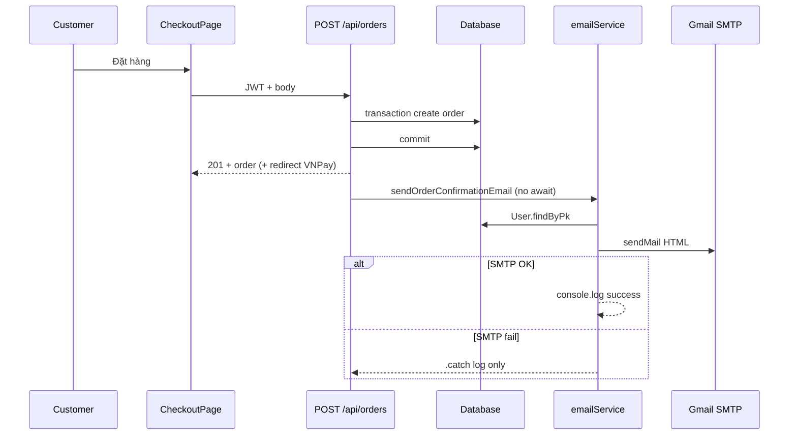

# Functional Requirement (FR) — Gửi email xác nhận đơn hàng (Send Order Confirmation Email)

## 1. Feature Overview

Sau khi khách **tạo đơn hàng thành công** (`POST /api/orders`), hệ thống gửi **email HTML xác nhận** tới địa chỉ email của user đặt hàng — thông báo mã đơn, sản phẩm, tổng tiền, địa chỉ giao hàng và phương thức thanh toán.

Đây là kênh **giao tiếp khách hàng (customer portal / transactional email)** song song với admin analytics — không phải API REST độc lập; logic nằm trong `server/services/emailService.js`, được gọi **fire-and-forget** từ `orderController.createOrder`.

```
Trigger: POST /api/orders → commit transaction → sendOrderConfirmationEmail(...)
Pattern: async, không block HTTP 201
Transport: nodemailer + Gmail service (hardcoded trong emailService)
```

**Không gửi** khi: thanh toán VNPay return thành công, admin đổi trạng thái, user hủy đơn — các luồng đó dùng `sendOrderUpdateEmail` hoặc không có email.

---

## 2. Actors

| Actor | Mô tả |
|-------|-------|
| **Customer** | Nhận email tại `users.email` |
| **orderController.createOrder** | Trigger sau `t.commit()` |
| **emailService.sendOrderConfirmationEmail** | Build HTML + `transporter.sendMail` |
| **User model** | Query `User.findByPk(order.user_id)` |
| **SMTP (Gmail)** | `EMAIL_USER`, `EMAIL_PASS` |

---

## 3. Scope

### In Scope

- Một lần gửi ngay sau tạo đơn (COD `processing` hoặc VNPay `AWAITING_PAYMENT`).
- Template tiếng Việt, branding LaptopStore.
- Nội dung: line items, tổng tiền, shipping, payment provider label.

### Out of Scope

- Email xác minh tài khoản (`authController` + `EMAIL_HOST` — stack SMTP **khác**).
- Push/SMS (template chỉ **hứa** SMS trong copy marketing).
- Queue (Bull/RabbitMQ), retry DB, idempotency key.
- Gửi lại khi VNPay IPN/return paid.
- Admin analytics dashboard (`GET /admin/analytics/*`).

---

## 4. Trigger & Preconditions

### Trigger

| Bước | Hành vi |
|------|---------|
| 1 | Client `POST /api/orders` với JWT |
| 2 | Transaction: tạo Order, OrderItems, Payment, trừ kho, clear cart |
| 3 | `await t.commit()` |
| 4 | Gọi `sendOrderConfirmationEmail({ order, items_breakdown, payment_provider, payment_method })` |
| 5 | Trả `201` cho client (không đợi email) |

### Preconditions

| # | Điều kiện |
|---|-----------|
| P-01 | Order đã persist (`order_id`, `order_code`, amounts, shipping fields) |
| P-02 | User tồn tại và có `email` hợp lệ (service throw nếu không có user) |
| P-03 | SMTP credentials (`EMAIL_USER` / `EMAIL_PASS`) — thiếu → lỗi runtime khi `sendMail` |
| P-04 | `items_breakdown` đã build trong cùng request `createOrder` |

### Postconditions (mong đợi)

| # | Kết quả |
|---|---------|
| PO-01 | Customer nhận email subject `Xác nhận đơn hàng {order_code} - LaptopStore` |
| PO-02 | API vẫn 201 dù email fail (`.catch` log) |

---

## 5. Input Contract (hàm service)

```javascript
sendOrderConfirmationEmail({
  order,              // Sequelize Order instance (plain fields)
  items_breakdown,    // Array — xem §6
  payment_provider,   // "COD" | "VNPAY"
  payment_method,     // "COD" | "VNPAYQR" | "VNBANK" | ...
})
```

### `items_breakdown` (từ `createOrder` L171–197)

Mỗi phần tử:

| Field | Type | Mô tả |
|-------|------|--------|
| `variation_id` | number | FK |
| `product_name` | string \| null | Từ `variation.product` |
| `quantity` | number | |
| `unit_price` | number | Giá gốc / đơn vị |
| `unit_discount_amount` | number | |
| `unit_final_price` | number | |
| `item_total` | number | |
| `item_discount` | number | |
| `item_subtotal_after_discount` | number | |

**Không có** `variation` nested object, **không có** `price` — template email hiện dùng `item.price` và `item.variation.*` → **GAP** (§12).

### `order` fields dùng trong template

| Field | Dùng cho |
|-------|----------|
| `order_code` | Tiêu đề, subject |
| `created_at` | Ngày đặt `toLocaleString('vi-VN')` |
| `status` | Label: `processing` → "Đang xử lý", else → "Chờ thanh toán" |
| `total_amount`, `discount_amount`, `shipping_fee`, `final_amount` | Bảng tiền |
| `shipping_name`, `shipping_phone`, `shipping_address` | Giao hàng |
| `user_id` | Query User |

---

## 6. Email Content Specification

### Metadata

| Thuộc tính | Giá trị |
|------------|---------|
| **From** | `process.env.EMAIL_USER \|\| 'noreply@laptopstore.vn'` |
| **To** | `user.email` |
| **Subject** | `Xác nhận đơn hàng ${order.order_code} - LaptopStore` |
| **Format** | HTML inline CSS |

### Payment label

```javascript
const paymentMethodText =
  payment_provider === "COD"
    ? "Thanh toán khi nhận hàng"
    : "Ví điện tử VNPay";
```

| # | Rule |
|---|------|
| BR-01 | Chỉ phân nhánh **COD vs không-COD** — `payment_method` (VNPAYQR, VNBANK…) **không** hiển thị |
| BR-02 | VNPay đơn mới: `order.status === 'AWAITING_PAYMENT'` → block trạng thái hiển thị "Chờ thanh toán" (vì không phải `processing`) |

### Body sections

1. Header xanh `#2563eb` — LaptopStore + "Xác nhận đơn hàng"
2. Lời chào `user.full_name || user.username`
3. Khối thông tin đơn: mã, ngày, trạng thái, PT thanh toán
4. Danh sách sản phẩm (map `items_breakdown`)
5. Tạm tính / giảm giá / ship / **Tổng cộng** (`final_amount`)
6. Thông tin giao hàng
7. Bullet "Tiếp theo": email chuẩn bị, SMS, hotline `1900 XXX XXX` (placeholder)
8. Footer © 2024

---

## 7. Backend Implementation Flow

```javascript
// orderController.js — sau commit
try {
  const { sendOrderConfirmationEmail } = require("../services/emailService");
  sendOrderConfirmationEmail({
    order,
    items_breakdown,
    payment_provider,
    payment_method,
  }).catch((err) => console.error("Email send failed:", err));
} catch (emailError) {
  console.error("Failed to queue order confirmation email:", emailError);
}
```

```javascript
// emailService.js
async function sendOrderConfirmationEmail(data) {
  const user = await User.findByPk(order.user_id);
  if (!user) throw new Error("User not found for order confirmation email");
  await transporter.sendMail(mailOptions);
}
```

### Transporter config (thực tế)

```javascript
nodemailer.createTransport({
  service: "gmail",
  auth: {
    user: process.env.EMAIL_USER || "your-email@gmail.com",
    pass: process.env.EMAIL_PASS || "your-app-password",
  },
});
```

| # | Rule |
|---|------|
| BR-03 | **Fire-and-forget** — không `await` ở controller |
| BR-04 | Lỗi email **không** rollback order |
| BR-05 | Success log: `Order confirmation email sent to {email} for order {order_code}` |
| BR-06 | Fail log + rethrow trong service; controller `.catch` nuốt |

---

## 8. Sequence Diagram



---

## 9. Frontend / Customer Portal

| # | Hành vi FE |
|---|------------|
| BR-07 | Checkout **không** hiển thị trạng thái gửi email |
| BR-08 | `CheckoutSuccessPage` / redirect VNPay — user có thể nhận email **trước** khi thanh toán VNPay xong |
| BR-09 | Không có UI "resend confirmation" |

Email là **kênh ngoài band** — customer portal web chỉ hiển thị đơn trong `OrderDetailPage` / danh sách đơn.

---

## 10. Environment Variables

| Biến | Dùng bởi | Ghi chú |
|------|----------|---------|
| `EMAIL_USER` | From + SMTP auth | Bắt buộc production |
| `EMAIL_PASS` | SMTP auth | App password Gmail |
| `EMAIL_HOST`, `EMAIL_PORT`, `EMAIL_SECURE`, `EMAIL_FROM` | **authController only** | **Không** đọc bởi `emailService.js` |

---

## 11. Related FRs & Docs

| Tài liệu | Liên kết |
|----------|----------|
| `orders/FR_CreateOrder.md` | Trigger chính |
| `orders/FR_CheckoutSuccessPage.md` | UX sau 201 |
| `payment/*` | VNPay redirect — email vẫn gửi khi AWAITING_PAYMENT |
| `FR_SendOrderUpdateEmail.md` | Mọi cập nhật sau tạo đơn |
| `admin/order/FR_AdminShipOrder` | Không gửi confirmation |
| `docs/architecture/event-driven-architecture.md` | `ORDER_CREATED_*` → email |
| `docs/engineering_rules/commerce-object-storage.md` | N/A |
| `master_specification.md` | Gmail/SMTP giao dịch |

---

## 12. Source Files

| File | Vai trò |
|------|---------|
| `server/services/emailService.js` | `sendOrderConfirmationEmail` L17–141 |
| `server/controllers/orderController.js` | Trigger L368–379; `items_breakdown` L171–197 |
| `server/controllers/authController.js` | SMTP khác (verify/register) |
| `client/app/pages/CheckoutPage.jsx` | Gọi create order |
| `client/app/hooks/useOrders.js` | `useCreateOrder` |

---

## 13. Acceptance Criteria

- [ ] COD: sau 201, log SMTP success (env đúng), email có đúng `order_code` và `final_amount`.
- [ ] VNPay: email gửi khi status `AWAITING_PAYMENT`, copy PT thanh toán "Ví điện tử VNPay".
- [ ] API 201 khi SMTP tắt / sai pass — order vẫn tồn tại DB.
- [ ] User không tồn tại → service throw; controller `.catch` — vẫn 201.
- [ ] Chỉ **một** trigger từ `createOrder` (không duplicate từ vnpay return).

---

## 14. Known Gaps / Inconsistencies

| # | Mô tả |
|---|--------|
| GAP-01 | Template dùng `item.price` — payload có `unit_price` → **dòng tiền sản phẩm có thể NaN/0** |
| GAP-02 | Template dùng `item.variation.processor/ram/storage` — `items_breakdown` **không** embed `variation` |
| GAP-03 | `payment_method` truyền vào nhưng **không** dùng trong HTML |
| GAP-04 | **Hai stack SMTP**: `emailService` (Gmail `service: 'gmail'`) vs `authController` (`EMAIL_HOST`/`PORT`) |
| GAP-05 | Thiếu env → fallback placeholder password — dễ fail im lặng ở dev |
| GAP-06 | Copy hứa SMS / hotline placeholder — chưa tích hợp |
| GAP-07 | Không gửi confirmation khi admin tạo đơn thay khách (nếu có) — không có flow |
| GAP-08 | Không idempotency — retry `POST /orders` (nếu client retry) có thể nhiều email (tùy duplicate order guard) |
| GAP-09 | `total_amount` trong email là tổng **trước** giảm dòng — label "Tạm tính" có thể gây hiểu nhầm vs `subtotalAfterDiscount` |
