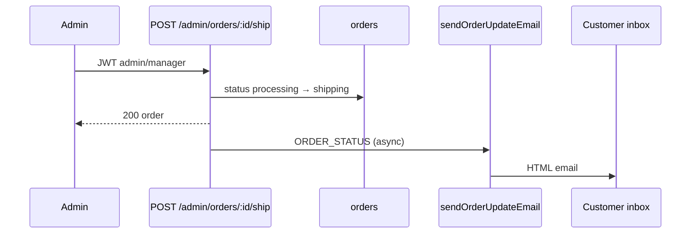
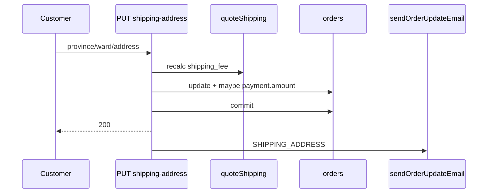

# Functional Requirement (FR) — Gửi email cập nhật đơn hàng (Send Order Update Email)

## 1. Feature Overview

Hệ thống gửi **email HTML thông báo thay đổi** liên quan đơn hàng — địa chỉ giao hàng, phương thức thanh toán, trạng thái (admin), hoàn tiền — tới email khách hàng. Một hàm đa mục đích: `sendOrderUpdateEmail` trong `server/services/emailService.js`, phân nhánh theo `changeType`.

```
Pattern: fire-and-forget (.catch log) sau khi DB commit / update thành công
Transport: nodemailer Gmail (cùng transporter với confirmation email)
Header email: cam #f59e0b (khác xanh confirmation)
```

Đây là **cổng thông báo giao dịch (portal)** cho vòng đời đơn sau khi tạo — bổ sung cho admin panel (đổi trạng thái trên UI) và self-service (đổi địa chỉ / PT thanh toán).

---

## 2. Actors

| Actor | Mô tả |
|-------|-------|
| **Customer** | Nhận email |
| **Admin / Manager** | Trigger qua admin order APIs |
| **Customer (authenticated)** | Trigger `changePaymentMethod`, `updateShippingAddress` |
| **emailService.sendOrderUpdateEmail** | Template engine |
| **User** | Object truyền vào `data.user` (không query lại trong service) |

---

## 3. Scope

### In Scope

| `changeType` | Trigger (controller) |
|--------------|----------------------|
| `SHIPPING_ADDRESS` | `orderController.updateShippingAddress` |
| `PAYMENT_METHOD` | `orderController.changePaymentMethod` |
| `ORDER_STATUS` | `adminController.updateOrderStatus`, `shipOrder`, `deliverOrder` |
| `ORDER_REFUND` | `adminController.refundOrder` |
| `default` | Fallback copy chung (không có caller hiện tại) |

### Out of Scope

- `sendOrderConfirmationEmail` (đơn mới).
- User `cancelOrder` — **không** gọi email (GAP).
- VNPay return / IPN — không email.
- Auth emails, marketing newsletter.
- Admin analytics (`GET /admin/analytics/dashboard`, `sales`).

---

## 4. Input Contract

```javascript
sendOrderUpdateEmail({
  order,        // Order instance (fields: order_code, status, final_amount, ...)
  changeType,   // 'SHIPPING_ADDRESS' | 'PAYMENT_METHOD' | 'ORDER_STATUS' | 'ORDER_REFUND' | other
  oldData,      // Object — shape tùy changeType
  newData,      // Object — shape tùy changeType
  user,         // User { email, full_name, username } — required
})
```

### Shape theo `changeType`

#### `SHIPPING_ADDRESS`

| | Fields |
|---|--------|
| **oldData** | `shipping_name`, `shipping_phone`, `shipping_address` |
| **newData** | `shipping_name`, `shipping_phone`, `shipping_address` |

**Caller:** `updateShippingAddress` — `oldData` từ `order._previousDataValues` sau `order.update(patch)`.

#### `PAYMENT_METHOD`

| | Fields |
|---|--------|
| **oldData** | `provider`, `method` (từ `payment._previousDataValues`) |
| **newData** | `provider`, `method` (payment sau update) |

**Caller:** `changePaymentMethod` sau `t.commit()`.

#### `ORDER_STATUS`

| | Fields |
|---|--------|
| **oldData** | `{ status }` |
| **newData** | `{ status }` |

**Callers:**

| API | Transition |
|-----|------------|
| `PUT /admin/orders/:id/status` | Arbitrary `status` từ body |
| `POST /admin/orders/:id/ship` | `processing` → `shipping` |
| `POST /admin/orders/:id/deliver` | `shipping` → `delivered` |

#### `ORDER_REFUND`

| | Fields |
|---|--------|
| **oldData** | `{}` |
| **newData** | `amount` (order.final_amount), `provider` (payment.provider) |

**Caller:** `POST /admin/orders/:id/refund` — order phải `cancelled`, payment `VNPAY`, cập nhật `payment_status = refunded`.

---

## 5. Template Logic (`changeType` switch)

### Shared email parts

| Part | Nội dung |
|------|----------|
| Subject | `${changeTitle} - Đơn hàng ${order.order_code} - LaptopStore` |
| To | `user.email` |
| From | `EMAIL_USER` |
| Footer | Auto-sent + © 2024 |

### `SHIPPING_ADDRESS`

- **changeTitle:** "Thay đổi địa chỉ giao hàng"
- **changeDetails:** Khối địa chỉ cũ / mới (HTML)
- **actionMessage:** "Chúng tôi sẽ xử lý đơn hàng theo địa chỉ mới này."

### `PAYMENT_METHOD`

- **changeTitle:** "Thay đổi phương thức thanh toán"
- Map `provider`: `COD` → "Thanh toán khi nhận hàng", else → "Ví điện tử VNPay"
- **actionMessage:** COD → thanh toán khi nhận; VNPAY → nhắc hoàn tất VNPay

### `ORDER_STATUS`

- **changeTitle:** "Cập nhật trạng thái đơn hàng"
- **statusLabels:**

| Key | Label VN |
|-----|----------|
| `AWAITING_PAYMENT` | Chờ thanh toán |
| `processing` | Đang xử lý |
| `shipping` | Đang giao hàng |
| `delivered` | Đã giao hàng |
| `cancelled` | Đã hủy |

- **actionMessage** theo `newData.status`:
  - `shipping` → đang vận chuyển
  - `delivered` → giao thành công
  - `cancelled` → hủy + hoàn 3–5 ngày
  - default → theo dõi tài khoản

### `ORDER_REFUND`

- **changeTitle:** "Hoàn tiền đơn hàng"
- Hiển thị `newData.amount`, provider label
- **actionMessage:** Hoàn 3–5 ngày làm việc

### Khối "Thông tin đơn hàng hiện tại" (mọi type)

```html
Mã đơn: order.order_code
Trạng thái: processing → "Đang xử lý"; AWAITING_PAYMENT → "Chờ thanh toán"; else raw status
Tổng tiền: order.final_amount
Phương thức thanh toán: newData.provider === 'COD' ? ... : VNPay
```

| # | Bug / GAP |
|---|-----------|
| BR-01 | Với `ORDER_STATUS`, `newData` **chỉ có** `status` — dòng PT thanh toán dùng `newData.provider` → **undefined → hiển thị VNPay** |

---

## 6. Call Sites (toàn dự án)

### 6.1 Customer — `orderController.js`

| Hàm | Route (ước lượng) | changeType | Điều kiện gửi |
|-----|-------------------|------------|----------------|
| `changePaymentMethod` | `POST /orders/:id/payment-method` | `PAYMENT_METHOD` | `user` tồn tại |
| `updateShippingAddress` | `PUT /orders/:id/shipping-address` | `SHIPPING_ADDRESS` | `user` tồn tại |

Cả hai: sau `t.commit()`, `User.findByPk(order.user_id)`.

### 6.2 Admin — `adminController.js`

| Hàm | Route | changeType | Ghi chú |
|-----|-------|------------|---------|
| `updateOrderStatus` | `PUT /admin/orders/:order_id/status` | `ORDER_STATUS` | Không validate enum chặt |
| `shipOrder` | `POST /admin/orders/:order_id/ship` | `ORDER_STATUS` | Guard `processing` only |
| `deliverOrder` | `POST /admin/orders/:order_id/deliver` | `ORDER_STATUS` | Guard `shipping` only |
| `refundOrder` | `POST /admin/orders/:order_id/refund` | `ORDER_REFUND` | VNPAY + cancelled |

Middleware admin: `authenticateToken` + `authorizeRoles("admin", "manager")`.

### 6.3 Không gửi update email

| Luồng | Lý do |
|-------|--------|
| `cancelOrder` (user) | Không gọi `sendOrderUpdateEmail` |
| `vnpayController` return | Không email |
| Tạo đơn | Dùng confirmation |

---

## 7. Backend Implementation Pattern

```javascript
try {
  const { sendOrderUpdateEmail } = require("../services/emailService");
  const user = await User.findByPk(order.user_id);
  if (user) {
    sendOrderUpdateEmail({ order, changeType: "...", oldData, newData, user })
      .catch((err) => console.error("... email failed:", err));
  }
} catch (emailError) {
  console.error("Failed to queue ... email:", emailError);
}
```

| # | Business rule |
|---|----------------|
| BR-02 | Không gửi nếu `user` null — **im lặng**, API vẫn 200 |
| BR-03 | Không `await` — API response không phụ thuộc SMTP |
| BR-04 | `user` phải do **caller** load — service không fallback query |
| BR-05 | Lỗi SMTP không rollback DB |
| BR-06 | `ship` / `deliver` dùng cùng template `ORDER_STATUS` — subject "Cập nhật trạng thái đơn hàng" (không riêng "Đang giao") |

---

## 8. Sequence — Admin ship order



---

## 9. Sequence — Customer đổi địa chỉ



---

## 10. Frontend / Portal

| Màn hình | Hành vi liên quan email |
|----------|-------------------------|
| `OrderDetailPage` | Đổi PT thanh toán → trigger `PAYMENT_METHOD` |
| `OrderDetailPage` / form địa chỉ | `updateShippingAddress` |
| `AdminOrders` / detail | Admin đổi status, ship, deliver, refund |
| Customer | Chỉ **nhận** email — không UI xem lịch sử gửi |

| # | FE rule |
|---|---------|
| BR-07 | FE không biết email đã gửi hay chưa |
| BR-08 | Không toast "Đã gửi email" |

---

## 11. Environment & Infrastructure

Giống confirmation email:

| Biến | Vai trò |
|------|---------|
| `EMAIL_USER` | SMTP + From |
| `EMAIL_PASS` | Gmail app password |

**Không** dùng `EMAIL_HOST` từ `authController`.

---

## 12. Relation to Admin Analytics Portal

| Thành phần | Vai trò |
|------------|---------|
| `/admin/analytics` | Dashboard Recharts — **doanh thu, đơn, sản phẩm**; không gửi email |
| **Transactional email** | Cập nhật khách khi dữ liệu analytics thay đổi (trạng thái đơn) |
| `sales_by_brand` / category trong analytics | Độc lập với email |

Email là **đầu ra hành động vận hành**; analytics là **đầu ra báo cáo** — cùng module nghiệp vụ admin nhưng tách implementation.

---

## 13. Related FRs

| FR | Liên kết |
|----|----------|
| `FR_SendOrderConfirmationEmail.md` | Đơn mới |
| `orders/FR_UpdateOrderShippingAddress.md` | Trigger SHIPPING_ADDRESS |
| `orders/FR_ChangePaymentMethod.md` | Trigger PAYMENT_METHOD |
| `admin/order/FR_AdminUpdateOrderStatus.md` | ORDER_STATUS |
| `admin/order/FR_AdminShipOrder.md` | ship → shipping |
| `admin/order/FR_AdminDeliverOrder.md` | deliver |
| `admin/order/FR_AdminRefundOrder.md` | ORDER_REFUND |
| `orders/FR_CancelOrder.md` | Không email |
| `event-driven-architecture.md` | ORDER_SHIPPED, ORDER_DELIVERED, … |

---

## 14. Source Files

| File | Vai trò |
|------|---------|
| `server/services/emailService.js` | `sendOrderUpdateEmail` L147–323 |
| `server/controllers/orderController.js` | PAYMENT_METHOD L1384–1407; SHIPPING_ADDRESS L1528–1553 |
| `server/controllers/adminController.js` | ORDER_STATUS L444–461, 489–506, 534–551; REFUND L587–607 |
| `server/routes/adminRoutes.js` | Admin order routes |
| `server/routes/orderRoutes.js` | Customer order routes |
| `client/app/hooks/useOrders.js` | Mutations admin + customer |
| `client/app/components/ChangePaymentMethodDialog.jsx` | FE payment change |

---

## 15. Acceptance Criteria

- [ ] Admin ship → customer nhận email (env SMTP ok), subject chứa `order_code`.
- [ ] Đổi địa chỉ thành công → email có old/new address.
- [ ] Đổi COD ↔ VNPAY → email PAYMENT_METHOD với action message đúng nhánh.
- [ ] Refund admin → email ORDER_REFUND với số tiền format VN.
- [ ] API 200 khi SMTP fail; DB đã cập nhật.
- [ ] `user` null → không crash API, không email.
- [ ] User cancel order → **không** có email (documented behavior).

---

## 16. Known Gaps / Inconsistencies

| # | Mô tả |
|---|--------|
| GAP-01 | **User cancel** không gửi `ORDER_STATUS` cancelled — khách không được email tự động |
| GAP-02 | Footer PT thanh toán dùng `newData.provider` cho mọi `changeType` — **sai** với `ORDER_STATUS` |
| GAP-03 | `PAYMENT_METHOD` template không hiển thị `method` chi tiết (VNPAYQR vs VNBANK) |
| GAP-04 | `updateOrderStatus` có thể set status bất kỳ → email với label fallback raw |
| GAP-05 | Không audit log / `email_sent_at` trên DB |
| GAP-06 | Không retry queue — mất email nếu SMTP tạm lỗi |
| GAP-07 | Cùng Gmail transporter cứng — lệch `authController` SMTP config |
| GAP-08 | `oldData` shipping phụ thuộc Sequelize `_previousDataValues` — có thể thiếu nếu field không đổi |
| GAP-09 | Admin FE chỉ role `admin` — manager gọi API được nhưng có thể không có UI |
| GAP-10 | Hoàn tiền email **không** gọi VNPay refund API — chỉ đổi `payment_status` admin |
| GAP-11 | `ship`/`deliver` trùng subject với generic status update — UX email chưa tách brand |
