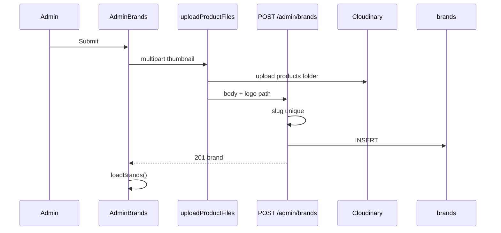

# Functional Requirement (FR) — Admin: Tạo thương hiệu (Admin Create Brand)

## 1. Feature Overview

Admin/Manager tạo thương hiệu mới: tên, mô tả, logo (multipart). Server **tự sinh `slug`** từ `brand_name` và kiểm tra trùng slug.

```
POST /api/admin/brands
Authorization: Bearer JWT
Content-Type: multipart/form-data
Role: admin | manager
```

**FE:** Form “Thêm thương hiệu mới” — `AdminBrands.jsx` → `adminAPI.createBrand(FormData)`.

> **Lưu ý code:** Trong `adminController.js` có **hai** định nghĩa `exports.createBrand` (L814 JSON body và L1247 multipart). Node ghi đè — **implementation có hiệu lực** là bản L1247–1283 (`uploadProductFiles` + slug).

---

## 2. Actors

| Actor | Mô tả |
|-------|-------|
| **Admin** | Submit form |
| **createBrand** | Controller + multer |
| **Cloudinary** | Lưu file qua `productImageStorage` |

---

## 3. Scope

### In Scope

- Body fields: `brand_name`, `description`.
- File: `thumbnail` (0–1) → `logo_url`.
- Auto slug, unique check.
- 201 + `{ message, brand }`.

### Out of Scope

- Client gửi `slug` tùy chỉnh (bị bỏ qua / không đọc).
- `is_active` (READMEAPI cũ — không có trong model).
- `uploadBrandFiles` / folder `laptop-store/brands` (có middleware nhưng **không** gắn route).

---

## 4. API Contract

### Request — multipart/form-data

| Field | Type | Bắt buộc | Ghi chú |
|-------|------|----------|---------|
| `brand_name` | string | Có (FE) | UNIQUE DB `brands.brand_name` |
| `description` | string | Không | TEXT |
| `thumbnail` | file | Không | Logo → `logo_url` |

**Ví dụ curl:**

```bash
curl -X POST "http://localhost:5000/api/admin/brands" \
  -H "Authorization: Bearer <token>" \
  -F "brand_name=Dell" \
  -F "description=Mỹ" \
  -F "thumbnail=@logo.png"
```

### Slug generation

```javascript
const slug = brand_name
  .toLowerCase()
  .replace(/[^\w\s-]/g, "")
  .trim()
  .replace(/\s+/g, "-");
```

Ví dụ: `"MSI Gaming"` → `"msi-gaming"`.

### Response — 201 Created

```json
{
  "message": "Brand created successfully",
  "brand": {
    "brand_id": 12,
    "brand_name": "Dell",
    "slug": "dell",
    "description": "Mỹ",
    "logo_url": "https://res.cloudinary.com/.../laptop-store/products/abc.jpg",
    "created_at": "...",
    "updated_at": "..."
  }
}
```

### Errors

| HTTP | Message / nguyên nhân |
|------|------------------------|
| 400 | `Slug already exists. Please choose a different brand name.` |
| 401/403 | Auth |
| 409/500 | `brand_name` UNIQUE violation (Sequelize) |
| 500 | Multer / Cloudinary misconfig |

---

## 5. Backend Logic (active)

```javascript
exports.createBrand = [
  uploadProductFiles,
  async (req, res, next) => {
    const { brand_name, description } = req.body;

    const slug = /* normalize brand_name */;

    const existingBrand = await Brand.findOne({ where: { slug } });
    if (existingBrand) {
      return res.status(400).json({
        message: "Slug already exists. Please choose a different brand name.",
      });
    }

    let logo_url = null;
    if (req.files?.thumbnail?.[0]) {
      logo_url = req.files.thumbnail[0].path;
    }

    const brand = await Brand.create({
      brand_name,
      slug,
      description,
      logo_url,
    });

    res.status(201).json({
      message: "Brand created successfully",
      brand,
    });
  },
];
```

| # | Business rule |
|---|----------------|
| BR-01 | Kiểm tra trùng **slug** (suy ra từ tên), không chỉ `brand_name` |
| BR-02 | `uploadProductFiles` → folder Cloudinary **`laptop-store/products`**, không `brands` |
| BR-03 | Field multipart **`thumbnail`** — convention chung product/category (GAP naming) |
| BR-04 | Không validate `brand_name` rỗng ở BE — FE `required` + trim alert |
| BR-05 | `description` có thể `undefined` — lưu NULL |

### Model constraints (`server/models/Brand.js`)

| Column | Rule |
|--------|------|
| `brand_name` | STRING(100), NOT NULL, UNIQUE |
| `slug` | STRING(100), NOT NULL, UNIQUE |
| `logo_url` | VARCHAR(255), nullable |
| `description` | TEXT, nullable |

---

## 6. Frontend — AdminBrands.jsx

```javascript
const submitData = new FormData();
submitData.append("brand_name", formData.brand_name);
submitData.append("description", formData.description);
if (logoFile) submitData.append("thumbnail", logoFile);

await adminAPI.createBrand(submitData);
await loadBrands();
resetForm();
```

| # | UX |
|---|-----|
| BR-06 | Preview logo: FileReader data URL |
| BR-07 | Success: `alert` tiếng Việt |
| BR-08 | Error: `error.response?.data?.message` |
| BR-09 | Layout 1/3 form + 2/3 table (khi mở form) |

### Axios / api instance

`api.post("/admin/brands", data)` với `FormData` — interceptor thường set `Content-Type: multipart/form-data` (boundary tự động).

---

## 7. Impact sau khi tạo

| Hệ thống | Ảnh hưởng |
|----------|-----------|
| `GET /products/brands` | Brand mới xuất hiện ngay (không cache invalidate từ AdminBrands) |
| `useBrands()` | `staleTime: Infinity` — **có thể stale** đến khi reload trang product form |
| Product create | Dropdown brand cần refresh hoặc invalidate `["admin-brands"]` |
| Filter HomePage | `customerUseBrandsFull` key `["brands-full"]` — cũng có thể stale |

---

## 8. Sequence



---

## 9. Related FRs

| FR | Liên kết |
|----|----------|
| `FR_AdminListBrands` | Hiển thị sau tạo |
| `FR_AdminUpdateBrand` | Sửa |
| `FR_AdminDeleteBrand` | Xóa khi không còn SP |
| `commerce-object-storage.md` | Quy ước `thumbnail` → `logo_url` |

---

## 10. Source Files

| File | Vai trò |
|------|---------|
| `server/controllers/adminController.js` | `createBrand` active L1247–1283; dead L814–825 |
| `server/routes/adminRoutes.js` | `POST /brands` |
| `server/middleware/upload.js` | `uploadProductFiles`, `uploadBrandFiles` (unused) |
| `client/app/pages/admin/AdminBrands.jsx` | Form |
| `client/app/services/api.js` | `createBrand` |

---

## 11. Acceptance Criteria

- [ ] POST hợp lệ → 201, `slug` đúng quy tắc normalize.
- [ ] Tên trùng slug (vd. “Dell” vs “dell” sau normalize) → 400 slug exists.
- [ ] Có file logo → `logo_url` là HTTPS Cloudinary.
- [ ] Không file → `logo_url` null, vẫn 201.
- [ ] List admin refresh thấy brand mới.

---

## 12. Known Gaps

| # | Mô tả |
|---|--------|
| GAP-01 | **Dead code** `createBrand` JSON L814–825 — gây nhầm khi đọc file |
| GAP-02 | Logo lưu folder **products** thay vì **brands** (`uploadBrandFiles` sẵn nhưng không dùng) |
| GAP-03 | Không invalidate React Query `admin-brands` / `brands-full` sau tạo |
| GAP-04 | `READMEAPI.md` mô tả JSON + `slug` required + `is_active` — **lệch** code |
| GAP-05 | Hai brand khác tên nhưng cùng slug sau normalize — chỉ chặn ở slug, không message riêng cho `brand_name` UNIQUE |
