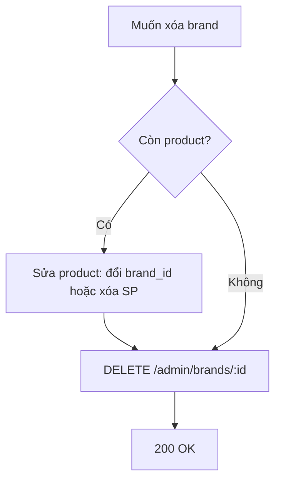

# Functional Requirement (FR) — Admin: Xóa thương hiệu (Admin Delete Brand)

## 1. Feature Overview

Admin/Manager **xóa cứng** (`destroy`) một brand khi **không còn sản phẩm** nào có `brand_id` trỏ tới brand đó.

```
DELETE /api/admin/brands/:brand_id
Authorization: Bearer JWT
Role: admin | manager
```

**FE:** Nút Trash trên `AdminBrands.jsx` → `confirm` → `adminAPI.deleteBrand(id)` → `loadBrands()`.

---

## 2. Actors

| Actor | Mô tả |
|-------|-------|
| **Admin** | Xóa qua UI |
| **Manager** | API được phép |
| **deleteBrand** | `adminController` L1332–1354 |
| **Product** | Chặn xóa qua `countProducts()` |

---

## 3. Scope

### In Scope

- `findByPk` → `countProducts()` → `destroy()` hoặc 400.
- Message lỗi có **tên brand** và **số sản phẩm**.

### Out of Scope

- Soft delete / `is_active`.
- Cascade xóa products.
- Tự động reassign `brand_id` sang brand khác.
- Xóa file Cloudinary `logo_url`.

---

## 4. API Contract

### Request

```http
DELETE /api/admin/brands/5
Authorization: Bearer <token>
```

### Response — 200 OK

```json
{
  "message": "Brand deleted successfully"
}
```

### Response — 404 Not Found

```json
{
  "message": "Brand not found"
}
```

### Response — 400 Bad Request

```json
{
  "message": "Cannot delete brand \"ASUS\" because it is associated with 15 product(s). Please reassign or remove these products first."
}
```

Message động: `brand.brand_name` + `productCount` từ Sequelize.

### Errors khác

| HTTP | Nguyên nhân |
|------|-------------|
| 401/403 | Auth |

---

## 5. Backend Logic

```javascript
exports.deleteBrand = async (req, res, next) => {
  try {
    const { brand_id } = req.params;

    const brand = await Brand.findByPk(brand_id);
    if (!brand) {
      return res.status(404).json({ message: "Brand not found" });
    }

    const productCount = await brand.countProducts();
    if (productCount > 0) {
      return res.status(400).json({
        message: `Cannot delete brand "${brand.brand_name}" because it is associated with ${productCount} product(s). Please reassign or remove these products first.`,
      });
    }

    await brand.destroy();

    res.json({ message: "Brand deleted successfully" });
  } catch (error) {
    next(error);
  }
};
```

| # | Business rule |
|---|----------------|
| BR-01 | **Hard delete** row `brands` |
| BR-02 | `Brand.hasMany(Product, { foreignKey: "brand_id" })` — `countProducts()` đếm quan hệ |
| BR-03 | Product phải đổi `brand_id` hoặc xóa SP trước — FK không SET NULL trong flow này |
| BR-04 | Message 400 **chi tiết hơn** category delete (category chỉ message generic) |

### Association

```javascript
// server/models/index.js
Product.belongsTo(Brand, { foreignKey: "brand_id", as: "brand" });
Brand.hasMany(Product, { foreignKey: "brand_id" });
```

---

## 6. Frontend

```javascript
const handleDelete = async (brandId, brandName) => {
  if (!confirm(`Bạn có chắc muốn xóa thương hiệu "${brandName}"?`)) return;

  await adminAPI.deleteBrand(brandId);
  alert("Xóa thương hiệu thành công!");
  await loadBrands();
};
```

| # | UX |
|---|-----|
| BR-05 | Confirm tiếng Việt có tên brand |
| BR-06 | 400 → `alert` với `error.response.data.message` (hiện số SP) |
| BR-07 | Không hiển thị `product_count` trên bảng — admin thử xóa mới biết |

---

## 7. Workflow khuyến nghị



### Thao tác admin thực tế

1. Vào **Sản phẩm** → lọc theo brand (nếu có) hoặc tìm SP gắn brand.
2. `AdminProductEditPage` → đổi “Thương hiệu” sang brand khác **hoặc** xóa sản phẩm.
3. Quay **Thương hiệu** → xóa brand.

---

## 8. Impact sau xóa

| Hệ thống | Hành vi |
|----------|---------|
| `GET /admin/brands` | Brand biến mất |
| `GET /products/brands` | Cùng — row đã destroy |
| Product cũ | Không còn case “orphan brand_id” nếu đã reassign — nếu force DB delete sẽ vi phạm FK DB |
| Filter FE | Brand id đã xóa có thể còn trong URL filter đến khi user refresh |

---

## 9. Related FRs

| FR | Liên kết |
|----|----------|
| `FR_AdminListBrands` | List sau xóa |
| `FR_AdminCreateBrand` | Tạo lại tên/slug mới |
| Admin product FRs | `brand_id` trên `products` |
| `FR_AdminDeleteCategory` | Pattern tương tự (message ngắn hơn) |

---

## 10. Source Files

| File | Vai trò |
|------|---------|
| `server/controllers/adminController.js` | `deleteBrand` L1332–1354 |
| `server/routes/adminRoutes.js` | `DELETE /brands/:brand_id` |
| `client/app/pages/admin/AdminBrands.jsx` | Delete button |
| `client/app/services/api.js` | `deleteBrand` |

---

## 11. Acceptance Criteria

- [ ] DELETE brand không có product → 200, row mất.
- [ ] DELETE brand có ≥1 product → 400, message có count.
- [ ] 404 id không tồn tại.
- [ ] FE list refresh, row biến mất.
- [ ] Public brands list không còn brand đã xóa.

---

## 12. Known Gaps

| # | Mô tả |
|---|--------|
| GAP-01 | Không bulk delete / merge brands |
| GAP-02 | Logo Cloudinary orphan |
| GAP-03 | UI không show product count — UX thử/xóa |
| GAP-04 | `useBrands` / `brands-full` cache có thể còn brand đã xóa đến khi reload |
| GAP-05 | Không soft-delete — khôi phục nhầm khó |
