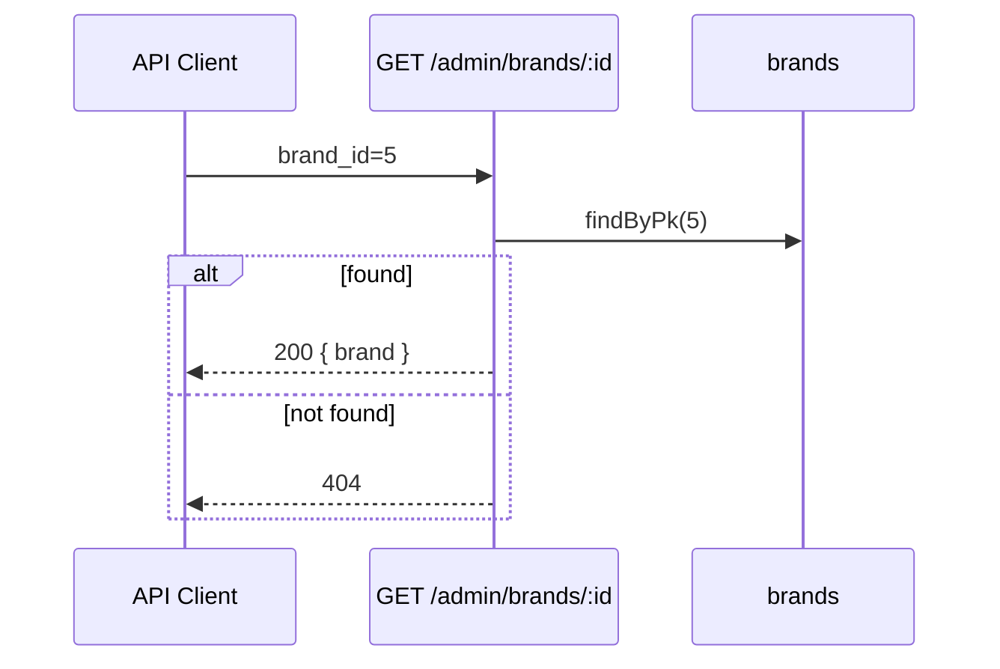

# Functional Requirement (FR) — Admin: Chi tiết thương hiệu theo ID (Admin Get Brand By Id)

## 1. Feature Overview

Admin/Manager lấy **một** bản ghi brand theo `brand_id` — dùng cho API client, tích hợp sau này, hoặc trang chi tiết (hiện **chưa** có UI riêng trên FE).

```
GET /api/admin/brands/:brand_id
Authorization: Bearer JWT
Role: admin | manager
```

**FE hiện tại:** `adminAPI.getBrandById(id)` đã khai báo trong `api.js` nhưng **`AdminBrands.jsx` không gọi** — edit inline lấy object từ list đã load.

---

## 2. Actors

| Actor | Mô tả |
|-------|-------|
| **Admin** | Có thể gọi qua API tool |
| **Manager** | API được phép |
| **getBrandById** | `adminController` L1232–1245 |

---

## 3. Scope

### In Scope

- `Brand.findByPk(brand_id)`.
- 200 + `{ brand }` hoặc 404.

### Out of Scope

- Include `products` / đếm sản phẩm.
- Public endpoint theo id (catalog chỉ có list all).
- Slug lookup (`GET by slug`).

---

## 4. API Contract

### Request

```http
GET /api/admin/brands/5
Authorization: Bearer <token>
```

| Path param | Type | Mô tả |
|------------|------|--------|
| `brand_id` | integer | PK `brands.brand_id` |

### Response — 200 OK

```json
{
  "brand": {
    "brand_id": 5,
    "brand_name": "Lenovo",
    "slug": "lenovo",
    "logo_url": "https://res.cloudinary.com/...",
    "description": "...",
    "created_at": "...",
    "updated_at": "..."
  }
}
```

### Response — 404 Not Found

```json
{
  "message": "Brand not found"
}
```

### Errors khác

| HTTP | Nguyên nhân |
|------|-------------|
| 401/403 | Auth / role |
| 500 | DB / `brand_id` không parse được |

### Route ordering

Trong `adminRoutes.js`, `GET /brands` đăng ký **trước** `GET /brands/:brand_id` — tránh conflict với static segment (đúng thứ tự hiện tại).

---

## 5. Backend Logic

```javascript
exports.getBrandById = async (req, res, next) => {
  try {
    const { brand_id } = req.params;
    const brand = await Brand.findByPk(brand_id);
    if (!brand) {
      return res.status(404).json({ message: "Brand not found" });
    }
    res.json({ brand });
  } catch (error) {
    next(error);
  }
};
```

| # | Business rule |
|---|----------------|
| BR-01 | Không validate `brand_id` là số — Sequelize/DB xử lý |
| BR-02 | Response bọc trong key `brand` (không trả flat object) |
| BR-03 | Không kiểm tra quyền sở hữu — mọi admin/manager xem được mọi brand |

---

## 6. Frontend integration (hiện trạng)

### API client

```javascript
// client/app/services/api.js
getBrandById: (id) => api.get(`/admin/brands/${id}`),
```

### AdminBrands — pattern thực tế

```javascript
const startEdit = (brand) => {
  setEditingBrand(brand.brand_id);
  setFormData({
    brand_name: brand.brand_name,
    description: brand.description,
  });
  setLogoPreview(brand.logo_url || "");
};
```

| # | FE rule |
|---|---------|
| BR-04 | Edit dùng row từ **list** — stale nếu brand đổi ở tab khác |
| BR-05 | Không deep-link `/admin/brands/:id` |

### Khi nào nên dùng GET by id

| Use case | Lý do |
|----------|--------|
| Trang detail `/admin/brands/:id` | Fresh data sau navigate |
| Modal edit tách route | Tránh stale list |
| Mobile admin app | REST chuẩn |
| Verify tồn tại trước PUT | Optional preflight |

---

## 7. Sequence



---

## 8. Related FRs

| FR | Liên kết |
|----|----------|
| `FR_AdminListBrands` | Nguồn dữ liệu thay thế trên UI hiện tại |
| `FR_AdminUpdateBrand` | PUT cùng `:brand_id` |
| `FR_AdminDeleteBrand` | DELETE cùng `:brand_id` |

---

## 9. Source Files

| File | Vai trò |
|------|---------|
| `server/controllers/adminController.js` | `getBrandById` L1232–1245 |
| `server/routes/adminRoutes.js` | `GET /brands/:brand_id` L40 |
| `client/app/services/api.js` | `getBrandById` (unused by page) |
| `client/app/pages/admin/AdminBrands.jsx` | List-only edit |

---

## 10. Acceptance Criteria

- [ ] `GET /admin/brands/{valid_id}` → 200, object đầy đủ.
- [ ] ID không tồn tại → 404 + message chuẩn.
- [ ] Không token → 401; role staff/customer → 403.
- [ ] Postman/Insomnia gọi được; FE page vẫn hoạt động không cần endpoint này.

---

## 11. Known Gaps

| # | Mô tả |
|---|--------|
| GAP-01 | **Dead API trên FE** — khai báo nhưng không dùng |
| GAP-02 | Không `include: Product` — admin không biết bao nhiêu SP gắn brand từ detail API |
| GAP-03 | Không endpoint public `GET /products/brands/:id` |
| GAP-04 | `brand_id` string trong URL — hành vi Sequelize với id invalid không thống nhất document |
