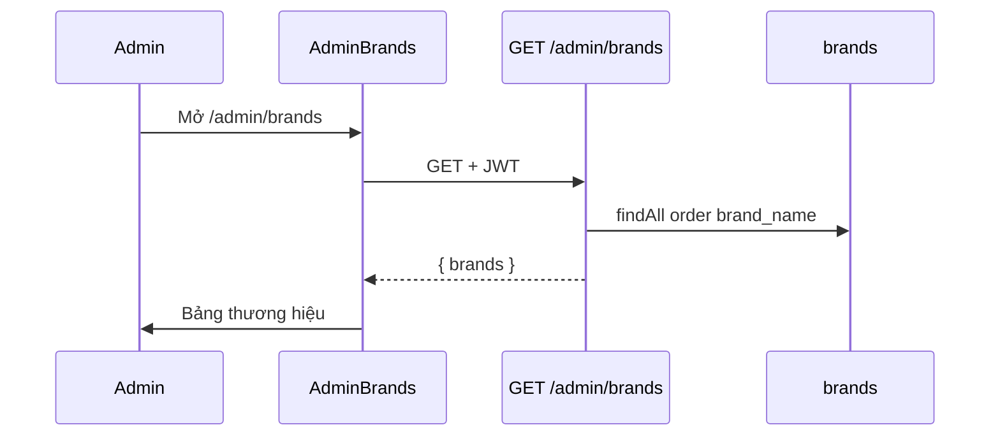

# Functional Requirement (FR) — Admin: Danh sách thương hiệu (Admin List Brands)

## 1. Feature Overview

Admin/Manager lấy **toàn bộ thương hiệu** (`brands`), sắp xếp theo `brand_name` tăng dần — phục vụ trang quản trị, dropdown sản phẩm (khi dùng admin API), và đồng bộ dữ liệu nguồn catalog.

```
GET /api/admin/brands
Authorization: Bearer JWT
Role: admin | manager
```

**FE:** `/admin/brands` → `AdminBrands.jsx` → `adminAPI.getAllBrands()` (load thủ công trong `useEffect`, **không** dùng React Query).

**Public song song:** `GET /api/products/brands` — cùng sort `brand_name ASC`, không JWT (`productController.getBrands`). Chi tiết: `docs/feature_requirements/catalog/FR_ListBrands.md`.

---

## 2. Actors

| Actor | Mô tả |
|-------|-------|
| **Admin** | UI panel (`AdminRoute` — chỉ role `admin`) |
| **Manager** | Gọi API được phép; **không** vào được `/admin/brands` trên FE (GAP) |
| **getAllBrands** | `adminController` L1220–1230 |
| **Customer / Catalog** | `GET /products/brands` |

---

## 3. Scope

### In Scope

- Trả full list, không pagination.
- Sort `brand_name ASC`.
- Fields model: `brand_id`, `brand_name`, `slug`, `logo_url`, `description`, `created_at`, `updated_at`.

### Out of Scope

- `GET /admin/brands/:id` (FR riêng — không dùng khi list).
- Đếm `product_count` theo brand.
- Search, filter, `is_active` (model **không** có cột này).

---

## 4. API Contract

### Request

```http
GET /api/admin/brands
Authorization: Bearer <access_token>
```

**Mount:** `server/routes/adminRoutes.js` → prefix `/api/admin` (trong `server.js`).

### Response — 200 OK

```json
{
  "brands": [
    {
      "brand_id": 1,
      "brand_name": "ASUS",
      "slug": "asus",
      "logo_url": "https://res.cloudinary.com/.../laptop-store/products/xxx.jpg",
      "description": "Thương hiệu Đài Loan",
      "created_at": "2025-01-01T00:00:00.000Z",
      "updated_at": "2025-01-01T00:00:00.000Z"
    }
  ]
}
```

### Errors

| HTTP | Nguyên nhân |
|------|-------------|
| 401 | Thiếu / hết hạn JWT |
| 403 | Role không thuộc `admin`, `manager` |
| 500 | Lỗi DB → `next(error)` |

---

## 5. Backend Logic

```javascript
exports.getAllBrands = async (req, res, next) => {
  try {
    const brands = await Brand.findAll({
      order: [["brand_name", "ASC"]],
    });
    res.json({ brands });
  } catch (error) {
    next(error);
  }
};
```

| # | Business rule |
|---|----------------|
| BR-01 | Không `attributes` giới hạn — trả mọi cột Sequelize |
| BR-02 | Không lọc brand “ẩn” — tất cả row trong bảng |
| BR-03 | Thứ tự khác admin category (`display_order`) — brand chỉ sort tên |

### So sánh public admin list

| Tiêu chí | `GET /admin/brands` | `GET /products/brands` |
|----------|---------------------|------------------------|
| Auth | JWT + admin/manager | Public |
| Controller | `adminController.getAllBrands` | `productController.getBrands` |
| Sort | `brand_name ASC` | `brand_name ASC` |
| Payload | `{ brands }` | `{ brands }` |

Logic DB **tương đương**; khác biệt chủ yếu là bảo mật và ngữ cảnh gọi.

---

## 6. Frontend — AdminBrands.jsx

### Load

```javascript
useEffect(() => {
  loadBrands();
}, []);

const loadBrands = async () => {
  const response = await adminAPI.getAllBrands();
  setBrands(response.data.brands || []);
};
```

| # | UX / FE rule |
|---|----------------|
| BR-04 | State local `brands[]` — không React Query |
| BR-05 | Bảng: Logo, Tên (+ mô tả truncate), Slug, Thao tác |
| BR-06 | Sau create/update/delete → `loadBrands()` lại |
| BR-07 | Empty state + CTA “Tạo thương hiệu đầu tiên” |

### Hook `useBrands()` (product forms — không phải trang này)

```javascript
// useProducts.js — queryKey ["admin-brands"]
queryFn: () => api.get("/products/brands")  // PUBLIC, không /admin/brands
```

Admin product new/edit dùng **public** brands, không admin list API.

---

## 7. Downstream usage trong đồ án

| Consumer | Endpoint / nguồn |
|----------|------------------|
| `AdminBrands` | `GET /admin/brands` |
| `AdminProductNewPage`, `AdminProductEditPage` | `useBrands()` → `/products/brands` |
| `ProductFilter` / HomePage | `customerUseBrandsFull()` → `/products/brands` |
| `ProductDetailPage` | `product.Brand` từ include API sản phẩm |
| Analytics dashboard | `sales_by_brand` SQL join `brands` |

---

## 8. Sequence



---

## 9. Related FRs

| FR | Liên kết |
|----|----------|
| `FR_AdminGetBrandById` | Chi tiết một brand |
| `FR_AdminCreateBrand` | Thêm |
| `FR_AdminUpdateBrand` | Sửa |
| `FR_AdminDeleteBrand` | Xóa |
| `catalog/FR_ListBrands` | Public list |

---

## 10. Source Files

| File | Vai trò |
|------|---------|
| `server/controllers/adminController.js` | `getAllBrands` L1220–1230 |
| `server/routes/adminRoutes.js` | `GET /brands` L39 |
| `server/controllers/productController.js` | `getBrands` L769–779 |
| `server/models/Brand.js` | Schema |
| `server/models/index.js` | `Brand.hasMany(Product)` |
| `client/app/pages/admin/AdminBrands.jsx` | UI list |
| `client/app/services/api.js` | `getAllBrands` |
| `client/app/App.jsx` | Route `admin/brands` |
| `client/app/components/AdminRoute.jsx` | Menu + guard |

---

## 11. Acceptance Criteria

- [ ] Admin JWT hợp lệ → 200, mảng `brands` sort A→Z theo tên.
- [ ] Guest / user thường → 403 trên `/api/admin/brands`.
- [ ] FE table hiển thị đúng số lượng và slug.
- [ ] Manager gọi API thành công (Postman) dù không vào được UI admin.

---

## 12. Known Gaps

| # | Mô tả |
|---|--------|
| GAP-01 | **Không pagination** — scale lớn → payload nặng |
| GAP-02 | **FE AdminRoute chỉ `admin`** — manager bị chặn UI dù API cho phép |
| GAP-03 | Trang admin brands **không** dùng `useBrands` / React Query — pattern khác `AdminCategories` |
| GAP-04 | Không hiển thị số sản phẩm trước khi xóa |
| GAP-05 | `READMEAPI.md` mô tả brand có `is_active` — **không khớp** model thực tế |
