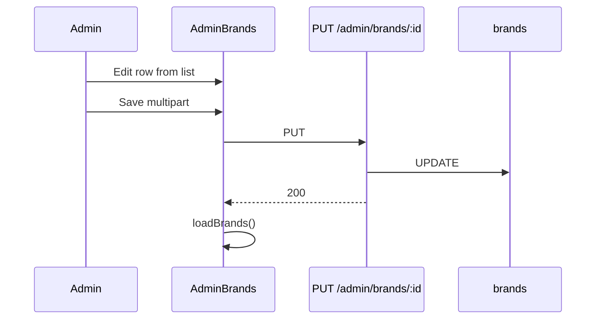

# Functional Requirement (FR) — Admin: Cập nhật thương hiệu (Admin Update Brand)

## 1. Feature Overview

Admin/Manager cập nhật brand: tên (và **slug** nếu đổi tên), mô tả, logo mới (multipart tùy chọn).

```
PUT /api/admin/brands/:brand_id
Authorization: Bearer JWT
Content-Type: multipart/form-data
Role: admin | manager
```

**FE:** Chế độ edit inline `editingBrand` trên `AdminBrands.jsx` → `adminAPI.updateBrand(id, FormData)`.

> **Implementation có hiệu lực:** L1285–1330 (`uploadProductFiles`). Bản L827–845 (`req.body` thẳng) bị **ghi đè** — dead code.

---

## 2. Actors

| Actor | Mô tả |
|-------|-------|
| **Admin** | Edit form |
| **updateBrand** | Controller |
| **Product** | Giữ `brand_id` — đổi slug không đổi FK |

---

## 3. Scope

### In Scope

- `description` luôn cập nhật từ body.
- `brand_name` đổi → slug mới + unique (exclude `brand_id` hiện tại).
- File `thumbnail` mới → overwrite `logo_url`.

### Out of Scope

- Xóa logo trên DB khi user bấm “X” preview FE (không gửi flag).
- Reassign hàng loạt products sang brand khác.
- PATCH partial JSON (chỉ PUT multipart trong FE).

---

## 4. API Contract

### Request

```http
PUT /api/admin/brands/5
Content-Type: multipart/form-data

brand_name=ASUS%20ROG
description=Gaming%20line
thumbnail=<file>   (optional)
```

| Path param | Mô tả |
|------------|--------|
| `brand_id` | PK cần update |

### Response — 200 OK

```json
{
  "message": "Brand updated successfully",
  "brand": {
    "brand_id": 5,
    "brand_name": "ASUS ROG",
    "slug": "asus-rog",
    "description": "Gaming line",
    "logo_url": "https://...",
    "created_at": "...",
    "updated_at": "..."
  }
}
```

### Errors

| HTTP | Message |
|------|---------|
| 404 | `Brand not found` |
| 400 | `Slug already exists. Please choose a different brand name.` |
| 401/403 | Auth |

---

## 5. Backend Logic (active)

```javascript
exports.updateBrand = [
  uploadProductFiles,
  async (req, res, next) => {
    const { brand_id } = req.params;
    const { brand_name, description } = req.body;

    const brand = await Brand.findByPk(brand_id);
    if (!brand) {
      return res.status(404).json({ message: "Brand not found" });
    }

    const updateData = { description };

    if (brand_name && brand_name !== brand.brand_name) {
      const slug = /* normalize */;
      const existingBrand = await Brand.findOne({
        where: { slug, brand_id: { [Op.ne]: brand_id } },
      });
      if (existingBrand) {
        return res.status(400).json({
          message: "Slug already exists. Please choose a different brand name.",
        });
      }
      updateData.brand_name = brand_name;
      updateData.slug = slug;
    }

    if (req.files?.thumbnail?.[0]) {
      updateData.logo_url = req.files.thumbnail[0].path;
    }

    await brand.update(updateData);

    res.json({
      message: "Brand updated successfully",
      brand,
    });
  },
];
```

| # | Business rule |
|---|----------------|
| BR-01 | Không đổi `brand_name` → **slug giữ nguyên** |
| BR-02 | Không upload logo → **giữ** `logo_url` cũ |
| BR-03 | `description` gửi rỗng → lưu chuỗi rỗng / null tùy body parser |
| BR-04 | `brand` trong response là instance Sequelize sau `update` — thường đã refresh in-memory |
| BR-05 | Không xóa asset Cloudinary cũ khi thay logo |

---

## 6. Frontend

### startEdit (không gọi GET by id)

```javascript
const startEdit = (brand) => {
  setEditingBrand(brand.brand_id);
  setFormData({
    brand_name: brand.brand_name || "",
    description: brand.description || "",
  });
  setLogoPreview(brand.logo_url || "");
  setLogoFile(null);
};
```

### Submit

```javascript
if (editingBrand) {
  await adminAPI.updateBrand(editingBrand, submitData);
}
await loadBrands();
```

| # | UX |
|---|-----|
| BR-06 | `removeLogo()` chỉ clear preview — **không** PUT xóa `logo_url` |
| BR-07 | Một panel form — không route `/admin/brands/:id/edit` |
| BR-08 | Không dùng `getBrandById` — data từ list có thể stale |

---

## 7. Catalog impact

| Thay đổi | Ảnh hưởng |
|----------|-----------|
| `brand_name` / `slug` | Filter `brand_id` vẫn theo ID; link `?brand_id=` trên ProductDetailPage ổn |
| `logo_url` | Logo filter / admin table đổi ảnh |
| Products đã gán | `products.brand_id` không đổi khi chỉ update brand metadata |

---

## 8. Sequence



---

## 9. Related FRs

| FR | Liên kết |
|----|----------|
| `FR_AdminGetBrandById` | Có thể thay list row khi cần fresh data |
| `FR_AdminCreateBrand` | Tạo |
| `FR_AdminDeleteBrand` | Xóa |
| `FR_AdminListBrands` | Nguồn row edit |

---

## 10. Source Files

| File | Vai trò |
|------|---------|
| `server/controllers/adminController.js` | `updateBrand` L1285–1330; dead L827–845 |
| `server/routes/adminRoutes.js` | `PUT /brands/:brand_id` |
| `client/app/pages/admin/AdminBrands.jsx` | Edit UI |
| `client/app/services/api.js` | `updateBrand` |

---

## 11. Acceptance Criteria

- [ ] PUT đổi tên → slug mới, không conflict brand khác.
- [ ] PUT chỉ description → name/slug giữ.
- [ ] Upload logo mới → `logo_url` đổi.
- [ ] 404 với `brand_id` không tồn tại.
- [ ] Bảng admin refresh đúng sau save.

---

## 12. Known Gaps

| # | Mô tả |
|---|--------|
| GAP-01 | Dead `updateBrand` JSON handler L827–845 |
| GAP-02 | Không API clear `logo_url` |
| GAP-03 | Cloudinary orphan khi đổi logo |
| GAP-04 | `brand_name` UNIQUE — đổi tên trùng brand khác → lỗi DB có thể khác message 400 slug |
| GAP-05 | Product form cache `useBrands` stale sau update |
