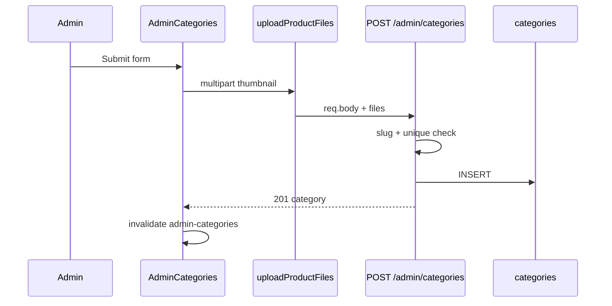

# Functional Requirement (FR) — Admin: Tạo danh mục (Admin Create Category)

## 1. Feature Overview

Admin/Manager tạo danh mục mới: tên, mô tả, thứ tự hiển thị, **icon** (upload multipart). Server **tự sinh `slug`** từ `category_name` và kiểm tra trùng.

```
POST /api/admin/categories
Authorization: Bearer JWT
Content-Type: multipart/form-data
```

**FE:** Form “Thêm danh mục mới” trên `AdminCategories.jsx` → `adminAPI.createCategory(FormData)`.

---

## 2. Actors

| Actor | Mô tả |
|-------|-------|
| **Admin** | Submit form |
| **createCategory** | Controller + `uploadProductFiles` |
| **Cloudinary** | Lưu file |

---

## 3. Scope

### In Scope

- Fields: `category_name`, `description`, `display_order`.
- File field `thumbnail` (0–1) → lưu `icon_url`.
- Auto slug.
- 201 + category object.

### Out of Scope

- `parent_id` (cột có, không nhận từ form).
- Slug tùy chỉnh từ FE.
- Xóa icon sau khi tạo (chỉ upload mới).

---

## 4. API Contract

### Request — multipart

| Field | Type | Bắt buộc | Mô tả |
|-------|------|----------|--------|
| `category_name` | string | Có | UNIQUE trên DB |
| `description` | string | Không | TEXT |
| `display_order` | number/string | Không | Default `0` |
| `thumbnail` | file | Không | Icon — map vào `icon_url` |

### Slug generation

```javascript
const slug = category_name
  .toLowerCase()
  .replace(/[^\w\s-]/g, '')
  .trim()
  .replace(/\s+/g, '-');
```

### Response — 201

```json
{
  "message": "Category created successfully",
  "category": {
    "category_id": 10,
    "category_name": "Laptop Văn phòng",
    "slug": "laptop-van-phong",
    "description": "...",
    "display_order": 2,
    "icon_url": "https://res.cloudinary.com/...",
    "parent_id": null
  }
}
```

### Errors

| HTTP | Message |
|------|---------|
| 400 | `Slug already exists. Please choose a different category name.` |
| 409/500 | `category_name` UNIQUE violation |
| 401/403 | Auth |

---

## 5. Backend Logic

```javascript
exports.createCategory = [
  uploadProductFiles,  // multer fields: thumbnail, product_images
  async (req, res, next) => {
    const slug = generateSlug(category_name);
    if (await Category.findOne({ where: { slug } })) return 400;

    let icon_url = null;
    if (req.files?.thumbnail?.[0]) {
      icon_url = req.files.thumbnail[0].path;  // Cloudinary URL
    }

    const category = await Category.create({
      category_name, slug, description,
      display_order: display_order || 0,
      icon_url,
    });
    res.status(201).json({ message: "Category created successfully", category });
  }
];
```

| # | Business rule |
|---|----------------|
| BR-01 | Kiểm tra trùng **slug** (không phải chỉ `category_name`) |
| BR-02 | `uploadProductFiles` dùng storage folder **`laptop-store/products`** — không phải `categories` (GAP) |
| BR-03 | Field multipart tên **`thumbnail`** — convention chung upload product (GAP naming) |
| BR-04 | Không validate `category_name` rỗng ở BE — FE `required` |

---

## 6. Frontend

```javascript
const submitData = new FormData();
submitData.append('category_name', formData.category_name);
submitData.append('description', formData.description);
submitData.append('display_order', formData.display_order);
if (iconFile) submitData.append('thumbnail', iconFile);

await adminAPI.createCategory(submitData);
queryClient.invalidateQueries({ queryKey: ["admin-categories"] });
```

| # | UX |
|---|-----|
| BR-05 | Preview icon FileReader / URL |
| BR-06 | `useCreateCategory` hook **import** nhưng page dùng `adminAPI` trực tiếp |
| BR-07 | Success → `alert` + `resetForm` |

---

## 7. Sequence



---

## 8. Related FRs

| FR | Liên kết |
|----|----------|
| `FR_AdminListCategories` | Hiển thị sau tạo |
| `FR_AdminUpdateCategory` | Sửa |
| `FR_AdminDeleteCategory` | Xóa (nếu chưa có SP) |

---

## 9. Source Files

| File | Vai trò |
|------|---------|
| `server/controllers/adminController.js` | `createCategory` L701–738 |
| `server/routes/adminRoutes.js` | `POST /categories` |
| `server/middleware/upload.js` | `uploadProductFiles`, `categoryIconStorage` (unused here) |
| `client/app/pages/admin/AdminCategories.jsx` | Form create |
| `client/app/services/api.js` | `createCategory` |

---

## 10. Acceptance Criteria

- [ ] POST hợp lệ → 201, category có `slug` đúng pattern.
- [ ] Trùng slug (cùng tên normalize) → 400.
- [ ] Upload icon → `icon_url` Cloudinary URL.
- [ ] List refresh thấy category mới đúng `display_order`.

---

## 11. Known Gaps

| # | Mô tả |
|---|--------|
| GAP-01 | Icon lưu folder **products** thay vì **categories** |
| GAP-02 | Field `thumbnail` gây nhầm với ảnh sản phẩm |
| GAP-03 | `parent_id` không hỗ trợ — không có cây danh mục |
| GAP-04 | Invalidate không gồm `["categories"]` cho customer filter |
