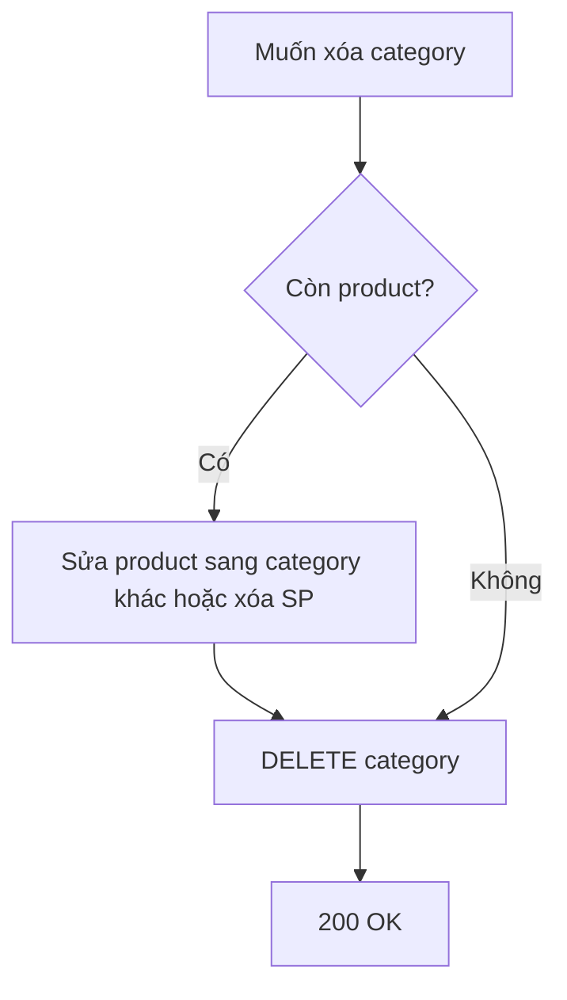

# Functional Requirement (FR) — Admin: Xóa danh mục (Admin Delete Category)

## 1. Feature Overview

Admin/Manager **xóa cứng** danh mục nếu **không còn sản phẩm** nào tham chiếu `category_id`.

```
DELETE /api/admin/categories/:category_id
Authorization: Bearer JWT
```

**FE:** Nút Trash trên `AdminCategories.jsx` → `adminAPI.deleteCategory(id)` + confirm.

---

## 2. Actors

| Actor | Mô tả |
|-------|-------|
| **Admin** | Xóa |
| **deleteCategory** | Controller |
| **Product** | Chặn xóa nếu còn liên kết |

---

## 3. Scope

### In Scope

- `Category.findByPk`.
- `category.countProducts()` — Sequelize `hasMany` Product.
- `destroy()` nếu count = 0.

### Out of Scope

- Soft delete.
- Cascade xóa products.
- Chuyển products sang category khác tự động.
- Xóa ảnh Cloudinary `icon_url`.

---

## 4. API Contract

### Request

```http
DELETE /api/admin/categories/5
Authorization: Bearer <token>
```

### Response — 200

```json
{
  "message": "Category deleted successfully"
}
```

### Errors

| HTTP | Message |
|------|---------|
| 404 | `Category not found` |
| 400 | `Cannot delete category with associated products` |
| 401/403 | Auth |

---

## 5. Backend Logic

```javascript
const category = await Category.findByPk(category_id);
if (!category) return res.status(404).json({ message: "Category not found" });

const productCount = await category.countProducts();
if (productCount > 0) {
  return res.status(400).json({
    message: "Cannot delete category with associated products",
  });
}

await category.destroy();
res.json({ message: "Category deleted successfully" });
```

| # | Business rule |
|---|----------------|
| BR-01 | **Hard delete** row `categories` |
| BR-02 | Products có `category_id` trỏ tới category → **chặn** |
| BR-03 | `category_id` trên product **không** SET NULL — phải sửa/xóa SP trước |
| BR-04 | Danh mục con `parent_id` trỏ tới category bị xóa — **không** kiểm tra (GAP FK) |

### Association

```javascript
// models/index.js
Category.hasMany(Product, { foreignKey: "category_id" });
```

---

## 6. Frontend

```javascript
const handleDelete = async (categoryId, categoryName) => {
  if (!confirm(`Bạn có chắc muốn xóa danh mục "${categoryName}"?`)) return;

  await adminAPI.deleteCategory(categoryId);
  alert("Xóa danh mục thành công!");
  queryClient.invalidateQueries({ queryKey: ["admin-categories"] });
};
```

| # | UX |
|---|-----|
| BR-05 | Lỗi 400 → alert message từ BE |
| BR-06 | Không hiển thị trước số SP trong bảng — admin có thể thử xóa nhầm |

---

## 7. Workflow khuyến nghị



---

## 8. Related FRs

| FR | Liên kết |
|----|----------|
| `FR_AdminListCategories` | List |
| `FR_AdminCreateCategory` | Tạo lại sau xóa |
| Admin product FRs | `category_id` FK trên products |

---

## 9. Source Files

| File | Vai trò |
|------|---------|
| `server/controllers/adminController.js` | `deleteCategory` L790–811 |
| `server/routes/adminRoutes.js` | `DELETE /categories/:category_id` |
| `client/app/pages/admin/AdminCategories.jsx` | Delete button |
| `client/app/hooks/useProducts.js` | `useDeleteCategory` |

---

## 10. Acceptance Criteria

- [ ] DELETE category không product → 200, row mất khỏi list.
- [ ] DELETE category còn ≥1 product → 400.
- [ ] 404 id không tồn tại.
- [ ] FE list refresh sau xóa.

---

## 11. Known Gaps

| # | Mô tả |
|---|--------|
| GAP-01 | Không orphan check `parent_id` children categories |
| GAP-02 | Product form dropdown vẫn có thể cache category đã xóa (`useCategories` key collision) |
| GAP-03 | Icon Cloudinary orphan |
| GAP-04 | Không bulk delete / merge categories |
