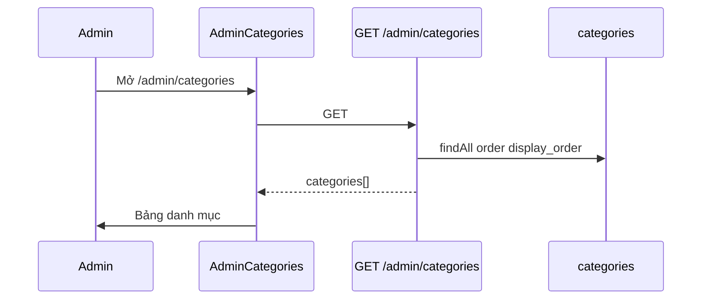

# Functional Requirement (FR) — Admin: Danh sách danh mục (Admin List Categories)

## 1. Feature Overview

Admin/Manager lấy **toàn bộ danh mục sản phẩm** (`categories`), sắp xếp theo `display_order` tăng dần — dùng cho trang quản trị và đồng bộ cache FE.

```
GET /api/admin/categories
Authorization: Bearer JWT
Role: admin | manager
```

**FE:** `/admin/categories` → `AdminCategories.jsx` + `useAdminCategories()`.

**Public song song:** `GET /api/products/categories` — cùng logic sort, không cần JWT (`productController.getCategories`).

---

## 2. Actors

| Actor | Mô tả |
|-------|-------|
| **Admin** | Panel UI |
| **Manager** | API được phép |
| **getAllCategories** | `adminController` |
| **Customer catalog** | Dùng public route |

---

## 3. Scope

### In Scope

- Trả full list (không pagination).
- Sort `display_order ASC`.
- Fields: `category_id`, `category_name`, `slug`, `description`, `parent_id`, `icon_url`, `display_order`, timestamps.

### Out of Scope

- Cây danh mục con (`parent_id` có cột nhưng CRUD **không** set).
- Đếm số sản phẩm mỗi category trong response.
- Search / filter query params.

---

## 4. API Contract

### Request

```http
GET /api/admin/categories
Authorization: Bearer <token>
```

### Response — 200

```json
{
  "categories": [
    {
      "category_id": 1,
      "category_name": "Laptop Gaming",
      "slug": "laptop-gaming",
      "description": "Máy chơi game hiệu năng cao",
      "parent_id": null,
      "icon_url": "https://res.cloudinary.com/.../laptop-store/products/xxx.jpg",
      "display_order": 1,
      "created_at": "...",
      "updated_at": "..."
    }
  ]
}
```

### Errors

| HTTP | Nguyên nhân |
|------|-------------|
| 401/403 | Auth / role |

---

## 5. Backend Logic

```javascript
const categories = await Category.findAll({
  order: [["display_order", "ASC"]],
});
res.json({ categories });
```

| # | Business rule |
|---|----------------|
| BR-01 | Trả cả danh mục không dùng — kể cả không có SP |
| BR-02 | `category_name` UNIQUE trên DB — tên trùng không tạo được |
| BR-03 | `slug` UNIQUE — sinh từ tên khi create/update |

---

## 6. Frontend — AdminCategories

### Load

```javascript
const { data, isLoading } = useAdminCategories();
// adminAPI.getCategories() → GET /admin/categories

useEffect(() => {
  if (data?.categories) setCategories(data.categories);
}, [data]);
```

### Bảng hiển thị

| Cột | Field |
|-----|--------|
| Icon | `icon_url` hoặc placeholder |
| Tên | `category_name` + `description` truncate |
| Slug | `slug` |
| Thứ tự | `display_order` |
| Thao tác | Edit / Delete |

| # | UX |
|---|-----|
| BR-04 | Layout 1/3 form + 2/3 list khi create/edit |
| BR-05 | Empty state + CTA “Tạo danh mục đầu tiên” |

### Cache collision (GAP)

```javascript
// useAdminCategories → GET /admin/categories
queryKey: ["admin-categories"]

// useCategories (product forms) → GET /products/categories  
queryKey: ["admin-categories"]  // CÙNG KEY — khác nguồn API
```

Có thể stale/wrong cache giữa admin page và product new/edit.

---

## 7. Downstream usage

| Consumer | Cách dùng |
|----------|-----------|
| `AdminProductNewPage` | Dropdown `category_id` qua `useCategories()` |
| `AdminProductEditPage` | Dropdown category |
| `ProductFilter` / HomePage | `customerUseCategories()` — key `["categories"]` |
| Analytics | `sales_by_category` join |

---

## 8. Sequence



---

## 9. Related FRs

| FR | Liên kết |
|----|----------|
| `FR_AdminCreateCategory` | Thêm |
| `FR_AdminUpdateCategory` | Sửa |
| `FR_AdminDeleteCategory` | Xóa |

---

## 10. Source Files

| File | Vai trò |
|------|---------|
| `server/controllers/adminController.js` | `getAllCategories` L689–699 |
| `server/routes/adminRoutes.js` | `GET /categories` |
| `server/controllers/productController.js` | `getCategories` public |
| `client/app/pages/admin/AdminCategories.jsx` | UI |
| `client/app/hooks/useProducts.js` | `useAdminCategories`, `useCategories` |
| `server/models/Category.js` | Schema |

---

## 11. Acceptance Criteria

- [ ] Admin GET → 200, mảng sorted by `display_order`.
- [ ] FE table khớp số lượng.
- [ ] Guest → 403 trên `/api/admin/categories`.
- [ ] Public `GET /products/categories` vẫn hoạt động không token.

---

## 12. Known Gaps

| # | Mô tả |
|---|--------|
| GAP-01 | **Không pagination** — nhiều category → payload lớn |
| GAP-02 | **Query key trùng** `admin-categories` giữa admin vs public API |
| GAP-03 | `parent_id` không dùng trong UI |
| GAP-04 | Không hiển thị `product_count` trước khi xóa |
