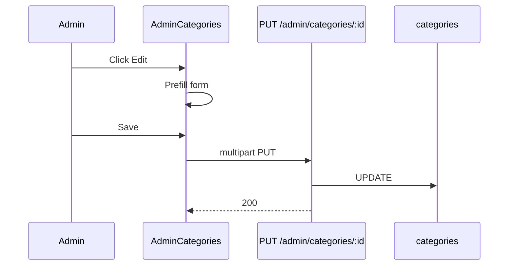

# Functional Requirement (FR) — Admin: Cập nhật danh mục (Admin Update Category)

## 1. Feature Overview

Admin/Manager cập nhật danh mục: tên (và **slug** nếu đổi tên), mô tả, `display_order`, icon mới (multipart tùy chọn).

```
PUT /api/admin/categories/:category_id
Authorization: Bearer JWT
Content-Type: multipart/form-data
```

**FE:** Inline edit mode `editingCategory` trên `AdminCategories.jsx` → `adminAPI.updateCategory(id, FormData)`.

---

## 2. Actors

| Actor | Mô tả |
|-------|-------|
| **Admin** | Edit form |
| **updateCategory** | Controller |
| **Products** | Vẫn reference `category_id` — đổi slug không đổi FK |

---

## 3. Scope

### In Scope

- Partial update: `description`, `display_order` luôn gửi.
- `category_name` đổi → regenerate `slug` + unique check (exclude self).
- File `thumbnail` mới → overwrite `icon_url`.

### Out of Scope

- Xóa icon trên server khi user clear preview FE (không gửi flag).
- Đổi `parent_id`.
- Reassign products sang category khác.

---

## 4. API Contract

### Request

```http
PUT /api/admin/categories/5
Content-Type: multipart/form-data

category_name=Laptop%20Gaming%20Pro
description=M%C3%B4%20t%E1%BA%A3%20m%E1%BB%9Bi
display_order=1
thumbnail=<file>   (optional)
```

### Response — 200

```json
{
  "message": "Category updated successfully",
  "category": { ... }
}
```

**Lưu ý:** `category` trong response là instance **trước** `reload` — có thể stale một số field sau `update` (Sequelize instance in-memory đã update nhưng nested — thường OK).

### Errors

| HTTP | Message |
|------|---------|
| 404 | `Category not found` |
| 400 | `Slug already exists. Please choose a different category name.` |

---

## 5. Backend Logic

```javascript
const updateData = {
  description,
  display_order: display_order || 0,
};

if (category_name && category_name !== category.category_name) {
  const slug = generateSlug(category_name);
  const conflict = await Category.findOne({
    where: { slug, category_id: { [Op.ne]: category_id } },
  });
  if (conflict) return 400;
  updateData.category_name = category_name;
  updateData.slug = slug;
}

if (req.files?.thumbnail?.[0]) {
  updateData.icon_url = req.files.thumbnail[0].path;
}

await category.update(updateData);
```

| # | Business rule |
|---|----------------|
| BR-01 | Không đổi tên → **slug giữ nguyên** |
| BR-02 | `display_order \|\| 0` — gửi `0` hợp lệ |
| BR-03 | Không upload icon mới → **giữ** `icon_url` cũ |
| BR-04 | FE `removeIcon()` chỉ xóa preview — **không** xóa icon DB |

---

## 6. Frontend — startEdit flow

```javascript
const startEdit = (category) => {
  setEditingCategory(category.category_id);
  setFormData({
    category_name: category.category_name,
    description: category.description,
    display_order: category.display_order || 0,
  });
  setIconPreview(category.icon_url || "");
  setIconFile(null);
};
```

Submit dùng chung `handleSubmit` với create — branch `editingCategory`.

| # | UX |
|---|-----|
| BR-05 | Một form panel — không route riêng `/edit/:id` |
| BR-06 | Sau success: invalidate `["admin-categories"]` only |

---

## 7. Impact on catalog

| Thay đổi | Ảnh hưởng |
|----------|-----------|
| Đổi `slug` | URL filter `?category_id=` vẫn dùng ID — slug đổi ít ảnh hưởng link cũ nếu có slug-based route |
| Đổi `display_order` | Thứ tự menu/filter đổi trên catalog |
| Đổi `icon_url` | UI category chip đổi ảnh |

---

## 8. Sequence



---

## 9. Related FRs

| FR | Liên kết |
|----|----------|
| `FR_AdminCreateCategory` | Tạo |
| `FR_AdminListCategories` | List |
| `FR_AdminDeleteCategory` | Xóa khi không còn SP |

---

## 10. Source Files

| File | Vai trò |
|------|---------|
| `server/controllers/adminController.js` | `updateCategory` L740–788 |
| `server/routes/adminRoutes.js` | `PUT /categories/:category_id` |
| `client/app/pages/admin/AdminCategories.jsx` | Edit UI |
| `client/app/hooks/useProducts.js` | `useUpdateCategory` (unused by page) |

---

## 11. Acceptance Criteria

- [ ] PUT đổi tên → slug mới, unique check.
- [ ] PUT chỉ description/order → slug/name giữ.
- [ ] Upload icon mới → `icon_url` đổi.
- [ ] 404 category không tồn tại.

---

## 12. Known Gaps

| # | Mô tả |
|---|--------|
| GAP-01 | Không xóa icon cũ trên Cloudinary khi thay ảnh |
| GAP-02 | Không API clear `icon_url` without new file |
| GAP-03 | `category_name` UNIQUE — đổi tên trùng category khác → 500/409 |
