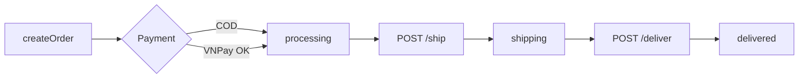

# Functional Requirement (FR) — Admin: Xác nhận đã giao / hoàn thành (Admin Deliver Order)

## 1. Feature Overview

Admin xác nhận khách **đã nhận hàng** — chuyển `orders.status` từ **`shipping`** → **`delivered`**, gửi email.

```
POST /api/admin/orders/:order_id/deliver
Authorization: Bearer JWT
Body: (empty)
```

**FE:** Tab “Đang giao hàng” → nút **✅ Đã nhận** → `useDeliverOrder`.

---

## 2. Actors

| Actor | Mô tả |
|-------|-------|
| **Admin / Manager** | Deliver action |
| **deliverOrder** | Controller |
| **Customer** | Nhận email hoàn tất |

---

## 3. Scope

### In Scope

- Guard: `status === 'shipping'`.
- Update `status = 'delivered'`.
- Email thông báo.

### Out of Scope

- Đánh giá sản phẩm / review trigger.
- Cập nhật `payment_status` COD → completed (không tự động).
- Hoàn tiền.

---

## 4. API Contract

### Request

```http
POST /api/admin/orders/42/deliver
Authorization: Bearer <token>
```

### Response — 200

```json
{
  "message": "Order delivered successfully",
  "order": {
    "order_id": 42,
    "status": "delivered",
    ...
  }
}
```

### Errors

| HTTP | Message |
|------|---------|
| 404 | `Order not found` |
| 400 | `Order must be in shipping status to deliver` |

---

## 5. Backend Logic

```javascript
if (order.status !== 'shipping') {
  return res.status(400).json({ message: "Order must be in shipping status to deliver" });
}
await order.update({ status: 'delivered' });
// email: shipping → delivered
```

| # | Business rule |
|---|----------------|
| BR-01 | Phải ship trước (`processing` → `shipping`) trừ khi admin **PUT status** bypass |
| BR-02 | `delivered` là trạng thái kết thúc thành công |
| BR-03 | Stock **không** thay đổi thêm (đã trừ khi đặt hàng) |
| BR-04 | Tab user “Hoàn thành” map `delivered` |

---

## 6. Fulfillment pipeline (end-to-end)



| Bước | Actor | Status |
|------|-------|--------|
| Đặt hàng | User | `processing` / `AWAITING_PAYMENT` |
| Thanh toán VNPay | Gateway | → `processing` |
| Xuất giao | Admin ship | `shipping` |
| Hoàn tất | Admin deliver | `delivered` |

---

## 7. Frontend

```javascript
const handleDeliverOrder = (orderId) => {
  if (window.confirm('Bạn có chắc muốn xác nhận khách hàng đã nhận được hàng?')) {
    deliverOrder.mutate({ orderId });
  }
};
```

| # | UX |
|---|-----|
| BR-05 | Nút chỉ khi `activeTab === 'shipping'` |
| BR-06 | Confirm text **đúng** nghĩa deliver |

```javascript
// useDeliverOrder
POST `/admin/orders/${orderId}/deliver`
onSuccess: invalidate ["admin-orders"]
```

---

## 8. Payment note

| Provider | `payment_status` sau deliver |
|----------|------------------------------|
| COD | Có thể vẫn `pending` — không auto `completed` |
| VNPAY | Thường đã `completed` lúc thanh toán |

Admin panel hiển thị payment block độc lập với order status.

---

## 9. Related FRs

| FR | Liên kết |
|----|----------|
| `FR_AdminShipOrder` | Bước trước |
| `FR_AdminListOrders` | Tab delivered |
| `FR_AdminUpdateOrderStatus` | Override |
| `FR_ViewUserOrders` | User tab completed |

---

## 10. Source Files

| File | Vai trò |
|------|---------|
| `server/controllers/adminController.js` | `deliverOrder` L518–560 |
| `server/routes/adminRoutes.js` | `POST /orders/:order_id/deliver` |
| `client/app/pages/admin/AdminOrders.jsx` | `handleDeliverOrder` |
| `client/app/hooks/useOrders.js` | `useDeliverOrder` |

---

## 11. Acceptance Criteria

- [ ] Đơn `shipping` → POST deliver → 200, `status=delivered`.
- [ ] Đơn `processing` → 400.
- [ ] Tab shipping có nút “Đã nhận”.
- [ ] Tab delivered chỉ còn nút Xem.

---

## 12. Known Gaps

| # | Mô tả |
|---|--------|
| GAP-01 | COD `payment_status` không auto complete khi deliver |
| GAP-02 | Không `delivered_at` column |
| GAP-03 | Deliver không có trên detail page |
| GAP-04 | `PUT status=delivered` skip shipping guard |
