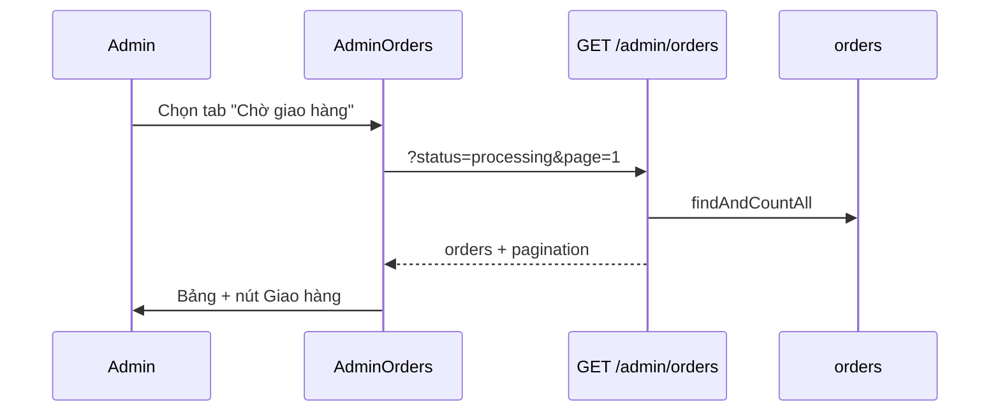

# Functional Requirement (FR) — Admin: Danh sách đơn hàng (Admin List Orders)

## 1. Feature Overview

Admin/Manager xem **danh sách đơn hàng** có phân trang, lọc theo **tab trạng thái**, thao tác nhanh (xem / giao / nhận / hoàn tiền) tùy tab.

```
GET /api/admin/orders?page=1&limit=20&status={optional}
Authorization: Bearer JWT
Role: admin | manager
```

**FE:** `/admin/orders` → `AdminOrders.jsx` (list mode).  
**Chi tiết:** `/admin/orders/:orderId` — component `AdminOrderDetail` embedded cùng file.

---

## 2. Actors

| Actor | Mô tả |
|-------|-------|
| **Admin / Manager** | Vận hành đơn |
| **getAllOrders** | `adminController` |
| **useAdminOrders** | React Query |

---

## 3. Scope

### In Scope

- Pagination `page`, `limit` (default 20).
- Filter server: query `status` (một giá trị ENUM).
- Include: `user` (id, username, email, full_name, phone_number), `payment` (id, method, status, provider).
- Sort server: `created_at DESC`.
- Tabs FE map → `status` query.
- Action buttons theo tab: ship, deliver, refund (VNPAY).

### Out of Scope

- Search theo email / mã đơn (`order_code`).
- Export CSV.
- Sort server theo `final_amount` (FE có UI sort **không gửi BE**).
- Multi-status filter server (FE filter client trên 1 trang).

---

## 4. API Contract

### Request

```http
GET /api/admin/orders?page=1&limit=20
GET /api/admin/orders?page=1&limit=20&status=processing
```

| Param | Default | Mô tả |
|-------|---------|--------|
| `page` | 1 | Trang |
| `limit` | 20 | Page size |
| `status` | — | Exact match `orders.status` |

### Response — 200

```json
{
  "orders": [
    {
      "order_id": 42,
      "order_code": "ORD-20260527-XXXX",
      "user_id": 5,
      "total_amount": "25000000.00",
      "shipping_fee": "30000.00",
      "discount_amount": "0.00",
      "final_amount": "25030000.00",
      "status": "processing",
      "shipping_name": "Nguyễn A",
      "shipping_phone": "090...",
      "shipping_address": "...",
      "created_at": "...",
      "user": {
        "user_id": 5,
        "username": "user1",
        "email": "a@example.com",
        "full_name": "Nguyễn A",
        "phone_number": "090..."
      },
      "payment": {
        "payment_id": 10,
        "payment_method": "COD",
        "payment_status": "pending",
        "provider": "COD"
      }
    }
  ],
  "pagination": {
    "total": 120,
    "page": 1,
    "limit": 20,
    "totalPages": 6
  }
}
```

### Errors

| HTTP | Nguyên nhân |
|------|-------------|
| 401/403 | Auth / role |
| 500 | DB |

---

## 5. Backend Logic

```javascript
const where = {};
if (status) where.status = status;

Order.findAndCountAll({
  where,
  include: [User, Payment],
  limit, offset,
  order: [["created_at", "DESC"]],
});
```

| # | Business rule |
|---|----------------|
| BR-01 | **Không** lọc theo `payment_status` — tab “đã hoàn tiền” FE lọc client |
| BR-02 | Trả **mọi** đơn mọi user — không scope theo admin |
| BR-03 | `FAILED` và `cancelled` là tab riêng (`status` exact) |
| BR-04 | Không include `OrderItem` — list nhẹ |

---

## 6. Frontend — Tabs & actions

### Tabs (`ORDER_STATUS_TABS`)

| Tab key | Label | `status` query |
|---------|-------|----------------|
| `all` | Tất cả | *(không gửi)* |
| `awaiting_payment` | Chờ thanh toán | `AWAITING_PAYMENT` |
| `processing` | Chờ giao hàng | `processing` |
| `shipping` | Đang giao hàng | `shipping` |
| `delivered` | Hoàn thành | `delivered` |
| `cancelled` | Đã hủy | `cancelled` |
| `failed` | Thanh toán thất bại | `FAILED` |

### Action buttons (`renderActionButtons`)

| Tab | Nút (ngoài Xem) |
|-----|------------------|
| `processing` | 🚚 **Giao hàng** → `POST .../ship` |
| `shipping` | ✅ **Đã nhận** → `POST .../deliver` |
| `cancelled` | 💰 **Hoàn tiền** nếu `payment.provider === 'VNPAY'` và chưa `refunded` |
| Khác | Chỉ **Xem** |

### Client-side filters (GAP)

- Checkbox filter trên tab `all` / `cancelled` — lọc **trên mảng trang hiện tại**, không gọi lại API.
- Tab cancelled: `cancelled_not_refunded` / `cancelled_refunded` theo `payment.payment_status`.

### Sort UI (GAP)

```javascript
useAdminOrders({ page, limit, status, sortBy, sortOrder });
// Hook chỉ nhận page, limit, status — sortBy/sortOrder BỊ BỎ QUA
```

Cột “Ngày đặt” có icon sort — **không ảnh hưởng** thứ tự server.

### Hook

```javascript
queryKey: ["admin-orders", page, limit, status]
staleTime: 0
```

`useEffect` gọi `refetch()` khi đổi tab/page/sort — refetch không đổi sort BE.

---

## 7. Hiển thị bảng

| Cột | Nguồn |
|-----|--------|
| Mã đơn | `#order_id` (không hiển thị `order_code`) |
| Khách | `user.full_name`, `user.email` |
| Tổng tiền | `final_amount` |
| Trạng thái | Badge tiếng Việt |
| Ngày đặt | `created_at` locale `vi-VN` |

---

## 8. Sequence



---

## 9. Related FRs

| FR | Liên kết |
|----|----------|
| `FR_AdminViewOrderDetail` | Xem chi tiết |
| `FR_AdminShipOrder` | Tab processing |
| `FR_AdminDeliverOrder` | Tab shipping |
| `FR_AdminRefundOrder` | Tab cancelled VNPAY |
| `FR_ViewUserOrders` | Phía khách |

---

## 10. Source Files

| File | Vai trò |
|------|---------|
| `server/controllers/adminController.js` | `getAllOrders` |
| `server/routes/adminRoutes.js` | `GET /orders` |
| `client/app/pages/admin/AdminOrders.jsx` | UI list |
| `client/app/hooks/useOrders.js` | `useAdminOrders` |
| `client/app/App.jsx` | Routes |
| `docs/master_specification.md` §8.3, §9.5 | Order states |

---

## 11. Acceptance Criteria

- [ ] Admin vào `/admin/orders` thấy danh sách + pagination.
- [ ] Tab `processing` chỉ đơn `status=processing`.
- [ ] Nút ship chỉ tab processing; deliver chỉ tab shipping.
- [ ] Tab cancelled + VNPAY + chưa refunded → nút hoàn tiền.
- [ ] Customer token → 403.

---

## 12. Known Gaps

| # | Mô tả |
|---|--------|
| GAP-01 | `sortBy`/`sortOrder` FE không gửi BE |
| GAP-02 | Filter checkbox chỉ trên 1 page dữ liệu |
| GAP-03 | Hiển thị `#order_id` thay vì `order_code` |
| GAP-04 | Tab không gộp `PAID` / `pending` / `confirmed` (ít dùng) |
| GAP-05 | Không search / date range |
| GAP-06 | Confirm ship: text “đã giao hàng” nhầm với “bắt đầu giao” |
