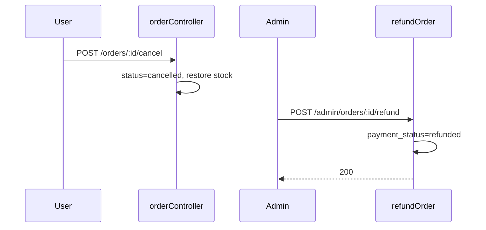

# Functional Requirement (FR) — Admin: Xác nhận hoàn tiền (Admin Refund Order)

## 1. Feature Overview

Sau khi đơn VNPay đã **hủy** (`cancelled`), admin xác nhận **đã hoàn tiền thủ công** cho khách (không gọi API refund VNPay). Hệ thống cập nhật `payments.payment_status = 'refunded'` và gửi email.

```
POST /api/admin/orders/:order_id/refund
Authorization: Bearer JWT
Body: (empty)
```

**FE:** Tab “Đã hủy” → nút **💰 Hoàn tiền** (chỉ `payment.provider === 'VNPAY'` và chưa refunded).

---

## 2. Actors

| Actor | Mô tả |
|-------|-------|
| **Admin / Manager** | Xác nhận hoàn tiền |
| **refundOrder** | Controller |
| **Customer** | Nhận email `ORDER_REFUND` |

---

## 3. Scope

### In Scope

- Preconditions: `order.status === 'cancelled'`, `payment.provider === 'VNPAY'`.
- Update `payment.payment_status` → `refunded`.
- Email thông báo amount + provider.

### Out of Scope

- VNPay refund API / IPN hoàn tiền tự động.
- Hoàn kho (đã hoàn khi **user cancel** — `FR_CancelOrder`).
- Đổi `order.status` (vẫn `cancelled`).
- Hoàn tiền đơn COD (400).

---

## 4. API Contract

### Request

```http
POST /api/admin/orders/42/refund
Authorization: Bearer <token>
```

### Response — 200

```json
{
  "message": "Order refunded successfully",
  "order": {
    "order_id": 42,
    "status": "cancelled",
    "payment": {
      "payment_status": "refunded",
      "provider": "VNPAY",
      ...
    },
    ...
  }
}
```

### Errors

| HTTP | Message |
|------|---------|
| 404 | `Order not found` |
| 400 | `Order must be cancelled to refund` |
| 400 | `Only VNPAY orders can be refunded through admin` |

---

## 5. Backend Logic

```javascript
const order = await Order.findByPk(order_id, {
  include: [{ model: Payment, as: 'payment' }],
});

if (order.status !== 'cancelled') {
  return res.status(400).json({ message: "Order must be cancelled to refund" });
}
if (order.payment?.provider !== 'VNPAY') {
  return res.status(400).json({ message: "Only VNPAY orders can be refunded through admin" });
}

if (order.payment) {
  await order.payment.update({ payment_status: 'refunded' });
}

sendOrderUpdateEmail({
  order,
  changeType: 'ORDER_REFUND',
  newData: { amount: order.final_amount, provider: order.payment?.provider },
  user,
});
```

| # | Business rule |
|---|----------------|
| BR-01 | **Không** gọi VNPay refund endpoint |
| BR-02 | `order.status` giữ `cancelled` |
| BR-03 | Đơn `FAILED` (VNPay fail) **không** refund qua endpoint này — cần `cancelled` |
| BR-04 | Không idempotent flag — POST lần 2 vẫn 200 nếu vẫn cancelled (payment đã refunded) |
| BR-05 | Stock: user cancel đã `increment stock_quantity` — refund không đụng kho |

### Luồng VNPay hủy → hoàn tiền



---

## 6. Frontend

### Điều kiện hiển thị nút

```javascript
activeTab === 'cancelled'
&& order.payment?.provider === 'VNPAY'
&& order.payment?.payment_status !== 'refunded'
```

Đã refunded → text **✅ Đã hoàn tiền** (không nút).

```javascript
const handleRefundOrder = (orderId) => {
  if (window.confirm('Bạn có chắc muốn xác nhận đã hoàn tiền cho đơn hàng này?')) {
    refundOrder.mutate({ orderId });
  }
};
```

```javascript
// useRefundOrder
POST `/admin/orders/${orderId}/refund`
onSuccess: invalidate ["admin-orders"]
```

### Client filter (tab cancelled)

- `cancelled_not_refunded` / `cancelled_refunded` — lọc client theo `payment_status`.

---

## 7. So sánh COD vs VNPAY

| | COD cancelled | VNPAY cancelled |
|--|---------------|-----------------|
| Hoàn kho khi cancel | ✅ | ✅ |
| Admin refund button | ❌ | ✅ |
| `payment_status` sau refund | — | `refunded` |
| Tiền thật | Không thu trước / COD | Admin hoàn manual |

---

## 8. Related FRs

| FR | Liên kết |
|----|----------|
| `FR_CancelOrder` | Tạo trạng thái cancelled + restore stock |
| `FR_AdminListOrders` | UI refund |
| `FR_ProcessVNPayReturn` | Thanh toán / fail |
| `FR_AdminUpdateOrderStatus` | Không thay payment |

---

## 9. Source Files

| File | Vai trò |
|------|---------|
| `server/controllers/adminController.js` | `refundOrder` L563–616 |
| `server/routes/adminRoutes.js` | `POST /orders/:order_id/refund` |
| `server/models/Payment.js` | `payment_status` ENUM |
| `server/services/emailService.js` | `ORDER_REFUND` template |
| `client/app/pages/admin/AdminOrders.jsx` | Refund UI |
| `client/app/hooks/useOrders.js` | `useRefundOrder` |

---

## 10. Acceptance Criteria

- [ ] Đơn `cancelled` + VNPAY → POST refund → `payment_status=refunded`.
- [ ] Đơn `processing` → 400 cancelled required.
- [ ] COD cancelled → 400 Only VNPAY.
- [ ] UI chuyển sang “Đã hoàn tiền” sau success.
- [ ] Email refund queued.

---

## 11. Known Gaps

| # | Mô tả |
|---|--------|
| GAP-01 | **Không** tích hợp VNPay Refund API — chỉ bookkeeping |
| GAP-02 | `FAILED` orders không dùng refund endpoint |
| GAP-03 | master spec “refund → hoàn kho” **sai** với code — kho hoàn lúc cancel |
| GAP-04 | Không lưu `refunded_at`, `refund_transaction_id` |
| GAP-05 | Không refund trên detail page |
| GAP-06 | POST refund lặp không chặn — vẫn 200 |
