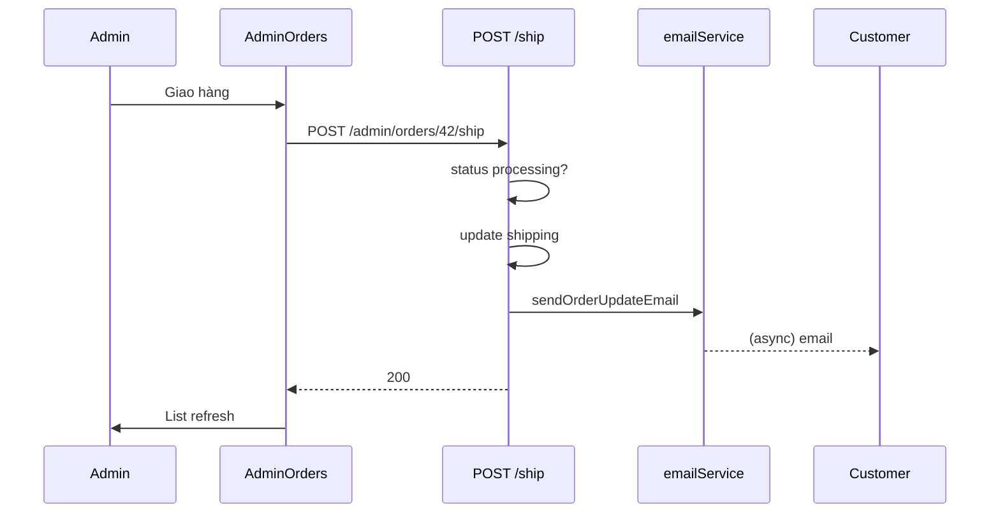

# Functional Requirement (FR) — Admin: Xác nhận giao hàng / chuyển sang đang giao (Admin Ship Order)

## 1. Feature Overview

Admin xác nhận đơn **đã chuyển cho đơn vị giao** (hoặc bắt đầu giao): chuyển `orders.status` từ **`processing`** → **`shipping`**, gửi email khách.

```
POST /api/admin/orders/:order_id/ship
Authorization: Bearer JWT
Body: (empty)
```

**FE:** Tab “Chờ giao hàng” trên `AdminOrders` → nút **🚚 Giao hàng** → `useShipOrder`.

**Lưu ý nhãn UI:** Confirm dialog ghi *"xác nhận đã giao hàng"* — thực tế API là **bắt đầu** giai đoạn shipping, chưa phải `delivered`.

---

## 2. Actors

| Actor | Mô tả |
|-------|-------|
| **Admin / Manager** | Ship action |
| **shipOrder** | Controller |
| **Customer** | Nhận email |

---

## 3. Scope

### In Scope

- Guard: chỉ `status === 'processing'`.
- Update `status = 'shipping'`.
- Email `ORDER_STATUS` old→new.

### Out of Scope

- Mã vận đơn GHN/GHTK.
- Cập nhật tracking URL.
- Trừ/hoàn kho (đã trừ lúc `createOrder`).

---

## 4. API Contract

### Request

```http
POST /api/admin/orders/42/ship
Authorization: Bearer <token>
```

### Response — 200

```json
{
  "message": "Order shipped successfully",
  "order": {
    "order_id": 42,
    "status": "shipping",
    ...
  }
}
```

### Errors

| HTTP | Message |
|------|---------|
| 404 | `Order not found` |
| 400 | `Order must be in processing status to ship` |
| 401/403 | Auth |

---

## 5. Backend Logic

```javascript
if (order.status !== 'processing') {
  return res.status(400).json({ message: "Order must be in processing status to ship" });
}
await order.update({ status: 'shipping' });
// sendOrderUpdateEmail: processing → shipping
```

| # | Business rule |
|---|----------------|
| BR-01 | COD đơn mới tạo thường đã `processing` — ship được |
| BR-02 | VNPay sau thanh toán: `vnpayController` set `processing` — ship được |
| BR-03 | `AWAITING_PAYMENT` → ship **bị chặn** 400 |
| BR-04 | `shipping` / `delivered` / `cancelled` → 400 |
| BR-05 | Không đổi `payment_status` |

### Điều kiện vào `processing` (context)

| Nguồn | Khi tạo / thanh toán |
|--------|----------------------|
| COD | `createOrder` → `status: processing` |
| VNPay success | `vnpayController` return → `processing` |

---

## 6. Frontend

```javascript
const handleShipOrder = (orderId) => {
  if (window.confirm('Bạn có chắc muốn xác nhận đã giao hàng cho đơn hàng này?')) {
    shipOrder.mutate({ orderId });
  }
};
```

```javascript
// useShipOrder
POST `/admin/orders/${orderId}/ship`
onSuccess: invalidateQueries(["admin-orders"])
```

| # | UX |
|---|-----|
| BR-06 | Nút chỉ tab `activeTab === 'processing'` |
| BR-07 | Sau success list refetch — đơn chuyển tab “Đang giao hàng” khi admin đổi tab |

---

## 7. Sequence



---

## 8. Related FRs

| FR | Liên kết |
|----|----------|
| `FR_AdminDeliverOrder` | Bước tiếp theo |
| `FR_AdminUpdateOrderStatus` | Bypass guard |
| `FR_AdminListOrders` | UI nút |
| `FR_CreateOrder` | Reserve inventory |

---

## 9. Source Files

| File | Vai trò |
|------|---------|
| `server/controllers/adminController.js` | `shipOrder` L473–515 |
| `server/routes/adminRoutes.js` | `POST /orders/:order_id/ship` |
| `client/app/pages/admin/AdminOrders.jsx` | `handleShipOrder` |
| `client/app/hooks/useOrders.js` | `useShipOrder` |

---

## 10. Acceptance Criteria

- [ ] Đơn `processing` → POST ship → 200, `status=shipping`.
- [ ] Đơn `AWAITING_PAYMENT` → 400.
- [ ] Tab processing hiện nút ship.
- [ ] Email queued (log nếu fail không rollback).

---

## 11. Known Gaps

| # | Mô tả |
|---|--------|
| GAP-01 | Wording confirm “đã giao hàng” vs `shipping` |
| GAP-02 | Không có ship trên trang detail |
| GAP-03 | Có thể `PUT status=shipping` bỏ qua guard processing |
| GAP-04 | Không ghi `shipped_at` timestamp |
