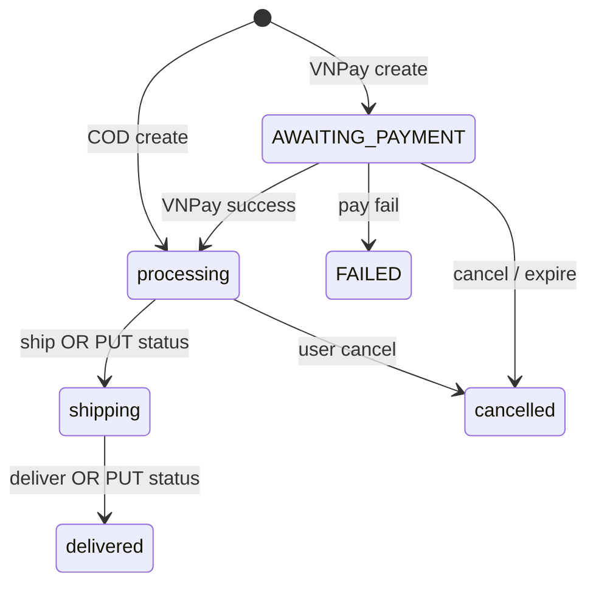

# Functional Requirement (FR) — Admin: Cập nhật trạng thái đơn (Admin Update Order Status)

## 1. Feature Overview

Admin/Manager **gán trực tiếp** `orders.status` — không qua ship/deliver workflow — kèm email thông báo (best-effort).

```
PUT /api/admin/orders/:order_id/status
Authorization: Bearer JWT
Body: { "status": "<ENUM>" }
```

**FE:** Dropdown trên `AdminOrderDetail` → `useUpdateOrderStatus`.

**Khác** `POST .../ship` và `POST .../deliver`: các endpoint đó **kiểm tra** trạng thái trước/sau cố định.

---

## 2. Actors

| Actor | Mô tả |
|-------|-------|
| **Admin / Manager** | Đổi status |
| **updateOrderStatus** | Controller |
| **sendOrderUpdateEmail** | `emailService` async |

---

## 3. Scope

### In Scope

- `Order.update({ status })`.
- Email `changeType: 'ORDER_STATUS'`.
- Trả về order sau update.

### Out of Scope

- Validate state machine / allowed transitions.
- Cập nhật `payments.payment_status` đồng bộ.
- Hoàn kho / trừ kho.
- Gọi VNPay refund API.

---

## 4. API Contract

### Request

```http
PUT /api/admin/orders/42/status
Content-Type: application/json

{
  "status": "shipping"
}
```

### Giá trị `status` hợp lệ (ENUM model)

`pending`, `confirmed`, `processing`, `shipping`, `delivered`, `cancelled`, `AWAITING_PAYMENT`, `PAID`, `FAILED`

### Response — 200

```json
{
  "message": "Order status updated successfully",
  "order": {
    "order_id": 42,
    "status": "shipping",
    ...
  }
}
```

### Errors

| HTTP | Message |
|------|---------|
| 404 | `Order not found` |
| 400/500 | Sequelize nếu status invalid |

---

## 5. Backend Logic

```javascript
const order = await Order.findByPk(order_id);
const oldStatus = order.status;
await order.update({ status });

sendOrderUpdateEmail({
  order,
  changeType: 'ORDER_STATUS',
  oldData: { status: oldStatus },
  newData: { status: order.status },
  user: await User.findByPk(order.user_id),
}).catch(...);
```

| # | Business rule |
|---|----------------|
| BR-01 | **Không** kiểm tra transition — admin có thể set bất kỳ ENUM |
| BR-02 | Email failure **không** rollback DB |
| BR-03 | **Không** đụng `payment`, `stock`, `order_items` |
| BR-04 | Body thiếu `status` → có thể set `undefined` (Sequelize) — FE luôn gửi |

---

## 6. Luồng chuẩn vs override

| Luồng khuyến nghị (fulfillment) | API |
|----------------------------------|-----|
| `processing` → `shipping` | `POST .../ship` |
| `shipping` → `delivered` | `POST .../deliver` |
| Bất kỳ (override) | `PUT .../status` |



---

## 7. Frontend

```javascript
const handleStatusChange = (newStatus) => {
  if (window.confirm(`... "${newStatus}"?`)) {
    updateStatus.mutate({ orderId: order.order_id, status: newStatus });
  }
};
```

```javascript
// useUpdateOrderStatus
api.put(`/admin/orders/${orderId}/status`, { status })
onSuccess: invalidate ["admin-orders"], ["orders"], ["order-counters"]
// Không invalidate ["admin-order", orderId]
```

| # | UX |
|---|-----|
| BR-05 | Confirm tiếng Việt trước mutate |
| BR-06 | `disabled={updateStatus.isPending}` trên select |

---

## 8. Email side effect

`server/services/emailService.js` — template theo `changeType`:

- Subject/body mô tả đổi trạng thái.
- Gửi tới `user.email` nếu user tồn tại.

| # | Gap |
|---|-----|
| GAP-01 | Không gửi nếu `user` null |
| GAP-02 | Không log audit trên DB |

---

## 9. Related FRs

| FR | Liên kết |
|----|----------|
| `FR_AdminShipOrder` | Transition có guard |
| `FR_AdminDeliverOrder` | Transition có guard |
| `FR_AdminViewOrderDetail` | UI dropdown |
| `FR_CancelOrder` | User cancel + restore stock |

---

## 10. Source Files

| File | Vai trò |
|------|---------|
| `server/controllers/adminController.js` | `updateOrderStatus` L431–469 |
| `server/routes/adminRoutes.js` | `PUT /orders/:order_id/status` |
| `server/models/Order.js` | ENUM `status` |
| `server/services/emailService.js` | Email |
| `client/app/hooks/useOrders.js` | `useUpdateOrderStatus` |

---

## 11. Acceptance Criteria

- [ ] PUT hợp lệ → 200, DB đổi status.
- [ ] 404 khi order không tồn tại.
- [ ] List admin refresh sau success.
- [ ] Có thể set `delivered` từ `processing` (override — documented).

---

## 12. Known Gaps

| # | Mô tả |
|---|--------|
| GAP-03 | Không FSM validation — dễ lệch payment/order |
| GAP-04 | PUT `cancelled` **không** hoàn kho (khác user cancel) |
| GAP-05 | Detail cache không invalidate |
| GAP-06 | Dropdown thiếu một số ENUM thực tế (`PAID`) |
