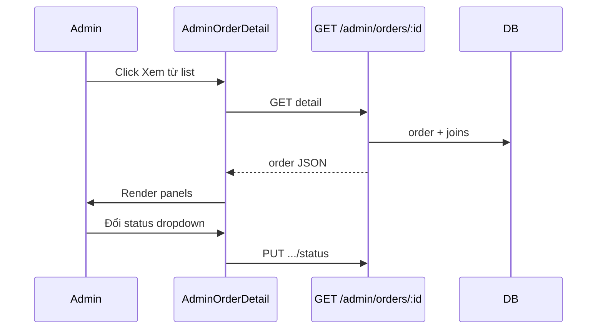

# Functional Requirement (FR) — Admin: Chi tiết đơn hàng (Admin View Order Detail)

## 1. Feature Overview

Admin/Manager xem **đầy đủ** một đơn: khách hàng, giao hàng, line items (ảnh SP), thanh toán, tổng tiền, ghi chú; **đổi trạng thái** tùy ý qua dropdown (không ràng buộc transition).

```
GET /api/admin/orders/:order_id
```

**FE:** `/admin/orders/:orderId` → `AdminOrderDetail` trong `AdminOrders.jsx`.  
**Cập nhật status:** `PUT /api/admin/orders/:order_id/status` (`FR_AdminUpdateOrderStatus`).

---

## 2. Actors

| Actor | Mô tả |
|-------|-------|
| **Admin / Manager** | Xem & sửa status |
| **getOrderDetail** | Admin controller |
| **useAdminOrderDetail** | Load data |
| **useUpdateOrderStatus** | Mutation status |

---

## 3. Scope

### In Scope

- Order + `items` + `variation.product` + `payment` + `user`.
- UI sections: khách, shipping, sản phẩm, thanh toán, tóm tắt, note.
- Dropdown đổi `status` + confirm.

### Out of Scope

- Nút ship/deliver/refund trên detail (chỉ có trên **list** tab).
- Sửa địa chỉ giao hàng (user API `PUT /orders/:id/shipping-address`).
- Timeline lịch sử status.

---

## 4. API Contract

### Request

```http
GET /api/admin/orders/42
Authorization: Bearer <token>
```

### Response — 200

```json
{
  "order": {
    "order_id": 42,
    "order_code": "ORD-...",
    "user_id": 5,
    "total_amount": "25000000.00",
    "shipping_fee": "30000.00",
    "discount_amount": "500000.00",
    "final_amount": "24530000.00",
    "status": "processing",
    "shipping_address": "123 ...",
    "shipping_phone": "0901234567",
    "shipping_name": "Nguyễn Văn A",
    "note": "...",
    "province_id": 1,
    "ward_id": 100,
    "reserve_expires_at": null,
    "created_at": "...",
    "items": [
      {
        "order_item_id": 1,
        "variation_id": 10,
        "quantity": 1,
        "price": "25000000.00",
        "discount_amount": "500000.00",
        "subtotal": "24500000.00",
        "variation": {
          "variation_id": 10,
          "sku": "...",
          "product": {
            "product_id": 3,
            "product_name": "Laptop X",
            "thumbnail_url": "https://..."
          }
        }
      }
    ],
    "payment": {
      "payment_id": 10,
      "payment_method": "COD",
      "payment_status": "pending",
      "provider": "COD",
      "transaction_id": null,
      "amount": "24530000.00"
    },
    "user": {
      "user_id": 5,
      "username": "user1",
      "email": "a@example.com",
      "full_name": "Nguyễn A",
      "phone_number": "090..."
    }
  }
}
```

### Errors

| HTTP | Message |
|------|---------|
| 404 | `Order not found` |

---

## 5. Backend — includes

```javascript
Order.findOne({
  where: { order_id },
  include: [
    {
      model: OrderItem, as: "items",
      include: [{
        model: ProductVariation, as: "variation",
        include: [{ model: Product, as: "product" }],
      }],
    },
    { model: Payment, as: "payment" },
    { model: User, as: "user", attributes: [...] },
  ],
});
```

| # | Rule |
|---|------|
| BR-01 | Không check ownership — admin xem mọi đơn |
| BR-02 | Giá dòng = `item.price` snapshot lúc đặt |
| BR-03 | Ảnh từ `variation.product.thumbnail_url` |

---

## 6. Frontend — AdminOrderDetail

### Load

```javascript
const { data } = useAdminOrderDetail(orderId);
const order = data?.order;
```

### Sections

| Block | Fields |
|-------|--------|
| Header | `#order_id`, ngày đặt, dropdown status |
| Khách | `user.full_name`, email, phone, username |
| Giao hàng | `shipping_name`, `shipping_phone`, `shipping_address` |
| Sản phẩm | Thumb, tên, `quantity × price`, line total |
| Thanh toán | method, provider, payment_status badge, transaction_id |
| Tóm tắt | total_amount, shipping_fee, discount, final_amount |
| Ghi chú | `order.note` nếu có |

### Status dropdown

```javascript
<option value="AWAITING_PAYMENT">Chờ thanh toán</option>
<option value="processing">Chờ giao hàng</option>
<option value="shipping">Đang giao hàng</option>
<option value="delivered">Hoàn thành</option>
<option value="cancelled">Đã hủy</option>
<option value="FAILED">Thanh toán thất bại</option>
```

| # | UX gap |
|---|--------|
| GAP-01 | Thiếu `PAID`, `pending`, `confirmed` trong dropdown |
| GAP-02 | Không hiển thị `order_code` |
| GAP-03 | Không hiển thị `reserve_expires_at` (VNPay countdown) |
| GAP-04 | `handleStatusChange` → `useUpdateOrderStatus` — không invalidate `["admin-order", id]` |

### Navigation

Nút “Quay lại” → `/admin/orders`.

---

## 7. Sequence



---

## 8. Related FRs

| FR | Liên kết |
|----|----------|
| `FR_AdminListOrders` | Entry |
| `FR_AdminUpdateOrderStatus` | Dropdown |
| `FR_ViewOrderDetail` | User-facing detail |
| `FR_CreateOrder` | Tạo đơn + reserve stock |

---

## 9. Source Files

| File | Vai trò |
|------|---------|
| `server/controllers/adminController.js` | `getOrderDetail` |
| `server/routes/adminRoutes.js` | `GET /orders/:order_id` |
| `client/app/pages/admin/AdminOrders.jsx` | `AdminOrderDetail` |
| `client/app/hooks/useOrders.js` | `useAdminOrderDetail`, `useUpdateOrderStatus` |

---

## 10. Acceptance Criteria

- [ ] GET hợp lệ → đủ items + payment + user.
- [ ] 404 → “Đơn hàng không tồn tại”.
- [ ] Đổi status → PUT success, list refresh (invalidate admin-orders).
- [ ] Line items hiển thị đúng quantity và giá.

---

## 11. Known Gaps

| # | Mô tả |
|---|--------|
| GAP-05 | Detail không có ship/deliver/refund — phải quay list |
| GAP-06 | PUT status không validate FSM — có thể nhảy `delivered` từ `AWAITING_PAYMENT` |
| GAP-07 | Cache detail stale sau đổi status |
