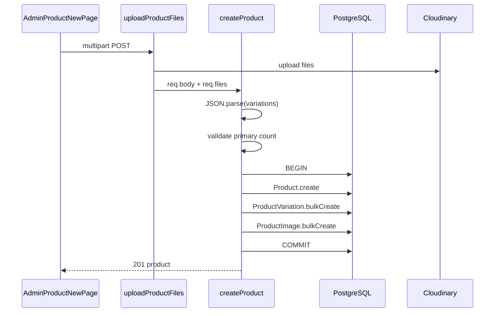

# Functional Requirement (FR) — Admin: Tạo sản phẩm kèm ảnh & biến thể (Admin Create Product With Images)

## 1. Feature Overview

Admin/Manager tạo **sản phẩm mới** trong một request **multipart/form-data**: metadata sản phẩm, **ảnh đại diện**, **gallery ảnh chi tiết**, và **danh sách biến thể (SKU)** — toàn bộ trong **một transaction** Sequelize.

```
POST /api/admin/products
Authorization: Bearer JWT
Role: admin | manager
Content-Type: multipart/form-data
```

**FE:** `/admin/products/new` → `AdminProductNewPage.jsx` → `adminAPI.createProduct(formData)`.

---

## 2. Actors

| Actor | Mô tả |
|-------|-------|
| **Admin / Manager** | Tạo SP |
| **uploadProductFiles** | Multer + Cloudinary |
| **createProduct** | `adminController` |
| **AdminProductNewPage** | Form UI |

---

## 3. Scope

### In Scope

- Fields text + `variations` JSON string.
- Upload `thumbnail` (0–1), `product_images` (0–10).
- `bulkCreate` variations.
- Validation: ≥1 variation, đúng 1 `is_primary`.
- `is_active: true` cố định lúc tạo.

### Out of Scope

- Sửa sau tạo (xem `FR_AdminUpdateProductWithVariations`).
- Endpoint tạo variation lẻ (`FR_AdminCreateVariationEndpoint`).
- Import CSV / clone product.
- Upload video.

---

## 4. API Contract

### Request — multipart fields

| Field | Type | Bắt buộc | Mô tả |
|-------|------|----------|--------|
| `product_name` | string | Có | Tên SP |
| `slug` | string | Khuyến nghị | Unique; FE auto từ tên |
| `description` | string (HTML) | Không | ReactQuill |
| `category_id` | number/string | Có | FK categories |
| `brand_id` | number/string | Có | FK brands |
| `discount_percentage` | number | Không | Default 0 |
| `thumbnail` | file | Khuyến nghị UI | Ảnh đại diện |
| `product_images` | file[] | Không | Tối đa 10 (multer) |
| `variations` | string JSON | Có | Mảng object SKU |

### Ví dụ `variations` JSON

```json
[
  {
    "processor": "Intel Core i5-12450H",
    "ram": "16GB",
    "storage": "512GB SSD",
    "graphics_card": "RTX 4050",
    "screen_size": "15.6 inch",
    "color": "Đen",
    "price": 25000000,
    "stock_quantity": 10,
    "is_primary": true,
    "sku": "LAP-INT-16GB-512GB-DEN"
  }
]
```

### Response — 201

```json
{
  "message": "Product created successfully",
  "product": {
    "product_id": 101,
    "product_name": "...",
    "slug": "...",
    "thumbnail_url": "https://res.cloudinary.com/.../laptop-store/products/...",
    "is_active": true,
    ...
  }
}
```

**Lưu ý:** Response **không** include `variations` / `images` — chỉ object `product` vừa create.

### Errors

| HTTP | Message / nguyên nhân |
|------|------------------------|
| 400 | `Invalid variations data` — JSON parse fail |
| 400 | `At least one variation is required` |
| 400 | `Exactly one variation must be marked as primary` |
| 401/403 | Auth / role |
| 409/500 | Unique `slug` / `sku` (Sequelize) |
| 500 | Cloudinary misconfig (`CLOUDINARY_*`) |

---

## 5. Backend Logic

### Middleware chain

```javascript
exports.createProduct = [
  uploadProductFiles,  // multer.fields: thumbnail x1, product_images x10
  async (req, res, next) => { ... }
];
```

### Transaction steps



| # | Business rule |
|---|----------------|
| BR-01 | `thumbnail_url` = `req.files.thumbnail[0].path` (Cloudinary URL) nếu có file |
| BR-02 | Gallery: `is_primary: false`, `display_order: index` |
| BR-03 | Variations: spread `...v` từ JSON — field thừa có thể vào DB nếu model cho phép |
| BR-04 | Không set `specs` JSONB từ form — default `{}` |
| BR-05 | Rollback transaction on any error |

### Cloudinary — `upload.js`

```javascript
uploadProductFiles = multer({
  storage: productImageStorage,  // folder: laptop-store/products
}).fields([
  { name: 'thumbnail', maxCount: 1 },
  { name: 'product_images', maxCount: 10 },
]);
```

| # | Gap |
|---|-----|
| GAP-01 | `thumbnailStorage` (folder `thumbnails`) **định nghĩa nhưng không dùng** — thumbnail cũng vào `products` |

---

## 6. Frontend — AdminProductNewPage

### Validation client (trước POST)

- `category_id`, `brand_id`, `product_name` bắt buộc.
- Đúng 1 `is_primary`.
- Mỗi variation: `price > 0`, `sku` non-empty (auto `generateSKU`).

### FormData build

```javascript
formDataToSend.append('variations', JSON.stringify(variations))
formDataToSend.append('thumbnail', thumbnailFile)  // optional file
productImageFiles.forEach(f => formDataToSend.append('product_images', f))
```

| # | UX |
|---|-----|
| BR-06 | Slug auto: lowercase, bỏ ký tự đặc biệt, space → `-` |
| BR-07 | SKU auto từ prefix tên + CPU/RAM/storage/color |
| BR-08 | Thêm/xóa variation client-side; tối thiểu 1 row |
| BR-09 | Success → `alert` + `navigate('/admin/products')` |

### Auth

`api` interceptor gắn `Authorization: Bearer` từ `localStorage.token`.

---

## 7. Downstream effects

| Hệ thống | Ảnh hưởng |
|----------|-----------|
| Catalog `GET /products` | SP mới nếu `is_active` true |
| PDP `GET /products/:id` | Sau khi có slug |
| KNN train | Variation mới cần `train_recommend.py` |
| Cart/Order | SKU unique — trùng → lỗi tạo |

---

## 8. Related FRs

| FR | Liên kết |
|----|----------|
| `FR_AdminUpdateProductWithVariations` | Sửa sau tạo |
| `FR_AdminDeleteProduct` | Ẩn SP |
| `FR_AdminCreateVariationEndpoint` | Thêm SKU lẻ (API có, FE không dùng) |

---

## 9. Source Files

| File | Vai trò |
|------|---------|
| `server/controllers/adminController.js` | `createProduct` L7–94 |
| `server/routes/adminRoutes.js` | `POST /products` |
| `server/middleware/upload.js` | Multer Cloudinary |
| `client/app/pages/admin/AdminProductNewPage.jsx` | UI |
| `client/app/services/api.js` | `adminAPI.createProduct` |
| `server/models/Product.js`, `ProductVariation.js`, `ProductImage.js` | Schema |
| `docs/engineering_rules/api-standard.md` §11 | Upload convention |

---

## 10. Acceptance Criteria

- [ ] Admin POST multipart hợp lệ → 201, `product_id` mới.
- [ ] 0 variation → 400.
- [ ] 2+ `is_primary: true` → 400.
- [ ] Thumbnail + 3 gallery → URLs lưu DB.
- [ ] Trùng `slug` → lỗi (không commit).
- [ ] FE list `/admin/products` thấy SP sau navigate.

---

## 11. Known Gaps

| # | Mô tả |
|---|--------|
| GAP-02 | Response thiếu `variations`/`images` — FE phải GET lại nếu cần |
| GAP-03 | Thumbnail không bắt buộc ở BE — có thể tạo SP không ảnh |
| GAP-04 | Không validate `category_id`/`brand_id` tồn tại trước insert |
| GAP-05 | `useCreateProduct` hook có nhưng page gọi `adminAPI` trực tiếp |
| GAP-06 | Không invalidate React Query cache products sau create (chỉ navigate) |
