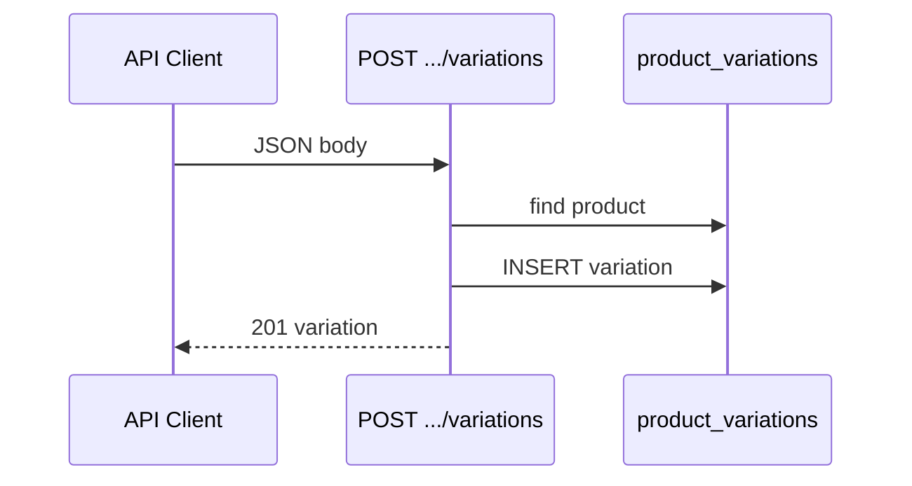

# Functional Requirement (FR) — Admin: Tạo biến thể (Create Variation Endpoint)

## 1. Feature Overview

API **độc lập** thêm **một** `product_variation` (SKU) cho sản phẩm đã tồn tại — body JSON, **không** multipart.

```
POST /api/admin/products/:product_id/variations
Authorization: Bearer JWT
Role: admin | manager
Content-Type: application/json
```

**Luồng chính trong đồ án:** Admin **không** dùng endpoint này từ UI — thay vào đó thêm SKU qua **`PUT /admin/products/:id`** với `variations` JSON (`FR_AdminUpdateProductWithVariations`) hoặc khi **tạo SP** (`FR_AdminCreateProductWithImages`).

Endpoint vẫn **mounted** và sẵn sàng cho API client / tích hợp tương lai.

---

## 2. Actors

| Actor | Mô tả |
|-------|-------|
| **Admin / Manager** | Caller |
| **createVariation** | Controller |
| **adminAPI.createVariation** | Client helper — **không được gọi** từ page hiện tại |

---

## 3. Scope

### In Scope

- Validate product tồn tại.
- `ProductVariation.create({ ...req.body, product_id })`.
- 201 + variation object.

### Out of Scope

- Upload ảnh theo SKU.
- Tự động set `is_primary` (không validate chỉ 1 primary).
- Bulk create (dùng create product / update sync).

---

## 4. API Contract

### Request

```http
POST /api/admin/products/101/variations
Content-Type: application/json

{
  "processor": "Intel Core i7-13700H",
  "ram": "32GB",
  "storage": "1TB SSD",
  "graphics_card": "RTX 4060",
  "screen_size": "16 inch",
  "color": "Bạc",
  "price": 32000000,
  "stock_quantity": 5,
  "is_primary": false,
  "sku": "LAP-INT-32GB-1TB-BAC",
  "is_available": true
}
```

| Field | Model | Ghi chú |
|-------|-------|---------|
| `sku` | unique | Trùng → Sequelize error |
| `price` | required DECIMAL | |
| `is_primary` | boolean | Không check tổng số primary |
| `is_available` | boolean | Default true |

### Response — 201

```json
{
  "message": "Variation created successfully",
  "variation": {
    "variation_id": 205,
    "product_id": 101,
    "sku": "LAP-INT-32GB-1TB-BAC",
    "price": "32000000.00",
    ...
  }
}
```

### Errors

| HTTP | Message |
|------|---------|
| 404 | `Product not found` |
| 400/500 | Validation / unique constraint |
| 401/403 | Auth |

---

## 5. Backend Logic

```javascript
exports.createVariation = async (req, res, next) => {
  const { product_id } = req.params;
  const variationData = req.body;

  const product = await Product.findByPk(product_id);
  if (!product) return res.status(404).json({ message: "Product not found" });

  const variation = await ProductVariation.create({
    ...variationData,
    product_id,
  });

  res.status(201).json({ message: "Variation created successfully", variation });
};
```

| # | Business rule |
|---|----------------|
| BR-01 | **Spread toàn bộ body** — field lạ có thể gây lỗi Sequelize |
| BR-02 | **Không** transaction với product |
| BR-03 | **Không** đảm bảo đúng 1 `is_primary` — có thể tạo SKU thứ 2 primary |
| BR-04 | **Không** kiểm tra `product.is_active` |
| BR-05 | Không trigger retrain KNN tự động |

---

## 6. So sánh với bulk create (update product)

| | POST variation | PUT product sync |
|--|----------------|------------------|
| Payload | JSON 1 SKU | `variations` array trong multipart |
| Primary validation | Không | Có (exactly one) |
| FE | Không dùng | AdminProductEditPage |
| Transaction | Không | Có (cùng product) |

---

## 7. Frontend client (dead path)

`client/app/services/api.js`:

```javascript
createVariation: (productId, data) =>
  api.post(`/admin/products/${productId}/variations`, data),
```

**Không** import trong `AdminProductNewPage` / `AdminProductEditPage`.

---

## 8. Sequence (API-only)



---

## 9. Related FRs

| FR | Liên kết |
|----|----------|
| `FR_AdminUpdateVariationEndpoint` | Sửa 1 SKU |
| `FR_AdminUpdateProductWithVariations` | Luồng FE chính |
| `FR_AdminCreateProductWithImages` | Tạo SKU lúc tạo SP |
| `FR_TrainRecommendationModelOffline` | Index SKU mới |

---

## 10. Source Files

| File | Vai trò |
|------|---------|
| `server/controllers/adminController.js` | `createVariation` L304–326 |
| `server/routes/adminRoutes.js` | `POST /products/:product_id/variations` |
| `client/app/services/api.js` | Helper (unused) |
| `server/models/ProductVariation.js` | Schema |

---

## 11. Acceptance Criteria

- [ ] POST với `product_id` hợp lệ → 201, row mới trong DB.
- [ ] POST product không tồn tại → 404.
- [ ] Trùng `sku` → lỗi DB.
- [ ] Manager/admin token OK; customer → 403.

---

## 12. Known Gaps

| # | Mô tả |
|---|--------|
| GAP-01 | FE không dùng — duplicate logic với bulk sync |
| GAP-02 | Không validate single primary |
| GAP-03 | `deleteVariation` trong api.js **không có route** |
| GAP-04 | `updateVariation` path FE **khác** route BE |
| GAP-05 | Tạo SKU không retrain ML — gợi ý có thể thiếu neighbor đến khi train |
