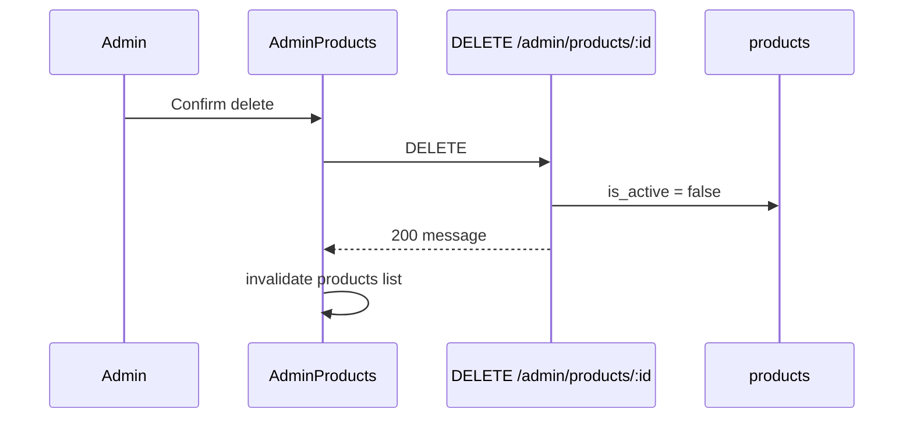

# Functional Requirement (FR) — Admin: Xóa sản phẩm (Admin Delete Product)

## 1. Feature Overview

Admin/Manager **“xóa”** sản phẩm bằng **soft delete**: đặt `products.is_active = false`. Sản phẩm **không** bị xóa cứng khỏi DB; variations và images **giữ nguyên**.

```
DELETE /api/admin/products/:product_id
Authorization: Bearer JWT
Role: admin | manager
```

**FE:** `AdminProducts.jsx` → `useDeleteProduct()` → confirm dialog.

---

## 2. Actors

| Actor | Mô tả |
|-------|-------|
| **Admin / Manager** | Thao tác xóa từ bảng |
| **deleteProduct** | Controller |
| **Customer catalog** | Có thể vẫn thấy SP tùy filter API |

---

## 3. Scope

### In Scope

- `DELETE` by `product_id`.
- Set `is_active: false`.
- JSON message success.

### Out of Scope

- Hard delete cascade variations/images.
- Xóa variation đơn lẻ (`deleteVariation` — **không có route**).
- Khôi phục (reactivate) qua API riêng — chỉ qua **edit** `is_active: true`.
- Xóa file Cloudinary khi soft delete.

---

## 4. API Contract

### Request

```http
DELETE /api/admin/products/101
Authorization: Bearer <token>
```

### Response — 200

```json
{
  "message": "Product deleted successfully"
}
```

### Errors

| HTTP | Message |
|------|---------|
| 404 | `Product not found` |
| 401/403 | Auth / role |

---

## 5. Backend Logic

```javascript
exports.deleteProduct = async (req, res, next) => {
  const product = await Product.findByPk(product_id);
  if (!product) return res.status(404).json({ message: "Product not found" });

  await product.update({ is_active: false });
  res.json({ message: "Product deleted successfully" });
};
```

| # | Business rule |
|---|----------------|
| BR-01 | **Không** transaction — một update đơn |
| BR-02 | **Không** đổi `is_available` trên variations |
| BR-03 | **Không** xóa `cart_items` / `order_items` |
| BR-04 | Slug unique vẫn chiếm — không tái sử dụng slug cho SP mới trừ khi sửa slug cũ |
| BR-05 | Idempotent gần đúng: xóa lần 2 vẫn 200 nếu product còn tồn tại |

---

## 6. Catalog visibility sau soft delete

Hành vi phụ thuộc **`getProducts` / `getProductsV2`** (productController):

| API | Thường gặp |
|-----|------------|
| Customer listing | Có thể filter `is_active` — master spec ghi đã bật hiển thị inactive trong một số bản (_version flag) |
| PDP `getProductDetail` | Có thể vẫn trả SP inactive — admin edit vẫn mở được qua id |

| # | Rule |
|---|------|
| BR-06 | UI list admin vẫn có thể hiển thị SP “Không hoạt động” |
| BR-07 | Text confirm FE: *"Bạn có chắc muốn xóa sản phẩm này?"* — user hiểu là ẩn |

---

## 7. Frontend

### AdminProducts.jsx

```javascript
const handleDelete = async (id) => {
  if (window.confirm("Bạn có chắc muốn xóa sản phẩm này?")) {
    await deleteProduct.mutateAsync(id);
  }
};
```

### useDeleteProduct

```javascript
api.delete(`/admin/products/${id}`)
onSuccess: invalidateQueries(["products"])
```

| # | UX |
|---|-----|
| BR-08 | Không toast chi tiết — lỗi chỉ `console.error` |
| BR-09 | Nút Trash trên mỗi row `product.product_id` |

### Khôi phục

Admin mở **Edit** → bật lại trạng thái hoạt động (`is_active: true`) → `PUT` update product.

---

## 8. Sequence



---

## 9. Data retained

| Bảng | Sau soft delete |
|------|-----------------|
| `products` | Row còn, `is_active=false` |
| `product_variations` | Không đổi |
| `product_images` | Không đổi |
| `order_items` | Lịch sử đơn vẫn reference |
| `questions` | Q&A product vẫn có `product_id` |

---

## 10. Related FRs

| FR | Liên kết |
|----|----------|
| `FR_AdminUpdateProductWithVariations` | `is_active` toggle |
| `FR_AdminCreateProductWithImages` | Tạo SP mới |
| Catalog FRs | Filter inactive trên storefront |

---

## 11. Source Files

| File | Vai trò |
|------|---------|
| `server/controllers/adminController.js` | `deleteProduct` L285–301 |
| `server/routes/adminRoutes.js` | `DELETE /products/:product_id` |
| `client/app/pages/admin/AdminProducts.jsx` | UI delete |
| `client/app/hooks/useProducts.js` | `useDeleteProduct` |
| `server/models/Product.js` | `is_active` column |

---

## 12. Acceptance Criteria

- [ ] DELETE id hợp lệ → 200, DB `is_active=false`.
- [ ] DELETE id không tồn tại → 404.
- [ ] Customer không admin → 403.
- [ ] List admin refresh sau delete (invalidate).
- [ ] Edit page có thể bật lại `is_active`.

---

## 13. Known Gaps

| # | Mô tả |
|---|--------|
| GAP-01 | Tên “delete” gây hiểu nhầm hard delete |
| GAP-02 | Không ẩn SP khỏi admin list sau delete |
| GAP-03 | Storefront có thể vẫn list inactive (tùy filter) |
| GAP-04 | Không xóa ảnh Cloudinary — storage cost |
| GAP-05 | Variations vẫn `is_available=true` — KNN train vẫn index |
| GAP-06 | `adminAPI.deleteProduct` vs hook `api.delete` — trùng chức năng OK |
