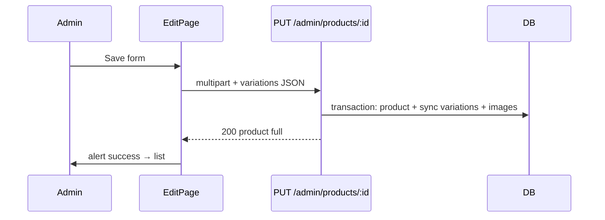

# Functional Requirement (FR) — Admin: Cập nhật sản phẩm & đồng bộ biến thể (Admin Update Product With Variations)

## 1. Feature Overview

Admin/Manager **cập nhật** sản phẩm qua `PUT` multipart: metadata, `is_active`, ảnh (thumbnail mới, gallery thêm/xóa), và **đồng bộ toàn bộ danh sách variations** (create / update / delete theo diff) trong **một transaction**.

```
PUT /api/admin/products/:product_id
Authorization: Bearer JWT
Role: admin | manager
Content-Type: multipart/form-data
```

**FE:** `/admin/products/edit/:id` → `AdminProductEditPage.jsx` → `adminAPI.updateProduct(id, formData)`.

**Load dữ liệu:** `useAdminProduct(id)` → `GET /api/products/:id` (public detail API, không phải admin-only).

---

## 2. Actors

| Actor | Mô tả |
|-------|-------|
| **Admin / Manager** | Sửa SP |
| **updateProduct** | Sync variations + images |
| **AdminProductEditPage** | Form |
| **getProductDetail** | Nguồn data ban đầu cho form |

---

## 3. Scope

### In Scope

- Update `products` row.
- Variation sync: update by `variation_id`, create without id, delete missing ids.
- `deleted_image_ids` → destroy `product_images`.
- New `product_images` upload.
- Optional new `thumbnail`.
- `is_active` toggle.

### Out of Scope

- Endpoint `PUT /variations/:id` riêng lẻ (xem `FR_AdminUpdateVariationEndpoint`) — FE **không** gọi khi save form.
- Hard delete product.
- Version history / audit log.

---

## 4. API Contract

### Request — multipart

| Field | Mô tả |
|-------|--------|
| `product_name`, `slug`, `description` | Metadata |
| `category_id`, `brand_id` | FK |
| `discount_percentage` | Number |
| `is_active` | boolean/string — FE gửi từ toggle |
| `variations` | JSON string — full list hiện tại |
| `thumbnail` | File mới (optional) |
| `product_images` | Files mới (optional, nhiều) |
| `deleted_image_ids` | Repeat field hoặc array — ID ảnh xóa |

### `variations` item shape

```json
{
  "variation_id": 5,
  "processor": "...",
  "ram": "...",
  "storage": "...",
  "graphics_card": "...",
  "screen_size": "...",
  "color": "...",
  "price": 22000000,
  "stock_quantity": 8,
  "is_primary": true,
  "sku": "LAP-..."
}
```

- **Có** `variation_id` → update row đó.
- **Không** `variation_id` → insert mới.
- ID có trong DB nhưng **không** có trong payload → **destroy** (xóa cứng).

### Response — 200

```json
{
  "message": "Product updated successfully",
  "product": {
    "product_id": 10,
    "product_name": "...",
    "variations": [ ... ],
    "images": [ ... ],
    ...
  }
}
```

Include đầy đủ `variations` + `images` sau commit.

### Errors

| HTTP | Message |
|------|---------|
| 404 | `Product not found` |
| 400 | `Invalid variations data` |
| 400 | `Exactly one variation must be marked as primary` (khi `variations.length > 0`) |
| 401/403 | Auth |

---

## 5. Backend — Variation sync algorithm

```javascript
const existingVariationIds = existingVariations.map(v => v.variation_id);
const incomingVariationIds = variations.filter(v => v.variation_id).map(v => v.variation_id);

const variationsToUpdate = variations.filter(v => v.variation_id);
const variationsToCreate = variations.filter(v => !v.variation_id);
const variationsToDelete = existingVariationIds.filter(id => !incomingVariationIds.includes(id));
```

### Update fields (whitelist implicit)

`processor`, `ram`, `storage`, `graphics_card`, `screen_size`, `color`, `price`, `stock_quantity`, `is_primary`, `sku`.

| # | Rule |
|---|------|
| BR-01 | **Không** update `is_available` từ form — giữ giá trị DB cũ |
| BR-02 | `variations.length === 0` → **bỏ qua** cả khối sync (không xóa hết variation) |
| BR-03 | Primary validation chỉ khi `variations.length > 0` |
| BR-04 | Delete variation: `destroy` where `variation_id IN (...)` — có thể fail nếu FK order_items |

### Images

```javascript
// Xóa
ProductImage.destroy({ where: { image_id: idsToDelete, product_id } });

// Thêm
ProductImage.bulkCreate(newImages from req.files.product_images);
```

| # | Rule |
|---|------|
| BR-05 | Ảnh mới luôn `is_primary: false` — không đổi primary gallery qua API |
| BR-06 | Thumbnail chỉ đổi khi upload file mới |

### `is_active`

```javascript
is_active: req.body.is_active !== undefined ? req.body.is_active : product.is_active
```

FE: `data.append('is_active', isActive)` — checkbox trạng thái SP.

---

## 6. Frontend — AdminProductEditPage

### Load

```javascript
useAdminProduct(id) → GET /api/products/${id}
// Map variations với variation_id
// existingImages từ product.images
// thumbnailPreview từ product.thumbnail_url
```

### Submit FormData

```javascript
data.append('variations', JSON.stringify(variations))
deletedImageIds.forEach(id => data.append('deleted_image_ids', id))
if (thumbnailFile) data.append('thumbnail', thumbnailFile)
selectedFiles.forEach(f => data.append('product_images', f))
```

### Client validation

Giống create: category/brand/name, ≥1 variation, 1 primary, price > 0, SKU required.

### After success

```javascript
queryClient.invalidateQueries({ queryKey: ["products"] })
queryClient.invalidateQueries({ queryKey: ["admin-product", id] })
navigate("/admin/products")
```

| # | UX |
|---|-----|
| BR-07 | Xóa variation trên UI = bỏ khỏi mảng gửi lên → BE destroy |
| BR-08 | Xóa ảnh cũ = `deleted_image_ids` + ẩn khỏi `existingImages` |
| BR-09 | Variation mới không có `variation_id` |

---

## 7. Sequence



---

## 8. Related FRs

| FR | Liên kết |
|----|----------|
| `FR_AdminCreateProductWithImages` | Tạo mới |
| `FR_AdminUpdateVariationEndpoint` | API lẻ (path khác FE client) |
| `FR_AdminDeleteProduct` | Soft delete |
| `FR_SelectProductVariation` | PDP dùng variations |

---

## 9. Source Files

| File | Vai trò |
|------|---------|
| `server/controllers/adminController.js` | `updateProduct` L98–283 |
| `server/routes/adminRoutes.js` | `PUT /products/:product_id` |
| `client/app/pages/admin/AdminProductEditPage.jsx` | UI |
| `client/app/hooks/useProducts.js` | `useAdminProduct`, `useUpdateProduct` |
| `server/controllers/productController.js` | `getProductDetail` — nguồn load |

---

## 10. Acceptance Criteria

- [ ] PUT hợp lệ → 200 kèm variations/images mới nhất.
- [ ] Thêm variation không id → row mới trong DB.
- [ ] Bỏ variation khỏi JSON → row bị xóa (nếu không FK block).
- [ ] `deleted_image_ids` → ảnh biến mất khỏi PDP.
- [ ] Upload thumbnail mới → `thumbnail_url` đổi.
- [ ] `is_active: false` → list hiển thị "Không hoạt động".
- [ ] 2 primary → 400.

---

## 11. Known Gaps

| # | Mô tả |
|---|--------|
| GAP-01 | Load edit qua **public** `GET /products/:id` — không có admin-only fields |
| GAP-02 | Gửi `variations: []` không xóa variations cũ (guard `length > 0`) |
| GAP-03 | Không sync `is_available` per variation |
| GAP-04 | Xóa variation có order history có thể 500 FK |
| GAP-05 | Không reorder `display_order` ảnh cũ khi thêm mới |
| GAP-06 | `adminAPI.updateVariation` path **sai** so với route thật (không dùng từ form) |
