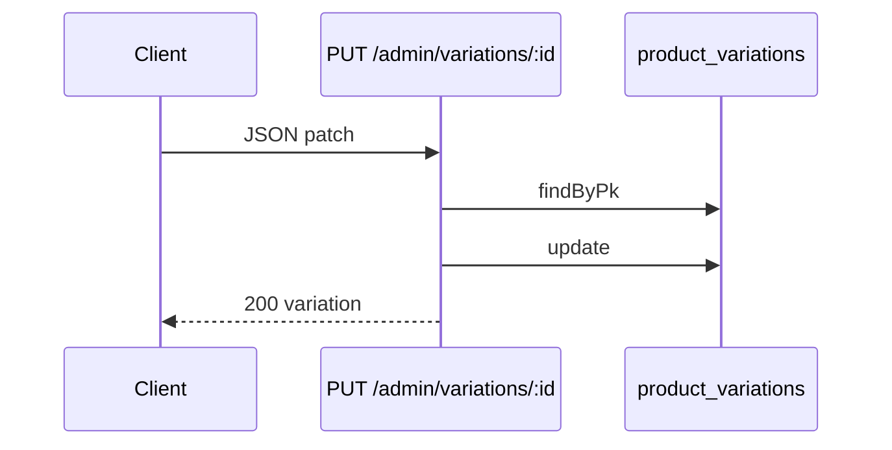

# Functional Requirement (FR) — Admin: Cập nhật biến thể (Admin Update Variation Endpoint)

## 1. Feature Overview

API **cập nhật một** biến thể theo `variation_id` — body JSON partial/full, không multipart.

```
PUT /api/admin/variations/:variation_id
Authorization: Bearer JWT
Role: admin | manager
Content-Type: application/json
```

**Route thực tế** (mounted): không có `product_id` trong path.

**FE client khai báo (sai path):**

```javascript
// api.js — KHÔNG khớp server
api.put(`/admin/products/${productId}/variations/${variationId}`, data)
```

**Luồng UI chính:** Cập nhật SKU qua **`PUT /admin/products/:product_id`** sync toàn bộ mảng `variations` (`FR_AdminUpdateProductWithVariations`).

---

## 2. Actors

| Actor | Mô tả |
|-------|-------|
| **Admin / Manager** | Caller |
| **updateVariation** | Controller |
| **AdminProductEditPage** | Sửa SKU trong form → **bulk PUT product**, không gọi endpoint này |

---

## 3. Scope

### In Scope

- `findByPk(variation_id)`.
- `variation.update(updateData)` với toàn bộ `req.body`.
- 200 + variation instance.

### Out of Scope

- Đổi `product_id` (không hỗ trợ move SKU sang SP khác).
- Validate primary uniqueness.
- File upload.

---

## 4. API Contract (mounted route)

### Request

```http
PUT /api/admin/variations/205
Content-Type: application/json

{
  "price": 29990000,
  "stock_quantity": 3,
  "is_primary": true,
  "processor": "Intel Core i7-13700H",
  "ram": "32GB",
  "storage": "1TB SSD",
  "graphics_card": "RTX 4060",
  "screen_size": "16 inch",
  "color": "Bạc",
  "sku": "LAP-INT-32GB-1TB-BAC",
  "is_available": false
}
```

### Response — 200

```json
{
  "message": "Variation updated successfully",
  "variation": {
    "variation_id": 205,
    "product_id": 101,
    "price": "29990000.00",
    "stock_quantity": 3,
    ...
  }
}
```

### Errors

| HTTP | Message |
|------|---------|
| 404 | `Variation not found` |
| 401/403 | Auth |
| 409 | Unique `sku` conflict |

---

## 5. Backend Logic

```javascript
exports.updateVariation = async (req, res, next) => {
  const { variation_id } = req.params;
  const updateData = req.body;

  const variation = await ProductVariation.findByPk(variation_id);
  if (!variation) return res.status(404).json({ message: "Variation not found" });

  await variation.update(updateData);

  res.json({ message: "Variation updated successfully", variation });
};
```

| # | Business rule |
|---|----------------|
| BR-01 | **Mass assignment** — mọi field body được phép bởi Sequelize |
| BR-02 | **Không** kiểm tra caller sở hữu `product_id` |
| BR-03 | **Không** đảm bảo chỉ 1 `is_primary` per product |
| BR-04 | Có thể set `product_id` qua body → **rủi ro** di chuyển SKU (nếu không chặn) |
| BR-05 | Không transaction với product row |

---

## 6. Bulk update path (what FE actually uses)

`updateProduct` whitelist khi sync:

```javascript
ProductVariation.update({
  processor, ram, storage, graphics_card, screen_size,
  color, price, stock_quantity, is_primary, sku,
}, { where: { variation_id } });
```

| So sánh | PUT `/variations/:id` | PUT `/products/:id` sync |
|---------|----------------------|---------------------------|
| Fields | Any in body | Whitelist cố định |
| Primary check | Không | Có (1 primary) |
| Xóa SKU | Không | Có (diff ids) |
| FE | Không dùng | AdminProductEditPage |

---

## 7. Route vs client mismatch

| | URL |
|--|-----|
| **Server** | `PUT /api/admin/variations/:variation_id` |
| **api.js** | `PUT /api/admin/products/:productId/variations/:variationId` |

Gọi qua `adminAPI.updateVariation` → **404** (route không tồn tại).

**Sửa đề xuất (một trong hai):**

```javascript
// Option A — sửa client
updateVariation: (variationId, data) =>
  api.put(`/admin/variations/${variationId}`, data),

// Option B — thêm route server (nested)
router.put('/products/:product_id/variations/:variation_id', ...)
```

---

## 8. DELETE variation (related gap)

`api.js`:

```javascript
deleteVariation: (productId, variationId) =>
  api.delete(`/admin/products/${productId}/variations/${variationId}`),
```

**Không có** handler/route trong `adminRoutes.js`. Xóa SKU trên UI chỉ qua **bulk sync** (bỏ khỏi mảng `variations`).

---

## 9. Sequence — standalone API



---

## 10. Downstream

| Hệ thống | Khi đổi price/spec |
|----------|-------------------|
| PDP | Giá/stock mới ngay |
| Cart | `price_at_add` cũ — không đổi |
| KNN | Cần retrain hoặc fresh pool 60 ngày |
| Orders | `order_items` snapshot giá cũ |

---

## 11. Related FRs

| FR | Liên kết |
|----|----------|
| `FR_AdminCreateVariationEndpoint` | Tạo SKU lẻ |
| `FR_AdminUpdateProductWithVariations` | Luồng FE |
| `FR_AdminDeleteProduct` | Soft delete SP — không xóa SKU |

---

## 12. Source Files

| File | Vai trò |
|------|---------|
| `server/controllers/adminController.js` | `updateVariation` L328–347 |
| `server/routes/adminRoutes.js` | `PUT /variations/:variation_id` |
| `client/app/services/api.js` | **Wrong path** helper |
| `client/app/pages/admin/AdminProductEditPage.jsx` | Bulk update thực tế |

---

## 13. Acceptance Criteria

**Endpoint mounted (`PUT /admin/variations/:id`):**

- [ ] PUT hợp lệ → 200, DB cập nhật.
- [ ] ID không tồn tại → 404.
- [ ] Đổi `price` / `stock_quantity` phản ánh PDP.

**Client api.js (hiện trạng):**

- [ ] `adminAPI.updateVariation` → **404** (documented).

**FE edit page:**

- [ ] Save form → `PUT /admin/products/:id` → variations sync OK.

---

## 14. Known Gaps

| # | Mô tả | Đề xuất |
|---|--------|---------|
| GAP-01 | **Path mismatch** FE vs BE | Align api.js hoặc thêm nested route |
| GAP-02 | **deleteVariation** không implement | Route + controller hoặc xóa helper |
| GAP-03 | Không validate single `is_primary` | Middleware hoặc DB constraint |
| GAP-04 | Mass assignment `product_id` | Whitelist fields |
| GAP-05 | Endpoint trùng chức năng bulk sync | Giữ một pattern trong docs |
| GAP-06 | `is_available` không sửa từ edit form bulk | Thêm field UI + sync |
