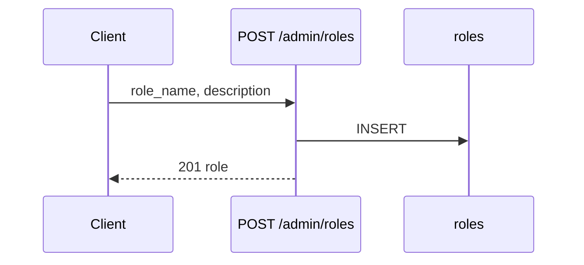

# Functional Requirement (FR) — Admin: Tạo vai trò (Admin Create Role)

## 1. Feature Overview

Admin/Manager tạo **role mới** trong bảng `roles` — định danh `role_name` (unique) và mô tả tùy chọn.

```
POST /api/admin/roles
Authorization: Bearer JWT
Body: { "role_name": "...", "description": "..." }
```

**FE:** Không có UI — chỉ API.

---

## 2. Actors

| Actor | Mô tả |
|-------|-------|
| **Admin / Manager** | Caller |
| **createRole** | Controller |

---

## 3. Scope

### In Scope

- Insert `role_name`, `description`.
- 201 + role object.

### Out of Scope

- Gán permissions (`role_permissions`).
- Tự động gán user.
- Validate pattern `role_name` (slug rules).

---

## 4. API Contract

### Request

```http
POST /api/admin/roles
Content-Type: application/json

{
  "role_name": "warehouse_staff",
  "description": "Nhân viên kho — quyền tùy chỉnh sau"
}
```

### Response — 201

```json
{
  "message": "Role created successfully",
  "role": {
    "role_id": 6,
    "role_name": "warehouse_staff",
    "description": "Nhân viên kho — quyền tùy chỉnh sau",
    "updated_at": "...",
    "created_at": "..."
  }
}
```

### Errors

| HTTP | Nguyên nhân |
|------|-------------|
| 409/500 | `role_name` trùng (UNIQUE) |
| 400 | Thiếu `role_name` (DB constraint) |
| 401/403 | Auth |

---

## 5. Backend Logic

```javascript
const { role_name, description } = req.body;
const role = await Role.create({ role_name, description });
res.status(201).json({ message: "Role created successfully", role });
```

| # | Business rule |
|---|----------------|
| BR-01 | `role_name` **unique** trên DB |
| BR-02 | Không chặn trùng tên role hệ thống (`admin`, `customer`) — có thể gây nhầm |
| BR-03 | Role mới **chưa** có user cho đến `updateUserRoles` |
| BR-04 | **Không** tự động cấp quyền FE/BE — cần code check `authorizeRoles` nếu muốn dùng |

### Tác động hệ thống

| Thành phần | Sau create role |
|------------|-----------------|
| `authorizeRoles("admin","manager")` | Role mới **không** vào admin API trừ khi sửa middleware |
| `AdminRoute` FE | Chỉ check string `"admin"` |
| PDP `staff` check | Chỉ `admin` \| `staff` hardcoded |

---

## 6. Sequence



---

## 7. Related FRs

| FR | Liên kết |
|----|----------|
| `FR_AdminListRoles` | Xem sau tạo |
| `FR_AdminUpdateUserRoles` | Gán user |
| `FR_AdminUpdateRole` | Sửa mô tả |

---

## 8. Source Files

| File | Vai trò |
|------|---------|
| `server/controllers/adminController.js` | `createRole` L865–878 |
| `server/routes/adminRoutes.js` | `POST /roles` |
| `server/models/Role.js` | Schema |

---

## 9. Acceptance Criteria

- [ ] POST hợp lệ → 201, `role_id` mới.
- [ ] Trùng `role_name` → lỗi.
- [ ] GET `/admin/roles` thấy role mới.

---

## 10. Known Gaps

| # | Mô tả |
|---|--------|
| GAP-01 | Không FE |
| GAP-02 | Permission model không liên kết |
| GAP-03 | Có thể tạo role trùng semantics (`Admin` vs `admin`) nếu không unique case |
