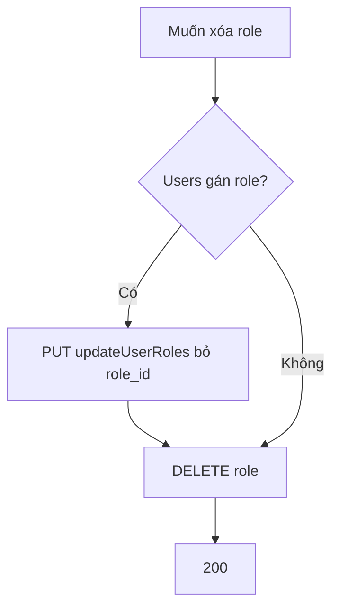

# Functional Requirement (FR) — Admin: Xóa vai trò (Admin Delete Role)

## 1. Feature Overview

Admin/Manager **xóa cứng** một role khỏi bảng `roles` nếu **không còn user** nào được gán.

```
DELETE /api/admin/roles/:role_id
Authorization: Bearer JWT
```

**FE:** Không có UI.

---

## 2. Actors

| Actor | Mô tả |
|-------|-------|
| **Admin / Manager** | Caller |
| **deleteRole** | Controller |

---

## 3. Scope

### In Scope

- Count users trên role.
- `destroy()` nếu count = 0.

### Out of Scope

- Xóa cascade `user_roles` tự động.
- Soft delete role.
- Xóa role `admin` / `customer` bảo vệ đặc biệt (không có trong code).

---

## 4. API Contract

### Request

```http
DELETE /api/admin/roles/6
Authorization: Bearer <token>
```

### Response — 200

```json
{
  "message": "Role deleted successfully"
}
```

### Errors

| HTTP | Message |
|------|---------|
| 404 | `Role not found` |
| 400 | `Cannot delete role with assigned users` |
| 401/403 | Auth |

---

## 5. Backend Logic

```javascript
const role = await Role.findByPk(role_id);
const userCount = await role.countUsers();
if (userCount > 0) {
  return res.status(400).json({ message: "Cannot delete role with assigned users" });
}
await role.destroy();
```

| # | Business rule |
|---|----------------|
| BR-01 | Phải **gỡ hết user** khỏi role (`setRoles` / xóa `user_roles`) trước |
| BR-02 | Xóa role `customer` khi còn user → 400 |
| BR-03 | `user_roles` rows liên quan Sequelize có thể CASCADE tùy DB FK — verify migration |

---

## 6. Workflow gợi ý



---

## 7. Related FRs

| FR | Liên kết |
|----|----------|
| `FR_AdminUpdateUserRoles` | Gỡ user trước khi xóa |
| `FR_AdminListRoles` | Kiểm tra `Users.length` |

---

## 8. Source Files

| File | Vai trò |
|------|---------|
| `server/controllers/adminController.js` | `deleteRole` L900–921 |
| `server/routes/adminRoutes.js` | `DELETE /roles/:role_id` |

---

## 9. Acceptance Criteria

- [ ] DELETE role không user → 200, row biến mất.
- [ ] DELETE role còn user → 400.
- [ ] 404 id không tồn tại.

---

## 10. Known Gaps

| # | Mô tả |
|---|--------|
| GAP-01 | Không FE |
| GAP-02 | Không chặn xóa role `admin` |
| GAP-03 | User mất role có thể còn JWT roles cũ trong localStorage |
