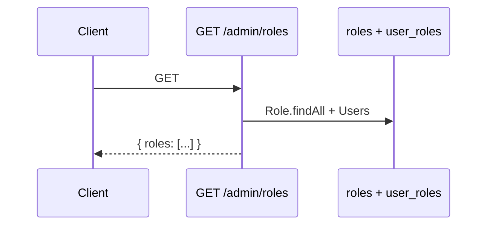

# Functional Requirement (FR) — Admin: Danh sách vai trò (Admin List Roles)

## 1. Feature Overview

Admin/Manager lấy **toàn bộ roles** trong hệ thống, kèm danh sách **users** gán mỗi role (include Sequelize).

```
GET /api/admin/roles
Authorization: Bearer JWT
Role: admin | manager
```

**FE:** **Không có** trang `/admin/roles` trong menu — API sẵn sàng cho Postman / tích hợp tương lai.

---

## 2. Actors

| Actor | Mô tả |
|-------|-------|
| **Admin / Manager** | API consumer |
| **getAllRoles** | Controller |

---

## 3. Scope

### In Scope

- `Role.findAll` + include `User` (M:N).
- Trả mảng `roles` (không pagination).

### Out of Scope

- Permission matrix (`role_permissions` — model có, **không** expose admin API).
- Pagination roles.
- FE CRUD UI.

---

## 4. API Contract

### Request

```http
GET /api/admin/roles
Authorization: Bearer <token>
```

### Response — 200

```json
{
  "roles": [
    {
      "role_id": 1,
      "role_name": "admin",
      "description": "Quản trị viên hệ thống",
      "created_at": "...",
      "updated_at": "...",
      "Users": [
        { "user_id": 1, "username": "super_admin", "email": "admin@laptopstore.com" }
      ]
    },
    {
      "role_id": 2,
      "role_name": "customer",
      "description": null,
      "Users": [ ... ]
    }
  ]
}
```

**Lưu ý:** Include `Users` có thể **không** exclude `password_hash` trên nested user — kiểm tra khi dùng production.

### Errors

| HTTP | Nguyên nhân |
|------|-------------|
| 401/403 | Auth |

---

## 5. Backend Logic

```javascript
const roles = await Role.findAll({
  include: [{
    model: User,
    through: { attributes: [] },
  }],
});
res.json({ roles });
```

| # | Business rule |
|---|----------------|
| BR-01 | Không sort order cố định — thứ tự DB |
| BR-02 | Role hệ thống thường gặp: `admin`, `customer`, `manager`, `staff` (tùy seed) |
| BR-03 | `staff` dùng PDP trả lời Q&A; `manager` vào API admin |

### Roles trong đồ án (tham chiếu)

| role_name | Mô tả sử dụng |
|-----------|----------------|
| `admin` | Full admin API + FE panel (gate) |
| `manager` | Admin API (`authorizeRoles`) — FE chưa |
| `staff` | Trả lời Q&A trên PDP |
| `customer` | Đăng ký mặc định |

---

## 6. Frontend / Integration

Không có hook `useAdminRoles` trong repo.

**Gợi ý tích hợp:**

```javascript
const { data } = await api.get('/admin/roles');
// data.roles → dropdown gán role trong FR_AdminUpdateUserRoles
```

`adminAPI` **không** wrap endpoint roles.

---

## 7. Sequence



---

## 8. Related FRs

| FR | Liên kết |
|----|----------|
| `FR_AdminCreateRole` | Thêm role |
| `FR_AdminUpdateRole` | Sửa |
| `FR_AdminDeleteRole` | Xóa |
| `FR_AdminUpdateUserRoles` | Gán user ↔ role |

---

## 9. Source Files

| File | Vai trò |
|------|---------|
| `server/controllers/adminController.js` | `getAllRoles` L848–863 |
| `server/routes/adminRoutes.js` | `GET /roles` |
| `server/models/Role.js` | Schema |
| `server/seedAdmin.js` | Seed `admin` role |

---

## 10. Acceptance Criteria

- [ ] GET trả danh sách roles.
- [ ] Mỗi role có thể có mảng `Users`.
- [ ] Admin/manager token OK.

---

## 11. Known Gaps

| # | Mô tả |
|---|--------|
| GAP-01 | **Không có UI** admin roles |
| GAP-02 | Payload nặng nếu nhiều user/role |
| GAP-03 | Nested users có thể lộ password |
| GAP-04 | Không có API list permissions |
