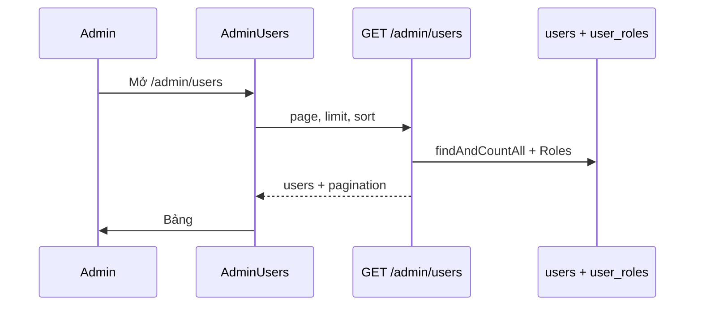

# Functional Requirement (FR) — Admin: Danh sách người dùng (Admin List Users)

## 1. Feature Overview

Admin/Manager lấy **danh sách tài khoản** trong hệ thống kèm **vai trò (roles)**, có phân trang và sắp xếp server-side. Không trả `password_hash`.

```
GET /api/admin/users?page=1&limit=20&sort=created_at&order=DESC
Authorization: Bearer JWT
Role: admin | manager (BE) — FE panel chỉ `admin` (xem GAP)
```

**FE:** `/admin/users` → `AdminUsers.jsx` + `useAdminUsers()`.

---

## 2. Actors

| Actor | Mô tả |
|-------|-------|
| **Admin** | Vào panel (FE gate) |
| **Manager** | Gọi được API admin |
| **getAllUsers** | `adminController` |

---

## 3. Scope

### In Scope

- Pagination `page`, `limit`.
- Sort whitelist: `user_id`, `username`, `created_at`, `last_login`, `email`.
- Include `Roles` qua bảng `user_roles` (M:N).
- Exclude `password_hash` trong response.

### Out of Scope

- Tìm kiếm theo email/username (query param).
- Filter `is_active` trên API.
- Gán/sửa role trên list (API riêng `FR_AdminUpdateUserRoles`).
- Xóa user (`adminAPI.deleteUser` — **không có route**).

---

## 4. API Contract

### Request

```http
GET /api/admin/users?page=1&limit=10&sort=user_id&order=asc
```

| Param | Default (BE) | Mô tả |
|-------|--------------|--------|
| `page` | 1 | Trang |
| `limit` | 20 | Page size |
| `sort` | `created_at` | Field whitelist |
| `order` | `DESC` | `ASC` \| `DESC` |

### Response — 200

```json
{
  "users": [
    {
      "user_id": 5,
      "username": "user1",
      "email": "a@example.com",
      "full_name": "Nguyễn A",
      "phone_number": "0901234567",
      "is_active": true,
      "last_login": "2026-05-20T...",
      "created_at": "...",
      "Roles": [
        { "role_id": 2, "role_name": "customer", "description": "..." }
      ]
    }
  ],
  "pagination": {
    "total": 150,
    "page": 1,
    "limit": 10,
    "totalPages": 15
  }
}
```

### Errors

| HTTP | Nguyên nhân |
|------|-------------|
| 401/403 | Token / role |

---

## 5. Backend Logic

```javascript
User.findAndCountAll({
  include: [{ model: Role, through: { attributes: [] } }],
  attributes: { exclude: ["password_hash"] },
  limit, offset,
  order: [[sortField, sortOrder]],
});
```

| # | Business rule |
|---|----------------|
| BR-01 | Trả **tất cả** user — kể cả inactive |
| BR-02 | Sequelize alias association: `Roles` (capital R) |
| BR-03 | Invalid `sort` → fallback `created_at` |

---

## 6. Frontend — AdminUsers.jsx

### Hook defaults

```javascript
// useAdminUsers.js
const defaultParams = { sort: 'user_id', order: 'asc', ...params };

// AdminUsers.jsx
const limit = 10;  // BE default 20 nếu không gửi limit
useAdminUsers({ page, limit });
```

| # | UX |
|---|-----|
| BR-04 | Cột: ID, tên/email, vai trò (format tiếng Việt), trạng thái, nút Khóa/Kích hoạt |
| BR-05 | `formatRoleName`: admin→Quản trị viên, manager→Quản lý |
| BR-06 | **Không** UI sửa roles — chỉ hiển thị |
| BR-07 | Pagination giống các trang admin khác |

### Auth panel

`AdminRoute` chỉ cho `user.roles.includes("admin")` — **manager không vào** `/admin/users` dù API cho phép.

---

## 7. Sequence



---

## 8. Related FRs

| FR | Liên kết |
|----|----------|
| `FR_AdminUpdateUserActiveStatus` | Khóa/mở khóa |
| `FR_AdminUpdateUserRoles` | Gán role |
| `FR_AdminListRoles` | Danh mục role |

---

## 9. Source Files

| File | Vai trò |
|------|---------|
| `server/controllers/adminController.js` | `getAllUsers` L619–664 |
| `server/routes/adminRoutes.js` | `GET /users` |
| `client/app/pages/admin/AdminUsers.jsx` | UI |
| `client/app/hooks/useAdminUsers.js` | Hook |
| `server/models/index.js` | User ↔ Role M:N |
| `docs/master_specification.md` §4.2, §9.5 | Roles matrix |

---

## 10. Acceptance Criteria

- [ ] Admin GET → 200, không có `password_hash` trong JSON.
- [ ] Pagination đúng `totalPages`.
- [ ] Mỗi user có mảng `Roles`.
- [ ] Customer token → 403 trên `/api/admin/*`.
- [ ] FE hiển thị list + phân trang.

---

## 11. Known Gaps

| # | Mô tả |
|---|--------|
| GAP-01 | **Manager** không vào FE admin panel |
| GAP-02 | Không search/filter `is_active` server |
| GAP-03 | `adminAPI.deleteUser` / `updateUserRole` path sai — không dùng |
| GAP-04 | FE `limit=10`, docs BE default 20 — cần thống nhất |
| GAP-05 | Không màn hình quản lý roles trong menu |
