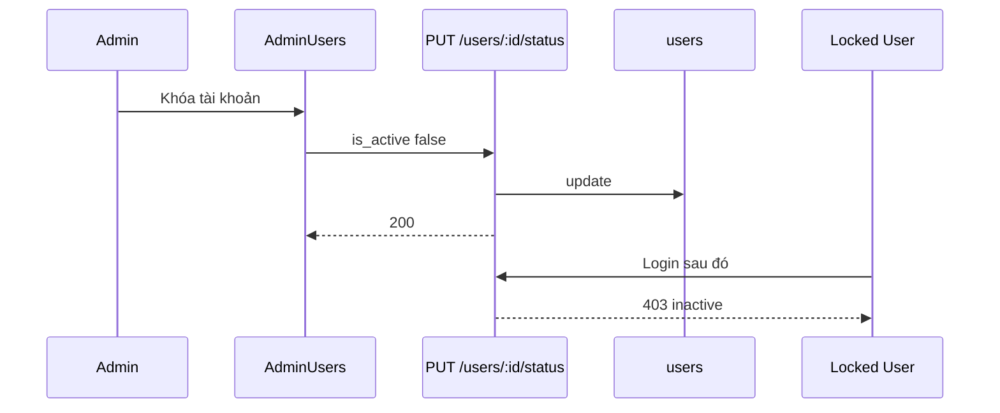

# Functional Requirement (FR) — Admin: Cập nhật trạng thái hoạt động user (Admin Update User Active Status)

## 1. Feature Overview

Admin/Manager **kích hoạt** hoặc **khóa** tài khoản bằng cách đặt `users.is_active`. User bị khóa **không** đăng nhập được (`authenticateToken` trả 403).

```
PUT /api/admin/users/:user_id/status
Authorization: Bearer JWT
Body: { "is_active": true | false }
```

**FE:** Nút **Khóa** / **Kích hoạt** trên `AdminUsers.jsx` → `useUpdateUserStatus()`.

---

## 2. Actors

| Actor | Mô tả |
|-------|-------|
| **Admin** | Thao tác UI |
| **updateUserStatus** | Controller |
| **Customer** | Bị chặn login khi `is_active: false` |

---

## 3. Scope

### In Scope

- Toggle `is_active` boolean.
- Response message + user object.

### Out of Scope

- Soft delete user row.
- Revoke JWT đang lưu client (token cũ hết hạn tự nhiên).
- Khóa theo IP / rate limit.
- Audit log.

---

## 4. API Contract

### Request

```http
PUT /api/admin/users/5/status
Content-Type: application/json

{
  "is_active": false
}
```

### Response — 200

```json
{
  "message": "User status updated successfully",
  "user": {
    "user_id": 5,
    "username": "user1",
    "email": "a@example.com",
    "is_active": false,
    "password_hash": "$2a$..."
  }
}
```

**Cảnh báo bảo mật:** Response `user` từ `findByPk` **có thể** chứa `password_hash` — GAP.

### Errors

| HTTP | Message |
|------|---------|
| 404 | `User not found` |
| 401/403 | Auth |

---

## 5. Backend Logic

```javascript
const user = await User.findByPk(user_id);
await user.update({ is_active });
res.json({ message: "User status updated successfully", user });
```

| # | Business rule |
|---|----------------|
| BR-01 | **Không** chặn admin tự khóa chính mình |
| BR-02 | **Không** chặn khóa user `admin` cuối cùng |
| BR-03 | `is_active` false → middleware: `User not found or inactive` (403) |

### Login impact (`auth.js`)

```javascript
if (!user || !user.is_active) {
  return res.status(403).json({ message: "User not found or inactive" });
}
```

---

## 6. Frontend

```javascript
const handleStatusChange = async (userId, isActive) => {
  if (window.confirm(`Bạn có chắc muốn ${isActive ? 'kích hoạt' : 'khóa'} tài khoản này?`)) {
    await updateUserStatus.mutateAsync({ userId, is_active: isActive });
  }
};
```

```javascript
// useUpdateUserStatus
PUT `/admin/users/${userId}/status` body { is_active }
onSuccess: invalidateQueries(["admin-users"])
```

| # | UX |
|---|-----|
| BR-04 | Badge xanh “Hoạt động” / đỏ “Bị khóa” |
| BR-05 | Lỗi → `alert` quyền hạn |
| BR-06 | `disabled` khi mutation pending |

---

## 7. Sequence



---

## 8. Related FRs

| FR | Liên kết |
|----|----------|
| `FR_AdminListUsers` | List + badge |
| `FR_AdminUpdateUserRoles` | Độc lập với active |

---

## 9. Source Files

| File | Vai trò |
|------|---------|
| `server/controllers/adminController.js` | `updateUserStatus` L666–685 |
| `server/routes/adminRoutes.js` | `PUT /users/:user_id/status` |
| `server/middleware/auth.js` | Check `is_active` |
| `client/app/hooks/useAdminUsers.js` | `useUpdateUserStatus` |
| `client/app/pages/admin/AdminUsers.jsx` | Buttons |

---

## 10. Acceptance Criteria

- [ ] PUT `is_active: false` → user không login được.
- [ ] PUT `is_active: true` → login lại OK.
- [ ] 404 user không tồn tại.
- [ ] List refresh sau success.

---

## 11. Known Gaps

| # | Mô tả |
|---|--------|
| GAP-01 | Response lộ `password_hash` |
| GAP-02 | Có thể khóa nhầm super admin |
| GAP-03 | JWT cũ vẫn valid đến khi hết hạn (nếu đã login trước khi khóa) |
