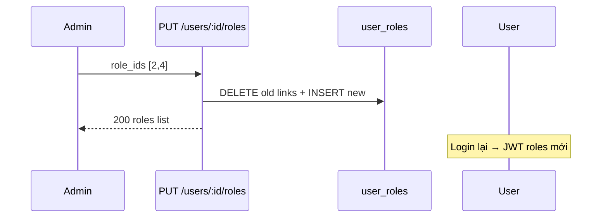

# Functional Requirement (FR) — Admin: Cập nhật vai trò người dùng (Admin Update User Roles)

## 1. Feature Overview

Admin/Manager **thay thế toàn bộ** tập roles của một user qua `user.setRoles()` — bảng trung gian `user_roles` được sync bởi Sequelize.

```
PUT /api/admin/users/:user_id/roles
Authorization: Bearer JWT
Body: { "role_ids": [1, 3] }
```

**FE:** **Không có** UI trên `AdminUsers.jsx` (chỉ hiển thị roles).  
**Client stub sai:** `adminAPI.updateUserRole(id, data)` → `PUT /admin/users/:id/role` — **route không tồn tại**.

---

## 2. Actors

| Actor | Mô tả |
|-------|-------|
| **Admin / Manager** | API caller |
| **updateUserRoles** | Controller |
| **Target user** | Nhận bộ role mới sau login lại (JWT/localStorage) |

---

## 3. Scope

### In Scope

- `role_ids` array các `role_id` hợp lệ.
- `Role.findAll({ where: { role_id: role_ids } })`.
- `user.setRoles(roles)` — **replace** không merge.

### Out of Scope

- Thêm một role (`addRole`) qua API admin — chỉ replace.
- Gán permissions.
- Tự động tạo cart / invalidate JWT.

---

## 4. API Contract

### Request

```http
PUT /api/admin/users/5/roles
Content-Type: application/json

{
  "role_ids": [2, 4]
}
```

| Field | Mô tả |
|-------|--------|
| `role_ids` | Mảng integer `role_id` — có thể rỗng `[]`? |

### Response — 200

```json
{
  "message": "User roles updated successfully",
  "user": {
    "user_id": 5,
    "username": "user1",
    "roles": [
      { "role_id": 2, "role_name": "customer" },
      { "role_id": 4, "role_name": "staff" }
    ]
  }
}
```

**Lưu ý:** Key response là `roles` (lowercase) — khác Sequelize association `Roles` trên list users.

### Errors

| HTTP | Message |
|------|---------|
| 404 | `User not found` |
| 401/403 | Auth |

---

## 5. Backend Logic

```javascript
const user = await User.findByPk(user_id);
const roles = await Role.findAll({ where: { role_id: role_ids } });
await user.setRoles(roles);

res.json({
  message: "User roles updated successfully",
  user: {
    user_id: user.user_id,
    username: user.username,
    roles: roles.map(r => ({ role_id: r.role_id, role_name: r.role_name })),
  },
});
```

| # | Business rule |
|---|----------------|
| BR-01 | **Replace:** roles không nằm trong `role_ids` bị **gỡ** |
| BR-02 | ID không tồn tại trong DB → **bỏ qua** (không 400) — `findAll` chỉ trả role hợp lệ |
| BR-03 | `role_ids: []` → `setRoles([])` — user **không role** — có thể lock khỏi mọi quyền |
| BR-04 | **Không** chặn gỡ `admin` cuối cùng |
| BR-05 | Session hiện tại user bị đổi: JWT vẫn cũ đến hết hạn — `localStorage roles` stale |

### Đăng ký mặc định (contrast)

`authController.register` gán `customer`:

```javascript
const customerRole = await Role.findOne({ where: { role_name: "customer" } });
await user.addRole(customerRole);
```

---

## 6. Path mismatch — api.js

| | Path |
|--|------|
| **Server (đúng)** | `PUT /api/admin/users/:user_id/roles` |
| **adminAPI (sai)** | `PUT /api/admin/users/:id/role` |

Sửa đề xuất:

```javascript
updateUserRoles: (id, data) => api.put(`/admin/users/${id}/roles`, data),
// data: { role_ids: [1, 2] }
```

---

## 7. Tác động theo role

| role_name | Sau khi gán |
|-----------|-------------|
| `admin` | Vào được FE `AdminRoute` sau login |
| `manager` | Gọi được `/api/admin/*`, FE panel vẫn chặn |
| `staff` | `canAnswer` trên PDP |
| `customer` | Mua hàng bình thường |

---

## 8. Sequence



---

## 9. Related FRs

| FR | Liên kết |
|----|----------|
| `FR_AdminListUsers` | Hiển thị `Roles` |
| `FR_AdminListRoles` | Lấy id để gán |
| `FR_AdminUpdateUserActiveStatus` | Độc lập |

---

## 10. Source Files

| File | Vai trò |
|------|---------|
| `server/controllers/adminController.js` | `updateUserRoles` L923–947 |
| `server/routes/adminRoutes.js` | `PUT /users/:user_id/roles` |
| `server/models/index.js` | `user_roles` M:N |
| `client/app/services/api.js` | Wrong `updateUserRole` path |
| `client/app/hooks/useAuth.js` | Lưu roles lúc login |

---

## 11. Acceptance Criteria

- [ ] PUT `role_ids` hợp lệ → 200, `user_roles` đúng trên DB.
- [ ] GET list users phản ánh roles mới.
- [ ] User được gán `admin` → login vào `/admin` OK.
- [ ] Gọi sai path `/role` → 404.

---

## 12. Known Gaps

| # | Mô tả |
|---|--------|
| GAP-01 | **Không FE** gán roles |
| GAP-02 | **api.js path sai** (`/role` vs `/roles`) |
| GAP-03 | Invalid `role_id` im lặng bị bỏ |
| GAP-04 | JWT không revoke khi đổi role |
| GAP-05 | Permission table không dùng |
| GAP-06 | `deleteUser` trong api.js không có BE |
