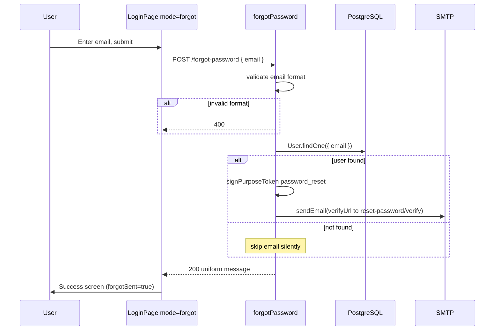

# Functional Requirement (FR) - Quên mật khẩu (Forgot Password)

## 1. Feature Overview

Cho phép user **yêu cầu đặt lại mật khẩu** bằng cách nhập email đã đăng ký. Hệ thống gửi email chứa link reset; link trỏ tới backend `GET /api/auth/reset-password/verify` (xem `FR_ResetPasswordVerifyRedirect.md`), sau đó chuyển user sang form đặt mật khẩu mới trên frontend.

Đặc điểm bảo mật quan trọng: API **luôn trả HTTP 200** với message chung — **không tiết lộ** email có tồn tại trong hệ thống hay không (anti-enumeration).

Frontend: `/login?mode=forgot` — sub-view trong `LoginPage.jsx`, hook `useForgotPassword()`.

---

## 2. Actors

| Actor | Mô tả |
|-------|-------|
| **User** | Quên mật khẩu, biết email đã đăng ký |
| **Guest** | Truy cập form forgot password |
| **Email System** | Gửi link reset qua Nodemailer |
| **System** | Tìm user theo email, ký purpose JWT, gửi mail |

---

## 3. Scope

### In Scope

- `POST /api/auth/forgot-password` body `{ email }`.
- Validate email format (express-validator).
- Tìm user; nếu có → ký token `password_reset`, gửi email.
- Response 200 uniform dù user tồn tại hay không.
- FE form email + success message + link về login.

### Out of Scope

- Verify token redirect → `FR_ResetPasswordVerifyRedirect.md`.
- Submit password mới → `POST /api/auth/reset-password` (FR riêng, chưa trong batch 6 file này nhưng được reference).
- Rate limiting per email/IP.
- Invalidate session/token cũ sau reset.
- OAuth users không có password — email vẫn có thể gửi nhưng reset sẽ set password mới.

---

## 4. Preconditions

- User có thể truy cập `/login?mode=forgot`.
- SMTP configured hoặc dev console log (giống register-email).
- Email trong DB khớp chính xác (normalized bởi validator).

---

## 5. Validation Rules

### Backend (`emailOnlyValidation`)

| Field | Required | Rules | Error |
|-------|----------|-------|-------|
| `email` | Yes | `isEmail()`, `normalizeEmail()` | `"Invalid email"` |

### Frontend

- Input `type="email"`, HTML5 `required`.
- Trim email trước submit: `forgotEmail.trim()`.

---

## 6. Business Rules

| # | Rule | Implementation |
|---|------|----------------|
| BR-01 | **Uniform response** | Luôn `200 { message: "If the email exists, a reset link has been sent" }` |
| BR-02 | **Silent skip** | Email không tồn tại → không gửi mail, vẫn 200 |
| BR-03 | **Purpose token** | `signPurposeToken({ purpose: "password_reset", userId, email })` |
| BR-04 | **Short TTL** | `PASSWORD_RESET_EXPIRES_IN \|\| "15m"` — ngắn hơn email verify (24h) |
| BR-05 | **Reset link → BE first** | `{API_PUBLIC_URL}/api/auth/reset-password/verify?token=...` |
| BR-06 | **Email dev fail-open** | Thiếu SMTP → log link, không throw |
| BR-07 | **No DB token storage** | Stateless JWT only |

---

## 7. API Contract

### Endpoint

```
POST /api/auth/forgot-password
```

**Auth:** Public.

### Request Body

```json
{
  "email": "kiet@example.com"
}
```

### Response — 200 OK (always on valid email format)

```json
{
  "message": "If the email exists, a reset link has been sent"
}
```

Áp dụng cả khi:
- Email **không** tồn tại trong DB.
- Email tồn tại và mail gửi thành công.
- Email tồn tại nhưng SMTP skipped (dev).

### Response — 400 Bad Request

```json
{
  "errors": [
    { "msg": "Invalid email", "path": "email", "location": "body" }
  ]
}
```

---

## 8. Email Content

| Thuộc tính | Giá trị |
|------------|---------|
| **To** | `user.email` (chỉ khi user found) |
| **Subject** | `"Đặt lại mật khẩu"` |
| **Link target** | `GET /api/auth/reset-password/verify?token=...` |

**HTML:** Nút "Xác nhận thay đổi mật khẩu" (style giống email verify).

**Text fallback:** Plain URL.

---

## 9. Token Specification

```javascript
jwt.sign(
  { purpose: "password_reset", userId, email },
  JWT_SECRET,
  { expiresIn: process.env.PASSWORD_RESET_EXPIRES_IN || "15m" }
)
```

| Claim | Value |
|-------|-------|
| `purpose` | `"password_reset"` |
| `userId` | User PK |
| `email` | User email |
| `exp` | ~15 phút default |

---

## 10. Processing Flow



---

## 11. Frontend Behavior

### Navigation

- Từ login form: link "Quên mật khẩu?" → `/login?mode=forgot`
- Success: nút "Về trang đăng nhập" → `/login`
- Cancel: link "Quay lại đăng nhập"

### States

| State | UI |
|-------|-----|
| Initial | Form email + nút "Gửi email" |
| `forgotSent=true` | Message: "Nếu email tồn tại trong hệ thống, chúng tôi đã gửi mail..." |
| Error | `localError` — validation/API fail (400) |

### Hook

```javascript
// useForgotPassword
authAPI.forgotPassword({ email }) → POST /auth/forgot-password
```

Loading: `forgotPassword.isPending` + spinner "Đang gửi...".

---

## 12. Downstream Flow (reference)

Sau email, user click link → **`FR_ResetPasswordVerifyRedirect.md`**:

1. BE validate token → redirect `/login?mode=reset&token=...`
2. User nhập password mới → `POST /api/auth/reset-password`
3. Success → `/login?reset=success` → login bằng password mới

---

## 13. Database Impact

| Case | DB change |
|------|-----------|
| Forgot password request | **Không** — read-only `User.findOne` |
| Password actually changed | Thuộc `reset-password` endpoint (update `password_hash`) |

---

## 14. Environment Variables

| Biến | Mục đích | Default |
|------|----------|---------|
| `PASSWORD_RESET_EXPIRES_IN` | JWT TTL reset | `"15m"` |
| `API_PUBLIC_URL` | Link trong email | `http://localhost:5000` |
| `EMAIL_*` | SMTP | — |
| `JWT_SECRET` | Sign token | — |

---

## 15. Edge Cases

| Case | Hành vi |
|------|---------|
| Email không tồn tại | 200 + FE success message (user không biết) |
| User inactive (`is_active=false`) | Vẫn tìm thấy user → **vẫn gửi email** reset |
| OAuth user (password null) | Vẫn gửi reset — set password mới được |
| Spam nhiều request cùng email | Mỗi request token JWT mới, cũ vẫn valid đến hết hạn |
| SMTP fail sau khi find user | Exception → 500 (user không nhận mail) |

---

## 16. Security Considerations

- **Anti-enumeration:** Uniform 200 response.
- **Short-lived token:** 15m default giảm window tấn công.
- **Purpose claim:** Token không dùng cho session API.
- **No rate limit:** Có thể spam forgot requests / email bombing.
- **Link qua HTTP GET:** Token trong URL — risk Referer leakage; HTTPS required prod.

---

## 17. Related Features

| FR | Quan hệ |
|----|---------|
| `FR_ResetPasswordVerifyRedirect.md` | Bước tiếp theo sau email |
| `FR_Login.md` | Login sau reset thành công |
| `FR_RegisterEmailVerification.md` | Cùng pattern email + purpose JWT |

---

## 18. Source Files

| Layer | File |
|-------|------|
| Route | `server/routes/authRoutes.js` L40 |
| Controller | `server/controllers/authController.js` → `forgotPassword`, `sendEmail`, `signPurposeToken`, `getApiBaseUrl` |
| FE Page | `client/app/pages/LoginPage.jsx` — block `mode === "forgot"` |
| FE Hook | `client/app/hooks/useAuth.js` → `useForgotPassword` |
| FE API | `client/app/services/api.js` → `authAPI.forgotPassword` |

---

## 19. Acceptance Criteria

- **AC1:** Submit email hợp lệ → luôn 200, FE chuyển success screen.
- **AC2:** Email không tồn tại → vẫn 200, không gửi mail, UX giống success.
- **AC3:** Email tồn tại → mail (hoặc console dev) chứa link `/api/auth/reset-password/verify?token=...`.
- **AC4:** Email sai format → 400, FE hiển thị lỗi.
- **AC5:** Token trong email có `purpose: password_reset`, hết hạn sau ~15 phút.
- **AC6:** Link "Quên mật khẩu?" từ login mở đúng form forgot.
