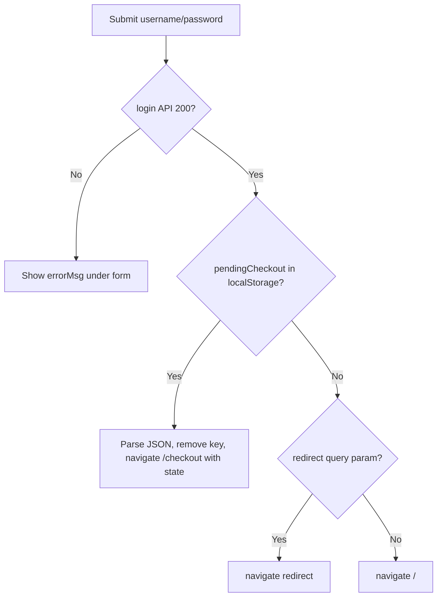

# Functional Requirement (FR) - Đăng nhập (Login)

## 1. Feature Overview

Cho phép user đã có tài khoản **đăng nhập bằng username + password**, nhận JWT session token (7 ngày) và thông tin profile kèm roles. Đây là cơ chế xác thực chính cho toàn bộ luồng thương mại: giỏ hàng, đặt hàng, checkout, profile, Q&A.

Frontend: trang `/login` (`LoginPage.jsx`), hook `useLogin()` tự động persist token, roles, Redux state và refresh cart queries.

---

## 2. Actors

| Actor | Mô tả |
|-------|-------|
| **Registered User** | User active (`is_active = true`) với password |
| **Inactive User** | Đã register-email nhưng chưa verify — **bị chặn** |
| **Guest** | Truy cập `/login` hoặc bị `ProtectedRoute` redirect |
| **System** | Validate, bcrypt compare, update `last_login`, issue JWT |

---

## 3. Scope

### In Scope

- `POST /api/auth/login` với `username`, `password`.
- Kiểm tra credentials và trạng thái active.
- Trả JWT + user object (kèm `roles[]`).
- FE: form login, hiển thị lỗi, OAuth buttons, forgot password link.
- Post-login: restore `pendingCheckout`, respect `?redirect=` query.
- Session persistence: `localStorage` + Redux + Axios interceptor.

### Out of Scope

- Login bằng email (chỉ username).
- OAuth username/password (Google/Facebook — redirect riêng).
- Refresh token / token rotation (single JWT 7d).
- Server-side logout endpoint (client-only logout).
- 2FA / CAPTCHA.

---

## 4. Preconditions

- User tồn tại với `username` khớp.
- Với register-email flow: `is_active = true` (đã verify).
- Password đúng (bcrypt compare).
- OAuth-only users (`password_hash = null`) **không** login được bằng form này.

---

## 5. Validation Rules

### Backend (`loginValidation`)

| Field | Required | Rules | Error |
|-------|----------|-------|-------|
| `username` | Yes | `trim()`, not empty | `"Username is required"` |
| `password` | Yes | not empty | `"Password is required"` |

### Frontend

- HTML5 `required` trên cả 2 field.
- Trim username trước khi gửi.

---

## 6. Business Rules

| # | Rule | Implementation |
|---|------|----------------|
| BR-01 | **Username login** | `User.findOne({ where: { username } })` — **không** tìm theo email |
| BR-02 | **Generic auth error** | Sai user hoặc password → cùng message `401 Invalid username or password` |
| BR-03 | **Active check** | `!user.is_active` → `403 Account is inactive` |
| BR-04 | **Password verify** | `user.comparePassword(password)` — bcrypt |
| BR-05 | **Last login** | `user.update({ last_login: new Date() })` |
| BR-06 | **Roles in response** | `user.Roles.map(r => r.role_name)` |
| BR-07 | **JWT session** | `generateToken(user.user_id)`, expires `7d` |
| BR-08 | **Include avatar** | Response có `avatar_url` (register direct response **không** có field này) |

---

## 7. API Contract

### Endpoint

```
POST /api/auth/login
```

**Auth:** Public.

### Request Body

```json
{
  "username": "kietpham",
  "password": "secret123"
}
```

### Response — 200 OK

```json
{
  "message": "Login successful",
  "token": "eyJhbGciOiJIUzI1NiIsInR5cCI6IkpXVCJ9...",
  "user": {
    "user_id": 42,
    "username": "kietpham",
    "email": "kiet@example.com",
    "full_name": "Kiệt Phạm",
    "phone_number": "0901234567",
    "avatar_url": null,
    "roles": ["customer"]
  }
}
```

### Response — 400 Bad Request

```json
{
  "errors": [
    { "msg": "Username is required", "path": "username", "location": "body" }
  ]
}
```

### Response — 401 Unauthorized

```json
{
  "message": "Invalid username or password"
}
```

### Response — 403 Forbidden

```json
{
  "message": "Account is inactive"
}
```

---

## 8. Authentication Token Usage

Sau login, client gắn header:

```
Authorization: Bearer <token>
```

**Middleware `authenticateToken`** (`server/middleware/auth.js`):

- Decode JWT → `userId`
- Load user + roles
- Reject nếu `!user || !user.is_active` → `403 User not found or inactive`
- JWT invalid/expired → `401 Invalid or expired token`

Token payload: `{ userId: number }` — không có roles embedded; roles luôn load từ DB mỗi request.

---

## 9. Frontend Flow

### Route

```
/login
/login?redirect=/checkout
/login?reset=success
/login?verify=invalid
/login?mode=forgot
/login?mode=reset&token=...
```

### Submit handler (`LoginPage.jsx`)



### `useLogin()` side effects (`onSuccess`)

1. `setAuthHeader(data.token)` — Axios default header.
2. `localStorage.setItem("token", ...)`.
3. `localStorage.setItem("roles", JSON.stringify(roles))`.
4. `dispatch(setCredentials({ token, user }))` — cũng lưu `user` JSON vào localStorage.
5. Invalidate/refetch React Query: `["me"]`, `["currentUser"]`, `["cart"]`.

### Error display

```javascript
errorMsg =
  login.error?.response?.data?.message ||
  login.error?.message ||
  "Tên đăng nhập hoặc mật khẩu không đúng"
```

403 inactive hiển thị message từ BE: `"Account is inactive"`.

### OAuth buttons (cùng trang)

- `{VITE_BACKEND_URL}/api/auth/google`
- `{VITE_BACKEND_URL}/api/auth/facebook`

Callback → `/oauth/success?token=...` — không qua login API.

### Links liên quan

- "Quên mật khẩu?" → `/login?mode=forgot`
- "Đăng ký ngay" → `/register`
- Banner xanh khi `?reset=success`
- Banner đỏ khi `?verify=*` (từ verify email fail)

---

## 10. Session Restore (F5 / reload)

`App.jsx` on mount:

- Đọc `localStorage.token` + `localStorage.user`
- Nếu có và Redux chưa authenticated → `dispatch(setCredentials(...))`

Axios request interceptor tự gắn token mỗi request.

**401/403 trên API khác** (không phải login/register): interceptor xóa session, clear cart Redux, redirect `/login`.

---

## 11. Integration với Commerce Flow

| Scenario | Hành vi sau login |
|----------|-------------------|
| Buy now chưa login | `ProductDetailPage` lưu `pendingCheckout` → login → `/checkout` |
| Cart checkout | `CartPage` redirect `/login?redirect=/checkout` |
| Protected routes | `ProtectedRoute` redirect login nếu chưa auth |
| Admin | Cần role `admin` trong `user.roles` — `AdminRoute` check riêng |

---

## 12. Database Impact

| Thao tác | Bảng | Field |
|----------|------|-------|
| SELECT | `users` + join `roles` | — |
| UPDATE | `users` | `last_login` |

Không ghi session server-side.

---

## 13. Environment Variables

| Biến | Mục đích |
|------|----------|
| `JWT_SECRET` | Sign/verify JWT |
| `VITE_API_URL` | FE axios base (`http://localhost:5000/api`) |
| `VITE_BACKEND_URL` | OAuth redirect origin |

---

## 14. Edge Cases

| Case | Hành vi |
|------|---------|
| User OAuth (no password) | `comparePassword` fail → 401 |
| Admin inactive | 403 |
| Token hết hạn sau 7d | API 401 → auto logout redirect |
| Login đồng thời nhiều tab | Shared localStorage |
| Username có khoảng trắng đầu/cuối | FE trim; BE trim qua validator |

---

## 15. Security Considerations

- Generic 401 message — không tiết lộ username có tồn tại hay không (chỉ áp dụng login, **không** áp dụng register duplicate).
- bcrypt cost factor 10.
- JWT in localStorage — XSS risk; không HttpOnly cookie.
- Login endpoint excluded khỏi 401 auto-redirect trong axios interceptor.
- Không rate limit brute force.

---

## 16. Related Features

| FR / Component | Quan hệ |
|----------------|---------|
| `FR_RegisterEmailVerification.md` | User phải verify trước khi login |
| `FR_VerifyEmail.md` | Auto-login thay thế form login |
| `FR_ForgotPassword.md` | Recovery khi quên password |
| `ProtectedRoute.jsx` | Guard routes |
| `GET /auth/me` | Validate session sau F5 |

---

## 17. Source Files

| Layer | File |
|-------|------|
| Route | `server/routes/authRoutes.js` L39 |
| Controller | `server/controllers/authController.js` → `login`, `generateToken` |
| Middleware | `server/middleware/auth.js` |
| Model | `server/models/User.js` → `comparePassword`, hooks |
| FE Page | `client/app/pages/LoginPage.jsx` |
| FE Hook | `client/app/hooks/useAuth.js` → `useLogin` |
| FE API | `client/app/services/api.js` → `authAPI.login`, interceptors |
| FE Store | `client/app/store/slices/authSlice.js` |
| FE App | `client/app/App.jsx` — session restore |

---

## 18. Acceptance Criteria

- **AC1:** Username/password đúng, user active → 200, FE lưu token và vào trang chủ (hoặc redirect).
- **AC2:** Password sai → 401, message hiển thị dưới form, **không** redirect.
- **AC3:** User inactive → 403 `"Account is inactive"`.
- **AC4:** Sau login, `GET /api/cart` hoạt động với Bearer token.
- **AC5:** Có `pendingCheckout` → sau login vào `/checkout` với state đúng.
- **AC6:** `?redirect=/orders` → sau login vào `/orders`.
- **AC7:** `last_login` trong DB được cập nhật.
- **AC8:** Roles lưu vào `localStorage.roles` và dùng cho UI staff/admin checks.
