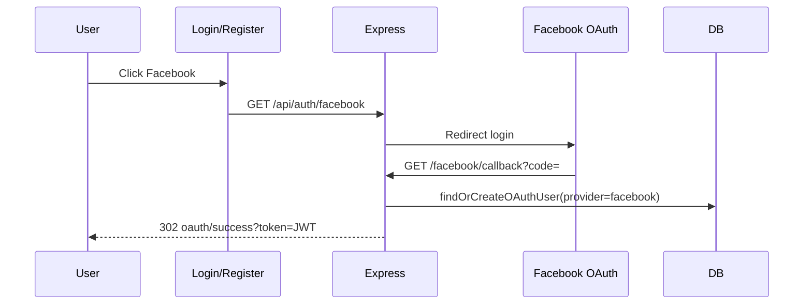

# Functional Requirement (FR) — Đăng nhập / Đăng ký bằng Facebook OAuth

## 1. Feature Overview

Luồng **Facebook Login** dùng **`passport-facebook`**, đăng ký route tại **`/api/auth/facebook`** và callback **`/api/auth/facebook/callback`**, cùng file `authSocialRoutes.js` với Google.

Sau khi Facebook redirect về với authorization code, Passport gọi strategy callback → **`findOrCreateOAuthUser`** với `provider: "facebook"` → phát hành JWT session (`issueJwt`) → redirect **`{FE_APP_URL}/oauth/success?token=...`**.

Frontend khởi chạy qua `window.location.assign(\`${BACKEND}/api/auth/facebook\`)` trên **`LoginPage`** và **`RegisterPage`**.

---

## 2. Actors

| Actor | Mô tả |
|-------|-------|
| **User** | Chọn nút Facebook trên FE |
| **Facebook (Meta)** | OAuth provider |
| **Backend** | `FacebookStrategy` + logic dùng chung `findOrCreateOAuthUser` |
| **Frontend** | `/oauth/success` nhận token |

---

## 3. Scope

### In Scope

- `GET /api/auth/facebook` — `passport.authenticate("facebook", { scope: ["email"], session: false })`.
- `GET /api/auth/facebook/callback` — `failureRedirect` tới **`/login?oauth=facebook_failed`**.
- `profileFields`: `["id", "displayName", "emails", "photos"]`.
- Cart + role customer cho user OAuth mới; cập nhật `last_login`.

### Out of Scope

- Instagram / Meta Business suite.
- Lưu long-lived Facebook token server-side.
- Page `/oauth/success` chi tiết → `FR_OAuthSuccessCallback.md`.

---

## 4. Environment Variables

| Biến | Mục đích |
|------|----------|
| `FACEBOOK_CLIENT_ID` | App ID |
| `FACEBOOK_CLIENT_SECRET` | App secret |
| `FACEBOOK_CALLBACK_URL` | Ví dụ `http://localhost:5000/api/auth/facebook/callback` — khớp cấu hình Facebook App |
| `JWT_SECRET` | Ký JWT session |
| `FE_APP_URL` | Redirect FE sau success (default `http://localhost:3000`) |

Cùng lưu ý như Google: **`FE_APP_URL` vs `FRONTEND_URL`** trong `authController`.

---

## 5. HTTP Routes

### `GET /api/auth/facebook`

```javascript
passport.authenticate("facebook", { scope: ["email"], session: false })
```

- Chỉ xin scope **`email`** trong code hiện tại (Facebook vẫn trả `id`, `name`, `picture` qua `profileFields`).

### `GET /api/auth/facebook/callback`

```javascript
passport.authenticate("facebook", {
  failureRedirect: `${FE_URL}/login?oauth=facebook_failed`,
  session: false,
}),
(req, res) => {
  const { token } = req.user;
  return res.redirect(
    `${FE_URL}/oauth/success?token=${encodeURIComponent(token)}`
  );
}
```

**Khác Google:** Callback handler Facebook **chỉ** destructure **`token`** (không dùng `user` trong redirect). Behavior cuối cùng giống Google vì FE vẫn dùng token để gọi **`GET /api/auth/me`**.

---

## 6. Strategy Callback

```javascript
new FacebookStrategy(
  {
    clientID: process.env.FACEBOOK_CLIENT_ID,
    clientSecret: process.env.FACEBOOK_CLIENT_SECRET,
    callbackURL: process.env.FACEBOOK_CALLBACK_URL,
    profileFields: ["id", "displayName", "emails", "photos"],
  },
  async (accessToken, refreshToken, profile, done) => {
    const email = profile.emails?.[0]?.value || null; // có thể null
    const name = profile.displayName || "";
    const avatar = profile.photos?.[0]?.value || null;
    const { user, token } = await findOrCreateOAuthUser({
      provider: "facebook",
      oauthId: profile.id,
      email,
      name,
      avatar,
    });
    return done(null, { user, token });
  }
);
```

---

## 7. Đặc thù Facebook so với Google

| Khía cạnh | Facebook |
|-----------|----------|
| **Email** | Có thể **không** có (`emails` rỗng) — comment trong code |
| **`oauth_id`** | Facebook user id (`profile.id`) |
| **`findOrCreateOAuthUser` nhánh 2** | Nếu không có email → không match user theo email; chỉ nhánh 1 (oauth_provider+oauth_id) hoặc nhánh 3 (tạo mới) |
| **User mới không email** | Vẫn `User.create` với `email: null` **không thể** nếu DB `allowNull: false` trên `email` |

**Rủi ro dữ liệu quan trọng:** Model `User` có `email: { allowNull: false }`. Nếu Facebook không trả email và user **chưa** tồn tại với `oauth_provider+oauth_id`, nhánh **tạo mới** sẽ gọi `User.create({ ..., email })` với **`email: null`** → ** Sequelize / DB có thể throw** hoặc vi phạm constraint.

Đây là **known gap**: cần policy (ép user nhập email sau login, hoặc dùng email proxy, hoặc `FACEBOOK_REQUIRES_EMAIL`) khi production.

Google thường có email nên ít gặp; Facebook có thể thiếu tùy app setting / user profile.

---

## 8. Chung phần `findOrCreateOAuthUser`

Giống hệt mô tả trong `FR_OAuthGoogle.md`:

- Match `oauth_provider` + `oauth_id`.
- Match `email` nếu có → merge OAuth vào account.
- Tạo mới + username random + **`Cart.create`** + role customer.
- `last_login`, `issueJwt`.

`oauth_provider` lưu chuỗi **`facebook`**.

---

## 9. Database

| Trường | Giá trị |
|--------|---------|
| `oauth_provider` | `'facebook'` |
| `oauth_id` | FB user id |

User inactive: OAuth **không** set `is_active: false`; user mới default active.

---

## 10. Sequence Diagram



---

## 11. Failure & UX

| Sự kiện | Redirect |
|---------|----------|
| User từ chối / lỗi Facebook | `/login?oauth=facebook_failed` |

---

## 12. Security

- Callback URL phải HTTPS production.
- Token JWT lộ qua query — xử lý nhanh tại `/oauth/success`.
- App Facebook cần chế độ **Live** và quyền `email` nếu muốn giảm case không email.

---

## 13. Related Features

| FR | Quan hệ |
|----|---------|
| `FR_OAuthGoogle.md` | Cùng helper và redirect pattern |
| `FR_OAuthSuccessCallback.md` | Xử lý token |
| `FR_AutoCreateCartOnRegistration.md` | Cart user mới |

---

## 14. Source Files

| Layer | File |
|-------|------|
| Routes | `server/routes/authSocialRoutes.js` |
| Passport | `server/config/passport.js` — `FacebookStrategy`, `findOrCreateOAuthUser` |
| FE | `client/app/pages/LoginPage.jsx`, `RegisterPage.jsx` |

---

## 15. Acceptance Criteria

- **AC1:** GET `/facebook` khởi động OAuth với scope `email`.
- **AC2:** Success → redirect `/oauth/success?token=...`.
- **AC3:** User Facebook mới có bản ghi với provider facebook + cart (khi create thành công).
- **AC4:** User đã có cùng `oauth_provider+oauth_id` → đăng nhập lại không duplicate.
- **AC5:** Trùng email (khi có) → gắn OAuth vào user hiện có.
- **AC6:** Document case **không có email** và rủi ro `allowNull: false` trên `email`.
