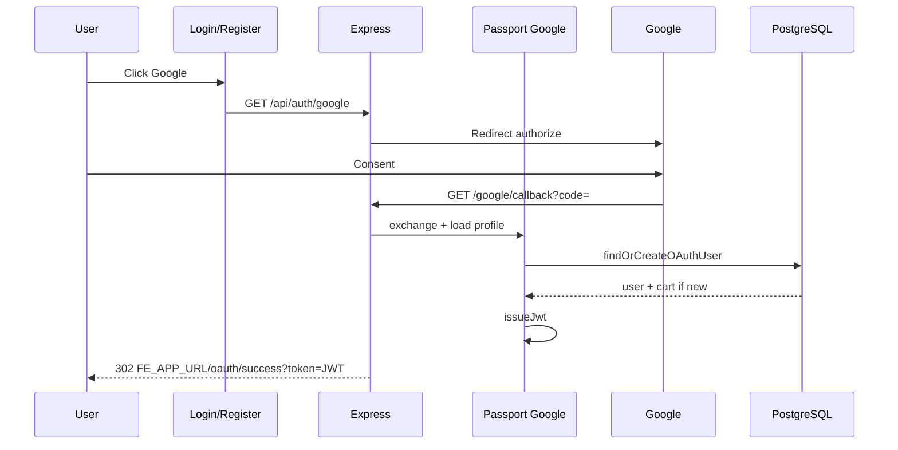

# Functional Requirement (FR) — Đăng nhập / Đăng ký bằng Google OAuth 2.0

## 1. Feature Overview

Luồng **Google OAuth** dùng **Passport.js** strategy `passport-google-oauth20`, mount tại prefix **`/api/auth`** cùng với các route auth REST.

| Bước | Endpoint / hành vi |
|------|---------------------|
| Bắt đầu OAuth | `GET /api/auth/google` → redirect sang Google consent |
| Callback | `GET /api/auth/google/callback` → Passport xử lý code → strategy callback → **`findOrCreateOAuthUser`** → redirect FE kèm JWT session |

JWT session được truyền qua query **`token`** đến trang **`/oauth/success`** trên frontend (xem `FR_OAuthSuccessCallback.md`).

Nút Google trên **`LoginPage`** và **`RegisterPage`** dùng `window.location.assign(\`${BACKEND}/api/auth/google\`)` với `BACKEND = VITE_BACKEND_URL || http://localhost:5000`.

---

## 2. Actors

| Actor | Mô tả |
|-------|-------|
| **User** | Browser, chọn “Đăng nhập/Google” hoặc “Đăng ký bằng Google” |
| **Google** | IdP OAuth 2.0 |
| **Backend** | Express + Passport `GoogleStrategy` + `findOrCreateOAuthUser` |
| **Frontend** | Nhận redirect `FE_URL/oauth/success?token=...` |

---

## 3. Scope

### In Scope

- Routes trong `server/routes/authSocialRoutes.js` (`/google`, `/google/callback`).
- Cấu hình strategy trong `server/config/passport.js`.
- Gắn `passport.initialize()` trong `server/server.js`.
- Logic tìm/tạo user, gán role `customer`, **`Cart.create`**, **`issueJwt`**.
- Failure redirect `/login?oauth=google_failed`.

### Out of Scope

- Xử lý chi tiết trang `/oauth/success` → FR OAuth Success.
- Facebook → `FR_OAuthFacebook.md`.
- Refresh token Google (chỉ dùng access profile lúc login).
- Liên kết nhiều provider cùng lúc cho một user (ngoài rule email-trùng hiện có).

---

## 4. Environment Variables

| Biến | Mục đích |
|------|----------|
| `GOOGLE_CLIENT_ID` | OAuth client ID |
| `GOOGLE_CLIENT_SECRET` | Client secret |
| `GOOGLE_CALLBACK_URL` | **Phải** khớp URL đã đăng ký trên Google Cloud (ví dụ `http://localhost:5000/api/auth/google/callback`) |
| `JWT_SECRET` | Ký session JWT (`issueJwt`) |
| `FE_APP_URL` | Base URL frontend cho redirect sau success (**mặc định** `http://localhost:3000`) — biến **khác** `FRONTEND_URL` dùng trong `authController` redirect email |

**Quan trọng:** Redirect OAuth social dùng `FE_APP_URL` trong `authSocialRoutes.js`, trong khi verify email/forgot redirect dùng `getFrontendBaseUrl()` (`FRONTEND_URL` / `CLIENT_URL`). Cần cấu hình **đồng bộ** môi trường production để không redirect nhầm host.

---

## 5. API / HTTP Behavior

### `GET /api/auth/google`

```javascript
passport.authenticate("google", {
  scope: ["profile", "email"],
  session: false,
});
```

- **Session:** `session: false` — không lưu session Passport; chỉ dùng cho luồng redirect.
- **Scope:** profile + email để lấy email xác định tài khoản.

### `GET /api/auth/google/callback`

```javascript
passport.authenticate("google", {
  failureRedirect: `${FE_URL}/login?oauth=google_failed`,
  session: false,
}),
(req, res) => {
  const { token, user } = req.user;
  return res.redirect(
    `${FE_URL}/oauth/success?token=${encodeURIComponent(token)}`
  );
}
```

- Passport gán **`req.user` = `{ user, token }`** (object custom từ `done(null, { user, token })` trong strategy verify).
- **Lư ý:** `user` được destructure nhưng **chỉ `token`** được đưa vào URL — FE **bắt buộc** gọi `GET /api/auth/me` để lấy profile đầy đủ (`OAuthSuccess.jsx`).

---

## 6. Passport Verify Callback (`GoogleStrategy`)

File: `server/config/passport.js`

Payload từ Google profile:

| Field | Mapping |
|-------|---------|
| `profile.emails[0].value` | `email` (có thể null nếu thiếu) |
| `profile.displayName` | `name` |
| `profile.photos[0].value` | `avatar` |
| `profile.id` | `oauthId` |

Gọi:

```javascript
findOrCreateOAuthUser({
  provider: "google",
  oauthId: profile.id,
  email,
  name,
  avatar,
});
```

Sau đó `done(null, { user, token })`.

---

## 7. `findOrCreateOAuthUser` (dùng chung Google & Facebook)

Thứ tự logic:

1. **Tìm theo cặp** `oauth_provider` + `oauth_id` — nếu có → user hiện có OAuth.
2. **Nếu chưa có và có `email`:** tìm `User` theo `email`. Nếu trùng → **gắn OAuth** vào user đó: `update({ oauth_provider, oauth_id, avatar_url: user.avatar_url || avatar })`.
3. **Nếu vẫn không có user:** tạo mới:
   - `username`: từ prefix email / `name` / `provider`, sanitize `[a-zA-Z0-9_.-]`, cắt 20 ký tự + `_` + random 5 ký tự base36.
   - `email`, `full_name`, `avatar_url`, `oauth_provider`, `oauth_id`.
   - `password_hash`, `phone_number` **null** (theo comment code).
   - Gán role **customer** nếu tồn tại trong bảng roles.
   - **`Cart.create({ user_id })`**.
4. **`user.update({ last_login: new Date() })`** cho mọi nhánh thành công.
5. **`issueJwt(user.user_id)`** — JWT `{ userId }`, `7d`, cùng secret với login thường.

---

## 8. Database Fields (User)

| Cột | Google example |
|-----|----------------|
| `oauth_provider` | `'google'` |
| `oauth_id` | Google `sub` / id string |
| `password_hash` | null (user mới OAuth) |
| `is_active` | default `true` (không qua bước verify email như `register-email`) |

---

## 9. Sequence Diagram



---

## 10. Security Considerations

- **HTTPS** bắt buộc production cho callback URL.
- **JWT trong query string** — lộ trong referrer/logs; thời gian sống ngắn nên xử lý nhanh tại `/oauth/success`.
- **Email trùng tài khoản local:** hệ thống **gộp** OAuth vào user email đó — cần awareness nghiệp vụ (user đã có password local vẫn có thể đăng nhập username/password).
- **Không kiểm tra email verified** từ Google — tin tưởng IdP.

---

## 11. Failure UX

| Sự kiện | Redirect / hành vi |
|---------|-------------------|
| User hủy / Google lỗi | `FE_URL/login?oauth=google_failed` |
| Lỗi trong `findOrCreateOAuthUser` | Passport `done(e)` → failure handling → `google_failed` |

Frontend có thể đọc query `oauth=google_failed` để hiển thị banner (cần kiểm tra `LoginPage` có parse hay không — có thể là gap UX).

---

## 12. Related Features

| FR | Quan hệ |
|----|---------|
| `FR_OAuthSuccessCallback.md` | Nhận token, gọi `/me`, Redux |
| `FR_OAuthFacebook.md` | Cùng `findOrCreateOAuthUser`, khác strategy |
| `FR_GetCurrentUser.md` | Hydrate user sau OAuth |
| `FR_AutoCreateCartOnRegistration.md` | Cart khi tạo user OAuth mới |

---

## 13. Source Files

| Layer | File |
|-------|------|
| Routes | `server/routes/authSocialRoutes.js` |
| Passport | `server/config/passport.js` — `GoogleStrategy`, `findOrCreateOAuthUser`, `issueJwt` |
| Server bootstrap | `server/server.js` — `passport.initialize()`, `app.use("/api/auth", authSocialRoutes)` |
| FE | `client/app/pages/LoginPage.jsx`, `client/app/pages/RegisterPage.jsx` |

---

## 14. Acceptance Criteria

- **AC1:** `GET /api/auth/google` redirect tới Google với scope profile+email.
- **AC2:** Callback thành công → redirect `/oauth/success?token=<jwt>`.
- **AC3:** User mới có `oauth_provider=google`, cart tồn tại, `last_login` cập nhật.
- **AC4:** User cũ trùng `oauth_provider+oauth_id` → đăng nhập, không tạo user trùng.
- **AC5:** User cũ trùng email → cập nhật `oauth_*`, giữ một bản ghi user.
- **AC6:** Failure → `/login?oauth=google_failed`.
