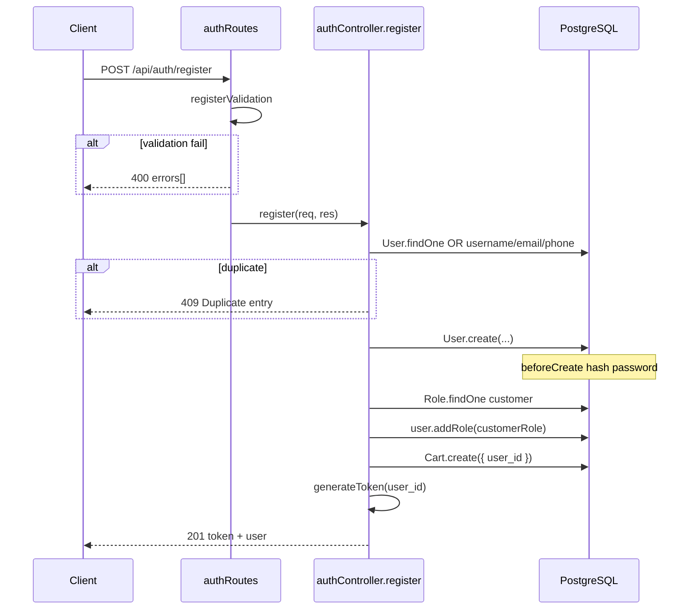

# Functional Requirement (FR) - Đăng ký trực tiếp (Register Direct)

## 1. Feature Overview

Cho phép khách tạo tài khoản mới trên hệ thống **Laptop Store** mà **không cần xác minh email**. Sau khi đăng ký thành công, backend:

- Tạo bản ghi `users` với trạng thái **active ngay** (`is_active = true` — giá trị mặc định của model).
- Gán role `customer`.
- Tạo giỏ hàng rỗng (`carts`).
- Trả về **JWT session token** (7 ngày) để client có thể đăng nhập ngay.

Đây là luồng đăng ký **legacy / API-first**: endpoint tồn tại và hoạt động đầy đủ trên backend, nhưng **frontend hiện tại không sử dụng** — trang `/register` gọi `POST /api/auth/register-email` thay vì endpoint này. Hook `useRegister()` vẫn được export sẵn trong `client/app/hooks/useAuth.js` để tích hợp sau này hoặc dùng qua API client/Postman.

---

## 2. Actors

| Actor | Mô tả |
|-------|-------|
| **Guest (Khách)** | Người chưa đăng nhập, muốn tạo tài khoản và dùng hệ thống ngay |
| **System (Backend)** | Validate input, kiểm tra trùng lặp, hash mật khẩu, gán role, tạo cart, phát JWT |
| **System (Frontend)** | *(Tùy chọn)* Form đăng ký gọi trực tiếp endpoint — **chưa triển khai UI** |

---

## 3. Scope

### In Scope

- Tiếp nhận `username`, `email`, `password`, `full_name`, `phone_number`.
- Validate bằng `express-validator` (`registerValidation` trong `server/routes/authRoutes.js`).
- Kiểm tra trùng `username`, `email`, `phone_number`.
- Hash mật khẩu bcrypt (hook `beforeCreate` của model `User`).
- Gán role `customer` qua bảng trung gian `user_roles`.
- Tạo `Cart` 1-1 với user (`user_id` unique trên bảng `carts`).
- Trả JWT + thông tin user cơ bản.

### Out of Scope

- Gửi email xác minh → xem `FR_RegisterEmailVerification.md`.
- Đăng nhập OAuth Google/Facebook → route riêng `/api/auth/google`, `/api/auth/facebook`.
- Cập nhật profile sau đăng ký → `PUT /api/auth/profile`.
- Rate limiting / CAPTCHA (chưa có trong code hiện tại).

---

## 4. Preconditions

- Database PostgreSQL đã migrate, bảng `users`, `roles`, `user_roles`, `carts` tồn tại.
- Role `customer` đã được seed trong bảng `roles`.
- Biến môi trường `JWT_SECRET` đã cấu hình (fallback dev: `"your-secret-key"`).
- Client gửi request JSON hợp lệ tới `POST /api/auth/register`.

---

## 5. Validation Rules

Validation được định nghĩa tại `server/routes/authRoutes.js` — middleware `registerValidation`:

| Field | Type | Required | Rules (BE) | Error message (BE) |
|-------|------|----------|------------|-------------------|
| `username` | string | Yes | `trim()`, length 3–50 | `"Username must be 3-50 characters"` |
| `email` | string | Yes | `isEmail()`, `normalizeEmail()` | `"Invalid email"` |
| `password` | string | Yes | length ≥ 6 | `"Password must be at least 6 characters"` |
| `full_name` | string | No | `optional()`, `trim()`, max 100 | *(validator default)* |
| `phone_number` | string | Yes | `trim()`, not empty, regex `^[+0-9][0-9\s\-()]{6,}$` | `"Phone number is required"` / `"Invalid phone number"` |

**Lưu ý FE (khi tích hợp sau):** `RegisterPage.jsx` hiện validate thêm `confirmPassword` ở client — logic này **không** áp dụng cho endpoint direct register vì FE chưa gọi endpoint này.

---

## 6. Business Rules

| # | Rule | Chi tiết implementation |
|---|------|-------------------------|
| BR-01 | **Active ngay** | Không set `is_active: false` → model default `is_active = true`. User có thể login ngay sau register. |
| BR-02 | **Hash mật khẩu** | Truyền plaintext vào field `password_hash` khi `User.create()`; hook `beforeCreate` hash bằng `bcrypt.hash(..., 10)`. |
| BR-03 | **Unique constraints** | Kiểm tra app-level `Op.or` trên `username`, `email`, `phone_number` trước khi insert; DB cũng có UNIQUE trên 3 cột. |
| BR-04 | **Role mặc định** | `Role.findOne({ role_name: "customer" })` → `user.addRole(customerRole)`. Response hardcode `roles: ["customer"]`. |
| BR-05 | **Cart tự tạo** | `Cart.create({ user_id })` — mỗi user tối đa 1 cart (`user_id` unique). |
| BR-06 | **JWT session** | `jwt.sign({ userId }, JWT_SECRET, { expiresIn: "7d" })` — **không** có claim `purpose` (khác với token email verify / password reset). |
| BR-07 | **Không gửi email** | Luồng này không gọi `sendEmail()`. |

---

## 7. API Contract

### Endpoint

```
POST /api/auth/register
```

**Auth:** Không yêu cầu (public).

**Content-Type:** `application/json`

### Request Body

```json
{
  "username": "kietpham",
  "email": "kiet@example.com",
  "password": "secret123",
  "full_name": "Kiệt Phạm",
  "phone_number": "0901234567"
}
```

### Response — 201 Created

```json
{
  "message": "User registered successfully",
  "token": "eyJhbGciOiJIUzI1NiIsInR5cCI6IkpXVCJ9...",
  "user": {
    "user_id": 42,
    "username": "kietpham",
    "email": "kiet@example.com",
    "full_name": "Kiệt Phạm",
    "phone_number": "0901234567",
    "roles": ["customer"]
  }
}
```

Client **có thể** lưu `token` vào `localStorage`, set header `Authorization: Bearer <token>`, dispatch `setCredentials` — pattern giống `useLogin.onSuccess`.

### Response — 400 Bad Request (validation)

```json
{
  "errors": [
    {
      "type": "field",
      "value": "ab",
      "msg": "Username must be 3-50 characters",
      "path": "username",
      "location": "body"
    }
  ]
}
```

Format `express-validator` — FE cần map `path`/`param` → field name.

### Response — 409 Conflict (duplicate)

```json
{
  "message": "Duplicate entry",
  "errors": [
    {
      "field": "username",
      "code": "DUPLICATE_USERNAME",
      "message": "Username already taken"
    },
    {
      "field": "email",
      "code": "DUPLICATE_EMAIL",
      "message": "Email already registered"
    }
  ]
}
```

Có thể trả về **một hoặc nhiều** mục trong `errors[]` tùy field trùng.

### Response — 500 Internal Server Error

Lỗi không bắt — `next(error)` → global error handler.

---

## 8. Database Impact

Thực hiện **tuần tự** (không bọc Sequelize transaction trong code hiện tại):

| Bước | Bảng | Thao tác |
|------|------|----------|
| 1 | `users` | INSERT: `username`, `email`, `password_hash` (hashed), `full_name`, `phone_number`, `is_active=true` |
| 2 | `user_roles` | INSERT: liên kết `user_id` ↔ `role_id` (customer) |
| 3 | `carts` | INSERT: `{ user_id }` |

**Rủi ro hiện tại:** Nếu bước 3 fail sau bước 1–2, user tồn tại nhưng chưa có cart. Login vẫn OK; các API cart có thể cần get-or-create (hiện cart API expect cart đã tồn tại từ register).

---

## 9. Processing Flow



---

## 10. Frontend Integration (hiện trạng)

| Thành phần | Trạng thái | Ghi chú |
|------------|------------|---------|
| `authAPI.register` | ✅ Có | `client/app/services/api.js` → `POST /auth/register` |
| `useRegister()` | ✅ Có | `client/app/hooks/useAuth.js` — **không** tự lưu token/Redux |
| `RegisterPage.jsx` | ❌ Không dùng | Dùng `useRegisterEmailVerification` thay thế |
| Axios interceptor | ✅ | `/auth/register` **không** bị redirect 401 khi login fail |

**Khi tích hợp UI direct register:** Sau `201`, nên mirror logic `useLogin.onSuccess`:
- `localStorage.setItem("token", ...)`
- `localStorage.setItem("roles", JSON.stringify(...))`
- `dispatch(setCredentials(...))`
- `qc.invalidateQueries(["cart", "me"])`

---

## 11. Environment Variables

| Biến | Mục đích | Default (dev) |
|------|----------|---------------|
| `JWT_SECRET` | Ký JWT session | `"your-secret-key"` |
| `DATABASE_URL` / `NEON_DATABASE_URL` | Kết nối PostgreSQL | — |

Không cần biến email cho luồng này.

---

## 12. Security Considerations

- **Không log password** trong controller.
- **Generic duplicate errors** có thể tiết lộ field nào đã tồn tại (409 với `DUPLICATE_*`) — chấp nhận cho UX đăng ký.
- **Không có rate limit** — có thể bị spam tạo tài khoản.
- **Plaintext password** chỉ tồn tại trong memory request; hash trước khi persist.
- JWT fallback secret `"your-secret-key"` **không an toàn production** — bắt buộc override `JWT_SECRET`.

---

## 13. Edge Cases

| Case | Hành vi hiện tại |
|------|------------------|
| Role `customer` chưa seed | User vẫn tạo; không gán role; response vẫn `roles: ["customer"]` (hardcode) — **mismatch** với DB |
| `phone_number` trùng nhưng username/email khác | 409 `DUPLICATE_PHONE` |
| OAuth user (password_hash null) | Không liên quan luồng register direct |
| Gọi register direct khi email đã tồn tại từ luồng register-email (inactive) | 409 `DUPLICATE_EMAIL` — không merge/activate |
| Concurrent 2 request cùng username | DB UNIQUE constraint + một request 409 |

---

## 14. Related Features

| FR | Quan hệ |
|----|---------|
| `FR_RegisterEmailVerification.md` | Luồng đăng ký **đang dùng trên FE** |
| `FR_Login.md` | Bước tiếp theo sau register direct |
| `FR_VerifyEmail.md` | **Không** áp dụng cho luồng direct |
| Auto-create cart | Side-effect chung với register-email |

---

## 15. Source Files

| Layer | File |
|-------|------|
| Route | `server/routes/authRoutes.js` |
| Controller | `server/controllers/authController.js` → `exports.register` |
| Model | `server/models/User.js`, `server/models/Cart.js`, `server/models/Role.js` |
| Mount | `server/server.js` → `app.use("/api/auth", authRoutes)` |
| FE API | `client/app/services/api.js` → `authAPI.register` |
| FE Hook | `client/app/hooks/useAuth.js` → `useRegister` |

---

## 16. Acceptance Criteria

- **AC1:** `POST /api/auth/register` với payload hợp lệ trả `201`, body có `token` và `user.user_id`.
- **AC2:** User mới có `is_active = true` và login được ngay qua `POST /api/auth/login`.
- **AC3:** Trùng username/email/phone trả `409` với mảng `errors[]` có `field` + `code` tương ứng.
- **AC4:** Validation fail trả `400` với mảng `errors` của express-validator.
- **AC5:** Sau register, bảng `carts` có đúng 1 row với `user_id` mới.
- **AC6:** Password trong DB là bcrypt hash, không phải plaintext.
- **AC7:** *(Optional UI)* Khi FE chuyển sang dùng endpoint này, user được auto-login không cần qua email verify.
