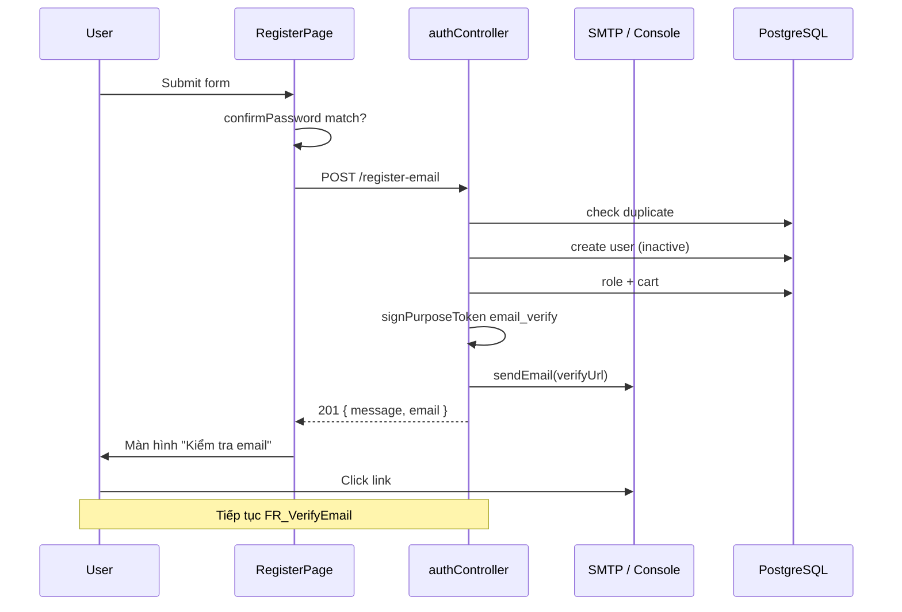

# Functional Requirement (FR) - Đăng ký kèm xác minh Email

## 1. Feature Overview

Cho phép khách tạo tài khoản trên **Laptop Store** với bước **xác minh email bắt buộc** trước khi có thể đăng nhập. Đây là luồng đăng ký **đang được frontend sử dụng** tại trang `/register`.

Luồng tóm tắt:

1. User điền form → `POST /api/auth/register-email`.
2. Backend tạo user **`is_active = false`**, gán role `customer`, tạo cart, gửi email chứa link xác nhận.
3. User bấm link trong email → `GET /api/auth/verify-email` (xem `FR_VerifyEmail.md`).
4. Sau verify, user được redirect và auto-login qua `/oauth/success?token=...`.

Khác biệt cốt lõi so với `FR_RegisterDirect.md`: **không trả JWT ngay** ở bước đăng ký; user **không login được** cho đến khi verify email.

---

## 2. Actors

| Actor | Mô tả |
|-------|-------|
| **Guest** | Người đăng ký qua form `/register` hoặc API |
| **Email System** | Nodemailer SMTP (hoặc skip + log link khi thiếu env) |
| **Frontend** | `RegisterPage.jsx` — form, validation client, màn hình "Kiểm tra email" |

---

## 3. Scope

### In Scope

- Form đăng ký: `full_name`, `username`, `email`, `phone_number`, `password`, `confirmPassword` (FE).
- Backend validation (`registerValidation` — **cùng rules** với register direct).
- Tạo user inactive, role, cart.
- Ký JWT purpose token `email_verify` và gửi email HTML/text.
- Màn hình FE "Kiểm tra email của bạn" sau submit thành công.
- Nút OAuth Google/Facebook trên cùng trang (luồng riêng, không qua endpoint này).

### Out of Scope

- Resend email verification (chưa có endpoint).
- Verify token processing → `FR_VerifyEmail.md`.
- Đăng nhập sau verify → redirect qua `OAuthSuccess.jsx`.
- Transaction ACID bọc user + role + cart + email.

---

## 4. Preconditions

- SMTP env đã cấu hình **hoặc** chấp nhận dev mode (log link ra console).
- `API_PUBLIC_URL` trỏ tới backend public (link trong email).
- Role `customer` tồn tại trong DB.
- Guest chưa có tài khoản trùng username/email/phone.

---

## 5. Validation Rules

### Backend (`registerValidation`)

| Field | Required | Rules |
|-------|----------|-------|
| `username` | Yes | 3–50 ký tự, trim |
| `email` | Yes | Email hợp lệ, normalize |
| `password` | Yes | ≥ 6 ký tự |
| `full_name` | No | max 100, trim |
| `phone_number` | Yes | Regex `^[+0-9][0-9\s\-()]{6,}$` |

### Frontend (`RegisterPage.jsx`)

| Field | Required | Rules bổ sung |
|-------|----------|---------------|
| `confirmPassword` | Yes | Phải khớp `password` — lỗi `"Mật khẩu không khớp"` |
| Tất cả field form | Yes | HTML5 `required`, password `minLength={6}` |

---

## 6. Business Rules

| # | Rule | Implementation |
|---|------|----------------|
| BR-01 | **Inactive until verified** | `User.create({ ..., is_active: false })` |
| BR-02 | **Không trả session token** | Response chỉ `{ message, email }` — status 201 |
| BR-03 | **Purpose token** | `signPurposeToken({ purpose: "email_verify", userId, email, expiresIn })` |
| BR-04 | **Token TTL** | `process.env.EMAIL_VERIFY_EXPIRES_IN \|\| "24h"` |
| BR-05 | **Verify URL** | `{API_PUBLIC_URL}/api/auth/verify-email?token={jwt}` — link trỏ **backend**, không phải FE |
| BR-06 | **Email fail-open (dev)** | `sendEmail()` nếu thiếu `EMAIL_*` env → log link, **không throw**, register vẫn 201 |
| BR-07 | **Cart + role** | Giống register direct: `customer` role + `Cart.create` |
| BR-08 | **Login blocked** | User inactive nhận `403 Account is inactive` khi gọi login |

---

## 7. API Contract

### Endpoint

```
POST /api/auth/register-email
```

**Auth:** Public.

### Request Body

```json
{
  "username": "kietpham",
  "email": "kiet@example.com",
  "password": "secret123",
  "full_name": "Kiệt Phạm",
  "phone_number": "0901234567"
}
```

### Response — 201 Created

```json
{
  "message": "Verification email sent",
  "email": "kiet@example.com"
}
```

**Không có** `token` hoặc `user` object.

### Response — 400 / 409

Giống `FR_RegisterDirect.md` (validation array / duplicate errors).

---

## 8. Email Content

Gửi qua `sendEmail()` trong `authController.js`:

| Thuộc tính | Giá trị |
|------------|---------|
| **To** | `user.email` |
| **Subject** | `"Xác nhận tài khoản"` |
| **Text** | Hướng dẫn + URL verify |
| **HTML** | Nút "Xác nhận" màu `#2563eb` |

**Verify URL format:**

```
{API_PUBLIC_URL}/api/auth/verify-email?token={encodeURIComponent(jwt)}
```

**Env liên quan email:**

| Biến | Mô tả |
|------|-------|
| `EMAIL_HOST` | SMTP host |
| `EMAIL_PORT` | SMTP port (number) |
| `EMAIL_SECURE` | `"true"` → TLS |
| `EMAIL_USER` / `EMAIL_PASS` | Credentials |
| `EMAIL_FROM` | From address (fallback `EMAIL_USER`) |
| `API_PUBLIC_URL` | Base URL backend cho link (default `http://localhost:5000`) |
| `EMAIL_VERIFY_EXPIRES_IN` | JWT TTL (default `24h`) |

---

## 9. Database Impact

| Bước | Bảng | Ghi chú |
|------|------|---------|
| 1 | `users` | INSERT, **`is_active = false`** |
| 2 | `user_roles` | customer role |
| 3 | `carts` | empty cart |

Không lưu verification token vào DB — stateless JWT.

---

## 10. End-to-End Flow



---

## 11. Frontend Behavior (`RegisterPage.jsx`)

### Route

```
/register
```

### Submit flow

1. Gọi `useRegisterEmailVerification().mutateAsync(payload)`.
2. Success → `setEmailSent(true)`, hiển thị email đã gửi.
3. Error → parse `response.data.errors[]` map vào `fieldErrors`; fallback `general` message.

### Màn hình sau khi gửi email

- Tiêu đề: "Kiểm tra email của bạn"
- Nút "Về trang đăng nhập" → `/login`
- Nút "Quay lại đăng ký" → reset form state

### OAuth trên cùng trang

- Google: redirect `{VITE_BACKEND_URL}/api/auth/google`
- Facebook: redirect `{VITE_BACKEND_URL}/api/auth/facebook`
- **Không** qua register-email — OAuth tạo/kích hoạt user theo logic Passport riêng.

### Hook & API

```javascript
// client/app/hooks/useAuth.js
useRegisterEmailVerification() → authAPI.registerEmail()

// client/app/services/api.js
registerEmail: (data) => api.post("/auth/register-email", data)
```

---

## 12. Error Handling (FE)

| HTTP | Xử lý UI |
|------|----------|
| 400 | Map `errors[].path/param` → field label |
| 409 | Hiển thị `DUPLICATE_*` messages dưới form |
| Network | `"Đăng ký thất bại. Vui lòng thử lại."` |

Axios interceptor **không** redirect `/login` khi register fail (chỉ exclude `/auth/login` và `/auth/register`, **không** exclude `/auth/register-email` — lỗi 401 hiếm nhưng sẽ không auto-redirect).

---

## 13. Edge Cases

| Case | Hành vi |
|------|---------|
| Email SMTP down | Exception → 500; user có thể đã tạo (inactive) |
| Dev không cấu hình email | Console log `[MAIL]` + full verify URL để test tay |
| User đăng ký lại email cũ (chưa verify) | 409 DUPLICATE_EMAIL |
| User verify rồi đăng ký lại | 409 DUPLICATE_EMAIL |
| Click link sau 24h | Token expired → redirect `/login?verify=invalid` |
| Cart created cho inactive user | Cart tồn tại; login/API cần active mới dùng được |

---

## 14. Security Considerations

- Không tiết lộ trong response liệu email có gửi thành công hay không ngoài message chung (register-email **luôn** báo sent nếu 201 — kể cả mail skipped dev).
- Verify token single-purpose (`purpose: "email_verify"`) — không dùng làm session token.
- Link verify đi qua backend để validate trước khi cấp session JWT.

---

## 15. Related Features

| FR | Quan hệ |
|----|---------|
| `FR_VerifyEmail.md` | Bước 2 bắt buộc |
| `FR_Login.md` | Blocked cho đến khi verify |
| `FR_RegisterDirect.md` | Luồng thay thế không verify |
| `OAuthSuccess.jsx` | Đích redirect sau verify thành công |

---

## 16. Source Files

| Layer | File |
|-------|------|
| Route | `server/routes/authRoutes.js` L33–37 |
| Controller | `server/controllers/authController.js` → `registerEmailVerification`, `sendEmail`, `signPurposeToken` |
| FE Page | `client/app/pages/RegisterPage.jsx` |
| FE Hook | `client/app/hooks/useAuth.js` → `useRegisterEmailVerification` |
| FE API | `client/app/services/api.js` → `authAPI.registerEmail` |

---

## 17. Acceptance Criteria

- **AC1:** Submit form hợp lệ tại `/register` → màn hình "Kiểm tra email", API 201.
- **AC2:** User mới có `is_active = false` trong DB.
- **AC3:** Login với user chưa verify → `403 Account is inactive`.
- **AC4:** Email (hoặc console dev) chứa link `{API_PUBLIC_URL}/api/auth/verify-email?token=...`.
- **AC5:** Trùng username/email/phone → 409 với errors chi tiết trên FE.
- **AC6:** `confirmPassword` không khớp → FE chặn submit, không gọi API.
- **AC7:** Cart và role customer được tạo cùng user inactive.
