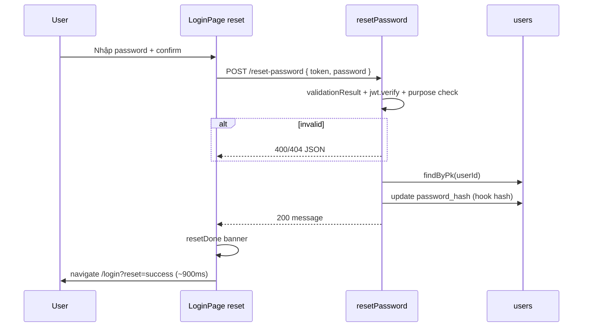

# Functional Requirement (FR) - Đặt lại mật khẩu (Reset Password — POST)

## 1. Feature Overview

Sau khi user nhận email quên mật khẩu (`FR_ForgotPassword.md`) và đi qua bước redirect (`FR_ResetPasswordVerifyRedirect.md`), frontend hiển thị form mật khẩu mới tại `/login?mode=reset&token=...`. **Bước hoàn tất** là gọi API:

```
POST /api/auth/reset-password
```

với body chứa **cùng JWT purpose** `password_reset` và mật khẩu mới (plain text). Backend verify token, tìm user, cập nhật `password_hash` (bcrypt qua Sequelize hook). **Không** cấp session JWT sau khi đổi mật khẩu — user phải đăng nhập lại.

Luồng tổng thể: Forgot → Email link → `GET /reset-password/verify` → FE form → **POST endpoint này** → `/login?reset=success`.

---

## 2. Actors

| Actor | Mô tả |
|-------|-------|
| **User** | Đã có token reset hợp lệ trên FE (từ query sau redirect) |
| **Frontend** | `LoginPage` mode `reset`, hook `useResetPassword` |
| **Backend** | `authController.resetPassword` + `resetPasswordValidation` |
| **Database** | Bảng `users` — cột `password_hash` |

---

## 3. Scope

### In Scope

- `POST /api/auth/reset-password` với `token`, `password`.
- Express-validator cho body.
- `jwt.verify` + kiểm tra `purpose === "password_reset"` và `userId`.
- `User.findByPk` + `user.update({ password_hash: password })` (hash trong `beforeUpdate` hook).
- Response JSON thành công / lỗi có cấu trúc rõ.

### Out of Scope

- Gửi email / tạo token → `FR_ForgotPassword.md`.
- GET verify redirect → `FR_ResetPasswordVerifyRedirect.md`.
- Đăng nhập tự động sau reset.
- Thu hồi token (one-time use) — token stateless, còn hiệu lực đến `exp`.
- Đổi mật khẩu khi đã đăng nhập (đổi mật khẩu trong profile) — **chưa có** endpoint riêng trong code hiện tại.

---

## 4. Preconditions

- User có JWT reset còn hạn (`PASSWORD_RESET_EXPIRES_IN`, mặc định `15m`).
- `JWT_SECRET` trùng với lúc ký token.
- User tương ứng `userId` trong token vẫn tồn tại trong DB.
- Mật khẩu mới đạt rule tối thiểu 6 ký tự (backend + frontend).

---

## 5. Validation Rules

### Backend (`resetPasswordValidation` — `server/routes/authRoutes.js`)

| Field | Required | Rules | Message mẫu |
|-------|----------|-------|-------------|
| `token` | Yes | `notEmpty()` | `"Token is required"` |
| `password` | Yes | `isLength({ min: 6 })` | `"Password must be at least 6 characters"` |

Sau validator, controller kiểm tra thêm:

- `token` rỗng → `400 { message: "Missing token" }` (phòng hờ ngoài validator).
- `jwt.verify` lỗi → `400 { message: "Invalid or expired token" }`.
- Sai purpose / thiếu `userId` trong payload → `400 { message: "Invalid token" }`.
- User không tồn tại → `404 { message: "User not found" }`.

### Frontend (`LoginPage.jsx` — `mode === "reset"`)

| Rule | Hành vi |
|------|---------|
| Thiếu `resetToken` (query) | Không gọi API; hiển thị `"Thiếu token đặt lại mật khẩu."` |
| `password.length < 6` | `"Mật khẩu phải có ít nhất 6 ký tự."` |
| `password !== confirmPassword` | `"Mật khẩu không khớp."` |

Submit: `useResetPassword().mutateAsync({ token: resetToken, password: resetForm.password })`.

---

## 6. Business Rules

| # | Rule | Implementation |
|---|------|----------------|
| BR-01 | **Purpose token only** | Chỉ chấp nhận JWT có `purpose: "password_reset"` |
| BR-02 | **Plain password → hook hash** | Gán plain vào `password_hash`; hook `beforeUpdate` gọi `bcrypt.hash` |
| BR-03 | **No session on success** | Response chỉ `{ message }`, không có `token` |
| BR-04 | **OAuth / null password** | User từng đăng nhập OAuth có `password_hash` null vẫn có thể set mật khẩu bằng flow này |
| BR-05 | **Inactive users** | Forgot password **vẫn gửi mail** cho `is_active=false` (theo `FR_ForgotPassword`); sau khi đặt mật khẩu, login vẫn bị chặn 403 `"Account is inactive"` cho đến khi kích hoạt |
| BR-06 | **Token không one-time** | Cùng token (còn hạn) có thể gọi POST nhiều lần → mật khẩu được ghi đè |

---

## 7. API Contract

### Endpoint

```
POST /api/auth/reset-password
```

**Auth:** Public (Bearer **không** dùng; dùng `token` trong body).

### Request Body

```json
{
  "token": "<jwt purpose password_reset>",
  "password": "newSecret456"
}
```

### Response — 200 OK

```json
{
  "message": "Password updated successfully"
}
```

### Response — 400 Bad Request

**Validator:**

```json
{
  "errors": [
    { "msg": "Token is required", "path": "token", "location": "body" },
    { "msg": "Password must be at least 6 characters", "path": "password", "location": "body" }
  ]
}
```

**Logic:**

```json
{ "message": "Missing token" }
```
```json
{ "message": "Invalid or expired token" }
```
```json
{ "message": "Invalid token" }
```

### Response — 404 Not Found

```json
{ "message": "User not found" }
```

### Response — 500

Lỗi không xử lý → `next(error)` → middleware lỗi chung.

---

## 8. Password Hashing (`User` model)

File: `server/models/User.js`

- `beforeUpdate`: nếu `password_hash` đổi → `bcrypt.hash(..., 10)`.
- `beforeCreate`: tương tự nếu có `password_hash`.

Do đó controller **không** gọi bcrypt trực tiếp.

---

## 9. Processing Flow



---

## 10. Frontend Behavior

### Routes & state

- URL kích hoạt form: `/login?mode=reset&token=<jwt>`
- Sau thành công: `navigate("/login?reset=success", { replace: true })`
- Trang login thường: banner xanh khi `reset=success` (copy UX trong code).

### Hook & API layer

```text
useResetPassword → authAPI.resetPassword({ token, password }) → POST /auth/reset-password
```

(`api.js`: `baseURL` = `VITE_API_URL || http://localhost:5000/api` → path `/auth/reset-password`.)

---

## 11. Database Impact

| Operation | Thay đổi |
|-----------|----------|
| Thành công | `UPDATE users SET password_hash = ?, updated_at = ? WHERE user_id = ?` |
| Không có | Không đổi `last_login`, không đổi `is_active` |

---

## 12. Environment Variables

| Biến | Vai trò |
|------|---------|
| `JWT_SECRET` | Verify JWT reset |
| `PASSWORD_RESET_EXPIRES_IN` | TTL khi **tạo** token (forgot-password) — không đọc lại trong POST |

---

## 13. Edge Cases

| Case | Hành vi |
|------|---------|
| Token hết hạn | 400 Invalid or expired token |
| Session JWT pasted làm reset token | 400 Invalid token (thiếu/sai purpose) |
| Email verify token | 400 Invalid token |
| User bị admin xóa giữa lúc | 404 User not found |
| Hai tab cùng submit | Cả hai đều có thể 200 nếu trong TTL |
| Mật khẩu mới giống cũ về mặt plaintext | Vẫn update → hook vẫn hash (hash string khác từng lần do salt bcrypt) |

---

## 14. Security Considerations

- Token trong **body POST** giảm lộ so với URL sau bước redirect; tuy vẫn đã qua query ở bước GET verify.
- Không revoke token sau use — có rủi ro reuse trong cửa sổ TTL.
- HTTPS bắt buộc production.
- Không có rate limit trên endpoint.

---

## 15. Known Gaps (code hiện tại)

1. **`?mode=reset&error=*`** từ redirect không có banner đặc thù trên FE (đã note trong `FR_ResetPasswordVerifyRedirect.md`).
2. **Không invalidate** JWT reset sau POST thành công.

---

## 16. Related Features

| FR / Doc | Quan hệ |
|----------|---------|
| `FR_ForgotPassword.md` | Tạo token |
| `FR_ResetPasswordVerifyRedirect.md` | Đưa token lên FE |
| `FR_Login.md` | Đăng nhập sau `?reset=success` |

---

## 17. Source Files

| Layer | File |
|-------|------|
| Route + validation | `server/routes/authRoutes.js` (POST `/reset-password`, `resetPasswordValidation`) |
| Controller | `server/controllers/authController.js` → `resetPassword` |
| Model / hash | `server/models/User.js` — hooks `beforeUpdate` / `beforeCreate` |
| FE Page | `client/app/pages/LoginPage.jsx` — `handleResetSubmit`, `mode === "reset"` |
| FE Hook | `client/app/hooks/useAuth.js` → `useResetPassword` |
| FE API | `client/app/services/api.js` → `authAPI.resetPassword` |

---

## 18. Acceptance Criteria

- **AC1:** Body hợp lệ + token đúng purpose + user tồn tại → 200 và mật khẩu mới dùng được khi login.
- **AC2:** Token sai/hết hạn → 400 với message phù hợp.
- **AC3:** User không tồn tại → 404.
- **AC4:** Password &lt; 6 ký tự → 400 validator.
- **AC5:** FE validation khớp BE (min 6, confirm match, token query).
- **AC6:** Sau success, không có JWT session trong response; user phải login thủ công.
