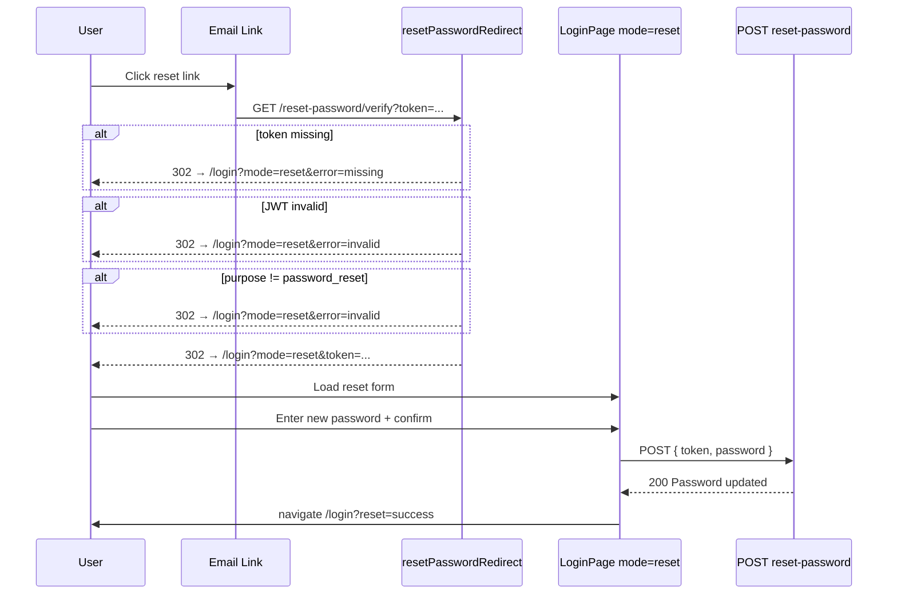

# Functional Requirement (FR) - Xác minh Token Reset Password (Redirect)

## 1. Feature Overview

Endpoint **cầu nối (bridge)** giữa email "Quên mật khẩu" và form đặt mật khẩu mới trên frontend. Khi user bấm link trong email (`FR_ForgotPassword.md`), browser gọi:

```
GET /api/auth/reset-password/verify?token=<jwt>
```

Backend **không** đổi mật khẩu tại bước này — chỉ:

1. Validate JWT purpose `password_reset`.
2. Redirect browser tới frontend với token còn nguyên trong query string.

Frontend `/login?mode=reset&token=...` hiển thị form nhập mật khẩu mới và gọi `POST /api/auth/reset-password` để hoàn tất.

Pattern **giống hệt** `FR_VerifyEmail.md` (email verify redirect), nhưng purpose token và đích FE khác.

---

## 2. Actors

| Actor | Mô tả |
|-------|-------|
| **User** | Click link reset trong email |
| **Browser** | Follow HTTP 302 redirect chain |
| **Backend** | Validate JWT, redirect — **no password change** |
| **Frontend** | `LoginPage` mode `reset` — form password mới |

---

## 3. Scope

### In Scope

- `GET /api/auth/reset-password/verify?token=`
- JWT verify + purpose check
- Success redirect: `{FE}/login?mode=reset&token={encodedJwt}`
- Error redirect: `{FE}/login?mode=reset&error={code}`
- FE đọc `token` query → submit `POST /api/auth/reset-password`

### Out of Scope

- Gửi email forgot → `FR_ForgotPassword.md`
- Hash và lưu password → `POST /api/auth/reset-password` (`authController.resetPassword`)
- Auto-login sau reset (user phải login thủ công)
- Invalidate purpose token sau dùng

---

## 4. Preconditions

- User đã request forgot password và nhận email.
- Token còn hạn (`PASSWORD_RESET_EXPIRES_IN`, default 15 phút).
- `JWT_SECRET` consistent.
- Frontend route `/login` hỗ trợ `mode=reset`.

---

## 5. Token Specification

Tạo bởi `forgotPassword`:

```javascript
signPurposeToken({
  purpose: "password_reset",
  userId: user.user_id,
  email: user.email,
  expiresIn: process.env.PASSWORD_RESET_EXPIRES_IN || "15m",
})
```

| Claim | Required | Value |
|-------|----------|-------|
| `purpose` | Yes | `"password_reset"` |
| `userId` | Yes | Integer PK |
| `email` | Yes | String |
| `exp` | Auto | ~15 minutes |

**Không được nhầm với:**
- Session JWT (`{ userId }`, 7d, no purpose)
- Email verify token (`purpose: "email_verify"`, 24h)

---

## 6. API Contract

### Endpoint

```
GET /api/auth/reset-password/verify?token={jwt}
```

**Auth:** Public.

**Response:** HTTP redirect (`302`) — **không có JSON body**.

### Success Redirect

```
{FRONTEND_URL}/login?mode=reset&token={encodeURIComponent(jwt)}
```

Token được **forward nguyên** sang FE để dùng cho bước `POST /reset-password`.

**Frontend base URL:**

```javascript
getFrontendBaseUrl() =
  (FRONTEND_URL || CLIENT_URL || "http://localhost:3000").replace(/\/$/, "")
```

### Error Redirects

| Điều kiện | URL |
|-----------|-----|
| Missing `token` query | `{FE}/login?mode=reset&error=missing` |
| JWT verify fail (expired/invalid) | `{FE}/login?mode=reset&error=invalid` |
| Wrong purpose hoặc missing `userId` | `{FE}/login?mode=reset&error=invalid` |
| Unhandled exception | `{FE}/login?mode=reset&error=error` |

**Lưu ý:** Error codes đặt trên `mode=reset` (không phải `verify=` như email verify).

---

## 7. Business Rules

| # | Rule | Chi tiết |
|---|------|----------|
| BR-01 | **Validate only** | Không `User.update`, không đổi `password_hash` |
| BR-02 | **Pass-through token** | Cùng JWT string chuyển sang FE query param |
| BR-03 | **No session issued** | Không gọi `generateToken()` tại bước này |
| BR-04 | **Separate completion step** | Password change chỉ qua POST với body `{ token, password }` |
| BR-05 | **User existence deferred** | Redirect success **không** check user còn tồn tại — check ở POST reset |

---

## 8. Processing Flow



---

## 9. Frontend Behavior (`LoginPage.jsx`)

### Activation

URL: `/login?mode=reset&token=<jwt>`

Detect:
```javascript
const mode = searchParams.get("mode") // "reset"
const resetToken = searchParams.get("token") // JWT string
```

### Reset form

| Field | Validation |
|-------|------------|
| `password` | required, min 6 |
| `confirmPassword` | must match password |

Submit → `useResetPassword().mutateAsync({ token: resetToken, password })`.

### Client-side errors (before API)

- Missing token: `"Thiếu token đặt lại mật khẩu."`
- Password < 6: `"Mật khẩu phải có ít nhất 6 ký tự."`
- Mismatch: `"Mật khẩu không khớp."`

### Success flow

1. `setResetDone(true)` — "Đổi mật khẩu thành công..."
2. After 900ms → `navigate("/login?reset=success", { replace: true })`
3. Login page hiển thị banner xanh: "Đổi mật khẩu thành công. Vui lòng đăng nhập bằng mật khẩu mới."

### Error from API (POST reset)

- `400 Invalid or expired token` — token hết hạn sau redirect
- `404 User not found` — user đã bị xóa
- Display: `resetPassword.error.response.data.message`

### Error query `?mode=reset&error=*`

**Hiện trạng code:** LoginPage **không** parse/hiển thị banner riêng cho `error=missing|invalid` trên mode reset — user có thể thấy form reset nhưng thiếu token hoặc submit fail. *(Gap documented — có thể bổ sung UX sau.)*

---

## 10. Downstream API (POST reset-password)

Endpoint hoàn tất luồng (reference — không thuộc scope verify redirect nhưng bắt buộc để hiểu E2E):

```
POST /api/auth/reset-password
```

**Body:**
```json
{
  "token": "<same jwt from query>",
  "password": "newSecret456"
}
```

**Success 200:**
```json
{ "message": "Password updated successfully" }
```

**Logic (`resetPassword`):**
1. Validate body (`resetPasswordValidation`)
2. `jwt.verify(token)` + purpose check
3. `User.findByPk(decoded.userId)`
4. `user.update({ password_hash: password })` — hook hash bcrypt

**Không** auto-login sau success.

---

## 11. Comparison: Verify Redirect Patterns

| Aspect | Email Verify | Password Reset Verify |
|--------|--------------|----------------------|
| Endpoint | `/verify-email` | `/reset-password/verify` |
| Purpose | `email_verify` | `password_reset` |
| TTL | 24h | 15m |
| Success redirect | `/oauth/success?token=sessionJwt` | `/login?mode=reset&token=purposeJwt` |
| Issues session? | Yes (new 7d JWT) | No |
| DB change on GET | `is_active=true` | None |
| Final action | Auto login | User submits new password |

---

## 12. Database Impact

**Tại GET verify redirect:** Không có thay đổi DB.

**Sau POST reset-password:** UPDATE `users.password_hash` (bcrypt via hook).

---

## 13. Environment Variables

| Biến | Role |
|------|------|
| `JWT_SECRET` | Verify purpose token |
| `PASSWORD_RESET_EXPIRES_IN` | Token TTL (default `15m`) |
| `FRONTEND_URL` / `CLIENT_URL` | Redirect target |
| `API_PUBLIC_URL` | Used when **building** email link in forgot-password |

---

## 14. Edge Cases

| Case | Hành vi |
|------|---------|
| Token expired trước khi user mở link | Redirect `error=invalid` |
| Token expired sau redirect, trước POST | POST 400 `Invalid or expired token` |
| User mở link trên thiết bị khác | OK — token không bind device |
| Click link 2 lần | Cả 2 lần redirect success với cùng token (until exp) |
| Email verify token gửi nhầm endpoint này | `error=invalid` (wrong purpose) |
| Session JWT paste vào verify | `error=invalid` (no purpose / wrong purpose) |

---

## 15. Security Considerations

- Purpose separation prevents using verify/reset/session tokens interchangeably.
- Token exposed twice: email URL + FE URL query — minimize time in browser history.
- GET endpoint idempotent — không mutate state (safe for prefetch hơn verify email activate).
- 15-minute window limits exposure.
- No one-time use — token valid until expiry for multiple POST attempts.
- HTTPS mandatory production.

---

## 16. Related Features

| FR | Quan hệ |
|----|---------|
| `FR_ForgotPassword.md` | Tạo token + email link trỏ tới endpoint này |
| `FR_Login.md` | Bước cuối sau `?reset=success` |
| `FR_VerifyEmail.md` | Cùng redirect pattern, khác outcome |

---

## 17. Source Files

| Layer | File |
|-------|------|
| Route | `server/routes/authRoutes.js` L41–44 |
| Controller | `server/controllers/authController.js` → `resetPasswordRedirect`, `resetPassword` |
| FE Page | `client/app/pages/LoginPage.jsx` — `mode === "reset"` |
| FE Hook | `client/app/hooks/useAuth.js` → `useResetPassword` |
| FE API | `client/app/services/api.js` → `authAPI.resetPassword` |
| Model | `server/models/User.js` — `beforeUpdate` password hash |

---

## 18. Acceptance Criteria

- **AC1:** Link hợp lệ từ email forgot → browser URL `{FE}/login?mode=reset&token=...`.
- **AC2:** Token invalid/expired tại GET → redirect `{FE}/login?mode=reset&error=invalid`.
- **AC3:** Missing token tại GET → redirect `error=missing`.
- **AC4:** GET verify **không** thay đổi `password_hash` trong DB.
- **AC5:** FE submit password mới + token → POST 200 → redirect login success banner.
- **AC6:** Sau full flow, login với password mới thành công; password cũ fail.
- **AC7:** Token `email_verify` gửi vào endpoint này → redirect error invalid.

---

## 19. Known Gaps (code hiện tại)

1. **FE không hiển thị** message cho `?mode=reset&error=*` từ redirect — user experience kém khi link hết hạn.
2. **Không invalidate** reset token sau POST thành công — token còn hạn có thể reset lại (idempotent password set).
3. **Không auto-login** sau reset — user phải nhập lại credentials (by design hiện tại).
