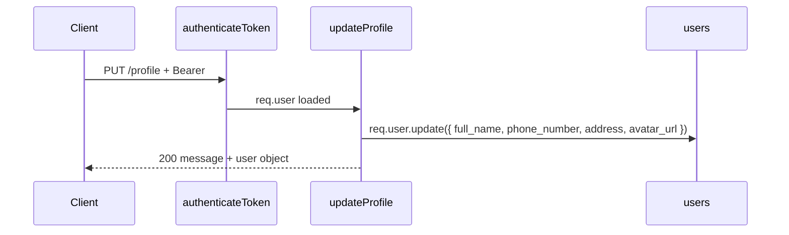

# Functional Requirement (FR) — Cập nhật hồ sơ (Update Profile)

## 1. Feature Overview

API **`PUT /api/auth/profile`** cho phép user đã đăng nhập cập nhật một số trường hồ sơ: `full_name`, `phone_number`, `address`, `avatar_url`. Username và email **không** đổi qua endpoint này (không có trong controller).

Yêu cầu **JWT Bearer**; sau cập nhật, response trả về object `user` đã refresh từ instance `req.user` (Sequelize).

**Hiện trạng frontend:** `ProfilePage.jsx` chỉ **hiển thị** dữ liệu từ Redux — **chưa có** form gọi `PUT /api/auth/profile`. File `api.js` **chưa** export `authAPI.updateProfile`. Tài liệu này mô tả **hợp đồng và logic backend đang chạy**, và ghi rõ gap FE.

---

## 2. Actors

| Actor | Mô tả |
|-------|-------|
| **Authenticated User** | customer / admin / manager (bất kỳ ai có JWT hợp lệ) |
| **Backend** | `authenticateToken` + `authController.updateProfile` |
| **Frontend (tương lai / client khác)** | Gọi PUT với Bearer token |

---

## 3. Scope

### In Scope

- `PUT /api/auth/profile`
- Fields: `full_name`, `phone_number`, `address`, `avatar_url` (từ `req.body`)
- `authenticateToken`
- Response message + subset user fields

### Out of Scope

- Validation express-validator trên route (hiện **không** có rule trong `authRoutes.js`).
- Đổi email / username / password.
- Upload file avatar — chỉ nhận **URL string** trong `avatar_url` (đồng bộ `docs/engineering_rules/commerce-object-storage.md`).
- Kiểm tra trùng `phone_number` với user khác — Sequelize/DB unique có thể ném lỗi 500 hoặc unique violation tùy cấu hình.

---

## 4. Preconditions

- JWT session hợp lệ, user active (`authenticateToken`).
- Body JSON (middleware `express.json()`).

---

## 5. API Contract

### Endpoint

```
PUT /api/auth/profile
```

**Headers:** `Authorization: Bearer <jwt>`  
**Content-Type:** `application/json`

### Request Body (tất cả optional về ý nghĩa nghiệp vụ — gửi field nào tùy client)

```json
{
  "full_name": "Nguyen Van A",
  "phone_number": "0909123456",
  "address": "Số nhà ..., phường ..., tỉnh ...",
  "avatar_url": "https://example.com/avatar.jpg"
}
```

### Response — 200 OK

```json
{
  "message": "Profile updated successfully",
  "user": {
    "user_id": 1,
    "username": "kiet_shop",
    "email": "kiet@example.com",
    "full_name": "Nguyen Van A",
    "phone_number": "0909123456",
    "address": "Số nhà ..., phường ..., tỉnh ...",
    "avatar_url": "https://example.com/avatar.jpg"
  }
}
```

**Lưu ý:** `user` trong response lấy từ **`req.user`** sau `update()` — Sequelize reload instance trong bộ nhớ; các field không gửi trong body vẫn giữ giá trị cũ trên instance.

### Response — 401 / 403

Giống middleware `authenticateToken` (thiếu token, invalid, inactive).

### Response — 500 / DB error

Unique constraint `phone_number` trùng user khác → có thể lỗi chưa được map sang 409 trong code hiện tại.

---

## 6. Business Rules

| # | Rule | Chi tiết |
|---|------|----------|
| BR-01 | **Partial update theo object** | Controller truyền trực tiếp 4 key từ `req.body` vào `update()` |
| BR-02 | **Undefined trong Sequelize** | Thuộc tính `undefined` thường không ghi SQL; field không gửi — giữ nguyên DB (hành vi Sequelize chuẩn) |
| BR-03 | **Không đổi auth identity** | `username`, `email` không xử lý |
| BR-04 | **Roles không trả về** | Response user **không** có mảng `roles` (khác `GET /me`) |
| BR-05 | **avatar_url** | Chuỗi URL — không validate format trong controller |

---

## 7. Model Constraints (`User.js`)

| Field | Ghi chú |
|-------|---------|
| `phone_number` | `allowNull: true`, `unique: true` — hai user cùng SĐT → vi phạm unique |
| `full_name` | STRING(100) |
| `address` | TEXT |
| `avatar_url` | STRING(255) |

**Typo trong model:** `vialidate` (không phải `validate`) — rule regex phone có thể không áp dụng ở tầng Sequelize như ý định.

---

## 8. Processing Flow



---

## 9. Frontend — Hiện trạng & Gợi ý tích hợp

| Mục | Trạng thái |
|-----|------------|
| `PUT` trong `authAPI` | **Chưa có** trong `client/app/services/api.js` |
| `ProfilePage` | Read-only Redux `state.auth.user` |
| Sau khi sửa (khi implement) | Nên `dispatch` cập nhật user hoặc `invalidateQueries` `["me"]` / `["currentUser"]` để khớp `GET /auth/me` |

Ví dụ thêm sau này (không có trong repo hiện tại):

```javascript
updateProfile: (data) => api.put("/auth/profile", data),
```

---

## 10. Related Documentation

| Tài liệu | Nội dung |
|----------|----------|
| `READMEAPI.md` | Mô tả PUT profile |
| `docs/master_specification.md` | Endpoint catalog |
| `docs/engineering_rules/api-standard.md` | Chuẩn REST |
| `FR_GetCurrentUser.md` | Lấy đầy đủ user + roles sau khi update |

---

## 11. Edge Cases

| Case | Hành vi mong đợi (hiện tại) |
|------|------------------------------|
| Body rỗng `{}` | Có thể không đổi row; vẫn 200 |
| `phone_number` trùng user khác | Lỗi DB / 500 |
| User OAuth, `phone_number` null | Cho phép set lần đầu nếu unique OK |
| Token hết hạn giữa chừng | 401 + interceptor FE redirect login |

---

## 12. Source Files

| Layer | File |
|-------|------|
| Route | `server/routes/authRoutes.js` — `router.put("/profile", authenticateToken, authController.updateProfile)` |
| Controller | `server/controllers/authController.js` → `updateProfile` |
| Middleware | `server/middleware/auth.js` |
| Model | `server/models/User.js` |
| FE (read-only) | `client/app/pages/ProfilePage.jsx` |

---

## 13. Acceptance Criteria

- **AC1:** Bearer hợp lệ + body hợp lệ → 200 + message + user object (5 field profile + id + username + email).
- **AC2:** Không Bearer → 401.
- **AC3:** Inactive user → 403 tại middleware.
- **AC4:** Cập nhật phản ánh sau khi gọi lại `GET /api/auth/me` (trừ khi lỗi cache phía client).
- **AC5:** Ghi nhận rõ: **FE chưa có UI/API wrapper** cho PUT profile trong code hiện tại.
