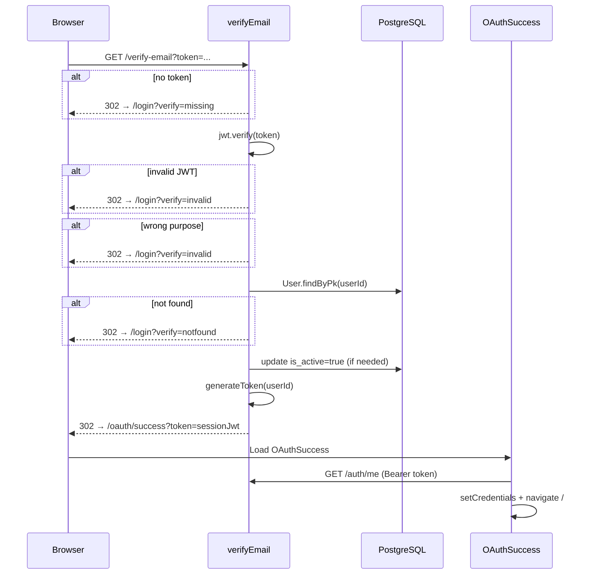

# Functional Requirement (FR) - Xác minh Email (Verify Email)

## 1. Feature Overview

Xử lý **link xác nhận** trong email đăng ký (`FR_RegisterEmailVerification.md`). Đây là endpoint **GET server-side redirect** — không trả JSON cho client SPA trực tiếp, mà:

1. Validate JWT purpose `email_verify`.
2. Kích hoạt tài khoản (`is_active = true`) nếu đang inactive.
3. Cấp **session JWT** (7 ngày).
4. Redirect browser tới frontend `/oauth/success?token=...` để hoàn tất đăng nhập.

User **không** cần nhập lại username/password sau khi bấm link email — flow tương tự OAuth success callback.

---

## 2. Actors

| Actor | Mô tả |
|-------|-------|
| **Guest / New User** | Người vừa đăng ký, mở email và click link xác nhận |
| **Browser** | Thực hiện GET redirect chain BE → FE |
| **Backend** | Validate token, activate user, issue session JWT |
| **Frontend** | `OAuthSuccess.jsx` nhận token, gọi `/auth/me`, vào app |

---

## 3. Scope

### In Scope

- `GET /api/auth/verify-email?token=<jwt>`
- JWT validation (`purpose === "email_verify"`, có `userId`)
- Idempotent activate: nếu đã active vẫn cấp token và redirect success
- Redirect lỗi về `/login?verify=<code>`
- FE banner lỗi trên `LoginPage` theo query `verify`

### Out of Scope

- Gửi email (thuộc register-email).
- Resend verification link.
- JSON API verify cho mobile app (chưa có).
- Invalidate purpose token sau dùng (JWT vẫn verify được đến khi hết hạn — click lại link vẫn redirect success nếu user tồn tại).

---

## 4. Preconditions

- User đã tạo qua `POST /api/auth/register-email` với `is_active = false`.
- Token còn hạn (`EMAIL_VERIFY_EXPIRES_IN`, default 24h).
- `JWT_SECRET` khớp lúc ký token.
- `FRONTEND_URL` / `CLIENT_URL` cấu hình đúng cho redirect.

---

## 5. Token Specification

Token được tạo bởi `signPurposeToken()`:

```javascript
jwt.sign(
  { purpose: "email_verify", userId, email },
  JWT_SECRET,
  { expiresIn: process.env.EMAIL_VERIFY_EXPIRES_IN || "24h" }
)
```

| Claim | Mô tả |
|-------|-------|
| `purpose` | Bắt buộc `"email_verify"` |
| `userId` | PK `users.user_id` |
| `email` | Email lúc đăng ký (informational) |
| `exp` | TTL theo env |

**Khác session JWT:** Session token chỉ có `{ userId }`, expires `7d`, không có `purpose`.

---

## 6. API Contract

### Endpoint

```
GET /api/auth/verify-email?token={jwt}
```

**Auth:** Public (token trong query string).

**Response type:** `302 Redirect` (Express `res.redirect`) — **không phải JSON**.

### Success Redirect

```
{FRONTEND_URL}/oauth/success?token={sessionJwt}
```

Trong đó `sessionJwt = generateToken(user.user_id)` — cùng hàm với login.

**Env frontend base:**

```javascript
process.env.FRONTEND_URL || process.env.CLIENT_URL || "http://localhost:3000"
```

### Error Redirects

| Điều kiện | Redirect URL |
|-----------|--------------|
| Thiếu `token` query | `{FE}/login?verify=missing` |
| JWT invalid/expired | `{FE}/login?verify=invalid` |
| `purpose !== "email_verify"` hoặc thiếu `userId` | `{FE}/login?verify=invalid` |
| User không tồn tại | `{FE}/login?verify=notfound` |
| Exception không mong đợi | `{FE}/login?verify=error` |

---

## 7. Business Rules

| # | Rule | Chi tiết |
|---|------|----------|
| BR-01 | **Activate once** | `if (!user.is_active) await user.update({ is_active: true })` |
| BR-02 | **Idempotent verify** | User đã active vẫn redirect success + token mới |
| BR-03 | **No JSON body** | Toàn bộ UX qua HTTP redirect |
| BR-04 | **Reuse OAuth success page** | Cùng `/oauth/success` với Google/Facebook callback |
| BR-05 | **Token in URL** | Session JWT exposed trong query — xóa khỏi URL sau khi FE xử lý (OAuthSuccess dùng `replace: true` navigate) |

---

## 8. Processing Flow



---

## 9. Frontend Integration

### `OAuthSuccess.jsx` (`/oauth/success`)

Shared với OAuth social login:

1. Đọc `token` từ query string.
2. Set `api.defaults.headers.Authorization` + `localStorage.token`.
3. `GET /auth/me` → `dispatch(setCredentials({ token, user }))`.
4. Kiểm tra `pendingCheckout` → redirect `/checkout` nếu có.
5. Ngược lại → `navigate("/", { replace: true })`.
6. Fail → `/login?oauth=failed`.

**Lưu ý:** Verify email success **không** set `localStorage.roles` trực tiếp — roles lấy từ `/auth/me` response (`user.roles`).

### `LoginPage.jsx` — error banner

Query param `verify` → message tiếng Việt:

| `verify` | Banner |
|----------|--------|
| `missing` | "Thiếu thông tin xác nhận." |
| `invalid` | "Link xác nhận không hợp lệ hoặc đã hết hạn." |
| `notfound` | "Tài khoản không tồn tại." |
| `error` | "Xác nhận thất bại. Vui lòng thử lại." |

### `RegisterPage.jsx` — legacy token handler

Có `useEffect` đọc `?token=` trên `/register` (OAuth cũ) — **không** dùng cho verify email (verify redirect tới `/oauth/success`, không phải `/register`).

---

## 10. Database Impact

| Thao tác | Bảng | Field |
|----------|------|-------|
| UPDATE (conditional) | `users` | `is_active = true` |

Không ghi log verification, không xóa/invalidate token.

---

## 11. Environment Variables

| Biến | Mục đích | Default |
|------|----------|---------|
| `JWT_SECRET` | Verify + sign tokens | `"your-secret-key"` |
| `EMAIL_VERIFY_EXPIRES_IN` | TTL purpose token | `"24h"` |
| `FRONTEND_URL` / `CLIENT_URL` | Redirect target | `http://localhost:3000` |
| `API_PUBLIC_URL` | *(Chỉ dùng lúc gửi email)* | `http://localhost:5000` |

---

## 12. Edge Cases

| Case | Hành vi |
|------|---------|
| Click link 2 lần | Lần 2 vẫn success (user đã active) |
| Token hết hạn | `verify=invalid` |
| Token `password_reset` gửi nhầm vào endpoint này | `verify=invalid` (wrong purpose) |
| User bị admin deactivate sau verify | Login/`/auth/me` → 403 inactive |
| Email client prefetch link | Có thể activate sớm (known email-client issue) — chưa mitigate |

---

## 13. Security Considerations

- Purpose claim ngăn dùng session JWT hoặc reset token cho verify endpoint.
- JWT trong URL có thể lộ qua Referer logs — session token ngắn hạn trong browser history.
- Không có one-time use nonce — token còn hạn có thể tái sử dụng.
- HTTPS bắt buộc production cho email link và redirect chain.

---

## 14. Related Features

| FR | Quan hệ |
|----|---------|
| `FR_RegisterEmailVerification.md` | Tạo token + gửi email |
| `FR_Login.md` | Cách login thay thế sau verify |
| `FR_ResetPasswordVerifyRedirect.md` | Pattern redirect tương tự, purpose khác |
| `OAuthSuccess.jsx` | Đích redirect thành công |

---

## 15. Source Files

| Layer | File |
|-------|------|
| Route | `server/routes/authRoutes.js` L38 |
| Controller | `server/controllers/authController.js` → `verifyEmail`, `generateToken`, `getFrontendBaseUrl` |
| FE Success | `client/app/pages/OAuthSuccess.jsx` |
| FE Error UI | `client/app/pages/LoginPage.jsx` → `verifyBanner` |
| Mount | `server/server.js` |

---

## 16. Acceptance Criteria

- **AC1:** Link hợp lệ từ email → browser land tại `/oauth/success`, user đã đăng nhập (có thể gọi API authenticated).
- **AC2:** `users.is_active` chuyển từ `false` → `true` sau verify lần đầu.
- **AC3:** Token thiếu/hết hạn → `/login` hiển thị banner lỗi tương ứng.
- **AC4:** User không tồn tại → `verify=notfound`.
- **AC5:** Sau verify, `GET /auth/me` trả user với roles từ DB.
- **AC6:** Verify thành công + có `pendingCheckout` → redirect checkout (logic OAuthSuccess).
