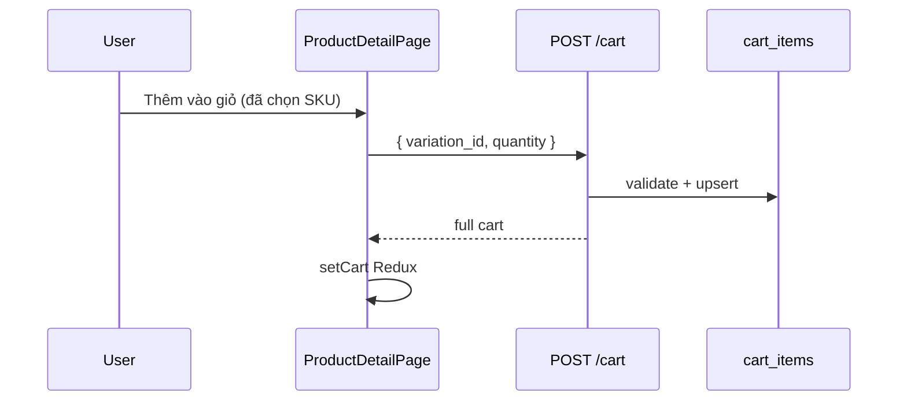

# Functional Requirement (FR) — Thêm vào giỏ hàng (Add to Cart)

## 1. Feature Overview

User **đã đăng nhập** thêm một **biến thể (SKU)** vào giỏ với số lượng cho trước. API:

```
POST /api/cart
Body: { variation_id, quantity? }
```

Logic: kiểm tra tồn tại variation, `is_available`, stock; **upsert** theo `(cart_id, variation_id)` — nếu đã có dòng cùng SKU thì **cộng quantity**; response luôn là **full cart** (`getCart`).

**Điểm vào chính:** `ProductDetailPage` → `useAddToCart().mutate`. Cũng dùng khi **đổi cấu hình** trên giỏ (add SKU mới trước khi xóa cũ).

---

## 2. Actors

| Actor | Mô tả |
|-------|-------|
| **Authenticated Customer** | Thêm từ PDP hoặc Cart (đổi cấu hình) |
| **Guest** | PDP redirect login + `pendingCheckout` (buy now path) — **không** gọi POST cart |
| **Backend** | `addToCart` |

---

## 3. Scope

### In Scope

- Validation stock / availability.
- `findOrCreate` CartItem.
- Trả lại toàn bộ giỏ sau add.
- FE: `useAddToCart` → `dispatch(setCart)` + invalidate `["cart", user_id]`.

### Out of Scope

- Redux-only `addItem` (`ProductRecommendations`) — không gọi API.
- Guest local cart persistence.

---

## 4. API Contract

### Request

```json
{
  "variation_id": 42,
  "quantity": 2
}
```

`quantity` default `1` nếu omitted.

### Response — 200

Cùng structure `GET /api/cart` (`{ cart: { ... } }`).

### Errors

| Status | Message / case |
|--------|----------------|
| 404 | `Product variation not found` |
| 400 | `Product not available or insufficient stock` (lần add đầu) |
| 400 | `Insufficient stock` (khi merge quantity vượt stock) |
| 401/403 | Auth middleware |

---

## 5. Backend Logic

```text
1. findByPk(variation_id) + include Product
2. if !is_available OR stock < quantity → 400
3. getOrCreateCart(user_id)
4. findOrCreate CartItem { cart_id, variation_id }
   defaults: { quantity, price_at_add: variation.price }
5. if !created:
     newQty = ci.quantity + quantity
     if newQty > stock → 400
     ci.quantity = newQty
     // price_at_add KHÔNG cập nhật (comment OPTIONAL trong code)
     save
6. return getCart(req,res)
```

| # | Rule |
|---|------|
| BR-01 | **Một dòng per variation** per cart (upsert key) |
| BR-02 | **price_at_add** snapshot lúc tạo dòng; merge qty giữ snapshot cũ |
| BR-03 | **Không add** SKU unavailable hoặc thiếu stock |

---

## 6. Frontend — Product Detail

`handleAddToCart` (sau validation cấu hình):

1. `isReady && matched` variation.
2. Stock checks client-side.
3. Nếu **chưa login** → `pendingCheckout` + `/login?redirect=/checkout` (buy-now style, **không** POST cart).
4. Nếu login → `addToCart.mutate({ variation_id, quantity })`.
5. 401 → redirect login.

**Không** navigate tới `/cart` tự động sau add (user ở lại PDP).

---

## 7. Frontend — Hook

```javascript
// useAddToCart
api.post("/cart", { variation_id, quantity })
onSuccess: dispatch(setCart(data.cart)); invalidateQueries(["cart", userId])
```

---

## 8. Integration Header

Sau login, `useLogin` `refetchQueries(["cart"])` — giỏ server load lại.

---

## 9. Sequence Diagram



---

## 10. Edge Cases

| Case | Hành vi |
|------|---------|
| Add cùng variation 2 lần | Quantity tăng, 1 dòng |
| Add 2 variation khác nhau | 2 dòng |
| Stock = 1, add qty 2 lần | Lần 2 có thể 400 Insufficient stock |
| Variation price đổi sau add | UI dùng discount hiện tại; snapshot `price_at_add` cũ |

---

## 11. Related Features

| FR | Quan hệ |
|----|---------|
| `FR_ViewCart.md` | Hiển thị sau add |
| `FR_UpdateCartItemQuantity.md` | Sửa qty thay vì add lại |
| `FR_ChangeCartItemVariation.md` | Add SKU mới + delete cũ |
| `FR_SelectProductVariation.md` | Chọn SKU trước khi add |

---

## 12. Source Files

| Layer | File |
|-------|------|
| Controller | `server/controllers/cartController.js` → `addToCart` |
| FE hook | `client/app/hooks/useCart.js` |
| FE PDP | `client/app/pages/ProductDetailPage.jsx` |
| FE cart | `client/app/pages/CartPage.jsx` (đổi cấu hình) |

---

## 13. Acceptance Criteria

- **AC1:** POST hợp lệ → 200 + cart có dòng mới/cập nhật qty.
- **AC2:** Trùng variation → quantity cộng dồn.
- **AC3:** Vượt stock → 400, Redux không corrupt (mutation error).
- **AC4:** Guest bấm thêm giỏ → không POST; redirect/login flow.
- **AC5:** Redux + Header badge cập nhật sau success.

---

## 14. Known Gaps

1. **ProductRecommendations** `dispatch(addItem)` — chỉ local Redux, mất sau refresh.
2. Không toast “Đã thêm vào giỏ” trên PDP.
3. `price_at_add` không refresh khi merge qty.
