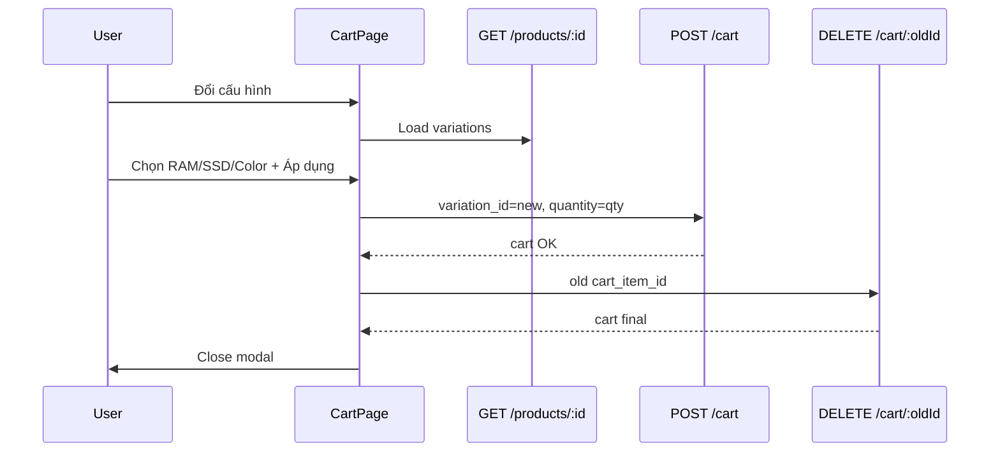

# Functional Requirement (FR) — Đổi cấu hình / biến thể trong giỏ (Change Cart Item Variation)

## 1. Feature Overview

Trên **CartPage**, user có thể **đổi SKU** (RAM/SSD/màu) của một dòng giỏ mà không xóa thủ công rồi thêm lại từ trang sản phẩm. UI: nút **“Đổi cấu hình”** → modal chọn RAM / Storage / Color → **Áp dụng**.

**Cách triển khai hiện tại (FE):** không gọi `PUT` đổi `variation_id`. Thay vào:

1. `POST /cart` với `variation_id` mới + **cùng quantity**.
2. On success → `DELETE /cart/:old_cart_item_id`.

Backend **có** hỗ trợ locate/update qua `PUT` body `variation_id`, nhưng **CartPage không dùng**.

---

## 2. Actors

| Actor | Mô tả |
|-------|-------|
| **Customer** | Đổi cấu hình trên giỏ |
| **Frontend** | Modal + `GET /products/:id` load variations |
| **Backend** | `addToCart` + `removeCartItem` (2 bước) |

---

## 3. Scope

### In Scope

- Modal `variantModal` trên `CartPage`.
- Load product detail: `api.get(/products/${product_id})`.
- Chọn `variantSel`: `{ ram, storage, color }` (subset ATTRS).
- `matchVariation` trên list `product.variations`.
- Stock / `is_available` check trước apply.
- Add new + remove old pattern.

### Out of Scope

- Đổi processor / screen từ modal giỏ (chỉ ram, storage, color).
- BE atomic “change variation” transaction.

---

## 4. UI Flow

### Open modal — `openVariantModal(item)`

1. `GET /products/{product_id}`.
2. Pre-fill `variantSel` từ variation hiện tại của dòng.
3. Show loading / error states.

### Options UI

- `getUnique(vars, "ram" | "storage" | "color")` → chips.
- User toggle `variantSel` keys.

### Apply — `handleApplyVariation`

```javascript
const chosen = matchVariation(vars, variantSel);
// validate stock, is_available
if (chosen.variation_id === oldVarId) close modal;

addToCart.mutate(
  { variation_id: chosen.variation_id, quantity: qty },
  {
    onSuccess: () => removeItemSrv.mutate(oldItemId, { onSuccess: closeVariantModal }),
    onError: () => setVariantError("Không đổi được cấu hình...")
  }
);
```

| # | Rule |
|---|------|
| BR-01 | Giữ **quantity** cũ |
| BR-02 | Nếu add fail → **không** xóa dòng cũ |
| BR-03 | Nếu add success nhưng delete fail → có thể **2 dòng** tạm thời (gap) |
| BR-04 | Cùng variation → đóng modal, no API |

---

## 5. Alternative BE path (not used by FE)

`PUT /api/cart/:cart_item_id` với body có thể tìm item theo `variation_id` — **không** đổi variation_id trực tiếp trong logic update hiện tại (chỉ đổi `quantity`). Muốn đổi SKU server-side cần mở rộng controller hoặc delete+add.

---

## 6. Merge behavior khi đổi sang SKU đã có trong giỏ

`POST /cart` **upsert** theo `variation_id`:

- Nếu SKU mới **đã có** dòng → quantity **cộng thêm** `qty` cũ → có thể gấp đôi ngoài ý muốn trước khi xóa dòng cũ.
- Sau đó delete old line → qty có thể đúng hoặc cần verify edge case.

**Edge case quan trọng:** Đổi từ A→B trong khi B đã có trong giỏ → merge qty trên B + delete A.

---

## 7. Display after change

Sau success, `useGetCart` / mutation `setCart` refresh list; `useEffect` auto-select all `cart_item_id` khi `items` change.

---

## 8. Sequence Diagram



---

## 9. Validation messages

| Message | Case |
|---------|------|
| Không tìm thấy cấu hình phù hợp | matchVariation null |
| Cấu hình này đã hết hàng | stock / !is_available |
| Không tải được danh sách cấu hình | GET product fail |
| Không đổi được cấu hình | addToCart error |

---

## 10. Related Features

| FR | Quan hệ |
|----|---------|
| `FR_AddToCart.md` | Bước 1 |
| `FR_RemoveCartItem.md` | Bước 2 |
| `FR_SelectProductVariation.md` | Cùng logic match trên PDP |
| `FR_ViewCart.md` | Host UI |

---

## 11. Source Files

| Layer | File |
|-------|------|
| FE | `client/app/pages/CartPage.jsx` (variantModal, handleApplyVariation) |
| BE | `addToCart`, `removeCartItem` |
| Product API | `getProductDetail` |

---

## 12. Acceptance Criteria

- **AC1:** Đổi sang SKU khác còn hàng → dòng giỏ hiển thị cấu hình mới.
- **AC2:** Quantity giữ nguyên.
- **AC3:** SKU hết hàng → error, dòng cũ giữ nguyên.
- **AC4:** Hủy modal → không đổi DB.

---

## 13. Known Gaps

1. Không atomic — lỗi giữa add/delete có thể duplicate/qty sai.
2. Chỉ 3 thuộc tính (ram, storage, color) — không processor/GPU/screen.
3. Không dùng PUT variation migration API.
4. Merge nếu SKU đích đã tồn tại trong giỏ.
