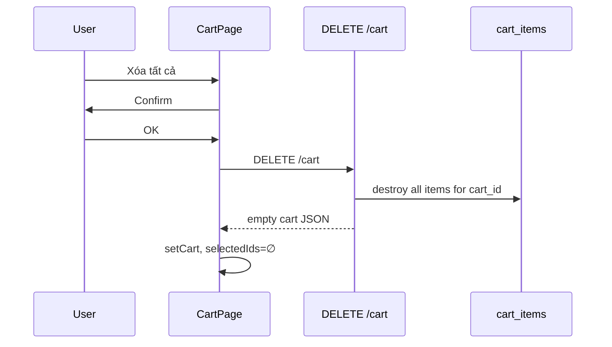

# Functional Requirement (FR) — Xóa toàn bộ giỏ hàng (Clear Cart)

## 1. Feature Overview

User xóa **tất cả** dòng trong giỏ một lần qua nút **“Xóa tất cả”** trên `CartPage`. API:

```
DELETE /api/cart
```

(Xóa mọi `cart_items` của cart user; bản ghi `carts` **giữ lại**.)

Sau clear, `GET` logic trong response trả giỏ **rỗng** (`items: []`, `item_count: 0`).

---

## 2. Actors

| Actor | Mô tả |
|-------|-------|
| **Authenticated Customer** | Clear từ CartPage |
| **Backend** | `clearCart` |
| **Logout** | `useLogout` gọi `clearCart()` Redux — **không** gọi DELETE /cart API |

---

## 3. Scope

### In Scope

- `DELETE /api/cart` (path `/` trên router cart).
- Confirm modal: “Xóa tất cả sản phẩm trong giỏ hàng?”
- `dispatch(setCart(data.cart))` từ response.
- Reset `selectedIds` → empty Set.

### Out of Scope

- Xóa bản ghi `carts` (user vẫn có cart_id).
- Auto-clear sau đặt hàng thành công (order flow có thể xóa từng item — xem Checkout `removeMany`).

---

## 4. API Contract

### Request

```
DELETE /api/cart
Authorization: Bearer <token>
```

No body.

### Response — 200

```json
{
  "cart": {
    "cart_id": 1,
    "item_count": 0,
    "items": [],
    "subtotal_snapshot": 0,
    "subtotal_after_discount": 0
  }
}
```

### Errors

401/403 — auth middleware.

---

## 5. Backend Logic

```javascript
const cart = await getOrCreateCart(user_id);
await CartItem.destroy({ where: { cart_id: cart.cart_id } });
return exports.getCart(req, res, next);
```

| # | Rule |
|---|------|
| BR-01 | Chỉ xóa items, không xóa cart header |
| BR-02 | Cart rỗng vẫn `getOrCreate` được lần sau |

---

## 6. Frontend — `CartPage`

```javascript
handleClearCart → confirmState { kind: "clear" }

doClearCart = async () => {
  const { data } = await api.delete("/cart");
  dispatch(setCart(data.cart));
  setSelectedIds(new Set());
}
```

**Lưu ý:** Dùng `api.delete` trực tiếp (không qua hook `useClearCart` — **chưa có** hook riêng trong `useCart.js`; `cartAPI.clearCart` tồn tại trong `api.js`).

---

## 7. Logout vs Clear Cart API

| Hành động | API DELETE /cart | Redux `clearCart` |
|-----------|------------------|-------------------|
| User “Xóa tất cả” | **Có** | setCart từ response |
| `useLogout` | **Không** | `clearCart()` local only |

Sau logout, server cart **vẫn còn items** — user login lại sẽ thấy lại (có thể là intended).

---

## 8. UI

- Nút đỏ nhỏ góc phải header “Giỏ hàng”.
- Sau clear → `items.length === 0` → empty state full page.

---

## 9. Sequence Diagram



---

## 10. Edge Cases

| Case | Hành vi |
|------|---------|
| Giỏ đã trống | DELETE vẫn OK, items [] |
| Network fail | alert “Không xoá được giỏ hàng…” |
| User khác login same browser | `useGetCart` load cart của user mới |

---

## 11. Related Features

| FR | Quan hệ |
|----|---------|
| `FR_RemoveCartItem.md` | Xóa từng dòng |
| `FR_ViewCart.md` | Empty state |
| `FR_AddToCart.md` | Thêm lại sau clear |

---

## 12. Source Files

| Layer | File |
|-------|------|
| Controller | `cartController.clearCart` |
| Route | `router.delete("/", ...)` |
| FE | `CartPage.jsx` (`doClearCart`) |
| FE API | `api.js` → `cartAPI.clearCart` |

---

## 13. Acceptance Criteria

- **AC1:** Confirm → tất cả dòng biến mất DB + UI.
- **AC2:** `cart_id` vẫn tồn tại; add mới vẫn hoạt động.
- **AC3:** `selectedIds` cleared.
- **AC4:** Header badge = 0.

---

## 14. Known Gaps

1. Logout không gọi DELETE /cart — server cart persists.
2. Không có `useClearCart` mutation hook (inline api.delete).
3. Không undo.
