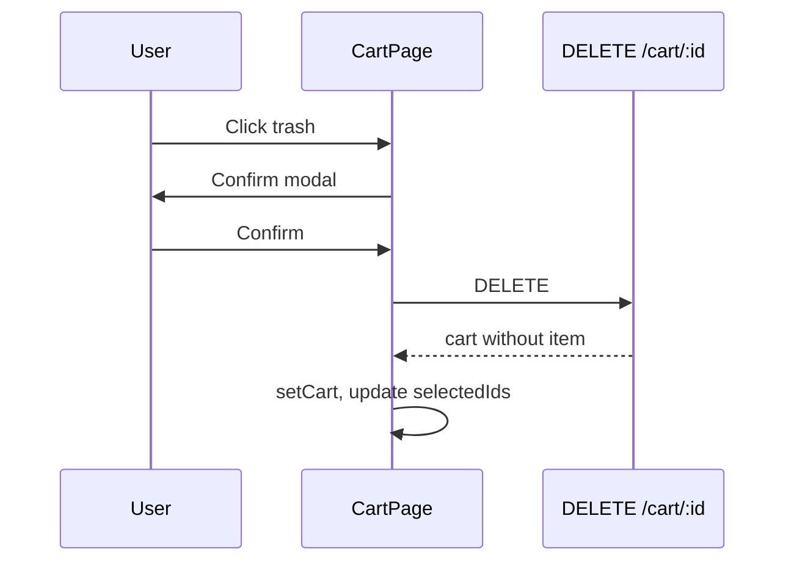

# Functional Requirement (FR) — Xóa một dòng giỏ hàng (Remove Cart Item)

## 1. Feature Overview

User xóa **một** sản phẩm khỏi giỏ bằng icon thùng rác hoặc sau khi xác nhận giảm số lượng về 0. API:

```
DELETE /api/cart/:cart_item_id
```

Backend xóa row `cart_items` thuộc cart user, trả **full cart** rỗng hoặc còn dòng.

**Lưu ý route:** `cartRoutes` chỉ mount `DELETE /:cart_item_id` (param `cart_item_id`). Code controller còn nhánh `variation_id` param — **không** khớp route hiện tại (dead code path).

---

## 2. Actors

| Actor | Mô tả |
|-------|-------|
| **Customer** | Xóa từng món trên CartPage |
| **Backend** | `removeCartItem` |
| **Flow phụ** | Sau `addToCart` khi đổi cấu hình — xóa dòng cũ |

---

## 3. Scope

### In Scope

- `DELETE /api/cart/:cart_item_id`
- Confirm modal trước khi xóa (FE).
- Cập nhật `selectedIds` — bỏ id đã xóa.
- `useRemoveFromCart` hook.

### Out of Scope

- Xóa toàn bộ giỏ → `FR_ClearCart.md`.
- Xóa qua `PUT quantity <= 0` (cùng outcome, khác API).

---

## 4. API Contract

### Request

```
DELETE /api/cart/10
```

**Auth:** JWT required.

### Response — 200

```json
{ "cart": { "cart_id": 1, "item_count": 0, "items": [], ... } }
```

### Errors

| Status | Case |
|--------|------|
| 401/403 | Auth |
| (Silent) | `cart_item_id` không thuộc cart user — destroy 0 rows, vẫn trả cart |

---

## 5. Backend Logic

```javascript
const cart = await getOrCreateCart(user_id);
if (cart_item_id) {
  await CartItem.destroy({ where: { cart_id: cart.cart_id, cart_item_id } });
}
return getCart(req, res, next);
```

---

## 6. Frontend — `CartPage`

### Triggers

1. Click **Trash2** → `handleRemoveItem(id)` → confirm modal.
2. `handleUpdateQuantity(id, newQty)` với `newQty <= 0` → confirm kind `remove`.

### Confirm flow

```javascript
confirmYes → doRemoveItem(targetId)
doRemoveItem(id) {
  selectedIds.delete(id);
  removeItemSrv.mutate(id);
}
```

Modal copy: “Xóa sản phẩm khỏi giỏ?” — Hủy / Xóa.

### Hook

```javascript
useRemoveFromCart → api.delete(`/cart/${itemId}`)
onSuccess: setCart(data.cart)
```

---

## 7. Change variation cleanup

Sau `addToCart` success (SKU mới):

```javascript
removeItemSrv.mutate(oldItemId, { onSuccess: closeVariantModal });
```

Đảm bảo không hai dòng cùng product khác SKU (trừ khi add fail).

---

## 8. Business Rules

| # | Rule |
|---|------|
| BR-01 | Xóa không hoàn tác (no undo) |
| BR-02 | Tick selection đồng bộ — bỏ id khỏi `selectedIds` |
| BR-03 | Response luôn full cart để Redux sync |

---

## 9. Sequence Diagram



---

## 10. Edge Cases

| Case | Hành vi |
|------|---------|
| Xóa item đang tick | Sidebar tổng giảm; có thể 0 tick |
| Xóa item cuối cùng | Empty state render |
| Double click delete | 2 requests — lần 2 harmless |

---

## 11. Related Features

| FR | Quan hệ |
|----|---------|
| `FR_ClearCart.md` | Xóa all |
| `FR_UpdateCartItemQuantity.md` | Path to remove via qty |
| `FR_ChangeCartItemVariation.md` | Remove old after add new |

---

## 12. Source Files

| Layer | File |
|-------|------|
| Controller | `cartController.removeCartItem` |
| Route | `DELETE /:cart_item_id` |
| FE | `CartPage.jsx`, `useCart.js` |

---

## 13. Acceptance Criteria

- **AC1:** Confirm → DELETE → dòng biến mất khỏi UI và DB.
- **AC2:** `selectedIds` không còn id đã xóa.
- **AC3:** Header badge giảm quantity tương ứng.
- **AC4:** Hủy confirm → không gọi API.

---

## 14. Known Gaps

1. Controller branch `variation_id` param không wired to route.
2. Không có undo / snackbar.
