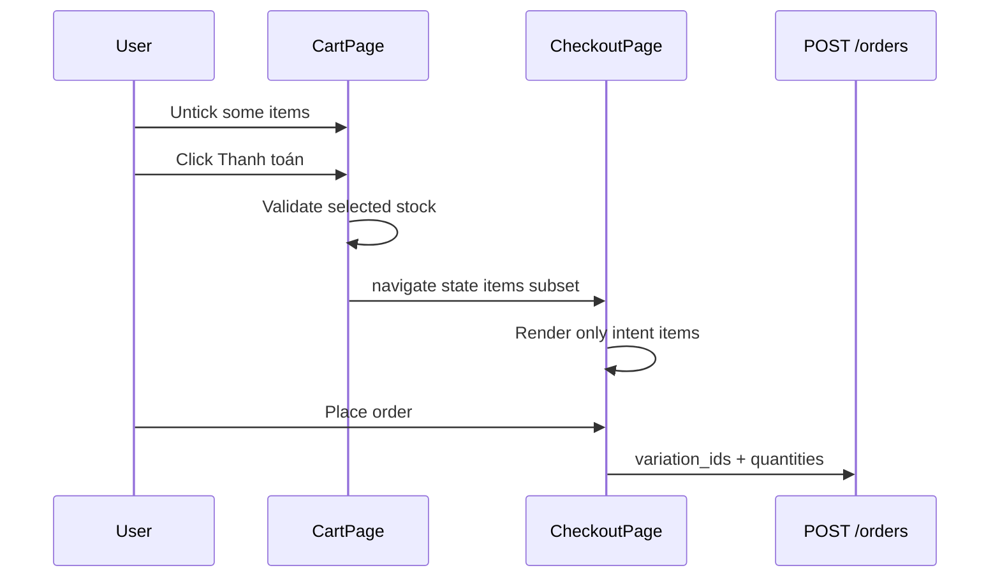

# Functional Requirement (FR) — Chọn sản phẩm trong giỏ để thanh toán (Select Cart Items for Checkout)

## 1. Feature Overview

Trước khi sang **Checkout**, user **tick chọn** một hoặc nhiều dòng trong giỏ (checkbox). Chỉ các dòng được chọn mới:

- Tính vào **“Tổng tiền”** sidebar.
- Được đưa vào `navigate("/checkout", { state: { mode: "cart", items: [...] } })`.

Đây là cơ chế **partial checkout** — các dòng không tick **vẫn nằm trong giỏ server** sau khi đặt hàng (trừ khi order/Checkout xóa có chọn — xem order flow).

**State chọn:** `selectedIds: Set<cart_item_id>` — **local React state** trên `CartPage`, **không** persist server; `cartSlice.setItemSelected` / `setAllSelected` **có trong Redux nhưng CartPage không dùng**.

---

## 2. Actors

| Actor | Mô tả |
|-------|-------|
| **Customer** | Tick / bỏ tick, “Chọn tất cả”, Thanh toán |
| **CheckoutPage** | Nhận `location.state.items` |
| **CartPage** | Validation stock trước checkout |

---

## 3. Scope

### In Scope

- Checkbox per line + “Chọn tất cả”.
- Auto-select **all** items khi `items` load/change (`useEffect`).
- `selectedItems` filter từ `selectedIds`.
- Subtotal = Σ `price × quantity` (selected only).
- `handleCheckout` payload `{ variation_id, quantity }[]`.
- Guest → `/login?redirect=/checkout`.
- Block checkout nếu selected invalid stock.

### Out of Scope

- Lưu selection vào DB.
- Sync selection sau F5 (re-select all via effect).
- Checkout without visiting cart (buy_now bypasses selection).

---

## 4. Selection State

```javascript
const [selectedIds, setSelectedIds] = useState(() => new Set());

useEffect(() => {
  if (items?.length) {
    setSelectedIds(new Set(items.map((i) => i.cart_item_id)));
  } else {
    setSelectedIds(new Set());
  }
}, [items]);
```

**Hành vi:** Mỗi khi giỏ reload (add/remove/clear), **mặc định tick lại tất cả** — user bỏ tick trước đó có thể bị reset.

### Toggle

```javascript
handleToggleItem(cartItemId)  // flip in Set
handleToggleAll()             // all or none
isAllSelected = selectedIds.size === items.length
```

---

## 5. Checkout navigation

```javascript
const handleCheckout = () => {
  if (!canCheckout) return; // selectedItems.length > 0

  const itemsPayload = selectedItems.map((it) => ({
    variation_id: it.variation_id,
    quantity: it.quantity,
  }));

  if (!isAuthenticated) {
    navigate("/login?redirect=/checkout");
    return;
  }

  navigate("/checkout", {
    state: { mode: "cart", items: itemsPayload },
  });
};
```

### CheckoutPage contract

```javascript
// CheckoutPage.jsx
const intentItems = location.state?.items || [];
const intentMode = location.state?.mode; // "cart" | "buy_now"
// Nếu không có items → redirect /cart
```

**Chỉ** `variation_id` + `quantity` gửi sang checkout — BE order tự tính giá/tồn.

---

## 6. Validation before checkout

```javascript
const selectedChecks = selectedItems.map((it) => ({
  stockQty, isAvailable, enoughStock: quantity <= stockQty, ...
}));

const hasInvalidSelected = selectedChecks.some(
  (c) => !c.isAvailable || !c.enoughStock
);
```

| UI | Condition |
|----|-----------|
| Nút “Thanh toán” disabled | `!canCheckout` OR `hasInvalidSelected` |
| Banner đỏ sidebar | List item hết hàng / vượt tồn |
| `title` tooltip | Giải thích lý do disabled |

**Per-line warnings** trong list + sidebar summary.

---

## 7. Pricing display (selected)

`getPriceParts(item)`:

- `raw` — giá gốc variation
- `discountPct` — từ product
- `finalUnit` — `item.price` hoặc `unit_price_after_discount`

Sidebar liệt kê từng món đã tick + **Tổng tiền** = `subtotal` chỉ selected.

**Lưu ý:** Không gọi `POST /orders/preview` tại Cart — preview có thể ở Checkout.

---

## 8. Business Rules

| # | Rule |
|---|------|
| BR-01 | Ít nhất 1 dòng tick mới checkout |
| BR-02 | Unticked items remain in cart DB |
| BR-03 | Auto re-select all on items array change |
| BR-04 | Stock validation client-side; BE order validates again |
| BR-05 | Guest must login; redirect preserves intent via redirect=/checkout (may need pendingCheckout for cart mode — **buy_now** uses pendingCheckout; **cart checkout** relies on state — **lost if login from redirect without state**) |

**Gap login flow:** `navigate("/login?redirect=/checkout")` **không** lưu `selectedItems` vào `pendingCheckout` — sau login redirect `/checkout` có thể **mất state** nếu full page navigation. User đã login thì OK.

---

## 9. Redux `selected` (unused path)

`cartSlice`:

```javascript
setItemSelected({ id, selected })
setAllSelected({ selected })
// items[].selected default false on setCart
```

CartPage **không** dispatch các action này — dùng `selectedIds` parallel model.

---

## 10. Sequence Diagram



---

## 11. Comparison: buy_now vs cart selection

| | buy_now (PDP) | cart selection |
|--|---------------|----------------|
| Selection | Single matched variation | User tick subset |
| Navigate | `pendingCheckout` localStorage | `location.state` |
| mode | `buy_now` | `cart` |

---

## 12. Related Features

| FR | Quan hệ |
|----|---------|
| `FR_ViewCart.md` | Host page |
| `FR_UpdateCartItemQuantity.md` | Qty affects selected totals |
| Order module | Final validation + cart item removal |

---

## 13. Source Files

| Layer | File |
|-------|------|
| FE | `client/app/pages/CartPage.jsx` (selectedIds, handleCheckout) |
| FE | `client/app/pages/CheckoutPage.jsx` |
| FE | `client/app/store/slices/cartSlice.js` (unused selected actions) |

---

## 14. Acceptance Criteria

- **AC1:** Tick subset → sidebar chỉ tính món đã chọn.
- **AC2:** “Chọn tất cả” bật/tắt đúng.
- **AC3:** Thanh toán với món hết hàng tick → disabled + banner.
- **AC4:** Checkout nhận đúng `{ variation_id, quantity }[]`.
- **AC5:** Unticked items vẫn trong GET /cart sau khi quay lại.

---

## 15. Known Gaps

1. **Login redirect** có thể mất `location.state` items (không dùng pendingCheckout cho cart mode).
2. Auto-select-all on items change resets user selection.
3. `cartSlice.selected` dead code path vs `selectedIds`.
4. Không persist selection cross-device.
