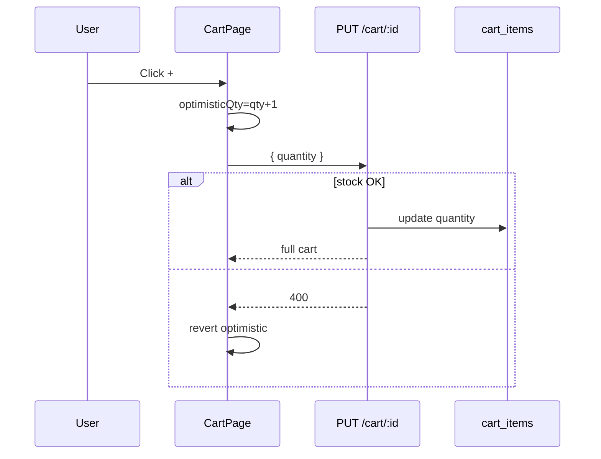

# Functional Requirement (FR) — Cập nhật số lượng dòng giỏ (Update Cart Item Quantity)

## 1. Feature Overview

User chỉnh **số lượng** một dòng giỏ hàng qua nút **+ / −** hoặc nhập số trên `CartPage`. API:

```
PUT /api/cart/:cart_item_id
Body: { quantity }  // required
```

- `quantity > 0` → cập nhật (kiểm tra stock).
- `quantity <= 0` → **xóa dòng** (destroy) — FE thường mở confirm trước khi gửi 0.

Response: full cart (`getCart`).

---

## 2. Actors

| Actor | Mô tả |
|-------|-------|
| **Authenticated Customer** | Sửa qty trên `/cart` |
| **Backend** | `updateCartItem` |

---

## 3. Scope

### In Scope

- Path param `cart_item_id`.
- Body `quantity` bắt buộc.
- Stock validation against `cartItem.variation.stock_quantity`.
- FE optimistic UI (`optimisticQty` state).
- Hook `useUpdateCartItem`.

### Out of Scope

- Đổi `variation_id` qua PUT (BE hỗ trợ body `variation_id` nhưng FE **không dùng** — xem `FR_ChangeCartItemVariation.md`).
- Cập nhật qty từ Checkout (read-only intent items).

---

## 4. API Contract

### Request

```
PUT /api/cart/10
```

```json
{ "quantity": 3 }
```

**Optional body fields (BE, unused FE):** `variation_id`, `cart_item_id` — fallback locate item.

### Locate item (BE)

Ưu tiên:

1. `params.cart_item_id` + `cart_id`
2. else `body.cart_item_id`
3. else `{ cart_id, variation_id }` từ body

### Response — 200

Full `{ cart }` như GET.

### Errors

| Status | Message |
|--------|---------|
| 400 | `quantity is required` |
| 404 | `Cart item not found` |
| 400 | `Insufficient stock` |

### Delete via update

```javascript
if (Number(quantity) <= 0) {
  await cartItem.destroy();
  return getCart(...);
}
```

---

## 5. Frontend — `CartPage`

```javascript
const handleUpdateQuantity = (id, newQuantity) => {
  if (newQuantity <= 0) {
    setConfirmState({ open: true, kind: "remove", targetId: id });
    return;
  }
  setOptimisticQty({ [id]: newQuantity });
  updateItem.mutate({ itemId: id, quantity: newQuantity }, {
    onError: () => revert optimisticQty,
    onSettled: () => delete optimisticQty[id],
  });
};
```

**Display qty:** `shownQty = optimisticQty[id] ?? item.quantity`

**UI guards:**

- Nút `+` **disabled** khi `quantity >= stock_quantity` (`isMaxQuantity`).
- Messages: hết hàng, chỉ còn N trong kho.

---

## 6. Hook — `useUpdateCartItem`

```javascript
api.put(`/cart/${itemId}`, { quantity })
onSuccess: setCart + invalidate ["cart", user_id]
```

---

## 7. Business Rules

| # | Rule |
|---|------|
| BR-01 | Quantity integer > 0 để giữ dòng |
| BR-02 | Không vượt `stock_quantity` tại thời điểm update |
| BR-03 | Chỉ sửa item thuộc cart của user hiện tại |
| BR-04 | Optimistic UI revert on error |

---

## 8. Sequence Diagram



---

## 9. Edge Cases

| Case | Hành vi |
|------|---------|
| Minus về 0 | Confirm remove modal (không PUT 0 trực tiếp từ minus — opens remove flow) |
| Rapid clicks +/- | Optimistic có thể nhấp nháy; settled về BE |
| Stock giảm sau khi đã trong giỏ | PUT fail Insufficient stock |
| Sai cart_item_id | 404 |

---

## 10. Related Features

| FR | Quan hệ |
|----|---------|
| `FR_RemoveCartItem.md` | Xóa thay vì qty=0 |
| `FR_ViewCart.md` | Host UI |
| `FR_SelectCartItemsForCheckout.md` | Validate qty vs stock trước checkout |

---

## 11. Source Files

| Layer | File |
|-------|------|
| Controller | `cartController.updateCartItem` |
| Route | `PUT /:cart_item_id` |
| FE | `CartPage.jsx`, `useCart.js` |

---

## 12. Acceptance Criteria

- **AC1:** Tăng qty hợp lệ → DB + UI khớp.
- **AC2:** Giảm về 0 qua flow remove → dòng biến mất.
- **AC3:** Vượt stock → 400, optimistic revert.
- **AC4:** `+` disabled tại max stock.
- **AC5:** Sidebar tổng tiền cập nhật theo tick + qty (local calc).

---

## 13. Known Gaps

1. Không debounce rapid API calls.
2. BE cho phép PUT `variation_id` nhưng FE không expose.
