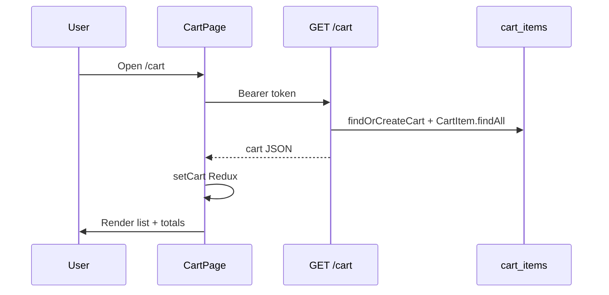

# Functional Requirement (FR) — Xem giỏ hàng (View Cart)

## 1. Feature Overview

Tính năng cho phép user **đã đăng nhập** xem toàn bộ sản phẩm trong giỏ: danh sách dòng hàng (`cart_items`), ảnh, tên SP, cấu hình SKU, giá sau giảm, tồn kho, số lượng, và tổng tiền. Dữ liệu nguồn là **`GET /api/cart`**; frontend đồng bộ vào **Redux** (`cartSlice.setCart`) và render tại **`/cart`** (`CartPage.jsx`).

Badge số lượng trên **Header** cũng đọc `state.cart.items` (cập nhật sau `useGetCart` / các mutation giỏ).

---

## 2. Actors

| Actor | Mô tả |
|-------|-------|
| **Authenticated Customer** | Xem `/cart`, thao tác tiếp (tick, sửa SL, checkout) |
| **Guest** | Vào `/cart` — giỏ Redux/API trống hoặc lỗi 401 (route **không** bọc `ProtectedRoute`) |
| **Backend** | `cartController.getCart` + `getOrCreateCart` |
| **Header** | Hiển thị `cartItemsCount` từ Redux |

---

## 3. Scope

### In Scope

- `GET /api/cart` — JWT bắt buộc (`router.use(authenticateToken)`).
- Response chuẩn hóa `normalizeItem` per line.
- FE: `useGetCart`, `CartPage`, empty state, layout 2 cột + sidebar tổng kết.
- `useGetCart` trong `Header` (mọi trang Layout) để refresh giỏ.

### Out of Scope

- Tick chọn checkout → `FR_SelectCartItemsForCheckout.md`.
- Thêm/sửa/xóa dòng → FR riêng.

---

## 4. Preconditions

- User có JWT hợp lệ, `is_active`.
- User đã có bản ghi `carts` (tạo lúc đăng ký/OAuth — `FR_AutoCreateCartOnRegistration.md`) hoặc được tạo lazy bởi `getOrCreateCart`.

---

## 5. API Contract — `GET /api/cart`

### Response — 200 OK

```json
{
  "cart": {
    "cart_id": 1,
    "item_count": 5,
    "items": [
      {
        "cart_item_id": 10,
        "variation_id": 42,
        "quantity": 2,
        "price_at_add": 25000000,
        "variation": {
          "stock_quantity": 8,
          "is_available": true,
          "processor": "i7",
          "ram": "16GB",
          "storage": "512GB"
        },
        "product": {
          "product_id": 3,
          "product_name": "Laptop X",
          "thumbnail_url": "https://...",
          "discount_percentage": 10,
          "variation": { "price": 25000000 }
        },
        "unit_price_before_discount": 25000000,
        "discount_percentage": 10,
        "unit_price_after_discount": 22500000,
        "line_total_after_discount": 45000000
      }
    ],
    "subtotal_snapshot": 50000000,
    "subtotal_after_discount": 45000000
  }
}
```

| Field | Ý nghĩa |
|-------|---------|
| `item_count` | Tổng **quantity** các dòng (không phải số dòng) |
| `price_at_add` | Giá SKU lúc thêm (snapshot, chưa giảm) |
| `subtotal_snapshot` | Σ `price_at_add × quantity` |
| `subtotal_after_discount` | Σ `line_total_after_discount` (giá hiện tại × discount %) |

**Sort items:** `added_at DESC` (mới thêm trước).

### Errors

| Status | Khi |
|--------|-----|
| 401 | Thiếu/invalid token |
| 403 | User inactive |

---

## 6. Frontend — `useGetCart`

```javascript
queryKey: ["cart", user?.user_id]
enabled: !!isAuthenticated && !!token && !!user?.user_id
onSuccess: dispatch(setCart(data.cart))
onError 401/403: dispatch(clearCart())
staleTime: 60_000
```

Invalidate khi `user_id` đổi (đăng nhập user khác).

---

## 7. Redux mapping (`setCart`)

Mỗi item FE:

- `id` / `cart_item_id`
- `variation_id`, `quantity`, `price` (unit sau giảm)
- `variation` (stock, is_available, processor, ram, storage)
- `product` (name, thumbnail, discount, nested variation price)
- `selected: false` (slice có field; **CartPage dùng `selectedIds` local** — xem FR Select)

`state.totalPrice` = `subtotal_after_discount` từ BE nếu có.

---

## 8. UI — `CartPage.jsx`

| Phần | Mô tả |
|------|-------|
| Empty | `items.length === 0` → icon + link về `/` |
| List | Checkbox, ảnh, tên, cấu hình, +/- qty, xóa, “Đổi cấu hình” |
| Sidebar | Chỉ **món đã tick**, tổng tiền, nút Thanh toán |
| Header page | “Xóa tất cả” |

**Route:** `/cart` — **public** (không `ProtectedRoute`); thực tế cần login để có data.

---

## 9. Header badge

```javascript
const cartItemsCount = items.reduce((t, i) => t + i.quantity, 0);
```

Link `/cart`. `useGetCart()` trong Header giữ giỏ đồng bộ khi browse.

---

## 10. Business Rules

| # | Rule | Chi tiết |
|---|------|----------|
| BR-01 | **1 user 1 cart** | `carts.user_id` UNIQUE |
| BR-02 | **Lazy create cart** | GET tạo cart nếu chưa có |
| BR-03 | **Giá hiển thị** | Ưu tiên `unit_price_after_discount` / `price` FE |
| BR-04 | **Snapshot vs live** | `price_at_add` giữ giá lúc add; tổng sidebar dùng giá live |
| BR-05 | **Guest** | Không load giỏ server |

---

## 11. Sequence Diagram



---

## 12. Related Features

| FR | Quan hệ |
|----|---------|
| `FR_AddToCart.md` | Tạo/cập nhật dòng |
| `FR_SelectCartItemsForCheckout.md` | Subset tick → checkout |
| `FR_AutoCreateCartOnRegistration.md` | Cart row khi đăng ký |

---

## 13. Source Files

| Layer | File |
|-------|------|
| Routes | `server/routes/cartRoutes.js` |
| Controller | `server/controllers/cartController.js` → `getCart`, `normalizeItem` |
| Models | `Cart.js`, `CartItem.js` |
| FE hook | `client/app/hooks/useCart.js` → `useGetCart` |
| FE page | `client/app/pages/CartPage.jsx` |
| FE state | `client/app/store/slices/cartSlice.js` |
| FE API | `client/app/services/api.js` → `cartAPI` |

---

## 14. Acceptance Criteria

- **AC1:** User đăng nhập mở `/cart` → thấy đủ dòng từ DB.
- **AC2:** Mỗi dòng có tên, ảnh, cấu hình, giá, quantity, stock hint.
- **AC3:** `item_count` khớp tổng quantity.
- **AC4:** Giỏ trống → empty state.
- **AC5:** Header badge = tổng quantity sau load giỏ.
- **AC6:** 401 → Redux giỏ cleared (hook onError).

---

## 15. Known Gaps

1. `/cart` không redirect guest về login (chỉ empty/401).
2. `cartSlice.selected` không dùng trên CartPage (dùng `selectedIds` local).
3. `ProductRecommendations` `addItem` Redux-only không sync GET cart.
