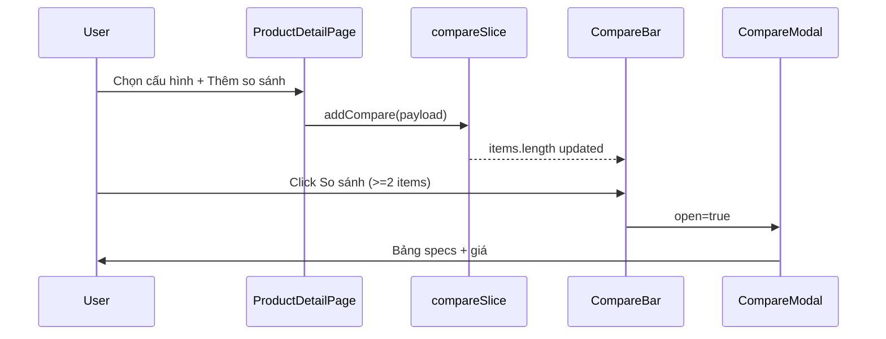

# Functional Requirement (FR) — So sánh sản phẩm (Compare Products)

## 1. Feature Overview

Tính năng so sánh cho phép khách **thêm tối đa 3 cấu hình (variation)** vào danh sách so sánh, xem **bảng thông số** cạnh nhau trên modal. Trong code hiện tại, luồng chính là **client-side Redux** (`compareSlice`) — **không gọi** API `GET/POST /api/products/compare` dù backend đã implement.

**Điểm vào:** nút “+ Thêm vào so sánh” trên `ProductDetailPage` (cần đã chọn variation).

**UI:** `CompareBar` (fixed bottom) + `CompareModal` (bảng specs + giá).

---

## 2. Actors

| Actor | Mô tả |
|-------|-------|
| **Customer** | Chọn SP so sánh, mở modal |
| **Redux** | `compareSlice` — max 3 items |
| **Backend (optional)** | `compareProducts` — matrix specs JSON, **chưa dùng FE** |

---

## 3. Scope

### In Scope (FE — thực tế đang chạy)

- `addCompare` / `removeCompare` / `clearCompare`
- Key trùng: `variation_id`
- FIFO khi vượt 3: `shift()` item cũ nhất
- Payload lưu: `variation_id`, `product_id`, `product_name`, `thumbnail_url`, `discount_percentage`, `specs` (snapshot variation fields), `variation` object
- `CompareModal` normalize specs + render table
- Nút “So sánh” disabled khi `< 2` items

### In Scope (BE — có sẵn, chưa tích hợp FE)

```
GET  /api/products/compare?ids=1,2,3
POST /api/products/compare  { "ids": [1,2,3] }
```

Trả `products` summary + `compare` matrix từ `products.specs` JSONB (nhóm label theo group).

### Out of Scope

- So sánh cross-session (persist localStorage)
- So sánh trên listing (chỉ detail page add)

---

## 4. Redux — `compareSlice.js`

```javascript
const MAX = 3;

addCompare(state, action) {
  const p = action.payload;
  if (state.items.find(x => x.variation_id === p.variation_id)) return;
  if (state.items.length >= MAX) state.items.shift();
  state.items.push(p);
}
```

**Item shape (comment trong code):**

```javascript
// { variation_id, product_id, product_name, thumbnail_url, discount_percentage, specs, variation }
```

---

## 5. Add to Compare — `ProductDetailPage`

```javascript
dispatch(addCompare({
  variation_id: selectedVariation?.variation_id,
  product_id: product.product_id,
  product_name: product.product_name,
  thumbnail_url: product.thumbnail_url,
  discount_percentage: product.discount_percentage,
  specs: selectedVariation ? {
    price: selectedVariation.price,
    processor: selectedVariation.processor,
    ram: selectedVariation.ram,
    storage: selectedVariation.storage,
    graphics_card: selectedVariation.graphics_card,
    screen_size: selectedVariation.screen_size,
    color: selectedVariation.color,
  } : {},
  variation: selectedVariation,
}));
```

- **Disabled** khi `!selectedVariation` — tooltip “Vui lòng chọn đủ cấu hình…”.

**Lưu ý:** `specs` ở đây là **snapshot cấu hình SKU**, không phải `product.specs` JSONB đầy đủ.

---

## 6. CompareModal UI

| Phần | Chi tiết |
|------|----------|
| `normalizeSpecs` | Flatten object/array specs giống detail page |
| Header row | Tên từng sản phẩm |
| Row “Giá gốc” | `specs.price` |
| Row “Giá sau giảm” | `price * (1 - discount_percentage/100)` |
| Dynamic rows | Union keys từ `_flatSpecs` |
| ESC / backdrop | Đóng modal |
| Empty | “Chưa có sản phẩm để so sánh.” |

---

## 7. CompareBar

- Fixed bottom center, `z-[900]`
- Thumbnails stack (max 3)
- “So sánh” → `onOpen` → `setCmpOpen(true)`
- “Xoá tất cả” → `clearCompare`
- `safeImg` normalize relative URL

---

## 8. Backend API (reference — unused by FE)

### Request

```
GET /api/products/compare?ids=1,2,3
POST /api/products/compare
Body: { "ids": [1, 2, 3] }
```

### Response shape

```json
{
  "products": [{ "id", "name", "thumbnail_url", "base_price", "discount_percentage" }],
  "compare": [
    {
      "group": "display",
      "rows": [
        { "label": "Kích thước", "values": ["15.6\"", "14\"", "—"] }
      ]
    }
  ]
}
```

Matrix build từ **`products.specs`** JSONB (cấu trúc group → array `{label, value}`), **không** từ variation snapshot FE đang dùng.

---

## 9. Business Rules

| # | Rule | Chi tiết |
|---|------|----------|
| BR-01 | **Max 3** | FIFO evict oldest |
| BR-02 | **Unique variation_id** | Không duplicate cùng SKU |
| BR-03 | **Min 2 to compare** | Button disabled `< 2` |
| BR-04 | **Per-session memory** | Redux only — mất khi refresh (unless rehydrate — không có) |
| BR-05 | **Requires selected variation** | Không add khi chưa chọn cấu hình |

---

## 10. Sequence Diagram (FE flow)



---

## 11. Edge Cases

| Case | Hành vi |
|------|---------|
| Thêm SP thứ 4 | Item đầu tiên bị đẩy ra |
| Thêm trùng variation | No-op |
| Refresh trang | Compare list mất |
| `specs.price` string | `Number()` khi tính giảm giá |
| Route `GET /compare` sau `/:id` | Có thể bị nuốt — xem route order |

---

## 12. Related Features

| FR | Quan hệ |
|----|---------|
| `FR_SelectProductVariation.md` | Bắt buộc trước khi add compare |
| `FR_ViewProductSpecsModal.md` | Cùng normalize specs pattern |

---

## 13. Source Files

| Layer | File |
|-------|------|
| Redux | `client/app/store/slices/compareSlice.js` |
| FE | `client/app/components/CompareBar.jsx`, `CompareModal.jsx` |
| FE | `client/app/pages/ProductDetailPage.jsx` |
| BE | `server/controllers/productController.js` → `compareProducts` |
| Route | `server/routes/productRoutes.js` L22–23 |

---

## 14. Acceptance Criteria

- **AC1:** Chọn variation → add compare → item xuất hiện trên CompareBar.
- **AC2:** Tối đa 3 items; item thứ 4 đẩy item cũ.
- **AC3:** ≥2 items → mở modal bảng so sánh.
- **AC4:** Modal hiển thị giá gốc và giá sau giảm theo `discount_percentage`.
- **AC5:** Clear all → bar ẩn.

---

## 15. Known Gaps

1. **FE không dùng** API `/api/products/compare` — matrix product.specs vs variation snapshot không thống nhất.
2. **Không persist** compare list.
3. **Route ordering** có thể hỏng GET compare.
